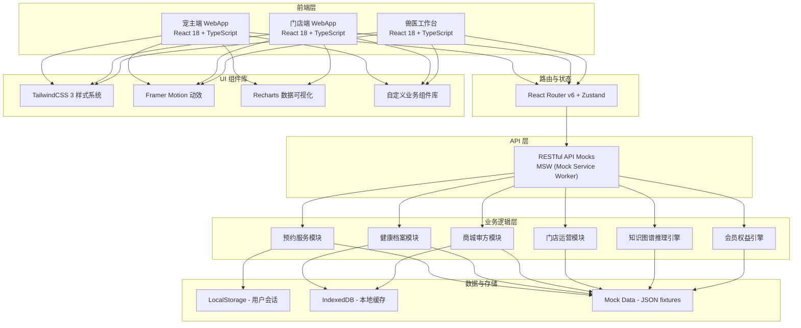
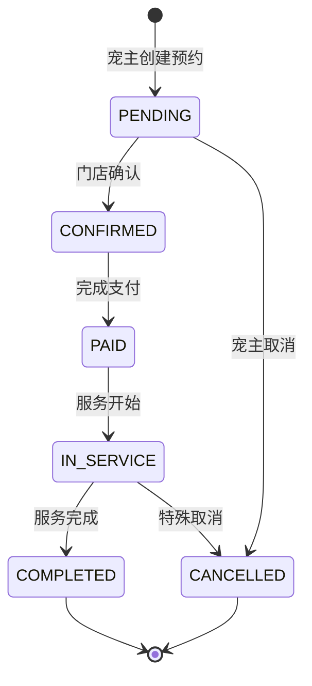

## 1. 架构设计



---

## 2. 技术描述

### 2.1 前端核心技术栈

| 层级 | 技术选型 | 版本 | 用途 |
|------|---------|------|------|
| 构建工具 | Vite | 5.x | 极速构建，热更新HMR |
| UI 框架 | React | 18.x | 函数式组件 + Hooks |
| 语言 | TypeScript | 5.x | 类型安全 |
| 样式方案 | TailwindCSS | 3.x | 原子化CSS，自定义主题 |
| 路由 | React Router | 6.x | 多应用路由，嵌套路由 |
| 状态管理 | Zustand | 4.x | 轻量全局状态，持久化 |
| 数据请求 | Axios | 1.x | HTTP 客户端，拦截器 |
| API Mock | MSW | 2.x | Service Worker 层 Mock |
| 动效 | Framer Motion | 11.x | 流畅动画，页面过渡 |
| 图表 | Recharts | 2.x | 健康数据可视化 |
| 日期处理 | date-fns | 3.x | 时间处理，国际化 |
| 图标 | Lucide React | 0.400+ 图标 |
| 表单 | React Hook Form | 7.x | 表单校验，受控/非受控 |
| 图片处理 | react-compare-image | 对比图组件 |

### 2.2 工程化配置

- **代码规范**: ESLint + Prettier + Husky + lint-staged
- **提交规范**: Commitlint (Conventional Commits)
- **路径别名**: @/ 指向 src/
- **环境变量**: .env.development / .env.production

---

## 3. 路由定义

### 3.1 宠主端路由 (owner)

| 路由路径 | 页面名称 | 权限 |
|---------|---------|------|
| / | 宠主首页-健康仪表盘 | 已登录 |
| /pets | 宠物列表 | 已登录 |
| /pets/:id | 宠物档案详情 | 已登录 |
| /pets/:id/records | 健康档案（疫苗/驱虫/病历） | 已登录 |
| /pets/:id/chronic | 慢病跟踪 | 已登录 |
| /booking | 服务预约首页 | 已登录 |
| /booking/service/:serviceId | 服务详情-门店选择 | 已登录 |
| /booking/store/:storeId | 门店详情-时段选择 | 已登录 |
| /booking/confirm | 预约确认 | 已登录 |
| /orders | 我的预约订单 | 已登录 |
| /orders/:id | 订单详情 | 已登录 |
| /shop | 在线商城 | 已登录 |
| /shop/product/:id | 商品详情 | 已登录 |
| /shop/cart | 购物车 | 已登录 |
| /shop/checkout | 结算-含审方流程 | 已登录 |
| /consult | 在线问诊列表 | 已登录 |
| /consult/:id | 问诊对话页 | 已登录 |
| /symptom-check | 症状自查 | 已登录 |
| /symptom-check/result | 自查结果推荐 | 已登录 |
| /member | 会员中心 | 已登录 |
| /member/points | 积分中心/积分商城 | 已登录 |
| /member/orders | 我的订单 | 已登录 |
| /login | 登录/注册 | 公开 |

### 3.2 门店端路由 (store)

| 路由路径 | 页面名称 | 权限 |
|---------|---------|------|
| /store | 门店工作台 | 门店管理员 |
| /store/schedule | 排班调度 | 门店管理员 |
| /store/services | 今日服务列表 | 门店管理员/美容师 |
| /store/services/:id | 服务执行页 | 美容师/医师 |
| /store/records | 病历管理 | 执业兽医 |
| /store/records/:id/edit | 病历编辑 | 执业兽医 |
| /store/inventory | 库存管理 | 门店管理员 |
| /store/inventory/batches | 批次追溯 | 门店管理员 |
| /store/members | 门店会员 | 门店管理员 |
| /store/reports | 数据报表 | 门店管理员 |
| /store/login | 门店登录 | 公开 |

---

## 4. Mock API 接口定义

### 4.1 核心数据类型定义

```typescript
// 用户与角色
type UserRole = 'owner' | 'store_admin' | 'veterinarian' | 'operator';

interface User {
  id: string;
  role: UserRole;
  phone: string;
  nickname?: string;
  avatar?: string;
  storeId?: string;
  veterinarianId?: string;
  licenseNo?: string;
  createdAt: string;
}

// 宠物档案
type PetSpecies = 'dog' | 'cat' | 'rabbit' | 'bird' | 'other';
type Gender = 'male' | 'female' | 'unknown';
type SterilizationStatus = 'yes' | 'no' | 'unknown';

interface Pet {
  id: string;
  ownerId: string;
  name: string;
  species: PetSpecies;
  breed: string;
  breedId: string;
  gender: Gender;
  birthday?: string;
  weight: number;
  sterilization: SterilizationStatus;
  avatar?: string;
  allergies?: string;
  healthScore: number;
  tags: string[];
  chronicConditions: ChronicCondition[];
}

interface ChronicCondition {
  id: string;
  petId: string;
  type: 'diabetes' | 'kidney' | 'heart' | 'thyroid' | 'other';
  name: string;
  diagnosedAt: string;
  veterinarianId: string;
  followUpPlan: string;
  lastFollowUp?: string;
  nextFollowUp?: string;
  metrics: ChronicMetric[];
}

interface ChronicMetric {
  id: string;
  date: string;
  metricName: string;
  value: number;
  unit: string;
  note?: string;
}

// 疫苗与驱虫记录
interface VaccineRecord {
  id: string;
  petId: string;
  vaccineName: string;
  vaccineType: string;
  administeredAt: string;
  administeredBy: string;
  veterinarianId: string;
  nextDueDate?: string;
  certificateImage?: string;
  batchNo?: string;
  signedBy: string;
}

interface DewormingRecord {
  id: string;
  petId: string;
  dewormingType: 'internal' | 'external' | 'both';
  productName: string;
  dosage: string;
  administeredAt: string;
  administeredBy: string;
  weightAtTime: number;
  nextDueDate?: string;
}

// 电子病历（符合动物诊疗机构管理办法）
interface MedicalRecord {
  id: string;
  petId: string;
  ownerId: string;
  storeId: string;
  veterinarianId: string;
  visitDate: string;
  visitType: 'outpatient' | 'emergency' | 'followup' | 'surgery';
  chiefComplaint: string;
  presentIllness: string;
  pastHistory: string;
  physicalExam: PhysicalExam;
  diagnosis: string;
  treatmentPlan: string;
  medications: PrescriptionItem[];
  labResults?: LabResult[];
  imagingResults?: ImagingResult[];
  doctorAdvice: string;
  signature: string;
  signedAt: string;
  archived: boolean;
  archivedAt?: string;
}

interface PhysicalExam {
  temperature: number;
  heartRate: number;
  respiratoryRate: number;
  weight: number;
  hydrationStatus: string;
  mucousMembranes: string;
  additionalFindings?: string;
}

interface PrescriptionItem {
  id: string;
  drugName: string;
  specification: string;
  dosage: string;
  frequency: string;
  duration: string;
  quantity: number;
  route: string;
}

interface LabResult {
  id: string;
  testName: string;
  testDate: string;
  items: LabItem[];
}

interface LabItem {
  name: string;
  value: string;
  unit: string;
  referenceRange: string;
  flag: 'normal' | 'high' | 'low';
}

// 服务与预约
type ServiceCategory = 'grooming' | 'deworming' | 'vaccination' | 'checkup_basic' | 'checkup_deep' | 'dental' | 'surgery' | 'specialty';

interface ServiceItem {
  id: string;
  name: string;
  category: ServiceCategory;
  description: string;
  durationMinutes: number;
  basePrice: number;
  originalPrice?: number;
  storeIds: string[];
  requiresVet: boolean;
  sopSteps: SOPStep[];
}

interface SOPStep {
  id: string;
  stepNumber: number;
  title: string;
  description: string;
  requirePhoto: boolean;
  requireNote?: boolean;
}

interface AppointmentStatus = 'pending' | 'confirmed' | 'paid' | 'in_service' | 'completed' | 'cancelled';

interface Appointment {
  id: string;
  orderNo: string;
  ownerId: string;
  petId: string;
  serviceId: string;
  storeId: string;
  veterinarianId?: string;
  staffId?: string;
  scheduledDate: string;
  startTime: string;
  duration: number;
  status: AppointmentStatus;
  totalPrice: number;
  paidAmount?: number;
  couponId?: string;
  notes?: string;
  createdAt: string;
  serviceTraces: ServiceTrace[];
}

interface ServiceTrace {
  id: string;
  appointmentId: string;
  stepId: string;
  completedAt: string;
  completedBy: string;
  photos?: string[];
  beforePhotos?: string[];
  afterPhotos?: string[];
  notes?: string;
}

// 门店与员工
interface Store {
  id: string;
  name: string;
  address: string;
  city: string;
  phone: string;
  latitude: number;
  longitude: number;
  rating: number;
  serviceIds: string[];
  businessHours: BusinessHour[];
}

interface BusinessHour {
  dayOfWeek: number;
  openTime: string;
  closeTime: string;
  closed: boolean;
}

type StaffRole = 'groomer' | 'veterinarian' | 'receptionist' | 'manager';

interface Staff {
  id: string;
  storeId: string;
  name: string;
  role: StaffRole;
  color: string;
  avatar?: string;
  services: string[];
}

interface Schedule {
  id: string;
  staffId: string;
  date: string;
  startTime: string;
  endTime: string;
  type: 'work' | 'leave' | 'break';
}

// 库存与批次
interface InventoryItem {
  id: string;
  storeId: string;
  sku: string;
  name: string;
  category: 'drug' | 'consumable' | 'food' | 'equipment';
  specification: string;
  unit: string;
  currentStock: number;
  safetyStock: number;
  unitPrice: number;
  supplier: string;
}

interface InventoryBatch {
  id: string;
  inventoryItemId: string;
  batchNo: string;
  quantity: number;
  receivedDate: string;
  expiryDate: string;
  supplier: string;
  receivedBy: string;
}

// 商城与审方
type ProductCategory = 'prescription_drug' | 'nutrition' | 'supplies' | 'grooming_product';

interface Product {
  id: string;
  name: string;
  category: ProductCategory;
  brand: string;
  specification: string;
  price: number;
  originalPrice?: number;
  requiresPrescription: boolean;
  description: string;
  images: string[];
  stock: number;
}

type ReviewStatus = 'pending' | 'reviewing' | 'approved' | 'rejected';

interface PrescriptionReview {
  id: string;
  orderId: string;
  ownerId: string;
  veterinarianId?: string;
  petId: string;
  items: PrescriptionItem[];
  prescriptionImage?: string;
  status: ReviewStatus;
  submittedAt: string;
  reviewedAt?: string;
  reviewNote?: string;
}

// 会员体系
type MemberLevel = 1 | 2 | 3 | 4 | 5;

interface MemberProfile {
  ownerId: string;
  level: MemberLevel;
  levelName: string;
  growthValue: number;
  nextLevelGrowth: number;
  points: number;
  totalSpent: number;
  memberSince: string;
  benefits: MemberBenefit[];
}

interface MemberBenefit {
  id: string;
  type: 'discount' | 'free_service' | 'priority_channel' | 'points_multiplier' | 'birthday_gift';
  name: string;
  description: string;
  icon: string;
  minLevel: MemberLevel;
}

interface PointsTransaction {
  id: string;
  ownerId: string;
  type: 'earn' | 'spend';
  amount: number;
  reason: string;
  relatedId?: string;
  createdAt: string;
}

// 在线问诊
type ConsultType = 'text' | 'video';
type ConsultStatus = 'waiting' | 'in_progress' | 'completed' | 'expired';

interface ConsultSession {
  id: string;
  orderNo: string;
  ownerId: string;
  veterinarianId: string;
  petId: string;
  type: ConsultType;
  status: ConsultStatus;
  question: string;
  images?: string[];
  startedAt?: string;
  endedAt?: string;
  duration?: number;
  amount: number;
  isPriorityChannel: boolean;
  messages: ConsultMessage[];
}

interface ConsultMessage {
  id: string;
  sessionId: string;
  senderType: 'owner' | 'veterinarian' | 'system';
  senderId: string;
  messageType: 'text' | 'image' | 'prescription' | 'record';
  content: string;
  createdAt: string;
  relatedRecordId?: string;
}

// 知识图谱与症状自查
interface Breed {
  id: string;
  species: PetSpecies;
  name: string;
  commonDiseases: string[];
  lifeExpectancy: string;
  characteristics: string;
  careGuide: string;
}

interface SymptomNode {
  id: string;
  name: string;
  relatedSymptoms?: string[];
  relatedDiseases: string[];
}

interface DiseaseNode {
  id: string;
  name: string;
  description: string;
  commonSymptoms: string[];
  severity: 'mild' | 'moderate' | 'severe';
  recommendedTests: string[];
  recommendedServices: string[];
  urgencyLevel: 'routine' | 'soon' | 'emergency';
}

interface SymptomCheckResult {
  sessionId: string;
  pet: { species: PetSpecies; breedId?: string; ageMonths: number; gender: Gender };
  selectedSymptoms: string[];
  possibleDiseases: RankedDisease[];
  recommendedTests: string[];
  recommendedServices: string[];
  urgencyAdvice: string;
}

interface RankedDisease {
  diseaseId: string;
  diseaseName: string;
  matchScore: number;
  description: string;
}
```

### 4.2 API 端点列表

| 模块 | 方法 | 端点 | 描述 |
|------|------|------|------|
| 认证 | POST | /api/auth/login | 登录（手机号+验证码/密码） |
| 认证 | POST | /api/auth/sms | 发送验证码 |
| 认证 | POST | /api/auth/logout | 退出登录 |
| 认证 | GET | /api/auth/me | 获取当前用户 |
| 宠物 | GET | /api/pets | 获取我的宠物列表 |
| 宠物 | POST | /api/pets | 创建宠物档案 |
| 宠物 | GET | /api/pets/:id | 宠物详情 |
| 宠物 | PUT | /api/pets/:id | 更新宠物信息 |
| 健康档案 | GET | /api/pets/:id/vaccines | 疫苗记录 |
| 健康档案 | GET | /api/pets/:id/dewormings | 驱虫记录 |
| 健康档案 | GET | /api/pets/:id/records | 病历列表 |
| 健康档案 | GET | /api/pets/:id/chronic | 慢病列表 |
| 健康档案 | POST | /api/pets/:id/chronic/:cid/metrics | 录入慢病指标 |
| 服务 | GET | /api/services | 服务分类列表 |
| 服务 | GET | /api/services/:id | 服务详情（SOP |
| 门店 | GET | /api/stores | 附近门店列表 |
| 门店 | GET | /api/stores/:id | 门店详情 |
| 门店 | GET | /api/stores/:id/staff | 门店员工 |
| 门店 | GET | /api/stores/:id/availability | 可预约时段 |
| 预约 | POST | /api/appointments | 创建预约 |
| 预约 | GET | /api/appointments | 我的预约列表 |
| 预约 | GET | /api/appointments/:id | 预约详情 |
| 预约 | PUT | /api/appointments/:id/cancel | 取消预约 |
| 门店-排班 | GET | /api/store/schedules | 周排班表 |
| 门店-排班 | POST | /api/store/schedules | 新增排班 |
| 门店-排班 | PUT | /api/store/schedules/:id | 修改排班 |
| 门店-服务 | GET | /api/store/services | 今日服务列表 |
| 门店-服务 | PUT | /api/store/services/:id/step | 完成服务步骤 |
| 门店-服务 | POST | /api/store/services/:id/photos | 上传服务照片 |
| 门店-病历 | GET | /api/store/records | 病历列表 |
| 门店-病历 | POST | /api/store/records | 创建病历 |
| 门店-病历 | PUT | /api/store/records/:id/sign | 兽医签署 |
| 门店-库存 | GET | /api/store/inventory | 库存列表 |
| 门店-库存 | GET | /api/store/inventory/:id/batches | 批次列表 |
| 门店-库存 | GET | /api/store/inventory/alerts | 库存预警 |
| 商城 | GET | /api/shop/products | 商品列表 |
| 商城 | GET | /api/shop/products/:id | 商品详情 |
| 商城 | POST | /api/shop/cart | 添加购物车 |
| 审方 | POST | /api/reviews | 提交审方申请 |
| 审方 | GET | /api/reviews/:id | 审方状态 |
| 问诊 | GET | /api/consults | 问诊列表 |
| 问诊 | POST | /api/consults | 创建问诊 |
| 问诊 | GET | /api/consults/:id/messages | 消息历史 |
| 问诊 | POST | /api/consults/:id/messages | 发送消息 |
| 会员 | GET | /api/member/profile | 会员信息 |
| 会员 | GET | /api/member/points/transactions | 积分流水 |
| 会员 | GET | /api/member/benefits | 权益列表 |
| 症状自查 | GET | /api/knowledge/breeds | 品种列表 |
| 症状自查 | GET | /api/knowledge/symptoms | 症状树 |
| 症状自查 | POST | /api/symptom-check | 执行自查推理 |
| 数据统计 | GET | /api/store/dashboard | 工作台数据 |
```

---

## 5. 前端分层架构图

```mermaid
flowchart TB
    subgraph "页面层 Pages"
        P1["宠主首页 DashboardPage"]
        P2["宠物档案 PetDetailPage"]
        P3["服务预约 BookingFlow"]
        P4["健康档案 HealthRecordsPage"]
        P5["商城 ShopPage"]
        P6["问诊 ConsultPage"]
        P7["症状自查 SymptomCheckPage"]
        P8["会员中心 MemberCenterPage"]
        P9["门店工作台 StoreDashboardPage"]
        P10["排班 SchedulePage"]
        P11["服务执行 ServiceExecutionPage"]
        P12["库存管理 InventoryPage"]
    end

    subgraph "业务组件层 Business Components"
        BC1["健康评分环 HealthScoreRing"]
        BC2["宠物卡片 PetCard"]
        BC3["疫苗时间线 VaccineTimeline"]
        BC4["服务步骤引导 ServiceSOPGuide"]
        BC5["对比图组件 CompareImage"]
        BC6["排班网格 ScheduleGrid"]
        BC7["批次追溯链路 BatchTraceTimeline"]
        BC8["电子病历表单 MedicalRecordForm"]
        BC9["症状选择器 SymptomSelector"]
        BC10["会员等级卡片 MemberLevelCard"]
    end

    subgraph "通用组件层 Common Components"
        C1["Button / Input / Select"]
        C2["Card / Modal / Drawer"]
        C3["DatePicker / TimePicker"]
        C4["Avatar / Tag / Badge"]
        C5["Table / Pagination"]
        C6["Upload / ImageViewer"]
        C7["ChartLine / ChartBar"]
        C8["Steps / Timeline"]
    end

    subgraph "Hooks 层"
        H1["useAuth 认证Hook"]
        H2["usePets 宠物数据"]
        H3["useBooking 预约流程"]
        H4["useSchedule 排班数据"]
        H5["useInventory 库存数据"]
        H6["useConsult 问诊Socket"]
        H7["useMember 会员数据"]
        H8["useSymptomCheck 知识推理"]
    end

    subgraph "Store 状态层 Zustand"
        S1["authStore 用户会话"]
        S2["petStore 宠物状态"]
        S3["bookingStore 预约状态机"]
        S4["cartStore 购物车"]
        S5["uiStore UI全局状态"]
    end

    subgraph "API/Services 层"
        A1["HTTP Client Axios 拦截器"]
        A2["MSW Mock Handlers"]
        A3["各模块 API Service"]
    end

    P1 --> BC1
    P1 --> BC2
    P2 --> BC3
    P11 --> BC4
    P11 --> BC5
    P10 --> BC6
    P12 --> BC7
    P9 --> BC7
    BC1 --> C1
    BC2 --> C4
    BC3 --> C8
    BC4 --> C1
    BC5 --> C6
    BC6 --> C5
    BC7 --> C8
    BC8 --> C2
    BC9 --> C3
    BC10 --> C4
    P1 --> H1
    P2 --> H2
    P3 --> H3
    P10 --> H4
    P12 --> H5
    P6 --> H6
    P8 --> H7
    P7 --> H8
    H1 --> S1
    H2 --> S2
    H3 --> S3
    H6 --> S5
    A3 --> A1
    A3 --> A2
    H1 --> A3
    H2 --> A3
```



---

## 6. 状态机: 预约服务状态机



---

## 7. 项目目录结构

```
src/
├── apps/                              # 多应用入口
│   ├── owner/                        # 宠主端
│   │   ├── main.tsx
│   │   ├── App.tsx
│   │   └── routes.tsx
│   ├── store/                        # 门店端
│   │   ├── main.tsx
│   │   ├── App.tsx
│   │   └── routes.tsx
│   └── vet/                          # 兽医端
│       ├── main.tsx
│       ├── App.tsx
│       └── routes.tsx
├── components/
│   ├── common/                       # 通用组件
│   ├── business/                    # 业务组件
│   └── layouts/                     # 布局组件
├── pages/
│   ├── owner/                       # 宠主端页面
│   ├── store/                       # 门店端页面
│   └── shared/                    # 共享页面
├── hooks/                           # 自定义Hooks
├── stores/                          # Zustand stores
├── services/                        # API services
├── types/                           # TypeScript 类型定义
│   ├── api.ts
│   ├── domain/
│   │   ├── pet.ts
│   │   ├── appointment.ts
│   │   ├── medical.ts
│   │   ├── inventory.ts
│   │   ├── member.ts
│   │   ├── consult.ts
│   │   └── knowledge.ts
├── mock/                           # MSW mock 数据
│   ├── handlers/
│   │   ├── auth.ts
│   │   ├── pets.ts
│   │   ├── appointment.ts
│   │   ├── medical.ts
│   │   ├── inventory.ts
│   │   ├── shop.ts
│   │   ├── consult.ts
│   │   ├── member.ts
│   │   └── knowledge.ts
│   ├── fixtures/                    # mock 数据fixtures
│   └── browser.ts
├── utils/                          # 工具函数
│   ├── date.ts
│   ├── format.ts
│   ├── validation.ts
│   └── knowledge-engine.ts            # 知识图谱推理引擎
├── config/                         # 配置
│   ├── theme.ts                   # Tailwind 主题扩展
│   ├── constants.ts
│   └── routes.ts
├── styles/                         # 全局样式
│   ├── index.css
│   └── animations.css
└── assets/                       # 静态资源
```
