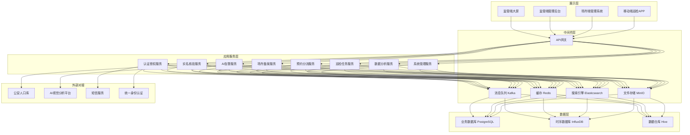
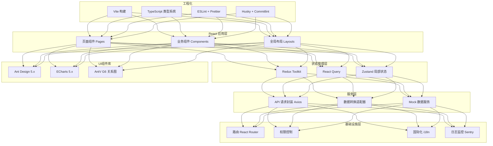
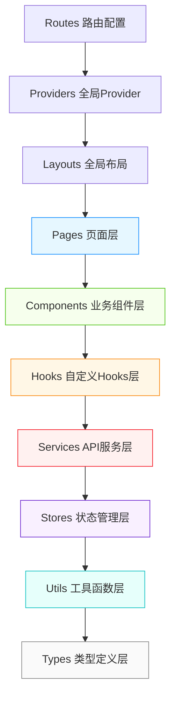
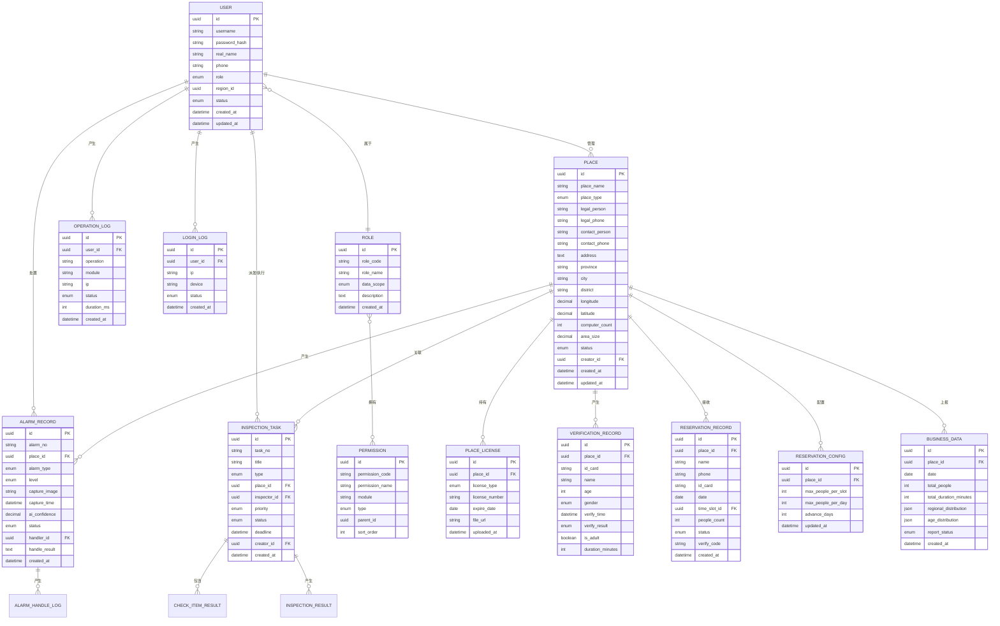

## 1. 架构设计

### 1.1 系统总体架构



### 1.2 前端架构



## 2. 技术描述

### 2.1 前端技术栈

| 技术 | 版本 | 用途说明 |
|------|------|----------|
| React | 18.x | 核心UI框架，使用并发特性优化渲染性能 |
| TypeScript | 5.x | 类型安全，减少运行时错误 |
| Vite | 5.x | 构建工具，提升开发体验和构建速度 |
| Ant Design | 5.x | 企业级UI组件库，支持主题定制 |
| React Router | 6.x | 客户端路由，支持嵌套路由和动态路由 |
| Redux Toolkit | 2.x | 全局状态管理，用于用户信息、权限等 |
| TanStack Query | 5.x | 服务端状态管理，缓存、重试、乐观更新 |
| Zustand | 4.x | 轻量级状态管理，用于复杂组件间状态共享 |
| Axios | 1.x | HTTP请求库，统一拦截器、错误处理 |
| ECharts | 5.x | 数据可视化，地图、图表、仪表盘 |
| @ant-design/charts | 2.x | 基于ECharts的React图表组件库 |
| dayjs | 1.x | 日期时间处理库 |
| ahooks | 3.x | React Hooks工具库 |
| Tailwind CSS | 3.x | 原子化CSS，快速构建UI |
| react-i18next | 14.x | 国际化支持 |
| Mock.js | 1.x | 开发阶段模拟接口数据 |
| crypto-js | 4.x | 前端加密，密码传输加密 |
| ESLint | 8.x | 代码质量检查 |
| Prettier | 3.x | 代码格式化 |
| Husky | 9.x | Git钩子 |
| Commitlint | 19.x | 提交规范检查 |

### 2.2 初始化工具

- **项目初始化**：使用 `npm create vite@latest` 创建React + TypeScript项目
- **包管理器**：pnpm 8.x，提升依赖安装速度
- **Node.js版本**：>= 18.17.0

### 2.3 后端与数据库（前端Mock模拟）

由于本项目为前端演示项目，采用Mock数据模拟后端接口：
- **Mock方案**：MSW (Mock Service Worker) + Mock.js
- **数据持久化**：localStorage 存储用户会话、表单草稿
- **数据库模拟**：使用 TypeScript 接口定义数据模型，内存数据库模拟
- **认证模拟**：JWT Token 机制模拟

## 3. 路由定义

| 路由路径 | 页面名称 | 权限要求 | 说明 |
|----------|----------|----------|------|
| `/login` | 登录认证页 | 公开 | 双因素认证登录 |
| `/dashboard` | 监管数据大屏 | 监管员/管理员 | 全省数据概览大屏 |
| `/places` | 场所备案管理 | 监管员/管理员 | 场所列表 |
| `/places/new` | 新增场所备案 | 场所管理员/监管员 | 新增备案表单 |
| `/places/:id` | 场所备案详情 | 监管员/管理员/场所管理员 | 查看详情、审核 |
| `/places/:id/edit` | 编辑场所备案 | 场所管理员/监管员 | 编辑备案信息 |
| `/verification` | 实名核验管理 | 监管员/管理员/场所管理员 | 核验记录列表 |
| `/reservation` | 预约分流管理 | 监管员/管理员/场所管理员 | 预约列表、配置 |
| `/reservation/config` | 预约配置 | 场所管理员/监管员 | 时段、限流配置 |
| `/alarms` | AI告警中心 | 监管员/管理员 | 告警列表 |
| `/alarms/:id` | 告警详情 | 监管员/管理员 | 告警处置 |
| `/inspection` | 巡检任务管理 | 监管员/管理员 | 任务列表 |
| `/inspection/new` | 创建巡检任务 | 市级/省级监管员 | 派发新任务 |
| `/inspection/:id` | 巡检任务详情 | 监管员/管理员 | 任务执行、结果查看 |
| `/analytics` | 经营数据分析 | 监管员/管理员 | 数据报表、分析 |
| `/analytics/reports` | 数据上报 | 场所管理员/监管员 | 经营数据上报 |
| `/system/users` | 用户管理 | 系统管理员 | 用户增删改查 |
| `/system/roles` | 角色权限 | 系统管理员 | 角色、权限配置 |
| `/system/logs` | 日志审计 | 系统管理员/监管员 | 操作日志、登录日志 |
| `/system/security` | 等保配置 | 系统管理员 | 安全策略配置 |
| `/profile` | 个人中心 | 所有登录用户 | 个人信息、密码修改 |
| `*` | 404页面 | 公开 | 路由未匹配 |

## 4. API 类型定义

### 4.1 通用响应结构

```typescript
// 通用响应包装
interface ApiResponse<T = any> {
  code: number;
  message: string;
  data: T;
  timestamp: number;
  traceId: string;
}

// 分页响应
interface PageResult<T = any> {
  list: T[];
  total: number;
  page: number;
  pageSize: number;
}

// 分页请求参数
interface PageParams {
  page: number;
  pageSize: number;
  keyword?: string;
}

// 排序参数
interface SortParams {
  sortField?: string;
  sortOrder?: 'ascend' | 'descend';
}
```

### 4.2 用户与认证

```typescript
// 登录请求
interface LoginRequest {
  username: string;
  password: string;
  smsCode?: string;
  captcha?: string;
  remember?: boolean;
}

// 登录响应
interface LoginResponse {
  token: string;
  refreshToken: string;
  expiresIn: number;
  userInfo: UserInfo;
  permissions: string[];
  lastLoginTime: string;
  lastLoginIp: string;
}

// 用户信息
interface UserInfo {
  id: string;
  username: string;
  realName: string;
  avatar?: string;
  phone: string;
  email?: string;
  role: UserRole;
  roleName: string;
  region?: string;
  regionName?: string;
  department?: string;
  status: 'active' | 'disabled' | 'locked';
  createdAt: string;
}

// 用户角色枚举
type UserRole = 'province_admin' | 'city_admin' | 'county_admin' | 'place_admin' | 'system_admin';

// 修改密码请求
interface ChangePasswordRequest {
  oldPassword: string;
  newPassword: string;
  confirmPassword: string;
}
```

### 4.3 场所备案

```typescript
// 场所信息
interface PlaceInfo {
  id: string;
  placeName: string;
  placeType: 'internet_bar' | 'game_hall' | 'ktv' | 'other';
  placeTypeName: string;
  legalPerson: string;
  legalPhone: string;
  contactPerson: string;
  contactPhone: string;
  address: string;
  province: string;
  city: string;
  district: string;
  businessHours: string;
  computerCount: number;
  areaSize: number;
  fireLicense?: string;
  fireLicenseExpire?: string;
  securityLicense?: string;
  securityLicenseExpire?: string;
  businessLicense?: string;
  status: 'pending' | 'approved' | 'rejected' | 'closed';
  statusName: string;
  auditRemark?: string;
  auditTime?: string;
  auditor?: string;
  longitude?: number;
  latitude?: number;
  createdAt: string;
  updatedAt: string;
}

// 场所备案请求
interface PlaceCreateRequest {
  placeName: string;
  placeType: string;
  legalPerson: string;
  legalPhone: string;
  contactPerson: string;
  contactPhone: string;
  address: string;
  province: string;
  city: string;
  district: string;
  businessHours: string;
  computerCount: number;
  areaSize: number;
  fireLicenseFile?: File;
  securityLicenseFile?: File;
  businessLicenseFile?: File;
  longitude?: number;
  latitude?: number;
}

// 场所审核请求
interface PlaceAuditRequest {
  id: string;
  status: 'approved' | 'rejected';
  remark: string;
}

// 证件上传响应
interface FileUploadResponse {
  fileId: string;
  fileName: string;
  fileUrl: string;
  fileSize: number;
}
```

### 4.4 实名核验

```typescript
// 核验记录
interface VerificationRecord {
  id: string;
  placeId: string;
  placeName: string;
  idCard: string;
  name: string;
  gender: 'male' | 'female';
  age: number;
  verifyTime: string;
  verifyResult: 'success' | 'failed';
  failReason?: string;
  isAdult: boolean;
  machineNumber?: string;
  startTime?: string;
  endTime?: string;
  duration?: number;
}

// 核验请求
interface VerifyRequest {
  placeId: string;
  idCard: string;
  name: string;
  faceImage?: string;
}

// 核验响应
interface VerifyResponse {
  success: boolean;
  isAdult: boolean;
  message: string;
  recordId?: string;
  confidence?: number;
}
```

### 4.5 预约分流

```typescript
// 预约记录
interface ReservationRecord {
  id: string;
  placeId: string;
  placeName: string;
  name: string;
  phone: string;
  idCard: string;
  date: string;
  timeSlot: string;
  peopleCount: number;
  status: 'pending' | 'confirmed' | 'cancelled' | 'used' | 'expired';
  statusName: string;
  verifyCode: string;
  createTime: string;
  confirmTime?: string;
  useTime?: string;
  cancelTime?: string;
  cancelReason?: string;
}

// 预约配置
interface ReservationConfig {
  placeId: string;
  timeSlots: TimeSlot[];
  maxPeoplePerSlot: number;
  maxPeoplePerDay: number;
  advanceDays: number;
  holidayEnabled: boolean;
  holidayConfig?: HolidayConfig[];
}

interface TimeSlot {
  id: string;
  name: string;
  startTime: string;
  endTime: string;
  maxPeople: number;
  enabled: boolean;
}

interface HolidayConfig {
  date: string;
  name: string;
  maxPeople: number;
  enabled: boolean;
}

// 预约请求
interface ReservationRequest {
  placeId: string;
  name: string;
  phone: string;
  idCard: string;
  date: string;
  timeSlotId: string;
  peopleCount: number;
}
```

### 4.6 AI告警

```typescript
// 告警记录
interface AlarmRecord {
  id: string;
  alarmNo: string;
  placeId: string;
  placeName: string;
  alarmType: 'smoking' | 'minor' | 'fight' | 'other';
  alarmTypeName: string;
  level: 'low' | 'medium' | 'high' | 'critical';
  levelName: string;
  captureImage: string;
  captureTime: string;
  aiConfidence: number;
  description?: string;
  status: 'pending' | 'processing' | 'resolved' | 'closed';
  statusName: string;
  handlerId?: string;
  handlerName?: string;
  handleTime?: string;
  handleResult?: string;
  handleImages?: string[];
  createdAt: string;
}

// 告警处置请求
interface AlarmHandleRequest {
  id: string;
  status: 'processing' | 'resolved' | 'closed';
  handleResult: string;
  handleImages?: File[];
  notifyPlace?: boolean;
}

// 告警统计
interface AlarmStatistics {
  total: number;
  pending: number;
  processing: number;
  resolved: number;
  today: number;
  smokingCount: number;
  minorCount: number;
  highLevelCount: number;
  trend: { date: string; count: number }[];
}
```

### 4.7 巡检任务

```typescript
// 巡检任务
interface InspectionTask {
  id: string;
  taskNo: string;
  title: string;
  type: 'routine' | 'special' | 'complaint' | 'alarm';
  typeName: string;
  placeId: string;
  placeName: string;
  inspectorId: string;
  inspectorName: string;
  priority: 'low' | 'medium' | 'high';
  priorityName: string;
  status: 'pending' | 'in_progress' | 'completed' | 'rejected';
  statusName: string;
  deadline: string;
  checkItems: CheckItem[];
  description?: string;
  attachments?: string[];
  creatorId: string;
  creatorName: string;
  createdAt: string;
  startedAt?: string;
  completedAt?: string;
  result?: InspectionResult;
}

// 检查项
interface CheckItem {
  id: string;
  name: string;
  category: string;
  required: boolean;
  result?: 'pass' | 'fail' | 'na';
  remark?: string;
  images?: string[];
}

// 巡检结果
interface InspectionResult {
  overall: 'pass' | 'fail' | 'partial';
  problemDescription?: string;
  rectificationRequired?: boolean;
  rectificationDeadline?: string;
  images?: string[];
  location?: { lat: number; lng: number };
  signature?: string;
}

// 任务创建请求
interface InspectionCreateRequest {
  title: string;
  type: string;
  placeId: string;
  inspectorId: string;
  priority: string;
  deadline: string;
  checkItemIds: string[];
  description?: string;
  attachments?: File[];
}

// 巡检执行请求
interface InspectionExecuteRequest {
  taskId: string;
  checkItems: CheckItem[];
  overall: string;
  problemDescription?: string;
  rectificationRequired?: boolean;
  rectificationDeadline?: string;
  images?: File[];
  location?: { lat: number; lng: number };
}
```

### 4.8 经营数据

```typescript
// 经营数据记录
interface BusinessData {
  id: string;
  placeId: string;
  placeName: string;
  date: string;
  totalPeople: number;
  totalDuration: number;
  avgDuration: number;
  peakHour: string;
  regionalDistribution: RegionItem[];
  ageDistribution: AgeItem[];
  genderDistribution: { male: number; female: number };
  revenue?: number;
  reportStatus: 'draft' | 'submitted' | 'approved' | 'rejected';
  reportTime?: string;
  auditor?: string;
  auditTime?: string;
  auditRemark?: string;
  createdAt: string;
}

interface RegionItem {
  region: string;
  count: number;
  percentage: number;
}

interface AgeItem {
  ageRange: string;
  count: number;
  percentage: number;
}

// 数据上报请求
interface BusinessReportRequest {
  placeId: string;
  date: string;
  totalPeople: number;
  totalDuration: number;
  dataDetails?: any;
}

// 数据统计概览
interface DataOverview {
  totalPlaces: number;
  onlinePlaces: number;
  todayPeople: number;
  todayDuration: number;
  activeRate: number;
  monthOnMonth: number;
  yearOnYear: number;
}
```

### 4.9 系统管理

```typescript
// 角色信息
interface RoleInfo {
  id: string;
  roleCode: string;
  roleName: string;
  description?: string;
  dataScope: 'all' | 'province' | 'city' | 'county' | 'self';
  dataScopeName: string;
  menuPermissions: string[];
  buttonPermissions: string[];
  status: 'enabled' | 'disabled';
  createdAt: string;
}

// 操作日志
interface OperationLog {
  id: string;
  userId: string;
  username: string;
  operation: string;
  module: string;
  method: string;
  params?: string;
  result?: string;
  ip: string;
  location?: string;
  device?: string;
  status: 'success' | 'failed';
  duration: number;
  createdAt: string;
}

// 登录日志
interface LoginLog {
  id: string;
  userId: string;
  username: string;
  ip: string;
  location?: string;
  device?: string;
  browser?: string;
  os?: string;
  status: 'success' | 'failed';
  failReason?: string;
  createdAt: string;
}

// 安全配置
interface SecurityConfig {
  passwordMinLength: number;
  passwordComplexity: boolean;
  passwordExpireDays: number;
  passwordHistoryCount: number;
  loginFailThreshold: number;
  loginLockTime: number;
  sessionTimeout: number;
  twoFactorAuth: boolean;
  dataEncryption: boolean;
  ipWhitelist?: string[];
}
```

## 5. 前端分层架构



## 6. 数据模型

### 6.1 实体关系图



### 6.2 前端数据存储策略

| 数据类型 | 存储方式 | 过期时间 | 加密 | 说明 |
|----------|----------|----------|------|------|
| JWT Token | localStorage | 2小时 | 是 | 访问令牌 |
| Refresh Token | localStorage | 7天 | 是 | 刷新令牌 |
| 用户信息 | Zustand Store | 会话内 | 否 | 内存存储 |
| 权限列表 | Zustand Store | 会话内 | 否 | 内存存储 |
| 菜单折叠状态 | localStorage | 永久 | 否 | UI状态 |
| 主题配置 | localStorage | 永久 | 否 | UI状态 |
| 表单草稿 | localStorage | 7天 | 是 | 未提交表单 |
| 搜索历史 | localStorage | 30天 | 否 | 搜索条件 |

### 6.3 目录结构

```
/Users/chen/Documents/trae_projects/local_projects/may-89106
├── .trae/
│   └── documents/
│       ├── PRD-山东省文旅场所智慧监管服务平台.md
│       └── ARCH-山东省文旅场所智慧监管服务平台.md
├── public/
│   ├── favicon.ico
│   ├── mockServiceWorker.js
│   └── static/
│       ├── maps/
│       │   └── shandong.json
│       └── images/
├── src/
│   ├── assets/
│   │   ├── styles/
│   │   │   ├── index.less
│   │   │   ├── theme.less
│   │   │   └── variables.less
│   │   └── images/
│   ├── components/
│   │   ├── common/
│   │   │   ├── PageContainer/
│   │   │   ├── TablePro/
│   │   │   ├── SearchForm/
│   │   │   ├── StatusTag/
│   │   │   ├── Desensitize/
│   │   │   └── UploadPro/
│   │   ├── charts/
│   │   │   ├── LineChart/
│   │   │   ├── BarChart/
│   │   │   ├── PieChart/
│   │   │   ├── MapChart/
│   │   │   └── DashboardCard/
│   │   └── layout/
│   │       ├── Header/
│   │       ├── Sidebar/
│   │       ├── Footer/
│   │       └── Breadcrumb/
│   ├── hooks/
│   │   ├── useAuth.ts
│   │   ├── usePermission.ts
│   │   ├── useTable.ts
│   │   ├── usePagination.ts
│   │   ├── useDesensitize.ts
│   │   └── useChartTheme.ts
│   ├── layouts/
│   │   ├── BasicLayout.tsx
│   │   ├── BlankLayout.tsx
│   │   └── SecurityLayout.tsx
│   ├── pages/
│   │   ├── login/
│   │   ├── dashboard/
│   │   ├── places/
│   │   ├── verification/
│   │   ├── reservation/
│   │   ├── alarms/
│   │   ├── inspection/
│   │   ├── analytics/
│   │   ├── system/
│   │   ├── profile/
│   │   └── 404.tsx
│   ├── providers/
│   │   ├── AppProvider.tsx
│   │   ├── ThemeProvider.tsx
│   │   └── QueryProvider.tsx
│   ├── router/
│   │   ├── index.tsx
│   │   ├── routes.tsx
│   │   └── guard.tsx
│   ├── services/
│   │   ├── api/
│   │   │   ├── auth.ts
│   │   │   ├── place.ts
│   │   │   ├── verification.ts
│   │   │   ├── reservation.ts
│   │   │   ├── alarm.ts
│   │   │   ├── inspection.ts
│   │   │   ├── analytics.ts
│   │   │   └── system.ts
│   │   ├── mock/
│   │   │   ├── handlers/
│   │   │   ├── data/
│   │   │   └── browser.ts
│   │   ├── request.ts
│   │   └── types.ts
│   ├── stores/
│   │   ├── useUserStore.ts
│   │   ├── usePermissionStore.ts
│   │   └── useAppStore.ts
│   ├── types/
│   │   ├── api.d.ts
│   │   ├── common.d.ts
│   │   └── models.d.ts
│   ├── utils/
│   │   ├── auth.ts
│   │   ├── crypto.ts
│   │   ├── desensitize.ts
│   │   ├── format.ts
│   │   ├── storage.ts
│   │   ├── region.ts
│   │   └── echarts-theme.ts
│   ├── App.tsx
│   ├── main.tsx
│   └── vite-env.d.ts
├── .env.development
├── .env.production
├── .env.test
├── .eslintrc.cjs
├── .prettierrc
├── .gitignore
├── index.html
├── package.json
├── pnpm-lock.yaml
├── tsconfig.json
├── tsconfig.node.json
├── vite.config.ts
└── tailwind.config.js
```
