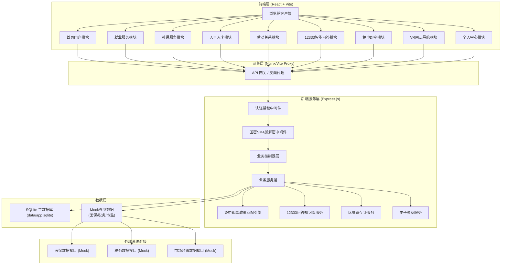
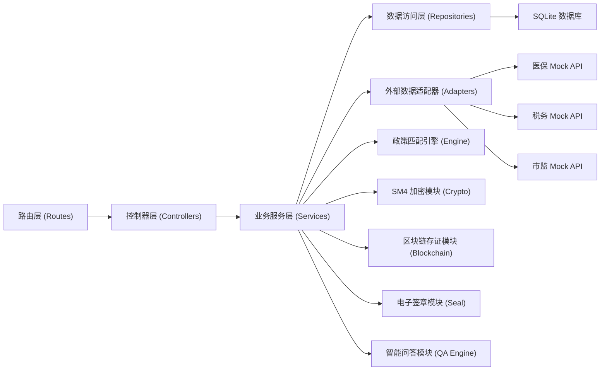

## 1. 架构设计



## 2. 技术说明

- **前端框架**: React@18 + React Router@6 + Vite@5
- **前端样式**: TailwindCSS@3 + PostCSS + Autoprefixer
- **状态管理**: React Context + useReducer（轻量级场景）
- **HTTP 客户端**: Axios + 请求/响应拦截器（自动加解密）
- **后端框架**: Express@4 + CORS + body-parser
- **数据库**: SQLite3 + better-sqlite3（文件数据库，data/app.sqlite）
- **国密加密**: gm-crypto（SM4对称加密，符合《个人信息保护法》要求）
- **电子签章**: Canvas API 前端签名 + 后端签章图片合成
- **区块链存证**: 简化版哈希链存证（SHA256 + 时间戳 Merkle Tree）
- **语音识别**: Web Speech API（方言识别采用关键词匹配模拟）
- **VR 全景**: CSS 3D Transform + panorama-sphere 组件模拟
- **数据可视化**: Recharts（统计图表展示）
- **初始化工具**: Vite 脚手架初始化前端项目

**端口配置**:
- 项目目录: may-89165，tail4 = 89165 后四位 = 9165
- FRONTEND_PORT = 40000 + 9165 = **49165**
- BACKEND_PORT = 50000 + 9165 = **59165**
- 所有服务只监听 127.0.0.1
- CORS 允许来源: http://127.0.0.1:49165

## 3. 路由定义

### 前端路由

| 路由路径 | 页面组件 | 用途说明 |
|----------|----------|----------|
| / | HomePage | 平台首页（服务导航、政策轮播、免申即享推荐） |
| /employment/unemployment-register | UnemploymentRegisterPage | 失业登记电子化签章办理 |
| /employment/entrepreneur-loan | EntrepreneurLoanPage | 创业担保贷款在线预审 |
| /employment/skill-certification | SkillCertificationPage | 职业技能等级认定报名与成绩核验 |
| /social-insurance/cert-blockchain | InsuranceCertPage | 社保参保证明区块链存证 |
| /social-insurance/payment-query | PaymentQueryPage | 社保缴费查询 |
| /personnel/title-review | TitleReviewPage | 职称评审服务 |
| /labor-relations/arbitration | ArbitrationPage | 劳动仲裁申请材料结构化填报 |
| /smart-qa | SmartQAPage | 12333智能问答（含方言语音） |
| /policy-match | PolicyMatchPage | 免申即享政策匹配 & 稳岗返还测算 |
| /service-outlets | OutletsVRPage | 服务网点VR实景导航 |
| /user/profile | UserProfilePage | 个人中心 - 我的信息 |
| /user/applications | UserApplicationsPage | 个人中心 - 我的办件 |
| /user/certificates | UserCertificatesPage | 个人中心 - 我的证照 |
| /login | LoginPage | 用户登录/实名认证 |

### 后端 API 路由前缀

所有接口统一前缀 `/api/v1`

| 路由前缀 | 用途说明 |
|----------|----------|
| /api/v1/auth | 认证授权相关接口 |
| /api/v1/employment | 就业服务业务接口 |
| /api/v1/social-insurance | 社保服务业务接口 |
| /api/v1/personnel | 人事人才业务接口 |
| /api/v1/labor-relations | 劳动关系业务接口 |
| /api/v1/policy-match | 免申即享政策匹配引擎接口 |
| /api/v1/smart-qa | 12333智能问答接口 |
| /api/v1/outlets | 服务网点接口 |
| /api/v1/user | 用户个人中心接口 |
| /api/v1/health | 服务健康检查接口 |

## 4. API 定义（TypeScript 类型）

```typescript
// 通用响应结构
interface ApiResponse<T> {
  code: number;           // 0 成功，非 0 错误码
  message: string;        // 响应消息
  data: T;                // 响应数据
  timestamp: number;      // 响应时间戳
  traceId: string;        // 请求追踪ID
}

// 用户信息
interface UserInfo {
  id: string;
  idCardEncrypted: string;   // 身份证号（SM4加密存储）
  realNameEncrypted: string; // 真实姓名（SM4加密存储）
  phoneEncrypted: string;    // 手机号（SM4加密存储）
  userType: 'personal' | 'enterprise' | 'staff' | 'admin';
  authLevel: number;         // 实名认证等级 1-4
  avatar?: string;
}

// 失业登记申请
interface UnemploymentRegister {
  id: string;
  userId: string;
  nameEncrypted: string;
  idCardEncrypted: string;
  unemploymentReason: string;
  employmentIntention: string[];
  education: string;
  workYears: number;
  signatureData: string;     // 电子签章base64数据
  sealCertHash: string;      // 签章存证哈希
  status: 'pending' | 'approved' | 'rejected';
  createdAt: string;
  updatedAt: string;
}

// 创业担保贷款预审
interface EntrepreneurLoanApplication {
  id: string;
  userId: string;
  enterpriseNameEncrypted: string;
  usccEncrypted: string;     // 统一社会信用代码（加密）
  loanAmount: number;        // 申请金额（元）
  loanPurpose: string;
  businessType: string;
  businessYears: number;
  employeeCount: number;
  preCheckResult?: 'pass' | 'fail' | 'pending';
  preCheckAmount?: number;   // 预审预估额度
  remark?: string;
  status: string;
  createdAt: string;
}

// 社保参保证明
interface InsuranceCertificate {
  id: string;
  userId: string;
  userNameEncrypted: string;
  idCardEncrypted: string;
  startDate: string;
  endDate: string;
  insuranceTypes: string[];  // 险种列表
  paymentMonths: number;     // 累计缴费月数
  blockchainHash: string;    // 区块链存证哈希
  previousHash: string;      // 上一区块哈希
  txId: string;              // 存证交易ID
  pdfUrl: string;
  verifyCode: string;        // 二维码核验码
  issuedAt: string;
}

// 职业技能等级认定
interface SkillCertification {
  id: string;
  userId: string;
  examId: string;
  examName: string;
  skillLevel: number;        // 1-5级
  registrationDate: string;
  examDate?: string;
  score?: number;
  passStatus?: 'pass' | 'fail' | 'pending';
  certificateNo?: string;
  certificateHash?: string;  // 证书存证哈希
  status: string;
}

// 劳动仲裁申请
interface ArbitrationApplication {
  id: string;
  userId: string;
  caseType: string;          // 案件类型：工资/社保/解除合同等
  applicantNameEncrypted: string;
  respondentNameEncrypted: string;  // 被申请人
  claimItems: ArbitrationClaim[];   // 诉求事项列表
  factsAndReasons: string;
  evidenceFiles: string[];   // 证据材料路径
  status: 'draft' | 'submitted' | 'accepted' | 'hearing' | 'decided';
  createdAt: string;
}

interface ArbitrationClaim {
  type: string;              // 诉求类型
  amount?: number;           // 涉及金额
  description: string;       // 诉求描述
}

// 免申即享政策匹配
interface PolicyMatchResult {
  policyId: string;
  policyName: string;
  policyType: string;        // 稳岗返还/社保补贴/就业补贴等
  matchScore: number;        // 匹配度 0-100
  eligible: boolean;         // 是否符合条件
  estimatedAmount?: number;  // 预估金额（如稳岗返还）
  requirements: string[];    // 所需材料
  deadline?: string;         // 申报截止日期
}

// 稳岗返还测算
interface WsReturnCalcResult {
  enterpriseName: string;
  totalEmployees: number;
  insuredEmployees: number;
  actualPayment: number;     // 实际缴纳失业保险费
  layoffRate: number;        // 裁员率
  returnRatio: number;       // 返还比例
  estimatedReturn: number;   // 预计返还金额
  eligible: boolean;
  reason?: string;
}

// 12333 智能问答
interface QAMessage {
  id: string;
  sessionId: string;
  role: 'user' | 'assistant';
  content: string;
  audioUrl?: string;         // 语音消息URL
  dialect?: string;          // 方言标识
  timestamp: number;
  relatedPolicyIds?: string[];
}

// 服务网点
interface ServiceOutlet {
  id: string;
  name: string;
  address: string;
  district: string;
  phone: string;
  businessHours: string;
  services: string[];        // 可办理业务列表
  latitude: number;
  longitude: number;
  vrPanoramaUrl?: string;    // VR全景图URL
  waitCount?: number;        // 当前排队人数
  distance?: number;         // 距离用户位置(km)
}
```

## 5. 服务端分层架构



**分层说明**:
- **Routes**: 定义 RESTful API 路由，参数校验
- **Controllers**: 请求参数解析、响应格式化、异常处理
- **Services**: 核心业务逻辑、事务控制
- **Repositories**: 数据库 CRUD 封装，SQL 语句隔离
- **Adapters**: 外部系统对接适配器，当前 Mock 实现
- **Engine**: 免申即享政策匹配规则引擎
- **Crypto**: 国密 SM4 对称加解密模块
- **Blockchain**: 简化哈希链存证模块
- **Seal**: 电子签章生成与验证模块
- **QA Engine**: 基于关键词匹配 + 知识库的智能问答引擎

## 6. 数据模型

### 6.1 ER 图

```mermaid
erDiagram
    USERS ||--o{ UNEMPLOYMENT_REGISTERS : "submit"
    USERS ||--o{ ENTREPRENEUR_LOANS : "submit"
    USERS ||--o{ INSURANCE_CERTS : "generate"
    USERS ||--o{ SKILL_CERTS : "register"
    USERS ||--o{ ARBITRATION_CASES : "submit"
    USERS ||--o{ USER_APPLICATIONS : "owns"
    USERS ||--o{ USER_CERTIFICATES : "holds"
    USERS ||--o{ POLICY_MATCH_LOGS : "generates"
    USERS ||--o{ QA_SESSIONS : "creates"

    INSURANCE_CERTS ||--|| BLOCKCHAIN_RECORDS : "anchors"
    SKILL_CERTS ||--o| BLOCKCHAIN_RECORDS : "anchors"

    POLICIES ||--o{ POLICY_MATCH_LOGS : "matches"
    QA_SESSIONS ||--o{ QA_MESSAGES : "contains"
    KNOWLEDGE_BASE ||--o{ QA_MESSAGES : "retrieved from"
    SERVICE_OUTLETS ||--o{ OUTLET_VR_SCENES : "has"

    USERS {
        string id PK
        string id_card_encrypted
        string real_name_encrypted
        string phone_encrypted
        string user_type
        int auth_level
        string password_hash
        string sm4_key_id
        datetime created_at
        datetime updated_at
    }

    UNEMPLOYMENT_REGISTERS {
        string id PK
        string user_id FK
        string reason
        string employment_intention
        string signature_data
        string seal_cert_hash
        string status
        datetime created_at
    }

    ENTREPRENEUR_LOANS {
        string id PK
        string user_id FK
        string enterprise_name_encrypted
        string uscc_encrypted
        decimal loan_amount
        string pre_check_result
        decimal pre_check_amount
        string status
        datetime created_at
    }

    INSURANCE_CERTS {
        string id PK
        string user_id FK
        string start_date
        string end_date
        string insurance_types
        int payment_months
        string blockchain_hash
        string verify_code
        datetime issued_at
    }

    SKILL_CERTS {
        string id PK
        string user_id FK
        string exam_name
        int skill_level
        decimal score
        string pass_status
        string certificate_no
        string certificate_hash
        string status
    }

    ARBITRATION_CASES {
        string id PK
        string user_id FK
        string case_type
        string respondent_encrypted
        string claim_items_json
        string facts_reasons
        string evidence_files_json
        string status
        datetime created_at
    }

    POLICIES {
        string id PK
        string name
        string type
        text rules_json
        text description
        string deadline
        int priority
    }

    POLICY_MATCH_LOGS {
        string id PK
        string user_id FK
        string policy_id FK
        int match_score
        boolean eligible
        decimal estimated_amount
        datetime matched_at
    }

    BLOCKCHAIN_RECORDS {
        string id PK
        string hash
        string previous_hash
        string data_digest
        string ref_type
        string ref_id
        int block_height
        datetime timestamp
    }

    KNOWLEDGE_BASE {
        string id PK
        string question
        string answer
        string keywords_json
        string category
        int hit_count
    }

    QA_SESSIONS {
        string id PK
        string user_id FK
        string title
        datetime created_at
    }

    QA_MESSAGES {
        string id PK
        string session_id FK
        string role
        string content
        string dialect
        datetime created_at
    }

    SERVICE_OUTLETS {
        string id PK
        string name
        string address
        string district
        string phone
        string business_hours
        decimal latitude
        decimal longitude
        string vr_panorama_url
    }
```



### 6.2 DDL 语句（SQLite）

```sql
-- 用户表
CREATE TABLE IF NOT EXISTS users (
    id TEXT PRIMARY KEY,
    id_card_encrypted TEXT NOT NULL,
    real_name_encrypted TEXT NOT NULL,
    phone_encrypted TEXT NOT NULL,
    user_type TEXT NOT NULL DEFAULT 'personal',
    auth_level INTEGER NOT NULL DEFAULT 1,
    password_hash TEXT NOT NULL,
    sm4_key_id TEXT NOT NULL,
    created_at DATETIME DEFAULT CURRENT_TIMESTAMP,
    updated_at DATETIME DEFAULT CURRENT_TIMESTAMP
);

-- 失业登记表
CREATE TABLE IF NOT EXISTS unemployment_registers (
    id TEXT PRIMARY KEY,
    user_id TEXT NOT NULL,
    reason TEXT NOT NULL,
    employment_intention TEXT,
    education TEXT,
    work_years INTEGER DEFAULT 0,
    signature_data TEXT,
    seal_cert_hash TEXT,
    status TEXT NOT NULL DEFAULT 'pending',
    reject_reason TEXT,
    created_at DATETIME DEFAULT CURRENT_TIMESTAMP,
    updated_at DATETIME DEFAULT CURRENT_TIMESTAMP,
    FOREIGN KEY (user_id) REFERENCES users(id)
);

-- 创业担保贷款表
CREATE TABLE IF NOT EXISTS entrepreneur_loans (
    id TEXT PRIMARY KEY,
    user_id TEXT NOT NULL,
    enterprise_name_encrypted TEXT NOT NULL,
    uscc_encrypted TEXT NOT NULL,
    loan_amount REAL NOT NULL,
    loan_purpose TEXT NOT NULL,
    business_type TEXT,
    business_years INTEGER DEFAULT 0,
    employee_count INTEGER DEFAULT 0,
    pre_check_result TEXT,
    pre_check_amount REAL,
    remark TEXT,
    status TEXT NOT NULL DEFAULT 'pending',
    created_at DATETIME DEFAULT CURRENT_TIMESTAMP,
    updated_at DATETIME DEFAULT CURRENT_TIMESTAMP,
    FOREIGN KEY (user_id) REFERENCES users(id)
);

-- 社保参保证明表
CREATE TABLE IF NOT EXISTS insurance_certs (
    id TEXT PRIMARY KEY,
    user_id TEXT NOT NULL,
    start_date TEXT NOT NULL,
    end_date TEXT NOT NULL,
    insurance_types TEXT NOT NULL,
    payment_months INTEGER NOT NULL,
    blockchain_hash TEXT NOT NULL,
    previous_hash TEXT,
    tx_id TEXT,
    pdf_url TEXT,
    verify_code TEXT NOT NULL,
    issued_at DATETIME DEFAULT CURRENT_TIMESTAMP,
    FOREIGN KEY (user_id) REFERENCES users(id)
);

-- 职业技能等级认定表
CREATE TABLE IF NOT EXISTS skill_certs (
    id TEXT PRIMARY KEY,
    user_id TEXT NOT NULL,
    exam_id TEXT NOT NULL,
    exam_name TEXT NOT NULL,
    skill_level INTEGER NOT NULL,
    registration_date TEXT NOT NULL,
    exam_date TEXT,
    score REAL,
    pass_status TEXT,
    certificate_no TEXT,
    certificate_hash TEXT,
    status TEXT NOT NULL DEFAULT 'registered',
    FOREIGN KEY (user_id) REFERENCES users(id)
);

-- 劳动仲裁申请表
CREATE TABLE IF NOT EXISTS arbitration_cases (
    id TEXT PRIMARY KEY,
    user_id TEXT NOT NULL,
    case_type TEXT NOT NULL,
    applicant_name_encrypted TEXT NOT NULL,
    respondent_name_encrypted TEXT,
    claim_items_json TEXT NOT NULL,
    facts_and_reasons TEXT,
    evidence_files_json TEXT,
    status TEXT NOT NULL DEFAULT 'draft',
    created_at DATETIME DEFAULT CURRENT_TIMESTAMP,
    updated_at DATETIME DEFAULT CURRENT_TIMESTAMP,
    FOREIGN KEY (user_id) REFERENCES users(id)
);

-- 政策表
CREATE TABLE IF NOT EXISTS policies (
    id TEXT PRIMARY KEY,
    name TEXT NOT NULL,
    type TEXT NOT NULL,
    rules_json TEXT NOT NULL,
    description TEXT,
    deadline TEXT,
    priority INTEGER DEFAULT 0,
    created_at DATETIME DEFAULT CURRENT_TIMESTAMP
);

-- 政策匹配日志表
CREATE TABLE IF NOT EXISTS policy_match_logs (
    id TEXT PRIMARY KEY,
    user_id TEXT NOT NULL,
    policy_id TEXT NOT NULL,
    match_score INTEGER NOT NULL,
    eligible INTEGER NOT NULL,
    estimated_amount REAL,
    matched_at DATETIME DEFAULT CURRENT_TIMESTAMP,
    FOREIGN KEY (user_id) REFERENCES users(id),
    FOREIGN KEY (policy_id) REFERENCES policies(id)
);

-- 区块链存证表
CREATE TABLE IF NOT EXISTS blockchain_records (
    id TEXT PRIMARY KEY,
    hash TEXT NOT NULL UNIQUE,
    previous_hash TEXT,
    data_digest TEXT NOT NULL,
    ref_type TEXT NOT NULL,
    ref_id TEXT NOT NULL,
    block_height INTEGER NOT NULL,
    timestamp DATETIME DEFAULT CURRENT_TIMESTAMP
);

-- 12333 知识库表
CREATE TABLE IF NOT EXISTS knowledge_base (
    id TEXT PRIMARY KEY,
    question TEXT NOT NULL,
    answer TEXT NOT NULL,
    keywords_json TEXT,
    category TEXT,
    hit_count INTEGER DEFAULT 0
);

-- 问答会话表
CREATE TABLE IF NOT EXISTS qa_sessions (
    id TEXT PRIMARY KEY,
    user_id TEXT NOT NULL,
    title TEXT,
    created_at DATETIME DEFAULT CURRENT_TIMESTAMP,
    FOREIGN KEY (user_id) REFERENCES users(id)
);

-- 问答消息表
CREATE TABLE IF NOT EXISTS qa_messages (
    id TEXT PRIMARY KEY,
    session_id TEXT NOT NULL,
    role TEXT NOT NULL,
    content TEXT NOT NULL,
    dialect TEXT,
    created_at DATETIME DEFAULT CURRENT_TIMESTAMP,
    FOREIGN KEY (session_id) REFERENCES qa_sessions(id)
);

-- 服务网点表
CREATE TABLE IF NOT EXISTS service_outlets (
    id TEXT PRIMARY KEY,
    name TEXT NOT NULL,
    address TEXT NOT NULL,
    district TEXT,
    phone TEXT,
    business_hours TEXT,
    services_json TEXT,
    latitude REAL,
    longitude REAL,
    vr_panorama_url TEXT,
    wait_count INTEGER DEFAULT 0
);

-- 用户证照表
CREATE TABLE IF NOT EXISTS user_certificates (
    id TEXT PRIMARY KEY,
    user_id TEXT NOT NULL,
    cert_type TEXT NOT NULL,
    cert_no TEXT,
    cert_name TEXT NOT NULL,
    cert_data_json TEXT,
    issued_by TEXT,
    issued_date TEXT,
    expire_date TEXT,
    created_at DATETIME DEFAULT CURRENT_TIMESTAMP,
    FOREIGN KEY (user_id) REFERENCES users(id)
);

-- 用户办件表
CREATE TABLE IF NOT EXISTS user_applications (
    id TEXT PRIMARY KEY,
    user_id TEXT NOT NULL,
    biz_type TEXT NOT NULL,
    biz_id TEXT NOT NULL,
    title TEXT NOT NULL,
    status TEXT NOT NULL,
    created_at DATETIME DEFAULT CURRENT_TIMESTAMP,
    updated_at DATETIME DEFAULT CURRENT_TIMESTAMP,
    FOREIGN KEY (user_id) REFERENCES users(id)
);

-- 创建索引
CREATE INDEX IF NOT EXISTS idx_users_phone ON users(phone_encrypted);
CREATE INDEX IF NOT EXISTS idx_registers_user ON unemployment_registers(user_id);
CREATE INDEX IF NOT EXISTS idx_certs_user ON insurance_certs(user_id);
CREATE INDEX IF NOT EXISTS idx_blockchain_hash ON blockchain_records(hash);
CREATE INDEX IF NOT EXISTS idx_qa_session ON qa_messages(session_id);
CREATE INDEX IF NOT EXISTS idx_policies_type ON policies(type);
CREATE INDEX IF NOT EXISTS idx_applications_user ON user_applications(user_id, status);
```

## 7. SM4 加密设计

### 加密流程

1. **密钥管理**: 每个用户分配独立 SM4 密钥（由主密钥 + 用户ID派生），主密钥存储于服务端环境变量
2. **加密范围**: 身份证号、真实姓名、手机号、企业名称、统一社会信用代码等个人敏感信息
3. **加密模式**: SM4-CBC + PKCS7 填充 + IV 随机生成
4. **存储格式**: `base64(iv) + ':' + base64(ciphertext)`

### 核心接口

```typescript
// SM4 加密工具
interface SM4Crypto {
  encrypt(plaintext: string, keyId: string): string;
  decrypt(ciphertext: string, keyId: string): string;
  generateKey(): { keyId: string; keyBase64: string };
}
```

### 请求响应拦截

- 请求: 前端对敏感字段自动 SM4 加密后上传
- 响应: 后端对数据库中加密字段解密后返回给已认证用户
- 日志: 敏感字段在日志中脱敏展示（身份证只显示前6后4位）
