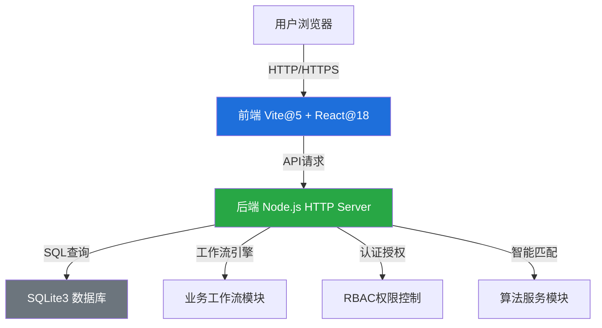
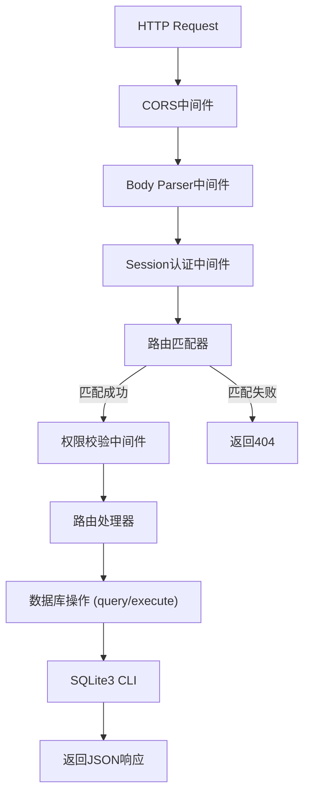
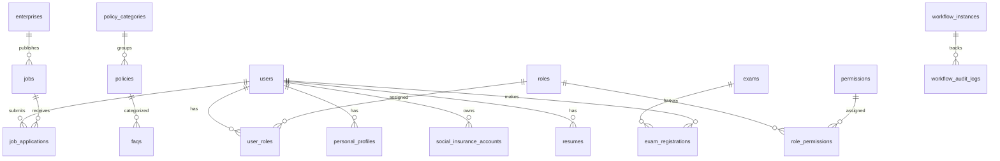

## 1. 架构设计



## 2. 技术描述

- **前端**: React@18.2 + React Router@6 + Ant Design@5 + TailwindCSS@3 + Vite@5 + axios@1
- **初始化工具**: npm create vite@latest
- **后端**: Node.js 原生 HTTP Server (无Express框架)
- **数据库**: SQLite3 (文件数据库 /data/app.sqlite, WAL模式)
- **后端端口**: 59086 (绑定 127.0.0.1)
- **前端端口**: 49086 (绑定 127.0.0.1)
- **状态管理**: React Context + useReducer
- **图表库**: recharts@2
- **HTTP客户端**: axios (带拦截器和Bearer Token认证)

## 3. 路由定义

| 路由 | 页面名称 | 权限要求 |
|-------|---------|---------|
| /login | 登录页 | 公开 |
| / | 首页门户 | 需要登录 |
| /dashboard | 个人中心首页 | 需要登录 |
| /insurance/accounts | 社保账户页 | personal.insurance.view |
| /insurance/registrations | 参保登记页 | personal.insurance.register |
| /insurance/certifications | 待遇资格认证 | personal.benefit.certify |
| /insurance/transfers | 社保转移页 | personal.insurance.transfer |
| /insurance/certificates | 电子凭证页 | personal.certificate.apply |
| /employment/jobs | 岗位列表页 | personal.job.search |
| /employment/jobs/:id | 岗位详情页 | personal.job.search |
| /employment/resume | 简历管理页 | personal.resume.manage |
| /employment/fairs | 招聘会页 | 公开 |
| /employment/training | 培训课程页 | personal.training.enroll |
| /exam/announcements | 考试公告页 | 公开 |
| /exam/registrations | 考试报名页 | personal.exam.register |
| /exam/tickets | 准考证页 | personal.exam.ticket |
| /exam/results | 成绩查询页 | personal.exam.result |
| /exam/certificates | 证书管理页 | personal.certificate.verify |
| /policy/list | 政策法规页 | policy.view |
| /policy/consult | 智能问答页 | policy.consult |
| /policy/faq | FAQ页 | 公开 |
| /analytics/time-monitoring | 时效监测页 | agency.statistics.view |
| /analytics/satisfaction | 满意度分析页 | agency.statistics.view |
| /analytics/heatmap | 热力分析页 | agency.statistics.view |
| /user/profile | 个人信息页 | 需要登录 |

## 4. API 定义

### 4.1 认证接口

```typescript
// 登录
POST /api/user/login
Request: { username: string, password: string }
Response: { 
  ok: boolean, 
  message: string, 
  data: { 
    token: string, 
    user: {
      id: number,
      username: string,
      real_name: string,
      user_type: 'personal' | 'enterprise' | 'agency',
      roles: string[],
      permissions: string[],
      profile: object
    }
  }
}

// 登出
POST /api/user/logout
Headers: Authorization: Bearer {token}

// 获取当前用户信息
GET /api/user/profile
Headers: Authorization: Bearer {token}
```

### 4.2 社保服务接口

```typescript
// 获取社保账户列表
GET /api/insurance/accounts
Headers: Authorization: Bearer {token}
Response: { ok: boolean, data: Account[] }

// 获取社保账户详情
GET /api/insurance/accounts/:id
Headers: Authorization: Bearer {token}

// 获取缴费记录
GET /api/insurance/payment-history
Headers: Authorization: Bearer {token}
Query: { insurance_type_id?: number, year?: number, page?: number, page_size?: number }

// 参保登记
POST /api/insurance/registrations
Headers: Authorization: Bearer {token}
Request: { insurance_type_id: number, registration_type: string, region: string }

// 待遇资格认证
POST /api/insurance/benefit-certification
Headers: Authorization: Bearer {token}
Request: { insurance_type_id: number, certification_method: 'face' | 'data_cross_check' }

// 社保转移申请
POST /api/insurance/transfers
Headers: Authorization: Bearer {token}
Request: { insurance_type_id: number, from_region: string, to_region: string }

// 社保概览
GET /api/insurance/overview
Headers: Authorization: Bearer {token}
```

### 4.3 就业服务接口

```typescript
// 岗位列表
GET /api/jobs
Headers: Authorization: Bearer {token}
Query: { keyword?: string, job_type?: string, region?: string, page?: number, page_size?: number }

// 智能推荐岗位
GET /api/jobs/recommended
Headers: Authorization: Bearer {token}
Query: { limit?: number }

// 岗位详情
GET /api/jobs/:id
Headers: Authorization: Bearer {token}

// 投递简历
POST /api/jobs/:id/apply
Headers: Authorization: Bearer {token}
Request: { resume_id?: number, cover_letter?: string }

// 获取我的简历
GET /api/resumes/me
Headers: Authorization: Bearer {token}

// 保存简历
POST /api/resumes
Headers: Authorization: Bearer {token}

// 投递记录
GET /api/job-applications
Headers: Authorization: Bearer {token}

// 招聘会列表
GET /api/job-fairs
Headers: Authorization: Bearer {token}

// 培训课程列表
GET /api/training-courses
Headers: Authorization: Bearer {token}

// 培训报名
POST /api/training-courses/:id/enroll
Headers: Authorization: Bearer {token}
```

### 4.4 人事考试接口

```typescript
// 考试列表
GET /api/exams
Headers: Authorization: Bearer {token}

// 考试公告
GET /api/exam-announcements
Headers: Authorization: Bearer {token}

// 考试报名
POST /api/exam-registrations
Headers: Authorization: Bearer {token}
Request: { exam_id: number, real_name: string, id_card: string }

// 我的报名
GET /api/exam-registrations
Headers: Authorization: Bearer {token}

// 准考证
GET /api/admission-tickets/:id
Headers: Authorization: Bearer {token}

// 成绩查询
GET /api/exam-results
Headers: Authorization: Bearer {token}

// 证书核验
GET /api/certificate-verify
Query: { certificate_no: string, id_card: string }
```

### 4.5 政策咨询接口

```typescript
// 政策列表
GET /api/policies
Headers: Authorization: Bearer {token}
Query: { category_id?: number, keyword?: string, page?: number, page_size?: number }

// 三维检索
GET /api/policies/3d-search
Headers: Authorization: Bearer {token}
Query: { population?: string, matter?: string, region?: string }

// 政策详情
GET /api/policies/:id
Headers: Authorization: Bearer {token}

// FAQ列表
GET /api/faq
Headers: Authorization: Bearer {token}
Query: { category_id?: number, keyword?: string }

// 智能咨询
POST /api/consultation
Headers: Authorization: Bearer {token}
Request: { question: string }

// 咨询历史
GET /api/consultation/history
Headers: Authorization: Bearer {token}

// 知识图谱
GET /api/knowledge-graph
Headers: Authorization: Bearer {token}
```

### 4.6 运营管理接口

```typescript
// 时效监测
GET /api/analytics/time-monitoring
Headers: Authorization: Bearer {token}
Query: { service_id?: number, days?: number }

// SLA预警
GET /api/analytics/sla-alerts
Headers: Authorization: Bearer {token}
Query: { threshold_days?: number }

// 满意度分析
GET /api/analytics/satisfaction
Headers: Authorization: Bearer {token}
Query: { service_id?: number, days?: number }

// 提交满意度
POST /api/satisfaction/submit
Headers: Authorization: Bearer {token}
Request: { service_id: number, overall_rating: number, comment?: string }

// 服务缺口热力图
GET /api/analytics/heatmap
Headers: Authorization: Bearer {token}
Query: { time_period?: string }

// 通知列表
GET /api/notifications
Headers: Authorization: Bearer {token}

// 标记通知已读
POST /api/notifications/:id/read
Headers: Authorization: Bearer {token}
```

## 5. 服务器架构图



## 6. 数据模型

### 6.1 核心数据模型



### 6.2 核心表说明

1. **users** - 用户表：存储用户基本信息、登录凭证、用户类型
2. **roles** - 角色表：personal_user, enterprise_hr, agency_staff, agency_admin, system_admin
3. **permissions** - 权限表：各模块操作权限编码
4. **social_insurance_accounts** - 社保账户表：五险账户信息
5. **insurance_contributions** - 缴费记录表：按月缴费明细
6. **jobs** - 岗位表：企业发布的招聘信息
7. **resumes** - 简历表：个人用户简历
8. **job_applications** - 投递记录表：简历投递状态追踪
9. **exams** - 考试表：人事考试基本信息
10. **exam_registrations** - 考试报名表：报名信息和状态
11. **admission_tickets** - 准考证表：生成的准考证信息
12. **policies** - 政策法规表：政策文件信息
13. **faqs** - 常见问题表：FAQ自动归因
14. **consultation_records** - 咨询记录表：智能问答历史
15. **workflow_instances** - 工作流实例表：业务办理流程
16. **satisfaction_surveys** - 满意度调查表：用户评价
17. **performance_metrics** - 绩效指标表：时效监测数据
18. **service_gap_heatmap** - 服务缺口表：热力分析数据

## 7. 前端项目结构

```
frontend/
├── src/
│   ├── api/                    # API接口封装
│   │   ├── index.js            # axios实例配置
│   │   ├── auth.js             # 认证接口
│   │   ├── insurance.js        # 社保接口
│   │   ├── employment.js       # 就业接口
│   │   ├── exam.js             # 考试接口
│   │   ├── policy.js           # 政策接口
│   │   └── analytics.js        # 运营接口
│   ├── components/             # 公共组件
│   │   ├── Layout/             # 布局组件
│   │   ├── ProtectedRoute.js   # 路由守卫
│   │   └── common/             # 通用组件
│   ├── context/                # React Context
│   │   ├── AuthContext.js      # 认证上下文
│   │   └── AppContext.js       # 全局应用上下文
│   ├── pages/                  # 页面组件
│   │   ├── Login.jsx           # 登录页
│   │   ├── Dashboard.jsx       # 首页
│   │   ├── insurance/          # 社保模块
│   │   ├── employment/         # 就业模块
│   │   ├── exam/               # 考试模块
│   │   ├── policy/             # 政策模块
│   │   ├── analytics/          # 运营模块
│   │   └── user/               # 用户中心
│   ├── hooks/                  # 自定义Hooks
│   │   ├── useAuth.js          # 认证Hook
│   │   └── useRequest.js       # 请求Hook
│   ├── utils/                  # 工具函数
│   │   ├── format.js           # 格式化工具
│   │   └── storage.js          # 本地存储
│   ├── App.jsx                 # 根组件
│   ├── main.jsx                # 入口文件
│   └── index.css               # 全局样式
├── public/                     # 静态资源
├── index.html
├── vite.config.js              # Vite配置（代理、端口）
├── package.json
└── tailwind.config.js          # Tailwind配置
```

## 8. 关键技术点

1. **Vite配置**：
   - 端口：49086，strictPort: true
   - 代理：/api -> http://127.0.0.1:59086
   - host: 127.0.0.1

2. **Axios拦截器**：
   - 请求拦截器：自动添加Authorization header
   - 响应拦截器：统一处理401未授权，自动跳转登录页

3. **路由守卫**：
   - ProtectedRoute组件检查token和权限
   - 无权限时显示403页面

4. **状态持久化**：
   - token存储在localStorage
   - 用户信息存储在AuthContext
   - 页面刷新自动恢复登录状态
