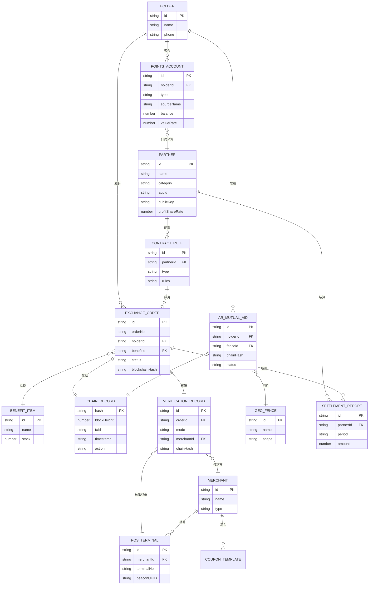

## 1. 架构设计

```mermaid
graph TB
    subgraph "前端展示层（React 18）"
        A1["仪表盘总览"]
        A2["持券人中心"]
        A3["权益兑换市场"]
        A4["智能合约中心"]
        A5["合作方管理"]
        A6["商户管理"]
        A7["区块链存证中心"]
        A8["权益健康监控"]
        A9["AR地理围栏"]
        A10["核销中心"]
    end
    
    subgraph "接口与状态层"
        B1["React Router 6 路由"]
        B2["Zustand 全局状态"]
        B3["React Query SWR缓存"]
        B4["Axios HTTP拦截器"]
        B5["Web3.js/Fabric SDK"]
    end
    
    subgraph "组件与可视化层"
        C1["Phosphor Icons"]
        C2["Recharts 数据可视化"]
        C3["Framer Motion 动画"]
        C4["QRCode / NFC Mock"]
        C5["Leaflet 地图"]
    end
    
    subgraph "模拟后端（Mock Service Worker）"
        D1["用户/权限Mock"]
        D2["权益数据Mock"]
        D3["交易/订单Mock"]
        D4["区块链存证Mock"]
        D5["合作方/商户Mock"]
    end
    
    subgraph "区块链存证层"
        E1["Hyperledger Fabric链码"]
        E2["智能合约规则引擎"]
        E3["参与方签名验证"]
        E4["哈希时间戳存证"]
    end
    
    A1 --> B1 & B2 & B3
    A2 --> B1 & B2
    A3 --> B3 & B4
    A4 --> B5 & E2
    A5 --> B4
    A6 --> B4 & C4
    A7 --> B5 & E1 & E3 & E4
    A8 --> C2
    A9 --> C5
    A10 --> C4
    
    B1 --> C1 & C2 & C3
    B2 --> D1
    B3 --> D2 & D3
    B4 --> D5
    B5 --> D4 & E1
```



## 2. 技术说明

- **前端框架**：React 18 + TypeScript 5，函数式组件+Hooks
- **构建工具**：Vite 5，启用HMR、ESBuild压缩、Rollup分包优化
- **样式方案**：TailwindCSS 3 + CSS变量主题系统 + 自定义设计Token
- **路由管理**：React Router v6，路由懒加载+路由守卫+嵌套路由
- **状态管理**：Zustand 4（轻量全局状态）+ React Query（服务端缓存）
- **HTTP请求**：Axios，统一错误拦截、Token注入、响应格式化
- **Mock服务**：Mock Service Worker（MSW），浏览器端拦截请求返回模拟数据
- **数据可视化**：Recharts 2，自定义主题配色、动画过渡
- **动效方案**：Framer Motion 11，页面过渡、组件微交互、入场动画
- **图标方案**：Phosphor React，线性/填充双风格、支持发光描边
- **地图组件**：React-Leaflet，深色地图瓦片、地理围栏绘制
- **二维码/核销**：qrcode.react 生成二维码、NFC/蓝牙近场Mock
- **代码规范**：ESLint + Prettier + Husky pre-commit

## 3. 路由定义

| 路由路径 | 页面组件 | 用途说明 |
|----------|----------|----------|
| `/` | 重定向到 `/dashboard` | 首页重定向 |
| `/dashboard` | DashboardOverview | 仪表盘总览：数据看板+实时交易+健康度雷达 |
| `/holder` | HolderCenter | 持券人中心：多源积分聚合+资产总览 |
| `/market` | ExchangeMarket | 权益兑换市场：商品列表+兑换计算 |
| `/contract` | SmartContractCenter | 智能合约中心：规则引擎+AR互助存证 |
| `/partner` | PartnerManagement | 合作方管理：API鉴权+密钥+结算报表 |
| `/merchant` | MerchantManagement | 商户管理：POS配置+券码生成 |
| `/blockchain` | BlockchainCenter | 区块链存证中心：哈希查询+签名验证 |
| `/health` | HealthMonitor | 权益健康监控：过期预警+异常告警 |
| `/ar-fence` | ARGeoFence | AR地理围栏：地图+信息管理 |
| `/verify` | VerificationCenter | 核销中心：多模态核销面板 |
| `/login` | LoginPage | 登录页：角色选择登录 |

## 4. 数据模型与类型定义

```typescript
// 持券人 - 多源积分账户
interface PointsAccount {
  id: string;
  holderId: string;
  type: 'insurance' | 'bank' | 'airline' | 'telecom';
  sourceName: string;
  balance: number;
  frozen: number;
  expireSoon: number;
  unit: string;
  valueRate: number;
  lastSyncAt: string;
}

// 合作方
interface Partner {
  id: string;
  name: string;
  category: 'insurance' | 'bank' | 'airline' | 'telecom';
  status: 'pending' | 'active' | 'suspended';
  appId: string;
  apiSecret: string;
  publicKey: string;
  privateKey: string;
  ipWhitelist: string[];
  rateLimit: number;
  profitShareRate: number;
  settledAmount: number;
  pendingAmount: number;
  createdAt: string;
}

// 商户
interface Merchant {
  id: string;
  name: string;
  type: 'offline_pos' | 'online_ecom';
  status: 'active' | 'inactive';
  posTerminals: POSTerminal[];
  couponTemplates: CouponTemplate[];
  settlementCycle: 'daily' | 'weekly' | 'monthly';
  totalVerified: number;
  totalRevenue: number;
}

interface POSTerminal {
  id: string;
  terminalNo: string;
  nfcPairCode: string;
  beaconUUID: string;
  location: string;
  lastHeartbeat: string;
}

// 权益商品
interface BenefitItem {
  id: string;
  name: string;
  category: string;
  coverImage: string;
  description: string;
  baseCost: { points: number; cash: number; type: string }[];
  stock: number;
  soldCount: number;
  rating: number;
  isHot: boolean;
}

// 兑换订单
interface ExchangeOrder {
  id: string;
  orderNo: string;
  holderId: string;
  benefitId: string;
  benefitName: string;
  pointsDeducted: { source: string; amount: number }[];
  cashDeducted: number;
  status: 'pending' | 'locked' | 'completed' | 'refunded';
  blockchainHash: string;
  timestamp: string;
  signatures: { party: string; sig: string }[];
}

// 区块链存证记录
interface ChainRecord {
  hash: string;
  blockHeight: number;
  txId: string;
  orderNo: string;
  timestamp: string;
  action: 'exchange' | 'verify' | 'settle' | 'ar_mutual_aid';
  participants: string[];
  signatures: { party: string; pubKey: string; sig: string }[];
  payloadHash: string;
}

// 智能合约规则
interface ContractRule {
  id: string;
  name: string;
  type: 'split_combine' | 'cash_stack' | 'ar_aid';
  description: string;
  rules: Record<string, unknown>;
  effectiveFrom: string;
  effectiveTo: string;
  isActive: boolean;
}

// AR互助信息 + 地理围栏
interface ARMutualAidInfo {
  id: string;
  title: string;
  content: string;
  type: 'help' | 'notice' | 'activity';
  publisherId: string;
  publisherName: string;
  fenceId: string;
  chainHash: string;
  status: 'pending' | 'published' | 'rejected' | 'expired';
  createdAt: string;
  expireAt: string;
}

interface GeoFence {
  id: string;
  name: string;
  shape: 'circle' | 'polygon';
  center?: { lat: number; lng: number };
  radius?: number;
  coordinates?: { lat: number; lng: number }[];
  createdBy: string;
  infoCount: number;
}

// 核销记录
interface VerificationRecord {
  id: string;
  orderId: string;
  orderNo: string;
  couponCode: string;
  mode: 'qrcode' | 'nfc' | 'bluetooth_beacon';
  merchantId: string;
  terminalId: string;
  holderId: string;
  status: 'success' | 'failed' | 'already_used';
  verifiedAt: string;
  chainHash: string;
}
```

## 5. 数据模型ER图



## 6. 目录结构

```
may-89234/
├── src/
│   ├── assets/               # 静态资源
│   ├── components/           # 通用组件
│   │   ├── layout/          # 布局组件
│   │   ├── ui/              # 基础UI组件
│   │   └── charts/          # 图表组件
│   ├── pages/               # 页面组件
│   │   ├── Dashboard/
│   │   ├── Holder/
│   │   ├── Market/
│   │   ├── Contract/
│   │   ├── Partner/
│   │   ├── Merchant/
│   │   ├── Blockchain/
│   │   ├── Health/
│   │   ├── ARFence/
│   │   └── Verify/
│   ├── store/               # Zustand状态
│   ├── hooks/               # 自定义Hooks
│   ├── services/            # API服务
│   ├── mocks/               # MSW Mock数据
│   ├── types/               # TypeScript类型
│   ├── utils/               # 工具函数
│   ├── styles/              # 全局样式
│   ├── router/              # 路由配置
│   ├── App.tsx
│   └── main.tsx
├── public/
├── .trae/documents/
├── index.html
├── vite.config.ts
├── tailwind.config.ts
├── tsconfig.json
└── package.json
```
