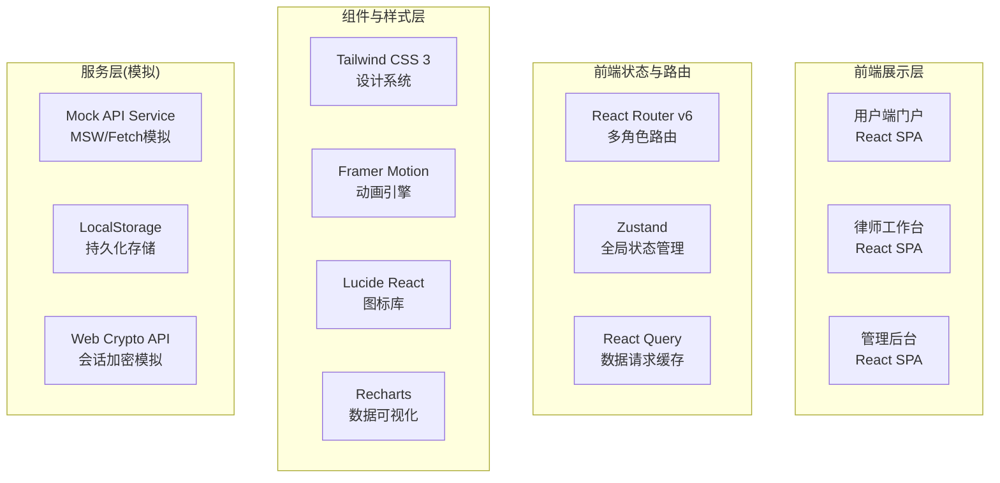
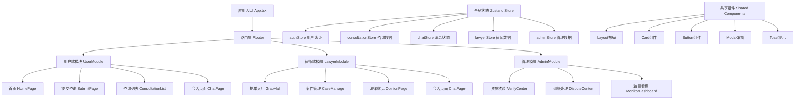

## 1. 架构设计



## 2. 技术描述

- **前端框架**：React@18 + TypeScript@5 + Vite@5
- **初始化工具**：Vite (react-ts 模板)
- **后端**：无独立后端，使用 MSW + LocalStorage 模拟完整前后端交互
- **状态管理**：Zustand - 轻量级状态管理，分模块管理用户/律师/咨询/消息等状态
- **路由**：React Router v6 - 嵌套路由 + 角色权限守卫
- **样式方案**：Tailwind CSS@3 + CSS Variables 设计令牌系统
- **数据请求**：React Query (TanStack Query) - 请求缓存、自动重试、乐观更新
- **图表可视化**：Recharts - 折线图、柱状图、热力图等监控图表
- **动画**：Framer Motion - 页面过渡、微交互、列表动画
- **图标**：Lucide React - 线性图标库，支持自定义颜色和大小
- **数据存储**：LocalStorage + IndexedDB 模拟持久化
- **加密模拟**：Web Crypto API 实现消息加密与水印渲染

## 3. 路由定义

| 路由 | 角色 | 用途 |
|------|------|------|
| / | 公开 | 平台首页/用户端首页 |
| /submit | 用户 | 提交法律咨询 |
| /my-consultations | 用户 | 我的咨询列表 |
| /consultation/:id | 用户/律师 | 加密IM会话页面 |
| /lawyer-hall | 律师 | 抢单大厅 |
| /lawyer-cases | 律师 | 我的案件管理 |
| /lawyer-opinion/:id | 律师 | 生成法律意见摘要 |
| /admin/verify | 管理员 | 律师资质核验中心 |
| /admin/disputes | 管理员 | 纠纷处理中心 |
| /admin/monitor | 管理员 | 运营监控看板 |
| /login | 公开 | 角色选择登录页 |

## 4. 类型定义与数据模型

### 4.1 核心实体类型

```typescript
// 用户角色
type UserRole = 'user' | 'lawyer' | 'admin';

// 案由分类
type CaseCategory = 'marriage' | 'labor' | 'debt' | 'traffic' | 'criminal' | 'other';

// 咨询状态
type ConsultationStatus = 'pending' | 'matched' | 'chatting' | 'closed' | 'reviewed';

// 律师资质状态
type LawyerVerifyStatus = 'pending' | 'approved' | 'rejected' | 'frozen';

// 纠纷处理阶段
type DisputeStage = 'evaluation' | 'appeal' | 'arbitration' | 'resolved';

interface User {
  id: string;
  name: string;
  phone: string;
  avatar?: string;
  role: UserRole;
  region: string;
}

interface Lawyer {
  id: string;
  name: string;
  licenseNo: string;
  verified: LawyerVerifyStatus;
  practiceYears: number;
  specialties: CaseCategory[];
  region: string;
  firm: string;
  educationCredits: number;
  avgResponseTime: number;
  totalCases: number;
  rating: number;
  isActive: boolean;
  lastResponseAt?: Date;
}

interface EvidenceFile {
  id: string;
  name: string;
  type: 'image' | 'document' | 'audio';
  url: string;
  size: number;
  uploadedAt: Date;
  watermarkEnabled: boolean;
}

interface Consultation {
  id: string;
  userId: string;
  lawyerId?: string;
  category: CaseCategory;
  region: string;
  urgency: 'low' | 'medium' | 'high';
  title: string;
  description: string;
  evidence: EvidenceFile[];
  status: ConsultationStatus;
  dispatchMode: 'grab' | 'assign';
  createdAt: Date;
  matchedAt?: Date;
  closedAt?: Date;
}

interface ChatMessage {
  id: string;
  consultationId: string;
  senderId: string;
  senderRole: UserRole;
  content: string;
  type: 'text' | 'file' | 'system';
  isBurnAfterRead: boolean;
  burnSeconds?: number;
  readAt?: Date;
  createdAt: Date;
  burned?: boolean;
}

interface LegalOpinion {
  id: string;
  consultationId: string;
  lawyerId: string;
  caseSummary: string;
  legalBasis: string;
  suggestions: string[];
  riskWarning: string;
  generatedAt: Date;
}

interface ServiceEvaluation {
  id: string;
  consultationId: string;
  userId: string;
  lawyerId: string;
  rating: number;
  comment: string;
  complaint?: string;
  createdAt: Date;
  disputeStage?: DisputeStage;
}

interface MonitorStats {
  totalConsultations: number;
  activeLawyers: number;
  avgResponseTime: number;
  avgConsultationsPerLawyer: number;
  satisfactionRate: number;
  zeroResponseLawyers: string[];
  trendData: { date: string; count: number }[];
  lawyerLoad: { lawyerId: string; name: string; load: number }[];
}
```

## 5. 前端状态与模块架构



## 6. 数据模型关系(ER图)

```mermaid
erDiagram
    USER ||--o{ CONSULTATION : "提交"
    LAWYER ||--o{ CONSULTATION : "响应"
    CONSULTATION ||--o{ EVIDENCE_FILE : "包含"
    CONSULTATION ||--o{ CHAT_MESSAGE : "产生"
    CONSULTATION ||--|| LEGAL_OPINION : "生成"
    CONSULTATION ||--o| SERVICE_EVALUATION : "被评价"
    LAWYER ||--o{ LEGAL_OPINION : "撰写"
    LAWYER ||--o{ SERVICE_EVALUATION : "被评价"
    SERVICE_EVALUATION ||--o| DISPUTE : "产生"

    USER {
        string id PK
        string name
        string phone
        string role
        string region
    }

    LAWYER {
        string id PK
        string name
        string licenseNo
        string verified
        int practiceYears
        string specialties
        string region
        string firm
        int educationCredits
        float avgResponseTime
        int totalCases
        float rating
        boolean isActive
    }

    CONSULTATION {
        string id PK
        string userId FK
        string lawyerId FK
        string category
        string region
        string urgency
        string title
        string description
        string status
        string dispatchMode
        datetime createdAt
    }

    EVIDENCE_FILE {
        string id PK
        string consultationId FK
        string name
        string type
        string url
        int size
    }

    CHAT_MESSAGE {
        string id PK
        string consultationId FK
        string senderId
        string senderRole
        string content
        string type
        boolean isBurnAfterRead
        int burnSeconds
        datetime createdAt
    }

    LEGAL_OPINION {
        string id PK
        string consultationId FK
        string lawyerId FK
        string caseSummary
        string legalBasis
        string suggestions
        string riskWarning
        datetime generatedAt
    }

    SERVICE_EVALUATION {
        string id PK
        string consultationId FK
        string userId FK
        string lawyerId FK
        int rating
        string comment
        string disputeStage
    }
```



## 7. 项目目录结构

```
src/
├── assets/              # 静态资源（字体、图片等）
├── components/          # 共享组件
│   ├── layout/         # 布局组件（Header、Sidebar、Footer）
│   ├── ui/             # 基础UI组件（Button、Card、Modal、Toast）
│   └── features/       # 业务组件（咨询卡片、消息气泡、图表等）
├── pages/               # 页面组件
│   ├── user/           # 用户端页面
│   ├── lawyer/         # 律师端页面
│   ├── admin/          # 管理后台页面
│   └── shared/         # 共享页面（登录、404等）
├── stores/              # Zustand状态管理
│   ├── auth.store.ts
│   ├── consultation.store.ts
│   ├── chat.store.ts
│   ├── lawyer.store.ts
│   └── admin.store.ts
├── services/            # API服务层
│   ├── api.client.ts
│   ├── auth.service.ts
│   ├── consultation.service.ts
│   ├── chat.service.ts
│   ├── lawyer.service.ts
│   └── admin.service.ts
├── mock/                # Mock数据
│   ├── data/           # 模拟数据
│   └── handlers.ts     # 请求处理
├── types/               # TypeScript类型定义
│   └── index.ts
├── utils/               # 工具函数
│   ├── crypto.ts       # 加密工具
│   ├── watermark.ts    # 水印工具
│   ├── date.ts         # 日期格式化
│   └── format.ts       # 通用格式化
├── hooks/               # 自定义Hooks
│   ├── useAuth.ts
│   ├── useChat.ts
│   └── useCountUp.ts
├── styles/              # 全局样式
│   ├── globals.css
│   └── variables.css
├── App.tsx
├── main.tsx
└── vite-env.d.ts
```
