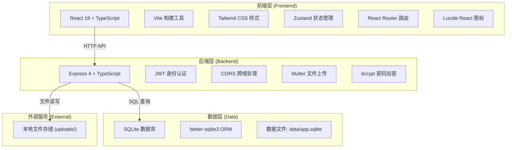
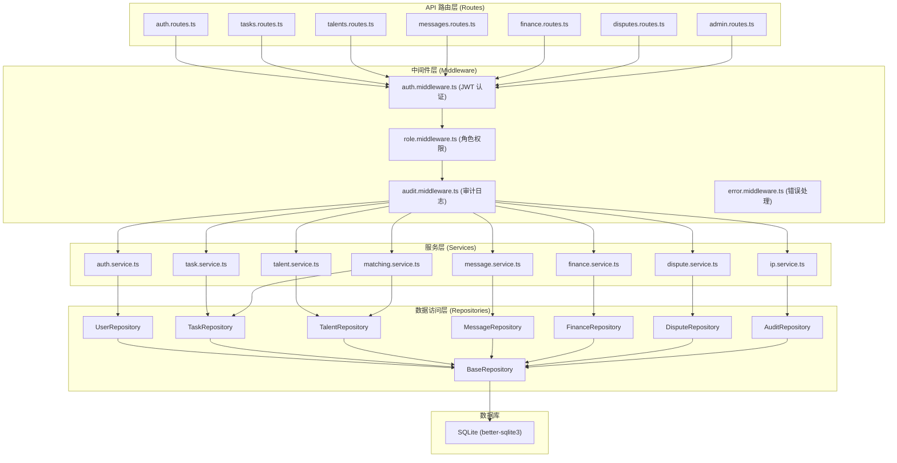
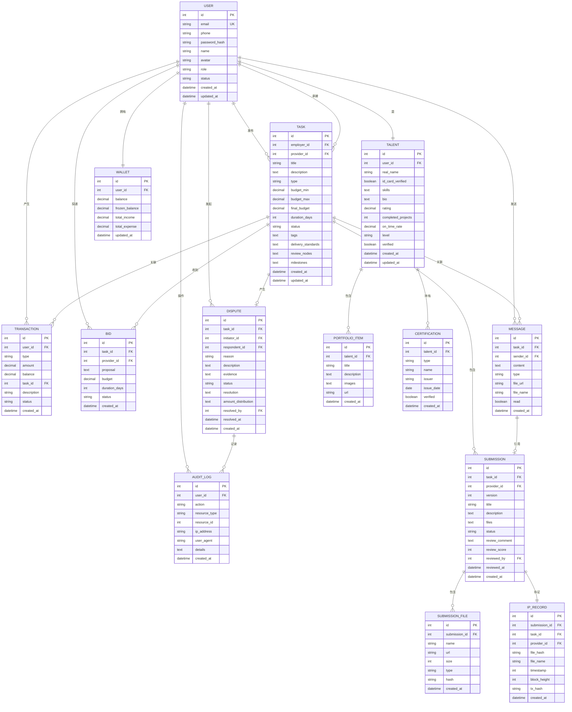

# 创意服务众包平台 - 技术架构文档

## 1. 架构设计



## 2. 技术说明

- **前端技术栈**：React@18 + TypeScript + Vite@5 + Tailwind CSS@3 + Zustand@4 + React Router@6 + Lucide React
- **后端技术栈**：Express@4 + TypeScript + better-sqlite3 + JWT + bcryptjs + Multer
- **数据库**：SQLite（文件存储：`data/app.sqlite`）
- **项目模板**：`react-express-ts`（全栈模板）
- **包管理器**：npm（检查环境后确定）
- **端口配置**：
  - 前端：49096（Vite strictPort 模式）
  - 后端：59096（Express 显式绑定）
  - 所有服务仅监听 `127.0.0.1`

## 3. 路由定义

### 前端路由

| 路由路径 | 页面名称 | 权限要求 |
|---------|----------|----------|
| `/login` | 登录页 | 公开 |
| `/` | 工作台首页 | 登录用户 |
| `/tasks` | 需求任务列表 | 登录用户 |
| `/tasks/publish` | 发布需求 | 企业雇主 |
| `/tasks/:id` | 任务详情 | 任务相关方 |
| `/talents` | 人才库 | 登录用户 |
| `/talents/:id` | 人才详情 | 登录用户 |
| `/messages` | 消息中心 | 登录用户 |
| `/finance` | 财务中心 | 登录用户 |
| `/admin/tasks` | 后台任务看板 | 管理员 |
| `/admin/talents` | 服务商管理 | 管理员 |
| `/admin/disputes` | 争议仲裁 | 管理员 |
| `/admin/audit` | 合规审计 | 管理员 |

### 后端 API 路由

| 方法 | 路径 | 模块 | 说明 |
|------|------|------|------|
| POST | `/api/auth/login` | 认证 | 用户登录 |
| POST | `/api/auth/register` | 认证 | 用户注册 |
| GET | `/api/auth/me` | 认证 | 获取当前用户信息 |
| POST | `/api/auth/logout` | 认证 | 用户登出 |
| GET | `/api/health` | 系统 | 健康检查 |
| GET | `/api/tasks` | 任务 | 获取任务列表 |
| POST | `/api/tasks` | 任务 | 发布新任务 |
| GET | `/api/tasks/:id` | 任务 | 获取任务详情 |
| PUT | `/api/tasks/:id` | 任务 | 更新任务信息 |
| POST | `/api/tasks/:id/bids` | 任务 | 服务商投标 |
| POST | `/api/tasks/:id/select` | 任务 | 选择服务商 |
| GET | `/api/tasks/:id/submissions` | 稿件 | 获取稿件列表 |
| POST | `/api/tasks/:id/submissions` | 稿件 | 提交稿件 |
| POST | `/api/submissions/:id/review` | 稿件 | 评审稿件 |
| GET | `/api/talents` | 人才 | 获取人才列表 |
| GET | `/api/talents/:id` | 人才 | 获取人才详情 |
| POST | `/api/talents/:id/verify` | 人才 | 审核资质（管理员） |
| GET | `/api/messages` | 沟通 | 获取会话列表 |
| GET | `/api/messages/:taskId` | 沟通 | 获取任务聊天记录 |
| POST | `/api/messages/:taskId` | 沟通 | 发送消息 |
| GET | `/api/finance/balance` | 财务 | 获取账户余额 |
| GET | `/api/finance/transactions` | 财务 | 获取交易流水 |
| POST | `/api/finance/escrow` | 财务 | 资金托管 |
| POST | `/api/finance/release` | 财务 | 验收打款 |
| POST | `/api/finance/withdraw` | 财务 | 提现申请 |
| POST | `/api/disputes` | 争议 | 发起争议 |
| GET | `/api/disputes` | 争议 | 获取争议列表（管理员） |
| POST | `/api/disputes/:id/resolve` | 争议 | 仲裁裁决（管理员） |
| GET | `/api/audit/logs` | 审计 | 获取操作日志（管理员） |
| GET | `/api/ip/records` | 存证 | 获取知识产权存证记录 |

## 4. API 类型定义

```typescript
// 用户相关
interface User {
  id: number;
  email: string;
  phone: string;
  name: string;
  avatar: string;
  role: 'employer' | 'provider' | 'admin';
  status: 'active' | 'verified' | 'suspended';
  createdAt: string;
  updatedAt: string;
}

interface LoginRequest {
  email: string;
  password: string;
  role: 'employer' | 'provider' | 'admin';
}

interface LoginResponse {
  token: string;
  user: User;
}

// 任务相关
interface Task {
  id: number;
  employerId: number;
  providerId: number | null;
  title: string;
  description: string;
  type: 'ui_design' | 'industrial_design' | 'animation' | 'software' | 'trademark' | 'copywriting';
  budgetMin: number;
  budgetMax: number;
  finalBudget: number | null;
  durationDays: number;
  status: 'draft' | 'published' | 'bidding' | 'selected' | 'in_progress' | 'submitted' | 'reviewing' | 'revising' | 'completed' | 'disputed' | 'cancelled';
  tags: string[];
  deliveryStandards: string;
  reviewNodes: ReviewNode[];
  milestones: Milestone[];
  createdAt: string;
  updatedAt: string;
}

interface ReviewNode {
  id: string;
  name: string;
  description: string;
  order: number;
  completed: boolean;
  completedAt: string | null;
}

interface Milestone {
  id: string;
  name: string;
  description: string;
  amount: number;
  dueDate: string;
  status: 'pending' | 'completed' | 'released';
}

interface Bid {
  id: number;
  taskId: number;
  providerId: number;
  proposal: string;
  budget: number;
  durationDays: number;
  status: 'pending' | 'accepted' | 'rejected';
  createdAt: string;
}

// 稿件相关
interface Submission {
  id: number;
  taskId: number;
  providerId: number;
  version: number;
  title: string;
  description: string;
  files: SubmissionFile[];
  status: 'submitted' | 'under_review' | 'revision_requested' | 'approved' | 'rejected';
  reviewComment: string | null;
  reviewScore: number | null;
  reviewedAt: string | null;
  reviewedBy: number | null;
  createdAt: string;
}

interface SubmissionFile {
  id: string;
  name: string;
  url: string;
  size: number;
  type: string;
  hash: string;
}

// 人才相关
interface Talent {
  id: number;
  userId: number;
  realName: string;
  idCardVerified: boolean;
  skills: string[];
  bio: string;
  portfolio: PortfolioItem[];
  rating: number;
  completedProjects: number;
  onTimeRate: number;
  level: 'entry' | 'intermediate' | 'advanced' | 'expert';
  verified: boolean;
  certifications: Certification[];
}

interface PortfolioItem {
  id: string;
  title: string;
  description: string;
  images: string[];
  url: string;
}

interface Certification {
  id: string;
  type: string;
  name: string;
  issuer: string;
  issueDate: string;
  verified: boolean;
}

// 消息相关
interface Message {
  id: number;
  taskId: number;
  senderId: number;
  content: string;
  type: 'text' | 'file' | 'submission' | 'system';
  fileUrl: string | null;
  fileName: string | null;
  read: boolean;
  createdAt: string;
}

// 财务相关
interface Transaction {
  id: number;
  userId: number;
  type: 'deposit' | 'escrow' | 'release' | 'refund' | 'withdraw' | 'fee';
  amount: number;
  balance: number;
  taskId: number | null;
  description: string;
  status: 'pending' | 'completed' | 'failed';
  createdAt: string;
}

interface Wallet {
  userId: number;
  balance: number;
  frozenBalance: number;
  totalIncome: number;
  totalExpense: number;
  updatedAt: string;
}

// 争议相关
interface Dispute {
  id: number;
  taskId: number;
  initiatorId: number;
  respondentId: number;
  reason: string;
  description: string;
  evidence: string[];
  status: 'pending' | 'reviewing' | 'resolved' | 'closed';
  resolution: string | null;
  amountDistribution: { [key: number]: number } | null;
  resolvedAt: string | null;
  resolvedBy: number | null;
  createdAt: string;
}

// 知识产权存证
interface IPRecord {
  id: number;
  submissionId: number;
  taskId: number;
  providerId: number;
  fileHash: string;
  fileName: string;
  timestamp: number;
  blockHeight: number | null;
  txHash: string | null;
  createdAt: string;
}

// 审计日志
interface AuditLog {
  id: number;
  userId: number;
  action: string;
  resourceType: string;
  resourceId: number | null;
  ipAddress: string;
  userAgent: string;
  details: object;
  createdAt: string;
}
```

## 5. 服务端架构图



## 6. 数据模型

### 6.1 ER 图



### 6.2 DDL 语句

```sql
-- 用户表
CREATE TABLE IF NOT EXISTS users (
  id INTEGER PRIMARY KEY AUTOINCREMENT,
  email TEXT UNIQUE NOT NULL,
  phone TEXT,
  password_hash TEXT NOT NULL,
  name TEXT NOT NULL,
  avatar TEXT,
  role TEXT NOT NULL CHECK (role IN ('employer', 'provider', 'admin')),
  status TEXT NOT NULL DEFAULT 'active' CHECK (status IN ('active', 'verified', 'suspended')),
  created_at DATETIME DEFAULT CURRENT_TIMESTAMP,
  updated_at DATETIME DEFAULT CURRENT_TIMESTAMP
);

CREATE INDEX IF NOT EXISTS idx_users_role ON users(role);
CREATE INDEX IF NOT EXISTS idx_users_status ON users(status);

-- 人才表
CREATE TABLE IF NOT EXISTS talents (
  id INTEGER PRIMARY KEY AUTOINCREMENT,
  user_id INTEGER UNIQUE NOT NULL,
  real_name TEXT,
  id_card_verified BOOLEAN DEFAULT 0,
  skills TEXT,
  bio TEXT,
  rating DECIMAL(3,2) DEFAULT 0,
  completed_projects INTEGER DEFAULT 0,
  on_time_rate DECIMAL(5,2) DEFAULT 100,
  level TEXT DEFAULT 'entry' CHECK (level IN ('entry', 'intermediate', 'advanced', 'expert')),
  verified BOOLEAN DEFAULT 0,
  created_at DATETIME DEFAULT CURRENT_TIMESTAMP,
  updated_at DATETIME DEFAULT CURRENT_TIMESTAMP,
  FOREIGN KEY (user_id) REFERENCES users(id)
);

CREATE INDEX IF NOT EXISTS idx_talents_level ON talents(level);
CREATE INDEX IF NOT EXISTS idx_talents_rating ON talents(rating);
CREATE INDEX IF NOT EXISTS idx_talents_verified ON talents(verified);

-- 作品集表
CREATE TABLE IF NOT EXISTS portfolio_items (
  id INTEGER PRIMARY KEY AUTOINCREMENT,
  talent_id INTEGER NOT NULL,
  title TEXT NOT NULL,
  description TEXT,
  images TEXT,
  url TEXT,
  created_at DATETIME DEFAULT CURRENT_TIMESTAMP,
  FOREIGN KEY (talent_id) REFERENCES talents(id)
);

-- 资质认证表
CREATE TABLE IF NOT EXISTS certifications (
  id INTEGER PRIMARY KEY AUTOINCREMENT,
  talent_id INTEGER NOT NULL,
  type TEXT NOT NULL,
  name TEXT NOT NULL,
  issuer TEXT NOT NULL,
  issue_date DATE NOT NULL,
  verified BOOLEAN DEFAULT 0,
  created_at DATETIME DEFAULT CURRENT_TIMESTAMP,
  FOREIGN KEY (talent_id) REFERENCES talents(id)
);

-- 任务表
CREATE TABLE IF NOT EXISTS tasks (
  id INTEGER PRIMARY KEY AUTOINCREMENT,
  employer_id INTEGER NOT NULL,
  provider_id INTEGER,
  title TEXT NOT NULL,
  description TEXT NOT NULL,
  type TEXT NOT NULL CHECK (type IN ('ui_design', 'industrial_design', 'animation', 'software', 'trademark', 'copywriting')),
  budget_min DECIMAL(12,2) NOT NULL,
  budget_max DECIMAL(12,2) NOT NULL,
  final_budget DECIMAL(12,2),
  duration_days INTEGER NOT NULL,
  status TEXT NOT NULL DEFAULT 'draft' CHECK (status IN ('draft', 'published', 'bidding', 'selected', 'in_progress', 'submitted', 'reviewing', 'revising', 'completed', 'disputed', 'cancelled')),
  tags TEXT,
  delivery_standards TEXT,
  review_nodes TEXT,
  milestones TEXT,
  created_at DATETIME DEFAULT CURRENT_TIMESTAMP,
  updated_at DATETIME DEFAULT CURRENT_TIMESTAMP,
  FOREIGN KEY (employer_id) REFERENCES users(id),
  FOREIGN KEY (provider_id) REFERENCES users(id)
);

CREATE INDEX IF NOT EXISTS idx_tasks_employer ON tasks(employer_id);
CREATE INDEX IF NOT EXISTS idx_tasks_provider ON tasks(provider_id);
CREATE INDEX IF NOT EXISTS idx_tasks_status ON tasks(status);
CREATE INDEX IF NOT EXISTS idx_tasks_type ON tasks(type);
CREATE INDEX IF NOT EXISTS idx_tasks_created ON tasks(created_at);

-- 投标表
CREATE TABLE IF NOT EXISTS bids (
  id INTEGER PRIMARY KEY AUTOINCREMENT,
  task_id INTEGER NOT NULL,
  provider_id INTEGER NOT NULL,
  proposal TEXT NOT NULL,
  budget DECIMAL(12,2) NOT NULL,
  duration_days INTEGER NOT NULL,
  status TEXT NOT NULL DEFAULT 'pending' CHECK (status IN ('pending', 'accepted', 'rejected')),
  created_at DATETIME DEFAULT CURRENT_TIMESTAMP,
  FOREIGN KEY (task_id) REFERENCES tasks(id),
  FOREIGN KEY (provider_id) REFERENCES users(id),
  UNIQUE(task_id, provider_id)
);

CREATE INDEX IF NOT EXISTS idx_bids_task ON bids(task_id);
CREATE INDEX IF NOT EXISTS idx_bids_provider ON bids(provider_id);
CREATE INDEX IF NOT EXISTS idx_bids_status ON bids(status);

-- 稿件表
CREATE TABLE IF NOT EXISTS submissions (
  id INTEGER PRIMARY KEY AUTOINCREMENT,
  task_id INTEGER NOT NULL,
  provider_id INTEGER NOT NULL,
  version INTEGER NOT NULL DEFAULT 1,
  title TEXT NOT NULL,
  description TEXT,
  files TEXT,
  status TEXT NOT NULL DEFAULT 'submitted' CHECK (status IN ('submitted', 'under_review', 'revision_requested', 'approved', 'rejected')),
  review_comment TEXT,
  review_score INTEGER,
  reviewed_by INTEGER,
  reviewed_at DATETIME,
  created_at DATETIME DEFAULT CURRENT_TIMESTAMP,
  FOREIGN KEY (task_id) REFERENCES tasks(id),
  FOREIGN KEY (provider_id) REFERENCES users(id),
  FOREIGN KEY (reviewed_by) REFERENCES users(id)
);

CREATE INDEX IF NOT EXISTS idx_submissions_task ON submissions(task_id);
CREATE INDEX IF NOT EXISTS idx_submissions_status ON submissions(status);

-- 消息表
CREATE TABLE IF NOT EXISTS messages (
  id INTEGER PRIMARY KEY AUTOINCREMENT,
  task_id INTEGER NOT NULL,
  sender_id INTEGER NOT NULL,
  content TEXT NOT NULL,
  type TEXT NOT NULL DEFAULT 'text' CHECK (type IN ('text', 'file', 'submission', 'system')),
  file_url TEXT,
  file_name TEXT,
  read BOOLEAN DEFAULT 0,
  created_at DATETIME DEFAULT CURRENT_TIMESTAMP,
  FOREIGN KEY (task_id) REFERENCES tasks(id),
  FOREIGN KEY (sender_id) REFERENCES users(id)
);

CREATE INDEX IF NOT EXISTS idx_messages_task ON messages(task_id);
CREATE INDEX IF NOT EXISTS idx_messages_sender ON messages(sender_id);
CREATE INDEX IF NOT EXISTS idx_messages_read ON messages(read);

-- 钱包表
CREATE TABLE IF NOT EXISTS wallets (
  id INTEGER PRIMARY KEY AUTOINCREMENT,
  user_id INTEGER UNIQUE NOT NULL,
  balance DECIMAL(12,2) DEFAULT 0,
  frozen_balance DECIMAL(12,2) DEFAULT 0,
  total_income DECIMAL(12,2) DEFAULT 0,
  total_expense DECIMAL(12,2) DEFAULT 0,
  updated_at DATETIME DEFAULT CURRENT_TIMESTAMP,
  FOREIGN KEY (user_id) REFERENCES users(id)
);

-- 交易记录表
CREATE TABLE IF NOT EXISTS transactions (
  id INTEGER PRIMARY KEY AUTOINCREMENT,
  user_id INTEGER NOT NULL,
  type TEXT NOT NULL CHECK (type IN ('deposit', 'escrow', 'release', 'refund', 'withdraw', 'fee')),
  amount DECIMAL(12,2) NOT NULL,
  balance DECIMAL(12,2) NOT NULL,
  task_id INTEGER,
  description TEXT,
  status TEXT NOT NULL DEFAULT 'completed' CHECK (status IN ('pending', 'completed', 'failed')),
  created_at DATETIME DEFAULT CURRENT_TIMESTAMP,
  FOREIGN KEY (user_id) REFERENCES users(id),
  FOREIGN KEY (task_id) REFERENCES tasks(id)
);

CREATE INDEX IF NOT EXISTS idx_transactions_user ON transactions(user_id);
CREATE INDEX IF NOT EXISTS idx_transactions_type ON transactions(type);
CREATE INDEX IF NOT EXISTS idx_transactions_created ON transactions(created_at);

-- 争议表
CREATE TABLE IF NOT EXISTS disputes (
  id INTEGER PRIMARY KEY AUTOINCREMENT,
  task_id INTEGER NOT NULL,
  initiator_id INTEGER NOT NULL,
  respondent_id INTEGER NOT NULL,
  reason TEXT NOT NULL,
  description TEXT NOT NULL,
  evidence TEXT,
  status TEXT NOT NULL DEFAULT 'pending' CHECK (status IN ('pending', 'reviewing', 'resolved', 'closed')),
  resolution TEXT,
  amount_distribution TEXT,
  resolved_by INTEGER,
  resolved_at DATETIME,
  created_at DATETIME DEFAULT CURRENT_TIMESTAMP,
  FOREIGN KEY (task_id) REFERENCES tasks(id),
  FOREIGN KEY (initiator_id) REFERENCES users(id),
  FOREIGN KEY (respondent_id) REFERENCES users(id),
  FOREIGN KEY (resolved_by) REFERENCES users(id)
);

CREATE INDEX IF NOT EXISTS idx_disputes_status ON disputes(status);
CREATE INDEX IF NOT EXISTS idx_disputes_created ON disputes(created_at);

-- 知识产权存证表
CREATE TABLE IF NOT EXISTS ip_records (
  id INTEGER PRIMARY KEY AUTOINCREMENT,
  submission_id INTEGER NOT NULL,
  task_id INTEGER NOT NULL,
  provider_id INTEGER NOT NULL,
  file_hash TEXT NOT NULL,
  file_name TEXT NOT NULL,
  timestamp INTEGER NOT NULL,
  block_height INTEGER,
  tx_hash TEXT,
  created_at DATETIME DEFAULT CURRENT_TIMESTAMP,
  FOREIGN KEY (submission_id) REFERENCES submissions(id),
  FOREIGN KEY (task_id) REFERENCES tasks(id),
  FOREIGN KEY (provider_id) REFERENCES users(id)
);

CREATE INDEX IF NOT EXISTS idx_ip_records_hash ON ip_records(file_hash);
CREATE INDEX IF NOT EXISTS idx_ip_records_task ON ip_records(task_id);

-- 审计日志表
CREATE TABLE IF NOT EXISTS audit_logs (
  id INTEGER PRIMARY KEY AUTOINCREMENT,
  user_id INTEGER NOT NULL,
  action TEXT NOT NULL,
  resource_type TEXT NOT NULL,
  resource_id INTEGER,
  ip_address TEXT,
  user_agent TEXT,
  details TEXT,
  created_at DATETIME DEFAULT CURRENT_TIMESTAMP,
  FOREIGN KEY (user_id) REFERENCES users(id)
);

CREATE INDEX IF NOT EXISTS idx_audit_user ON audit_logs(user_id);
CREATE INDEX IF NOT EXISTS idx_audit_action ON audit_logs(action);
CREATE INDEX IF NOT EXISTS idx_audit_created ON audit_logs(created_at);

-- 初始化管理员账号 (密码: admin123)
INSERT OR IGNORE INTO users (email, phone, password_hash, name, role, status) VALUES 
('admin@example.com', '13800000000', '$2a$10$7EqJtq98hPqEX7fNZaFWoO1t68e7jYYoB5y25Zv4a3XH7jC9I9q1e', '平台管理员', 'admin', 'verified');

-- 初始化测试雇主账号 (密码: 123456)
INSERT OR IGNORE INTO users (email, phone, password_hash, name, role, status) VALUES 
('employer@example.com', '13800000001', '$2a$10$7EqJtq98hPqEX7fNZaFWoO1t68e7jYYoB5y25Zv4a3XH7jC9I9q1e', '测试企业', 'employer', 'verified');

-- 初始化测试服务商账号 (密码: 123456)
INSERT OR IGNORE INTO users (email, phone, password_hash, name, role, status) VALUES 
('provider@example.com', '13800000002', '$2a$10$7EqJtq98hPqEX7fNZaFWoO1t68e7jYYoB5y25Zv4a3XH7jC9I9q1e', '测试设计师', 'provider', 'verified');

INSERT OR IGNORE INTO talents (user_id, real_name, skills, bio, rating, level, verified) VALUES 
(3, '张三', '["UI设计","品牌设计","插画"]', '8年设计经验，服务过多家500强企业', 4.9, 'expert', 1);

-- 初始化钱包
INSERT OR IGNORE INTO wallets (user_id, balance, frozen_balance) VALUES 
(2, 100000.00, 0),
(3, 0, 0);
```
