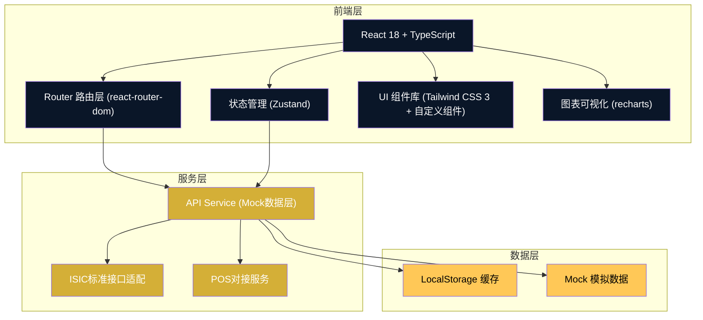
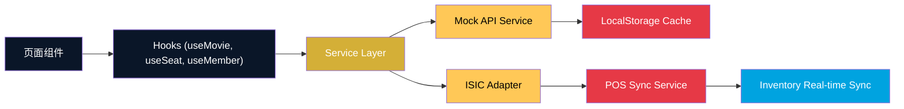

## 1. 架构设计



## 2. 技术描述

- **前端框架**: React@18 + TypeScript@5 + Vite@5
- **构建工具**: Vite@5 (极速热更新、按需打包)
- **路由方案**: react-router-dom@6
- **状态管理**: Zustand@4 (轻量级状态管理)
- **样式方案**: Tailwind CSS@3 + PostCSS + Autoprefixer
- **图表库**: recharts@2 (后台数据可视化)
- **图标库**: lucide-react
- **日期处理**: dayjs
- **后端服务**: 无独立后端，采用 Mock 数据层模拟服务，接口定义符合影院行业 ISIC 标准
- **数据存储**: LocalStorage + IndexedDB 缓存用户数据

## 3. 路由定义

| 路由路径 | 页面组件 | 功能用途 |
|---------|---------|---------|
| / | HomePage | 首页 - 影城导航、热映影片、活动横幅 |
| /movies/:movieId | MovieDetailPage | 影片详情 - 影片信息、多媒体、排片 |
| /cinemas | CinemaListPage | 影城列表 - 全部影城、筛选 |
| /cinemas/:cinemaId | CinemaDetailPage | 影城详情 - 影城信息、影厅配置、排片 |
| /booking/:showtimeId | SeatSelectionPage | 选座购票 - 智能选座引擎、座位图 |
| /concessions | ConcessionsPage | 卖品商城 - 单品、组合套餐、购物车 |
| /member | MemberCenterPage | 会员中心 - 等级、积分、任务 |
| /member/redeem | PointsRedeemPage | 积分兑换 - 积分商品、兑换记录 |
| /promotions | PromotionsPage | 营销活动 - 限时抢座、早鸟票、优惠码 |
| /orders | OrderHistoryPage | 订单记录 - 购票/卖品订单列表 |
| /admin | AdminDashboardPage | 管理后台 - 数据看板 |
| /admin/movies | AdminMoviesPage | 影片管理 - 影片元数据CRUD |
| /admin/inventory | AdminInventoryPage | 库存管理 - 卖品库存、POS同步 |

## 4. API 定义（ISIC 标准接口）

```typescript
// 影城相关接口
interface Cinema {
  id: string;
  name: string;
  address: string;
  city: string;
  district: string;
  phone: string;
  hallTypes: Array<'IMAX' | '4DX' | 'Dolby' | 'Standard' | 'VIP'>;
  halls: Hall[];
  imageUrl: string;
  distance?: number;
  businessHours: string;
}

interface Hall {
  id: string;
  name: string;
  type: 'IMAX' | '4DX' | 'Dolby' | 'Standard' | 'VIP';
  totalSeats: number;
  seatLayout: SeatLayout;
}

interface SeatLayout {
  rows: number;
  cols: number;
  seats: Seat[][];
}

interface Seat {
  id: string;
  row: number;
  col: number;
  status: 'available' | 'sold' | 'locked' | 'selected';
  zone: 'VIP' | 'Standard' | 'Discount' | 'Golden';
  price: number;
  isGoldenView: boolean;
}

// 影片相关接口
interface Movie {
  id: string;
  title: string;
  originalTitle: string;
  posterUrl: string;
  backdropUrl: string;
  director: string;
  cast: string[];
  genres: string[];
  duration: number;
  releaseDate: string;
  rating: number;
  ratingCount: number;
  description: string;
  trailerUrl: string;
  photos: string[];
  reviews: Review[];
  status: 'showing' | 'upcoming' | 'offline';
}

interface Review {
  id: string;
  userId: string;
  userName: string;
  rating: number;
  content: string;
  date: string;
}

// 排片接口
interface Showtime {
  id: string;
  movieId: string;
  cinemaId: string;
  hallId: string;
  startTime: string;
  endTime: string;
  language: string;
  version: '2D' | '3D' | 'IMAX' | '4DX';
  basePrice: number;
  availableSeats: number;
}

// 卖品相关接口
interface Concession {
  id: string;
  name: string;
  category: 'snack' | 'drink' | 'combo' | 'merchandise';
  description: string;
  imageUrl: string;
  price: number;
  originalPrice?: number;
  stock: number;
  isCombo: boolean;
  comboItems?: ComboItem[];
  discountRules?: DiscountRule[];
}

interface ComboItem {
  concessionId: string;
  quantity: number;
}

interface DiscountRule {
  type: 'quantity' | 'combo' | 'time';
  condition: number;
  discount: number;
  description: string;
}

// 会员相关接口
interface Member {
  id: string;
  phone: string;
  nickname: string;
  avatar: string;
  level: PACONNIELevel;
  points: number;
  totalSpent: number;
  growthValue: number;
  joinDate: string;
  birthday?: string;
}

type PACONNIELevel = 'Bronze' | 'Silver' | 'Gold' | 'Platinum' | 'Diamond';

interface MemberTask {
  id: string;
  name: string;
  description: string;
  type: 'daily' | 'growth';
  reward: { points?: number; growthValue?: number };
  progress: number;
  target: number;
  completed: boolean;
}

interface RedeemItem {
  id: string;
  name: string;
  description: string;
  imageUrl: string;
  pointsRequired: number;
  stock: number;
  category: 'concession' | 'merchandise' | 'benefit';
  levelRequired?: PACONNIELevel;
}

// 营销活动接口
interface Promotion {
  id: string;
  name: string;
  type: 'flash_sale' | 'early_bird' | 'group_buy' | 'coupon';
  description: string;
  imageUrl: string;
  startTime: string;
  endTime: string;
  discount: number;
  conditions?: PromotionCondition;
}

interface PromotionCondition {
  minTickets?: number;
  minAmount?: number;
  promoCode?: string;
}

// 订单接口
interface Order {
  id: string;
  orderNo: string;
  type: 'ticket' | 'concession';
  userId: string;
  items: OrderItem[];
  totalAmount: number;
  discountAmount: number;
  pointsUsed: number;
  payAmount: number;
  status: 'pending' | 'paid' | 'cancelled' | 'completed';
  createTime: string;
  payTime?: string;
  pickupCode?: string;
}

interface OrderItem {
  type: 'seat' | 'concession';
  name: string;
  quantity: number;
  unitPrice: number;
  details?: SeatInfo;
}

interface SeatInfo {
  row: number;
  col: number;
  hallName: string;
  showtimeId: string;
}
```

## 5. 前端服务层架构



## 6. 数据模型

### 6.1 实体关系图

```mermaid
erDiagram
    CINEMA ||--o{ HALL : contains
    HALL ||--o{ SHOWTIME : schedules
    MOVIE ||--o{ SHOWTIME : plays_in
    SHOWTIME ||--o{ SEAT : has
    MEMBER ||--o{ ORDER : places
    ORDER ||--o{ ORDER_ITEM : contains
    CONCESSION ||--o{ ORDER_ITEM : "ordered_as
    MEMBER ||--o{ MEMBER_TASK : has
    MEMBER ||--o{ REDEEM_RECORD : makes
    REDEEM_ITEM ||--o{ REDEEM_RECORD : redeemed
    PROMOTION ||--o{ ORDER : applied_to

    CINEMA {
        string id PK
        string name
        string address
        string city
    }
    HALL {
        string id PK
        string cinemaId FK
        string name
        string type
    }
    MOVIE {
        string id PK
        string title
        number rating
        string status
    }
    SHOWTIME {
        string id PK
        string movieId FK
        string hallId FK
        string startTime
        number basePrice
    }
    SEAT {
        string id PK
        string showtimeId FK
        number row
        number col
        string status
        string zone
    }
    MEMBER {
        string id PK
        string phone
        string level
        number points
    }
    CONCESSION {
        string id PK
        string name
        string category
        number price
        number stock
    }
    ORDER {
        string id PK
        string memberId FK
        string type
        number totalAmount
        string status
    }
```

### 6.2 项目目录结构

```
src/
├── assets/              # 静态资源（图片、字体）
├── components/          # 通用组件
│   ├── ui/           # 基础UI组件
│   ├── layout/        # 布局组件
│   └── business/      # 业务组件
├── pages/             # 页面组件
│   ├── home/
│   ├── movies/
│   ├── cinemas/
│   ├── booking/
│   ├── concessions/
│   ├── member/
│   ├── promotions/
│   └── admin/
├── services/          # 服务层
│   ├── api/        # API接口定义
│   ├── mock/       # Mock数据
│   └── utils/      # 工具函数
├── store/           # 状态管理（Zustand）
├── hooks/           # 自定义Hooks
├── types/           # TypeScript类型定义
├── utils/           # 工具函数
├── router/          # 路由配置
└── App.tsx
└── main.tsx
```
