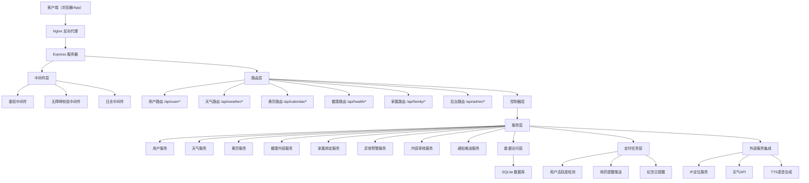
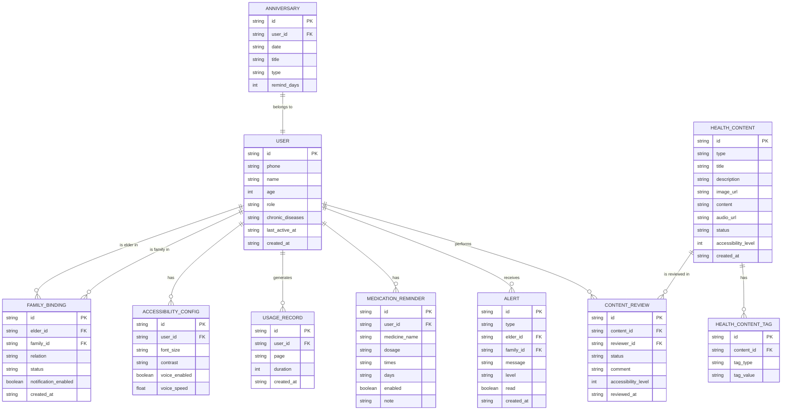

## 1. 架构设计

```mermaid
graph TD
    A["前端层 React 18"] --> B["状态管理 Zustand"]
    A --> C["路由 React Router"]
    A --> D["无障碍组件库"]
    D --> D1["字号调节"]
    D --> D2["对比度切换"]
    D --> D3["语音播报 TTS"]
    A --> E["功能模块"]
    E --> E1["天气服务模块"]
    E --> E2["农历黄历引擎"]
    E --> E3["健康知识库"]
    E --> E4["家属协同后台"]
    E --> E5["内容审核系统"]
    F["后端层 Express 4"] --> G["API 接口层"]
    G --> G1["用户认证 API"]
    G --> G2["天气数据 API"]
    G --> G3["黄历数据 API"]
    G --> G4["健康内容 API"]
    G --> G5["家属绑定 API"]
    G --> G6["内容审核 API"]
    G --> G7["异常预警 API"]
    F --> H["业务逻辑层"]
    H --> H1["IP定位服务"]
    H --> H2["黄历算法引擎"]
    H --> H3["内容审核流"]
    H --> H4["异常监测引擎"]
    H --> H5["通知推送服务"]
    I["数据层 SQLite"] --> J["数据表"]
    J --> J1["用户表"]
    J --> J2["家属绑定表"]
    J --> J3["健康内容表"]
    J --> J4["使用记录表"]
    J --> J5["预警通知表"]
    J --> J6["内容审核表"]
    J --> J7["用药提醒表"]
    K["外部服务"] --> K1["IP定位接口"]
    K --> K2["天气数据接口"]
    K --> K3["TTS语音合成"]
```



## 2. 技术描述

### 2.1 技术栈选型

| 层级 | 技术选型 | 版本 | 说明 |
|------|----------|------|------|
| 前端框架 | React | 18.x | 组件化开发，无障碍支持良好 |
| 前端语言 | TypeScript | 5.x | 类型安全，减少运行时错误 |
| 构建工具 | Vite | 5.x | 快速开发构建 |
| 样式方案 | Tailwind CSS | 3.x | 原子化CSS，快速实现适老化样式 |
| 状态管理 | Zustand | 4.x | 轻量级状态管理，存储无障碍配置 |
| 路由管理 | React Router DOM | 6.x | 单页路由，操作路径≤3步 |
| UI组件 | lucide-react | 0.x | 无障碍图标库，图标清晰可辨 |
| 后端框架 | Express | 4.x | 轻量级Node.js后端 |
| 后端语言 | TypeScript | 5.x | 前后端类型统一 |
| 数据库 | SQLite | 3.x | 轻量级嵌入式数据库，无需额外服务 |
| HTTP客户端 | axios | 1.x | 前后端通信 |

### 2.2 关键技术决策

1. **前端强制无障碍**：自定义 `AccessibleProvider` 包裹整个应用，强制启用无障碍模式
2. **操作路径约束**：路由设计扁平，所有功能页面深度≤2层
3. **无弹窗广告**：全局拦截 `window.open` 和 `alert`，使用自定义通知条
4. **IP定位天气**：后端调用免费IP定位+天气API，前端展示
5. **农历黄历引擎**：前端实现农历算法，宜忌事项内置规则引擎
6. **异常预警**：后端定时任务检测用户活跃度，连续3天未登录触发通知
7. **内容审核流**：状态机管理内容生命周期（待审核→已通过→已驳回）

## 3. 路由定义

| 路由路径 | 页面名称 | 访问角色 | 说明 |
|----------|----------|----------|------|
| `/` | 首页工作台 | 所有用户 | 无障碍设置+功能导航 |
| `/weather` | 天气详情 | 老年用户/家属 | 实时天气+生活指数+7日预报 |
| `/calendar` | 农历黄历 | 老年用户/家属 | 今日黄历+宜忌+节气养生+纪念日 |
| `/health` | 健康知识 | 老年用户/家属 | 食谱+八段锦+用药提醒+筛选 |
| `/health/recipe/:id` | 食谱详情 | 老年用户/家属 | 具体食谱内容+语音播报 |
| `/health/exercise` | 八段锦视频 | 老年用户/家属 | 视频教学+分步指导 |
| `/health/medication` | 用药提醒 | 老年用户/家属 | 用药列表+定时提醒 |
| `/family` | 家属后台 | 家属用户 | 绑定管理+使用记录+异常预警 |
| `/admin` | 审核后台登录 | 审核员/管理员 | 后台登录入口 |
| `/admin/dashboard` | 审核工作台 | 审核员/管理员 | 内容审核列表+操作 |
| `/admin/users` | 用户管理 | 管理员 | 用户列表+权限管理 |
| `*` | 404页面 | 所有用户 | 友好的错误页面，一键返回首页 |

## 4. API 定义

### 4.1 TypeScript 类型定义

```typescript
// 用户相关
interface User {
  id: string;
  phone: string;
  name: string;
  age: number;
  role: 'elder' | 'family' | 'auditor' | 'admin';
  avatar?: string;
  accessibilityConfig: AccessibilityConfig;
  chronicDiseases: string[];
  createdAt: string;
  lastActiveAt: string;
}

interface AccessibilityConfig {
  fontSize: 'normal' | 'large' | 'xlarge';
  contrast: 'normal' | 'high';
  voiceEnabled: boolean;
  voiceSpeed: number;
}

// 家属绑定
interface FamilyBinding {
  id: string;
  elderId: string;
  familyId: string;
  relation: string;
  status: 'pending' | 'active' | 'inactive';
  notificationEnabled: boolean;
  createdAt: string;
}

// 天气数据
interface WeatherData {
  city: string;
  temperature: number;
  feelsLike: number;
  humidity: number;
  windSpeed: number;
  weather: string;
  weatherIcon: string;
  uvIndex: number;
  carWashIndex: string;
  dressingAdvice: string;
  umbrellaReminder: boolean;
  forecast: DailyForecast[];
}

interface DailyForecast {
  date: string;
  high: number;
  low: number;
  weather: string;
  weatherIcon: string;
}

// 黄历数据
interface LunarCalendar {
  lunarDate: string;
  lunarYear: string;
  lunarMonth: string;
  lunarDay: string;
  ganZhi: string;
  zodiac: string;
  solarTerm: string | null;
  yi: string[];
  ji: string[];
  healthTips: string[];
  anniversaries: Anniversary[];
}

interface Anniversary {
  id: string;
  date: string;
  title: string;
  type: 'birthday' | 'festival' | 'memorial';
  remindDays: number;
}

// 健康内容
interface HealthContent {
  id: string;
  type: 'recipe' | 'exercise' | 'medication';
  title: string;
  description: string;
  imageUrl: string;
  ageGroups: string[];
  chronicDiseases: string[];
  content: any;
  audioUrl?: string;
  status: 'pending' | 'approved' | 'rejected';
  accessibilityLevel: number;
  createdAt: string;
}

// 用药提醒
interface MedicationReminder {
  id: string;
  userId: string;
  medicineName: string;
  dosage: string;
  times: string[];
  days: number[];
  enabled: boolean;
  note: string;
}

// 异常预警
interface Alert {
  id: string;
  type: 'inactivity' | 'health' | 'system';
  elderId: string;
  familyId: string;
  message: string;
  level: 'info' | 'warning' | 'danger';
  read: boolean;
  createdAt: string;
}

// 内容审核
interface ContentReview {
  id: string;
  contentId: string;
  reviewerId: string;
  status: 'pending' | 'approved' | 'rejected';
  comment: string;
  accessibilityLevel: number;
  reviewedAt: string;
}
```

### 4.2 API 接口列表

| 方法 | 路径 | 功能描述 | 鉴权 |
|------|------|----------|------|
| POST | `/api/auth/login` | 手机号验证码登录 | 否 |
| POST | `/api/auth/send-code` | 发送验证码 | 否 |
| GET | `/api/user/profile` | 获取当前用户信息 | 是 |
| PUT | `/api/user/accessibility` | 更新无障碍配置 | 是 |
| PUT | `/api/user/profile` | 更新用户信息 | 是 |
| GET | `/api/weather/current` | 获取当前城市天气（IP定位） | 是 |
| GET | `/api/weather/city/:city` | 获取指定城市天气 | 是 |
| GET | `/api/calendar/today` | 获取今日黄历 | 是 |
| GET | `/api/calendar/date/:date` | 获取指定日期黄历 | 是 |
| POST | `/api/calendar/anniversary` | 添加纪念日 | 是 |
| GET | `/api/calendar/anniversaries` | 获取纪念日列表 | 是 |
| DELETE | `/api/calendar/anniversary/:id` | 删除纪念日 | 是 |
| GET | `/api/health/contents` | 获取健康内容列表（支持筛选） | 是 |
| GET | `/api/health/contents/:id` | 获取内容详情 | 是 |
| GET | `/api/health/medications` | 获取用药提醒列表 | 是 |
| POST | `/api/health/medications` | 添加用药提醒 | 是 |
| PUT | `/api/health/medications/:id` | 更新用药提醒 | 是 |
| DELETE | `/api/health/medications/:id` | 删除用药提醒 | 是 |
| POST | `/api/family/bind` | 绑定家属账号 | 是 |
| GET | `/api/family/bindings` | 获取绑定列表 | 是 |
| DELETE | `/api/family/bindings/:id` | 解除绑定 | 是 |
| GET | `/api/family/usage/:elderId` | 获取老人使用记录 | 是 |
| GET | `/api/family/alerts` | 获取预警通知列表 | 是 |
| PUT | `/api/family/alerts/:id/read` | 标记预警已读 | 是 |
| GET | `/api/admin/contents/pending` | 获取待审核内容列表 | 是（审核员） |
| POST | `/api/admin/contents/:id/review` | 审核内容 | 是（审核员） |
| GET | `/api/admin/users` | 获取用户列表 | 是（管理员） |
| PUT | `/api/admin/users/:id/role` | 修改用户角色 | 是（管理员） |

## 5. 服务器架构图



## 6. 数据模型

### 6.1 ER 图



### 6.2 DDL 语句

```sql
-- 用户表
CREATE TABLE IF NOT EXISTS users (
  id TEXT PRIMARY KEY,
  phone TEXT UNIQUE NOT NULL,
  name TEXT NOT NULL,
  age INTEGER,
  role TEXT NOT NULL DEFAULT 'elder',
  avatar TEXT,
  chronic_diseases TEXT DEFAULT '[]',
  last_active_at TEXT,
  created_at TEXT NOT NULL DEFAULT CURRENT_TIMESTAMP
);

-- 无障碍配置表
CREATE TABLE IF NOT EXISTS accessibility_configs (
  id TEXT PRIMARY KEY,
  user_id TEXT UNIQUE NOT NULL,
  font_size TEXT NOT NULL DEFAULT 'large',
  contrast TEXT NOT NULL DEFAULT 'normal',
  voice_enabled INTEGER NOT NULL DEFAULT 1,
  voice_speed REAL NOT NULL DEFAULT 1.0,
  FOREIGN KEY (user_id) REFERENCES users(id)
);

-- 家属绑定表
CREATE TABLE IF NOT EXISTS family_bindings (
  id TEXT PRIMARY KEY,
  elder_id TEXT NOT NULL,
  family_id TEXT NOT NULL,
  relation TEXT NOT NULL,
  status TEXT NOT NULL DEFAULT 'pending',
  notification_enabled INTEGER NOT NULL DEFAULT 1,
  created_at TEXT NOT NULL DEFAULT CURRENT_TIMESTAMP,
  FOREIGN KEY (elder_id) REFERENCES users(id),
  FOREIGN KEY (family_id) REFERENCES users(id),
  UNIQUE(elder_id, family_id)
);

-- 使用记录表
CREATE TABLE IF NOT EXISTS usage_records (
  id TEXT PRIMARY KEY,
  user_id TEXT NOT NULL,
  page TEXT NOT NULL,
  duration INTEGER NOT NULL DEFAULT 0,
  created_at TEXT NOT NULL DEFAULT CURRENT_TIMESTAMP,
  FOREIGN KEY (user_id) REFERENCES users(id)
);

-- 健康内容表
CREATE TABLE IF NOT EXISTS health_contents (
  id TEXT PRIMARY KEY,
  type TEXT NOT NULL,
  title TEXT NOT NULL,
  description TEXT,
  image_url TEXT,
  content TEXT NOT NULL,
  audio_url TEXT,
  status TEXT NOT NULL DEFAULT 'pending',
  accessibility_level INTEGER NOT NULL DEFAULT 0,
  created_at TEXT NOT NULL DEFAULT CURRENT_TIMESTAMP
);

-- 健康内容标签表
CREATE TABLE IF NOT EXISTS health_content_tags (
  id TEXT PRIMARY KEY,
  content_id TEXT NOT NULL,
  tag_type TEXT NOT NULL,
  tag_value TEXT NOT NULL,
  FOREIGN KEY (content_id) REFERENCES health_contents(id)
);

-- 用药提醒表
CREATE TABLE IF NOT EXISTS medication_reminders (
  id TEXT PRIMARY KEY,
  user_id TEXT NOT NULL,
  medicine_name TEXT NOT NULL,
  dosage TEXT NOT NULL,
  times TEXT NOT NULL,
  days TEXT NOT NULL,
  enabled INTEGER NOT NULL DEFAULT 1,
  note TEXT,
  FOREIGN KEY (user_id) REFERENCES users(id)
);

-- 预警通知表
CREATE TABLE IF NOT EXISTS alerts (
  id TEXT PRIMARY KEY,
  type TEXT NOT NULL,
  elder_id TEXT NOT NULL,
  family_id TEXT NOT NULL,
  message TEXT NOT NULL,
  level TEXT NOT NULL DEFAULT 'warning',
  read INTEGER NOT NULL DEFAULT 0,
  created_at TEXT NOT NULL DEFAULT CURRENT_TIMESTAMP,
  FOREIGN KEY (elder_id) REFERENCES users(id),
  FOREIGN KEY (family_id) REFERENCES users(id)
);

-- 内容审核表
CREATE TABLE IF NOT EXISTS content_reviews (
  id TEXT PRIMARY KEY,
  content_id TEXT NOT NULL,
  reviewer_id TEXT NOT NULL,
  status TEXT NOT NULL,
  comment TEXT,
  accessibility_level INTEGER NOT NULL,
  reviewed_at TEXT NOT NULL DEFAULT CURRENT_TIMESTAMP,
  FOREIGN KEY (content_id) REFERENCES health_contents(id),
  FOREIGN KEY (reviewer_id) REFERENCES users(id)
);

-- 纪念日表
CREATE TABLE IF NOT EXISTS anniversaries (
  id TEXT PRIMARY KEY,
  user_id TEXT NOT NULL,
  date TEXT NOT NULL,
  title TEXT NOT NULL,
  type TEXT NOT NULL,
  remind_days INTEGER NOT NULL DEFAULT 3,
  FOREIGN KEY (user_id) REFERENCES users(id)
);

-- 索引
CREATE INDEX IF NOT EXISTS idx_users_phone ON users(phone);
CREATE INDEX IF NOT EXISTS idx_users_role ON users(role);
CREATE INDEX IF NOT EXISTS idx_family_bindings_elder ON family_bindings(elder_id);
CREATE INDEX IF NOT EXISTS idx_family_bindings_family ON family_bindings(family_id);
CREATE INDEX IF NOT EXISTS idx_usage_records_user ON usage_records(user_id);
CREATE INDEX IF NOT EXISTS idx_usage_records_created ON usage_records(created_at);
CREATE INDEX IF NOT EXISTS idx_health_contents_type ON health_contents(type);
CREATE INDEX IF NOT EXISTS idx_health_contents_status ON health_contents(status);
CREATE INDEX IF NOT EXISTS idx_alerts_family ON alerts(family_id);
CREATE INDEX IF NOT EXISTS idx_alerts_read ON alerts(read);
CREATE INDEX IF NOT EXISTS idx_anniversaries_user ON anniversaries(user_id);
```

### 6.3 初始数据

```sql
-- 插入示例健康内容
INSERT INTO health_contents (id, type, title, description, image_url, content, audio_url, status, accessibility_level) VALUES
('recipe_001', 'recipe', '南瓜小米粥', '养胃健脾，适合糖尿病患者', 'https://images.unsplash.com/photo-1547592166-23ac45744acd?w=800', '{"ingredients":["南瓜200g","小米50g","枸杞适量"],"steps":["1. 南瓜去皮切块","2. 小米淘洗干净","3. 加水煮30分钟","4. 加入枸杞即可"]}', NULL, 'approved', 5),
('recipe_002', 'recipe', '清蒸鲈鱼', '高蛋白低脂肪，适合高血压患者', 'https://images.unsplash.com/photo-1519708227418-c8fd9a32b7a2?w=800', '{"ingredients":["鲈鱼1条","葱姜适量","料酒少许"],"steps":["1. 鲈鱼处理干净","2. 放上葱姜","3. 蒸15分钟","4. 淋上热油即可"]}', NULL, 'approved', 5),
('exercise_001', 'exercise', '八段锦第一式：两手托天理三焦', '调理脾胃，增强免疫力', 'https://images.unsplash.com/photo-1545205597-3d9d02c29597?w=800', '{"videoUrl":"https://www.w3schools.com/html/mov_bbb.mp4","steps":["1. 两脚分开与肩同宽","2. 两手交叉于小腹前","3. 缓缓上举过头","4. 掌心向上，抬头看手","5. 缓缓放下，重复8次"]}', NULL, 'approved', 5);

-- 插入内容标签
INSERT INTO health_content_tags (id, content_id, tag_type, tag_value) VALUES
('tag_001', 'recipe_001', 'age', '60+'),
('tag_002', 'recipe_001', 'disease', '糖尿病'),
('tag_003', 'recipe_002', 'age', '60-70'),
('tag_004', 'recipe_002', 'disease', '高血压'),
('tag_005', 'exercise_001', 'age', 'all');

-- 插入测试用户
INSERT INTO users (id, phone, name, age, role, chronic_diseases, last_active_at) VALUES
('user_elder_001', '13800000001', '张大爷', 68, 'elder', '["高血压","糖尿病"]', datetime('now')),
('user_family_001', '13800000002', '张小明', 42, 'family', '[]', datetime('now')),
('user_auditor_001', '13800000003', '李审核', 35, 'auditor', '[]', datetime('now'));

-- 插入家属绑定
INSERT INTO family_bindings (id, elder_id, family_id, relation, status, notification_enabled) VALUES
('bind_001', 'user_elder_001', 'user_family_001', '父子', 'active', 1);

-- 插入用药提醒
INSERT INTO medication_reminders (id, user_id, medicine_name, dosage, times, days, enabled, note) VALUES
('med_001', 'user_elder_001', '硝苯地平缓释片', '10mg', '["08:00","20:00"]', '[1,2,3,4,5,6,7]', 1, '饭后服用'),
('med_002', 'user_elder_001', '二甲双胍', '500mg', '["07:00","12:00","18:00"]', '[1,2,3,4,5,6,7]', 1, '饭前服用');
```
