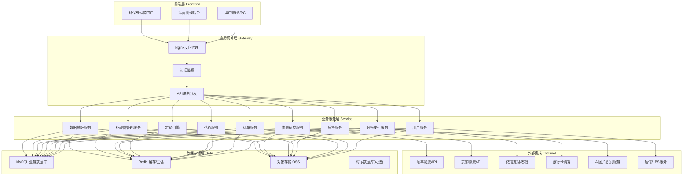
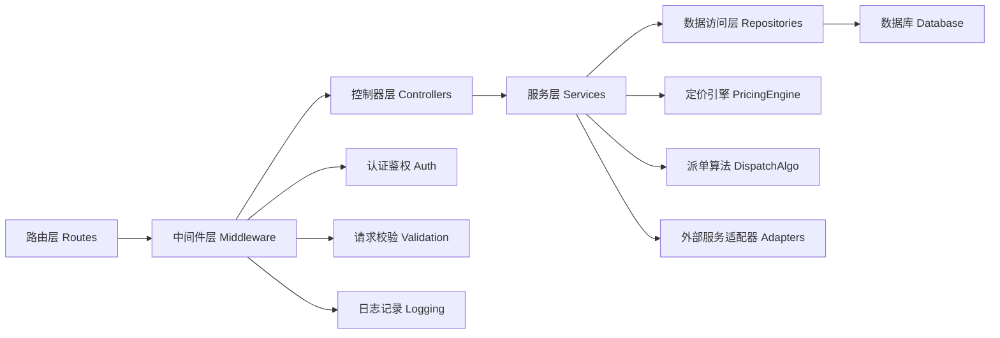
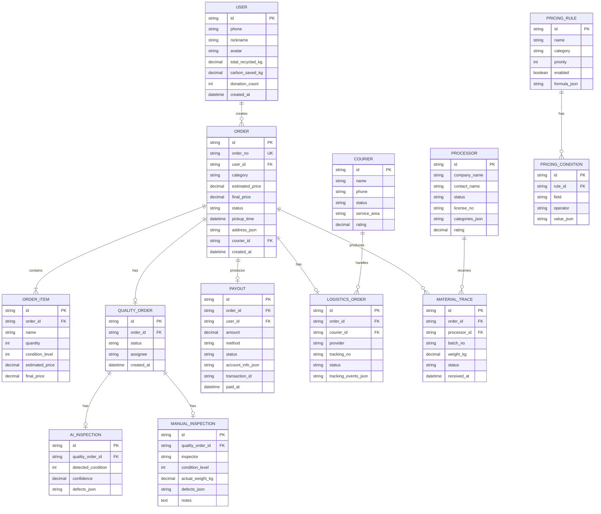

## 1. 架构设计



## 2. 技术描述

### 2.1 技术栈选型

- **前端框架**：React@18 + TypeScript
- **构建工具**：Vite@5
- **样式方案**：TailwindCSS@3
- **状态管理**：Zustand
- **路由**：React Router DOM@6
- **UI组件库**：Headless UI + 自研业务组件
- **图表库**：ECharts@5
- **图标库**：Lucide React
- **后端框架**：Express@4 + TypeScript
- **数据库**：SQLite(开发环境Mock) / MySQL(生产)
- **缓存**：内存缓存(开发) / Redis(生产)
- **HTTP客户端**：Axios
- **日期处理**：dayjs

### 2.2 项目初始化

使用 `react-express-ts` 模板初始化，包含前后端一体化工程结构。

## 3. 路由定义

### 3.1 用户端路由

| 路由 | 页面名称 | 用途 |
|------|----------|------|
| /user/home | 用户端首页 | 品类入口、快速估价、订单快捷入口、环保数据 |
| /user/estimate | 智能估价页 | 品类选择、品牌型号、成色评估、价格预估 |
| /user/booking | 预约下单页 | 时间窗口、地址管理、订单确认 |
| /user/orders | 订单列表页 | 我的回收订单列表 |
| /user/orders/:id | 订单追踪页 | 状态时间轴、物流追踪、质检报告 |
| /user/profile | 个人中心 | 账户信息、收款账户、地址管理 |
| /user/donation | 公益追溯页 | 捐赠流向、受捐机构、捐赠证书 |

### 3.2 运营管理后台路由

| 路由 | 页面名称 | 用途 |
|------|----------|------|
| /admin/dashboard | 运营仪表盘 | KPI指标、趋势图表、待办列表 |
| /admin/quality | 质检工单列表 | 工单筛选、批量操作 |
| /admin/quality/:id | 质检工单详情 | SOP质检流程、AI初筛、人工复核 |
| /admin/pricing | 定价规则列表 | 规则管理、启用/禁用 |
| /admin/pricing/:id | 定价规则编辑 | 条件配置、公式编辑、模拟测试 |
| /admin/payout | 分账管理 | 待打款列表、T+0打款操作 |
| /admin/logistics | 物流调度 | 快递员管理、智能派单、运单追踪 |
| /admin/processors | 环保处理商管理 | 资质审核、处理商列表 |
| /admin/processors/:id | 处理商详情 | 资料查看、资质审核操作 |
| /admin/analytics | 数据统计看板 | 用户分析、品类分析、运营分析 |

### 3.3 环保处理商门户路由

| 路由 | 页面名称 | 用途 |
|------|----------|------|
| /processor/login | 处理商登录 | 账号登录 |
| /processor/dashboard | 处理商工作台 | 待处理物资、处理进度上报 |
| /processor/trace | 物资追溯 | 接收批次、流向记录 |

## 4. API定义

### 4.1 用户服务API

```typescript
// 用户信息
interface User {
  id: string;
  phone: string;
  nickname: string;
  avatar?: string;
  wechatOpenId?: string;
  totalRecycledKg: number;
  carbonSavedKg: number;
  donationCount: number;
}

// GET /api/user/profile - 获取用户信息
// POST /api/user/login - 手机号登录
// PUT /api/user/profile - 更新用户信息
```

### 4.2 估价服务API

```typescript
interface EstimateRequest {
  category: 'clothing' | 'books' | 'phones';
  brand?: string;
  model?: string;
  condition: number; // 1-10 成色等级
  weightKg?: number;
  quantity?: number;
}

interface EstimateResult {
  minPrice: number;
  maxPrice: number;
  unitPrice: number;
  breakdown: { item: string; value: number }[];
}

// POST /api/estimate/calculate - 计算预估价格
// GET /api/estimate/brands?category=xxx - 获取品类品牌列表
```

### 4.3 订单服务API

```typescript
type OrderStatus = 'pending' | 'assigned' | 'picked' | 'inspecting' | 'priced' | 'confirmed' | 'paid' | 'completed' | 'cancelled';

interface Order {
  id: string;
  orderNo: string;
  userId: string;
  category: 'clothing' | 'books' | 'phones';
  items: OrderItem[];
  estimatedPrice: number;
  finalPrice?: number;
  status: OrderStatus;
  pickupTime: string;
  address: Address;
  courierId?: string;
  createdAt: string;
  timeline: OrderTimeline[];
}

interface OrderItem {
  id: string;
  name: string;
  quantity: number;
  condition: number;
  estimatedPrice: number;
  finalPrice?: number;
  images?: string[];
}

interface OrderTimeline {
  status: OrderStatus;
  time: string;
  description: string;
}

// GET /api/orders - 订单列表
// GET /api/orders/:id - 订单详情
// POST /api/orders - 创建订单
// PUT /api/orders/:id/status - 更新订单状态
```

### 4.4 质检服务API

```typescript
interface QualityOrder {
  id: string;
  orderId: string;
  status: 'pending' | 'ai-screening' | 'manual-inspection' | 'completed';
  aiResult?: AiInspectionResult;
  manualResult?: ManualInspectionResult;
  images: string[];
  sopSteps: SopStep[];
  assignee?: string;
}

interface AiInspectionResult {
  categoryConfidence: number;
  detectedCondition: number;
  defects: string[];
  confidence: number;
}

interface ManualInspectionResult {
  inspector: string;
  condition: number;
  actualWeightKg: number;
  defects: string[];
  notes: string;
  images: string[];
}

interface SopStep {
  id: string;
  name: string;
  description: string;
  required: boolean;
  completed: boolean;
  completedAt?: string;
}

// GET /api/admin/quality-orders - 质检工单列表
// GET /api/admin/quality-orders/:id - 质检详情
// POST /api/admin/quality-orders/:id/ai-screen - AI初筛
// PUT /api/admin/quality-orders/:id/manual - 提交人工质检
```

### 4.5 定价引擎API

```typescript
interface PricingRule {
  id: string;
  name: string;
  category: 'clothing' | 'books' | 'phones' | 'all';
  priority: number;
  enabled: boolean;
  conditions: PricingCondition[];
  formula: PricingFormula;
}

interface PricingCondition {
  field: 'weight' | 'condition' | 'brand' | 'model' | 'quantity';
  operator: 'eq' | 'gt' | 'lt' | 'gte' | 'lte' | 'in' | 'between';
  value: any;
}

interface PricingFormula {
  type: 'fixed' | 'per_kg' | 'per_item' | 'percentage';
  basePrice: number;
  multipliers: { field: string; factor: number }[];
}

// GET /api/admin/pricing-rules - 规则列表
// POST /api/admin/pricing-rules - 创建规则
// PUT /api/admin/pricing-rules/:id - 更新规则
// POST /api/admin/pricing-rules/simulate - 模拟定价
```

### 4.6 分账支付API

```typescript
interface Payout {
  id: string;
  orderId: string;
  userId: string;
  amount: number;
  method: 'wechat_wallet' | 'bank_card';
  status: 'pending' | 'processing' | 'success' | 'failed';
  accountInfo: AccountInfo;
  transactionId?: string;
  createdAt: string;
  paidAt?: string;
}

interface AccountInfo {
  type: 'wechat' | 'bank';
  accountNumber: string;
  accountName: string;
  bankName?: string;
}

// GET /api/admin/payouts - 待打款列表
// POST /api/admin/payouts/:id/execute - 执行打款
// POST /api/admin/payouts/batch - 批量打款
```

### 4.7 物流调度API

```typescript
interface Courier {
  id: string;
  name: string;
  phone: string;
  status: 'online' | 'offline' | 'busy';
  serviceArea: string;
  rating: number;
  orderCount: number;
  currentLocation?: { lat: number; lng: number };
}

interface LogisticsOrder {
  id: string;
  orderId: string;
  courierId: string;
  provider: 'sf' | 'jd';
  trackingNo: string;
  status: 'created' | 'picked' | 'transit' | 'delivered';
  trackingEvents: TrackingEvent[];
}

// GET /api/admin/couriers - 快递员列表
// POST /api/admin/couriers/:id/assign - 派单
// GET /api/admin/logistics/:orderId/track - 物流追踪
```

### 4.8 环保处理商API

```typescript
interface Processor {
  id: string;
  companyName: string;
  contactName: string;
  contactPhone: string;
  status: 'pending' | 'reviewing' | 'approved' | 'rejected';
  licenseNo: string;
  licenseImages: string[];
  capacity: string;
  categories: string[];
  rating: number;
  reviewHistory: ReviewRecord[];
}

interface ReviewRecord {
  id: string;
  status: 'pending' | 'approved' | 'rejected';
  reviewer: string;
  comment: string;
  createdAt: string;
}

// GET /api/admin/processors - 处理商列表
// POST /api/admin/processors/:id/review - 审核操作
// GET /api/admin/processors/:id/trace - 物资追溯记录
```

### 4.9 数据统计API

```typescript
interface AnalyticsData {
  overview: {
    totalOrders: number;
    totalRecycledKg: number;
    totalPayout: number;
    activeUsers: number;
  };
  orderTrend: { date: string; count: number; kg: number }[];
  categoryDistribution: { category: string; count: number; percentage: number }[];
  userFrequency: { range: string; count: number }[];
  regionDistribution: { region: string; count: number }[];
}

// GET /api/admin/analytics/overview - 概览数据
// GET /api/admin/analytics/trend - 趋势数据
// GET /api/admin/analytics/category - 品类分布
```

## 5. 服务端架构



- **路由层**：定义API端点，请求分发
- **中间件层**：JWT认证、参数校验、CORS、日志
- **控制器层**：请求解析、响应格式化
- **服务层**：核心业务逻辑，定价引擎、派单算法
- **数据访问层**：数据库CRUD抽象
- **适配器层**：外部物流、支付、AI服务对接

## 6. 数据模型

### 6.1 ER图



### 6.2 核心数据初始化

```sql
-- 用户表
CREATE TABLE users (
  id VARCHAR(36) PRIMARY KEY,
  phone VARCHAR(20) UNIQUE NOT NULL,
  nickname VARCHAR(50),
  avatar VARCHAR(255),
  total_recycled_kg DECIMAL(10,2) DEFAULT 0,
  carbon_saved_kg DECIMAL(10,2) DEFAULT 0,
  donation_count INT DEFAULT 0,
  created_at DATETIME DEFAULT CURRENT_TIMESTAMP
);

-- 订单表
CREATE TABLE orders (
  id VARCHAR(36) PRIMARY KEY,
  order_no VARCHAR(32) UNIQUE NOT NULL,
  user_id VARCHAR(36) NOT NULL,
  category VARCHAR(20) NOT NULL,
  estimated_price DECIMAL(10,2) NOT NULL,
  final_price DECIMAL(10,2),
  status VARCHAR(20) NOT NULL,
  pickup_time DATETIME NOT NULL,
  address_json TEXT NOT NULL,
  courier_id VARCHAR(36),
  created_at DATETIME DEFAULT CURRENT_TIMESTAMP,
  INDEX idx_user_id (user_id),
  INDEX idx_status (status),
  INDEX idx_created_at (created_at)
);

-- 定价规则初始数据
INSERT INTO pricing_rules (id, name, category, priority, enabled, formula_json) VALUES
('rule-001', '衣物基础定价', 'clothing', 10, true, '{"type":"per_kg","basePrice":2.5,"multipliers":[{"field":"condition","factor":0.1}]}'),
('rule-002', '图书基础定价', 'books', 10, true, '{"type":"per_kg","basePrice":1.2,"multipliers":[{"field":"condition","factor":0.15}]}'),
('rule-003', '手机品牌溢价', 'phones', 5, true, '{"type":"per_item","basePrice":100,"multipliers":[{"field":"brand","factor":0.2},{"field":"condition","factor":0.3}]}');
```
