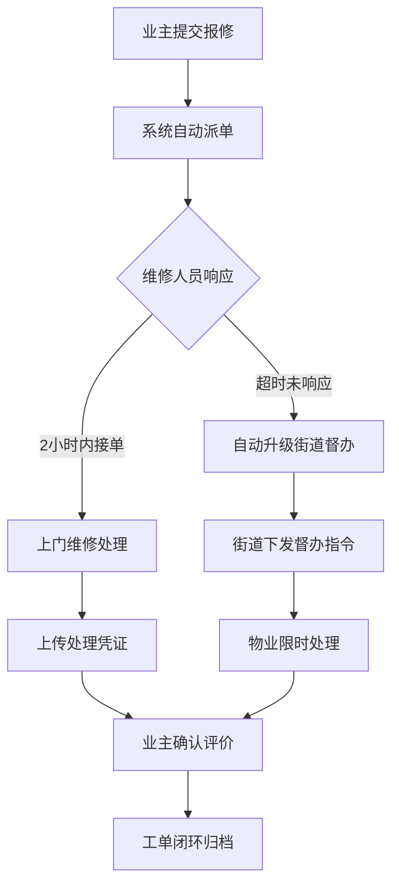

## 1. 产品概述

面向社区业委会的全流程数字化治理工作台系统，覆盖业主身份核验、民主议事、财务透明、印章管控、物业协同、邻里经济及街道监管等核心场景，构建透明、高效、可信的社区治理生态。

- 解决痛点：业委会运作不透明、财务信息不公开、印章使用无监管、物业协同效率低、居民参与度不足
- 目标价值：实现社区治理全流程数字化留痕、区块链存证、多角色协同，提升社区治理现代化水平

## 2. 核心功能

### 2.1 用户角色

| 角色 | 注册/认证方式 | 核心权限 |
|------|---------------|----------|
| 业主 | 房产证核验 + 人脸实名 + 楼栋单元绑定 | 参与投票、查看财务、报修、邻里经济活动 |
| 业委会主任 | 业主认证 + 任职备案 | 审批用章、发布议案、查看全量数据 |
| 业委会委员 | 业主认证 + 任职备案 | 发起议案、财务录入、参与审批 |
| 物业公司 | 营业执照 + 服务合同备案 | 处理报修工单、派单、合同管理 |
| 维修人员 | 物业公司邀请注册 | 接单、处理报修、上传凭证 |
| 街道办工作人员 | 政府统一身份认证 | 下发监管指令、查看治理数据、督办工单 |

### 2.2 功能模块

1. **工作台首页**: 治理健康度仪表盘、待办事项、快捷入口、数据概览
2. **民主议事模块**: 议案管理、投票系统（匿名/实名）、附件公示、区块链存证
3. **财务透明模块**: 内账科目树、外账票据OCR、收支管理、审计报告
4. **印章管控模块**: 用章申请、审批流程、智能印章柜联动、录像存档
5. **物业协同模块**: 报修工单、自动派单、超时升级、街道督办
6. **邻里经济模块**: 旧物置换、信用积分、特产众筹、能量值兑换
7. **基础管理模块**: 业主认证、业委会任期、物业合同、街道监管

### 2.3 页面详情

| 页面名称 | 模块名称 | 功能描述 |
|----------|----------|----------|
| 工作台首页 | 治理健康度仪表盘 | 缴费率、议事参与率、投诉解决率三维度评估，雷达图展示，趋势分析 |
| 工作台首页 | 待办事项中心 | 待审批、待投票、待处理工单、待响应监管指令 |
| 工作台首页 | 快捷入口卡片 | 五大模块快捷操作入口 + 最近使用记录 |
| 工作台首页 | 数据概览面板 | 业主总数、在任委员、活跃工单、本月收支等关键指标 |
| 议案列表页 | 民主议事 | 议案卡片列表，状态筛选（草拟/公示/投票中/已通过/已否决），搜索 |
| 议案详情页 | 民主议事 | 议案内容、附件预览、投票进度条、投票选项、存证哈希展示 |
| 发起议案页 | 民主议事 | 表单填写、附件上传、投票类型选择（匿名/实名）、截止时间设置 |
| 投票页面 | 民主议事 | 身份二次校验、投票确认、实时计票、区块链存证动画 |
| 财务总览页 | 财务透明 | 科目树形导航、收支趋势图、预算执行率、票据识别进度 |
| 票据管理页 | 财务透明 | 票据列表、OCR识别结果展示、人工修正、分类归档 |
| 审计报告页 | 财务透明 | 自动生成审计报告、数据图表、异常项标注、导出下载 |
| 用章申请列表 | 印章管控 | 申请记录、状态流转、审批进度、关联录像查看 |
| 用章申请页 | 印章管控 | 申请事由、用章类型、使用时间、附件材料上传 |
| 印章柜监控 | 印章管控 | 印章柜状态实时展示、开锁记录、录像回放、异常告警 |
| 报修工单大厅 | 物业协同 | 工单列表、地图分布展示、状态（待派单/处理中/已完成/已升级） |
| 工单详情页 | 物业协同 | 报修信息、维修人员、处理过程、照片凭证、评价打分 |
| 街道督办中心 | 物业协同 | 超时工单列表、督办指令下发、反馈记录、处理时效统计 |
| 邻里经济首页 | 邻里经济 | 积分余额、能量值展示、旧物置换、众筹项目、服务兑换入口 |
| 旧物置换广场 | 邻里经济 | 物品卡片、信用积分标价、置换申请、交易记录 |
| 众筹预售页 | 邻里经济 | 众筹项目列表、进度条、支持人数、剩余时间、参与支持 |
| 能量兑换中心 | 邻里经济 | 保洁服务时长兑换、兑换记录、服务预约 |
| 业主管理 | 基础管理 | 业主列表、认证状态、楼栋绑定、批量导入导出 |
| 业委会管理 | 基础管理 | 任期管理、委员信息、选举记录、链上存证查验 |
| 物业公司管理 | 基础管理 | 物业公司档案、服务合同、考核评分、到期提醒 |
| 街道监管中心 | 基础管理 | 指令下发、执行反馈、辖区小区排名、治理预警 |

## 3. 核心流程

### 3.1 业主认证流程
业主提交房产证照片 → OCR识别核验 → 人脸识别实名比对 → 楼栋单元信息绑定 → 认证完成并获得投票权限

### 3.2 民主议事投票流程
业委会发起议案 → 附件公示期（不少于3天） → 投票开启 → 业主身份校验 → 匿名/实名投票 → 截止计票 → 结果区块链存证 → 结果公示

### 3.3 用章审批流程
申请人提交用章申请 → 业委会主任审批 → 审批通过 → 智能印章柜授权开锁 → 取章使用录像 → 归还确认 → 记录存档

### 3.4 报修工单流程
业主提交报修 → 系统自动匹配维修人员 → 派单通知 → 维修人员接单 → 上门处理 → 上传完成凭证 → 业主确认评价 → 超时未响应自动升级街道督办

### 3.5 Mermaid流程图

## 4. 用户界面设计

### 4.1 设计风格
- **主色调**: 政务蓝 `#1E40AF` + 信任青 `#0EA5E9`，体现专业、公正、透明
- **辅助色**: 活力橙 `#F97316`（待办提醒）、成功绿 `#10B981`（通过/完成）、警示红 `#EF4444`（异常/超时）
- **整体风格**: 政务数字化风格，严谨而不失现代感，卡片化布局，数据可视化突出
- **按钮风格**: 圆角8px，主要按钮实色填充带轻微悬浮效果，次要按钮描边样式
- **字体**: 中文使用思源宋体（标题）+ 思源黑体（正文），营造正式专业感
- **布局**: 左侧导航栏 + 顶部状态栏 + 主内容区，支持面包屑导航
- **图标**: 线性图标风格，统一2px描边，搭配政务场景专属图标

### 4.2 页面设计概览

| 页面名称 | 模块名称 | UI元素 |
|----------|----------|--------|
| 工作台首页 | 治理健康度仪表盘 | 大型雷达图、三维度评分卡片、趋势折线图、环形进度条 |
| 工作台首页 | 待办事项中心 | 数字角标、时间线布局、优先级标签、一键处理按钮 |
| 议案详情页 | 民主议事 | 富文本内容区、附件预览卡片、实时投票进度、区块链哈希展示区 |
| 财务总览页 | 财务透明 | 可折叠树形科目导航、双Y轴收支对比图、数据透视表格、异常高亮 |
| 印章柜监控 | 印章管控 | 仿真印章柜示意图、实时状态指示灯、录像缩略图时间轴、告警浮窗 |
| 报修工单大厅 | 物业协同 | 地图热力图 + 列表双视图、状态色标签、处理时效倒计时、升级提醒条 |
| 邻里经济首页 | 邻里经济 | 积分能量值双余额卡片、物品瀑布流、众筹进度卡、兑换服务网格 |

### 4.3 响应式设计
- Desktop-first设计，优先保证1440px及以上宽屏体验
- 左侧导航栏在平板端可折叠收起
- 数据仪表盘支持自适应，图表组件自动调整尺寸
- 移动端简化为底部Tab导航，核心功能优先展示

### 4.4 动效与交互动效
- 页面加载：左侧导航率先展开，内容区卡片渐次上浮（staggered reveal）
- 数据更新：数字滚动动画（count-up）、进度条平滑填充
- 投票存证：区块链节点连接动画、哈希值打字机效果展示
- 印章开锁：柜门打开模拟动画、录像播放按钮脉冲效果
- 悬停交互：卡片阴影加深+轻微上移、数据图表局部放大高亮
