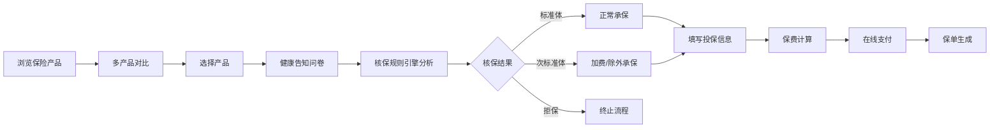

# 健康保障垂直领域 SaaS 服务平台 - 产品需求文档 (PRD)

## 1. 产品概述

健康保障 SaaS 平台是整合体检机构与保险公司资源的一站式健康管理服务平台，构建"体检预约-保险配置-健康管理"完整服务闭环。平台通过智能化筛选、核保规则引擎、健康数据分析等核心能力，为用户提供个性化健康保障方案，同时为保险公司和体检机构提供数字化运营能力。

- **核心价值**：打通医疗健康与保险服务链条，实现"预防-保障-管理"一体化
- **目标用户**：C 端健康关注者、B 端保险公司、B 端体检机构、平台运营方
- **市场定位**：合规化、智能化的健康保障科技服务平台

## 2. 核心功能

### 2.1 用户角色

| 角色 | 注册方式 | 核心权限 |
|------|----------|----------|
| 个人用户 | 手机号注册 | 体检预约、保险购买、健康档案管理、风险预警查看 |
| 保险公司 | 平台审核入驻 | 产品管理、核保规则配置、订单管理、佣金结算 |
| 体检机构 | 平台审核入驻 | 套餐管理、预约管理、HIS 系统对接、报告上传 |
| 平台管理员 | 后台账号 | 机构准入审核、佣金结算、数据统计、系统配置、合规管理 |

### 2.2 功能模块

1. **体检预约模块**：套餐智能筛选、在线预约、HIS 系统状态同步、体检报告管理
2. **保险配置模块**：核保规则引擎、产品对比矩阵、投保引导、订单管理
3. **健康档案中心**：体检报告 OCR 解析、结构化存储、健康趋势图表、数据可视化
4. **风险预警模块**：慢性病风险分析、指标异常预警、健康建议推送
5. **机构管理后台**：保司准入审核、体检机构管理、佣金结算自动化、合规监管
6. **运营管理后台**：用户管理、订单管理、数据统计、隐私数据加密隔离

### 2.3 页面详情

| 页面名称 | 模块名称 | 功能描述 |
|----------|----------|----------|
| 首页 | 导航横幅 | 平台介绍、核心服务入口、数据概览 |
| 首页 | 服务卡片 | 体检预约、保险商城、健康档案三大入口 |
| 首页 | 健康资讯 | 健康知识、产品推荐、活动公告 |
| 体检列表页 | 筛选区域 | 城市、价格区间、套餐类型、年龄适配多维度筛选 |
| 体检列表页 | 套餐卡片 | 机构信息、套餐详情、价格、预约按钮 |
| 体检详情页 | 套餐信息 | 检查项目、适用人群、注意事项、机构介绍 |
| 体检详情页 | 预约表单 | 体检人信息、日期选择、时段选择、在线支付 |
| 保险商城页 | 产品列表 | 保险产品卡片、筛选条件、快速对比 |
| 保险对比页 | 对比矩阵 | 保障范围、免赔额、续保条款、保费多维度对比 |
| 投保页 | 健康告知 | 智能问卷、异常项自动识别、核保结果实时反馈 |
| 投保页 | 订单确认 | 投保人信息、受益人信息、保费计算、在线支付 |
| 健康档案页 | 报告列表 | 历史体检报告、上传入口、OCR 识别状态 |
| 健康档案页 | 数据看板 | 关键指标趋势图、异常项高亮、健康评分 |
| 健康档案页 | 风险预警 | 慢性病风险分析、个性化健康建议 |
| 机构后台首页 | 数据概览 | 订单统计、收入统计、用户画像 |
| 平台管理后台 | 审核中心 | 保司准入、机构入驻、产品审核 |
| 平台管理后台 | 结算中心 | 佣金计算、结算记录、对账管理 |
| 平台管理后台 | 合规中心 | 操作日志、数据加密、隐私访问审计 |

## 3. 核心流程

### 3.1 体检预约流程

### 3.2 保险投保流程

### 3.3 健康管理流程

## 4. 用户界面设计

### 4.1 设计风格

- **主色调**：医疗蓝 `#1677ff`（专业、可信）+ 健康绿 `#52c41a`（活力、健康）
- **辅助色**：预警橙 `#fa8c16`（风险提示）、重疾红 `#f5222d`（严重异常）
- **中性色**：深灰 `#262626`、中灰 `#595959`、浅灰 `#bfbfbf`、背景 `#f5f7fa`
- **按钮风格**：圆角 8px，主按钮渐变蓝，悬停微放大效果
- **字体**：标题使用 Noto Sans SC Bold，正文使用 Noto Sans SC Regular
- **布局风格**：卡片式布局，清晰的层级关系，充足的留白
- **图标风格**：线性图标 + 色块背景，医疗健康相关元素

### 4.2 页面设计概述

| 页面名称 | 模块名称 | UI 元素 |
|----------|----------|---------|
| 首页 | 导航横幅 | 渐变蓝色背景，大标题+副标题，CTA 按钮组，滚动视差效果 |
| 首页 | 服务卡片 | 三个并列卡片，图标+标题+简介，悬停上浮阴影 |
| 体检列表页 | 筛选区域 | 顶部固定筛选栏，标签式多条件组合，实时筛选结果 |
| 体检列表页 | 套餐卡片 | 左侧机构 Logo，中间详情，右侧价格+预约按钮 |
| 保险对比页 | 对比矩阵 | 固定表头横向滚动，差异项高亮标注 |
| 健康档案页 | 数据看板 | 大数字关键指标，趋势折线图，异常项红色徽章 |
| 健康档案页 | 风险预警 | 卡片式风险等级，进度条展示风险值 |

### 4.3 响应式设计

- **桌面优先**：1440px 基准设计，适配 1280px - 1920px
- **平板适配**：1024px 断点，两栏布局，侧边栏收起
- **移动适配**：768px 断点，单列布局，底部导航
- **触摸优化**：按钮最小高度 44px，手势滑动支持

### 4.4 动效设计

- **页面加载**：骨架屏占位，内容渐入
- **卡片交互**：悬停上浮 + 阴影加深
- **数据更新**：数字滚动动画，图表渐入
- **流程引导**：步骤进度条，下一步按钮脉冲效果
- **风险提示**：红色徽章呼吸动画，预警信息滑入
