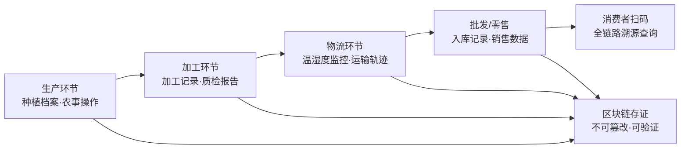

# 农产品全链条可信溯源与交易协同平台 产品需求文档

## 1. 产品概述

农产品全链条可信溯源与交易协同平台，覆盖生产、加工、批发、零售全环节，通过区块链技术为每批次农产品生成唯一存证溯源码，关联种植档案、农事操作、检测报告、物流温湿度、入市销售记录。交易侧支持B2B/B2C双模式，包含在线开店、供需撮合引擎、电子合同签署、信用保证金监管、货款担保支付。配套农技知识库支持专家问答工单流转、病虫害图像识别诊断、气象预警主动推送。系统对接农业农村部监管平台、市场监管总局抽检数据库，输出区域农产品质量趋势分析报告。

**目标用户**：农业生产者、加工企业、批发商、零售商、消费者、农技专家、监管机构  
**市场价值**：提升农产品供应链透明度，保障食品安全，促进产销对接，赋能农业数字化转型

## 2. 核心功能

### 2.1 用户角色

| 角色 | 注册方式 | 核心权限 |
|------|----------|----------|
| 生产者 | 企业认证注册 | 管理种植档案、农事操作记录、溯源码申请、产品上架 |
| 加工商 | 企业认证注册 | 加工批次管理、质检报告上传、溯源信息对接 |
| 批发商 | 企业认证注册 | 批量采购、供需发布、电子合同、B2B交易 |
| 零售商 | 企业/个人认证 | 店铺开设、零售销售、B2C交易 |
| 消费者 | 手机号注册 | 溯源查询、商品购买、评价反馈 |
| 农技专家 | 专家认证 | 问答回复、病虫害诊断、知识发布 |
| 平台管理员 | 后台账号 | 平台管理、用户审核、数据监管 |
| 监管机构 | 专用账号 | 数据查询、质量抽检、趋势分析 |

### 2.2 功能模块

1. **首页/数据看板**：平台数据概览、溯源统计、交易数据、质量趋势
2. **溯源系统**：溯源码查询、区块链存证、批次全链路追踪、种植/加工/物流/销售档案
3. **交易市场**：B2B批发市场、B2C零售商城、供需撮合引擎、商品搜索与筛选
4. **店铺中心**：在线开店、商品管理、订单管理、店铺装修
5. **交易协同**：电子合同签署、信用保证金、货款担保支付、交易纠纷处理
6. **农技服务**：专家问答工单、病虫害图像识别、气象预警推送、农技知识库
7. **监管中心**：质量抽检数据、区域质量趋势、监管平台对接、分析报告
8. **个人中心**：账户信息、实名认证、消息通知、信用评价

### 2.3 页面详情

| 页面名称 | 模块名称 | 功能描述 |
|----------|----------|----------|
| 首页 | Hero区域 | 平台价值主张、核心数据展示、动画动效 |
| 首页 | 数据看板 | 溯源批次数量、交易总额、入驻企业、合格率等关键指标 |
| 首页 | 功能入口 | 溯源查询、商城、农技服务、监管四大模块入口卡片 |
| 首页 | 质量趋势 | 区域质量趋势图表、近期抽检结果 |
| 溯源查询页 | 查询模块 | 输入溯源码/扫码查询、结果展示 |
| 溯源详情页 | 全链路时间轴 | 生产、加工、物流、销售各环节信息时间线展示 |
| 溯源详情页 | 区块链存证 | 区块高度、哈希值、存证时间、验证状态 |
| 溯源详情页 | 档案详情 | 种植档案、农事操作、检测报告、温湿度记录 |
| B2B批发市场 | 商品列表 | 批量商品展示、筛选排序、供应商信息 |
| B2B批发市场 | 供需大厅 | 采购需求发布、供应信息展示、智能撮合推荐 |
| B2C零售商城 | 商品列表 | 零售商品展示、分类筛选、搜索功能 |
| 商品详情页 | 商品信息 | 商品图片、规格、价格、溯源信息、评价 |
| 订单中心 | 订单管理 | 订单列表、订单详情、物流跟踪、售后处理 |
| 店铺中心 | 店铺管理 | 店铺信息、商品上架、订单处理、数据统计 |
| 电子合同 | 合同管理 | 合同列表、在线签署、合同模板、存证验证 |
| 农技问答 | 问答广场 | 问题列表、专家解答、提问功能、工单状态 |
| 病虫害识别 | 图像识别 | 图片上传、AI识别、诊断结果、防治建议 |
| 气象预警 | 预警中心 | 天气预报、灾害预警、农事建议、推送设置 |
| 监管中心 | 数据总览 | 区域数据、抽检结果、质量排名、趋势分析 |
| 监管中心 | 分析报告 | 质量分析、风险预警、月度/季度报告下载 |
| 个人中心 | 账户设置 | 个人信息、实名认证、安全设置、消息通知 |

## 3. 核心流程

### 3.1 农产品溯源流程

生产者创建种植批次 → 记录农事操作 → 提交检测报告 → 加工商加工记录 → 物流温湿度监控 → 批发商/零售商入库 → 消费者扫码溯源 → 全链路信息展示

### 3.2 B2B交易流程

采购方发布需求 → 供需撮合匹配 → 供应商报价 → 双方确认 → 电子合同签署 → 保证金/货款担保 → 发货物流 → 验收确认 → 货款结算 → 信用评价

### 3.3 农技问答工单流程

用户提交问题 → 系统分类派单 → 专家接单 → 在线解答 → 用户评价 → 问题归档入库

## 4. 用户界面设计

### 4.1 设计风格

- **设计基调**：自然、科技、可信。以绿色系为主色调，融合农业自然感与区块链科技感
- **主色**：翠绿 `#10B981`（代表农业、自然、生机）
- **辅助色**：深蓝 `#1E40AF`（代表科技、信任、专业）、暖橙 `#F59E0B`（代表预警、提醒）
- **中性色**：深灰 `#1F2937`、中灰 `#6B7280`、浅灰 `#F3F4F6`、白色 `#FFFFFF`
- **按钮风格**：圆角中等（8px），主按钮翠绿渐变，悬停阴影效果
- **字体**：标题使用「思源黑体 Bold」，正文使用「思源黑体 Regular」，数字使用等宽字体
- **布局风格**：卡片式布局，顶部导航栏，侧边栏功能区，内容区数据网格
- **图标风格**：线性图标，统一2px描边，圆角风格
- **数据可视化**：使用ECharts图表，配色与主题一致，动效流畅

### 4.2 页面设计概览

| 页面名称 | 模块名称 | UI元素 |
|----------|----------|--------|
| 首页 | Hero区域 | 大标题、数据统计、渐变背景、粒子动效、主CTA按钮 |
| 首页 | 功能入口 | 四大模块图标卡片、悬停上浮效果、渐变图标 |
| 溯源详情页 | 时间轴 | 垂直时间线、节点图标、状态色标、滚动动画 |
| 溯源详情页 | 区块链信息 | 数据卡片、哈希展示、验证动效、区块标识 |
| 商城列表页 | 商品卡片 | 图片、标题、价格、溯源标签、供应商、悬停效果 |
| 商品详情页 | 信息区 | 图片轮播、规格选择、价格区、立即购买按钮 |
| 订单中心 | 订单列表 | 订单卡片、状态标签、进度条、操作按钮 |
| 农技问答 | 问题卡片 | 问题标题、专家头像、回复数、状态标签 |
| 监管中心 | 数据图表 | 折线图、柱状图、地图热力图、数据仪表盘 |

### 4.3 响应式设计

- 采用桌面优先（Desktop-first）设计
- 断点：大屏（1280px+）、中屏（1024px）、平板（768px）、手机（480px）
- 移动端采用底部Tab导航，侧边栏转为抽屉式
- 数据表格在移动端转为卡片列表展示
- 触控交互优化，按钮最小尺寸44px

## 5. 核心数据指标

- 溯源批次总量、日新增溯源码数
- 入驻企业数量、活跃商家数
- B2B/B2C交易额、订单量
- 质量检测合格率、抽检通过率
- 农技问答解决率、平均响应时长
- 用户活跃度、留存率

## 6. 非功能性需求

- **性能**：首屏加载时间 < 2s，列表页响应 < 500ms
- **安全**：数据加密传输、敏感信息脱敏、操作日志审计
- **可用性**：系统可用性99.9%，支持7×24小时访问
- **兼容性**：支持Chrome、Safari、Edge主流浏览器最新两个版本
- **可扩展**：模块化架构，支持功能插件化扩展
