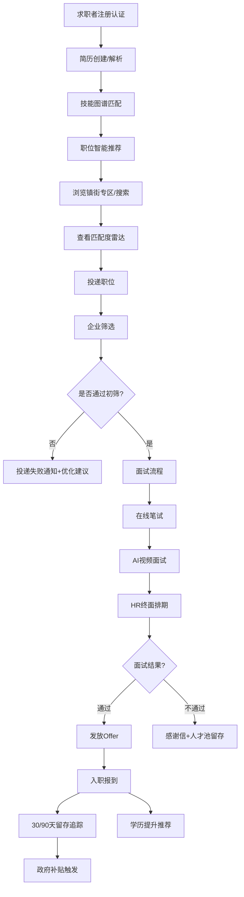

## 1. 产品概述
面向华南制造业密集区（以中山市为核心）的智能招聘中台系统，聚焦蓝领、技工、应届生三类核心求职者，融合AI智能匹配、镇街属地化网络、校园招聘闭环、学历提升服务四大能力，为企业提供RPO项目全流程管理与招聘效果归因分析。

- 解决痛点：制造业招工难、蓝领求职信息不对称、校园招聘效率低、招聘渠道ROI难以量化
- 市场价值：打通"政府-企业-求职者-院校-教育机构"五方生态，打造制造业招聘产业互联网基础设施

## 2. 核心功能

### 2.1 用户角色
| 角色 | 注册方式 | 核心权限 |
|------|----------|----------|
| 求职者（蓝领/技工/应届生） | 手机号 + 实名认证 | 职位搜索、智能匹配、简历管理、投递追踪、学历提升、镇街专区浏览 |
| 企业HR/招聘专员 | 营业执照 + 属地认证 | 职位发布、简历筛选、RPO项目管理、面试排期、招聘看板 |
| 企业RPO顾问 | 企业管理员授权 | 人才池打标、猎聘进度跟踪、背调报告归档、项目结算 |
| 院校就业办 | 院校资质认证 | 宣讲会管理、学生批量导入、笔试/面试协调 |
| 平台运营/政府专员 | 后台账号分配 | 企业审核、镇街专区运营、招聘效果监控、补贴申领审核 |

### 2.2 功能模块
1. **求职者端首页**：镇街专区入口、职位智能推荐、技能图谱匹配、校园招聘通道、学历提升服务
2. **职位搜索与智能匹配**：多维度筛选（镇街/薪资/技能/经验）、简历解析、JD语义理解、技能图谱对齐匹配度评分
3. **简历管理中心**：在线简历编辑、简历附件解析、技能标签、作品集上传、求职偏好设置
4. **镇街招聘专区**：中山25个镇街独立专区、属地企业认证、镇街产业集群展示、本地生活配套信息
5. **校园招聘闭环**：宣讲会预约、在线笔试、AI视频面试初筛、HR终面排期、offer管理
6. **学历提升服务**：自考/成考课程包推荐、学分银行接口、在职提升方案、学籍对接
7. **企业端工作台**：职位发布管理、简历收件箱、面试日历、人才搜索
8. **RPO项目管理**：项目看板、人才池打标、猎聘进度SOP跟踪、背调报告上传归档、项目ROI
9. **招聘效果归因分析**：多渠道ROI分析、到面率漏斗、留存周期分析、成本/人效指标
10. **后台运营中心**：企业审核、镇街运营、补贴申领通道、技能图谱维护、系统配置

### 2.3 页面详情
| 页面名称 | 模块名称 | 功能描述 |
|----------|----------|----------|
| 求职者首页 | 顶部导航 | 角色切换、搜索入口、消息中心、个人中心入口 |
| 求职者首页 | 镇街专区矩阵 | 中山25镇街卡片网格，显示镇街名称、在招企业数、职位数、产业标签 |
| 求职者首页 | 智能职位推荐 | 基于技能图谱的个性化推荐，显示匹配度百分比、薪资范围、企业属地 |
| 求职者首页 | 快捷入口 | 技工专区、应届生专区、蓝领普工专区、学历提升、校园招聘会 |
| 职位搜索页 | 高级筛选 | 镇街选择器、薪资区间、技能标签多选、经验要求、学历要求、企业规模 |
| 职位搜索页 | 匹配度排序 | 按智能匹配度/最新发布/薪资高低/距离排序，匹配度高亮显示 |
| 职位详情页 | 职位信息 | JD结构化展示、技能标签、企业属地认证标识、薪资福利、工作地点地图 |
| 职位详情页 | 智能匹配卡 | 简历与JD匹配度雷达图（技能/经验/学历/地点/薪资期望）、差距分析 |
| 职位详情页 | 投递操作 | 一键投递、投递前简历优化建议、投递进度追踪入口 |
| 简历管理页 | 简历编辑器 | 模块化编辑：基本信息、教育经历、工作经历、技能证书、项目经验、自我评价 |
| 简历管理页 | 简历解析 | PDF/Word附件上传、AI解析填充、智能技能标签提取、解析准确率反馈 |
| 简历管理页 | 技能图谱 | 个人技能可视化图谱、技能熟练度自评、推荐学习路径、同岗位技能对比 |
| 镇街专区首页 | 镇街产业概览 | 产业集群分布（如小榄五金、古镇灯饰、沙溪休闲服）、龙头企业、招聘热度趋势 |
| 镇街专区首页 | 属地企业列表 | 镇街认证企业、地图模式/列表模式切换、企业到镇中心距离 |
| 镇街专区首页 | 本地生活 | 住房/交通/子女入学配套信息，提升蓝领求职决策效率 |
| 校园招聘大厅 | 宣讲会日历 | 院校-企业联合宣讲、在线预约、宣讲提醒、回放观看 |
| 校园招聘大厅 | 在线笔试 | 题目随机组卷、计时答题、防切屏检测、客观题自动评分 |
| 校园招聘大厅 | AI面试 | 视频录制、AI表情/语音/语义多维度评分、结构化评分报告 |
| 校园招聘大厅 | 面试排期 | HR终面时间选择、腾讯会议/线下面试地点、面试提醒日历同步 |
| 学历提升中心 | 课程超市 | 自考/成考/职业资格课程包，按学历目标/专业/预算筛选 |
| 学历提升中心 | 学分银行 | 学习进度追踪、学分对接查询、学历认证进度、证书获取预估 |
| 企业工作台 | 数据看板 | 今日新增投递、本周待面试、本月到岗、招聘预算使用进度 |
| 企业工作台 | 职位管理 | 发布/编辑/下架职位、JD智能优化建议、职位曝光量统计 |
| 企业工作台 | 简历收件箱 | 批量筛选、匹配度排序、标签打标、一键进入面试流程 |
| RPO项目中心 | 项目看板 | 甘特图视图、项目阶段划分（需求确认→寻访→初筛→推荐→面试→offer→入职→保用期） |
| RPO项目中心 | 人才池管理 | 人才标签体系、人才活跃度追踪、批量触达、人才库去重合并 |
| RPO项目中心 | 背调归档 | 背调报告上传、授权书管理、背调结果分级、项目结算凭证 |
| 招聘分析中心 | 渠道ROI | 各渠道（招聘网站/内推/镇街/校园/猎头）成本对比、简历质量评分、入职转化漏斗 |
| 招聘分析中心 | 效果漏斗 | 曝光→点击→投递→筛选通过率→到面率→offer率→入职率→30/90天留存率 |
| 招聘分析中心 | 留存分析 | 不同渠道/岗位/镇街的留存周期对比、离职原因分布标签云 |
| 后台运营中心 | 企业审核 | 营业执照OCR识别、属地认证（办公地址核验）、信用评级 |
| 后台运营中心 | 补贴申领 | 企业吸纳就业补贴、高校毕业生就业补贴、技能提升补贴申请与审核流程 |
| 后台运营中心 | 技能图谱维护 | 制造业岗位分类树、技能权重配置、新兴技能（如工业机器人、MES系统）定期更新 |

## 3. 核心流程

### 3.1 求职者求职流程
求职者注册 → 实名认证 → 简历填写/附件解析 → 技能标签自动提取 → 设置求职偏好（镇街/薪资/岗位类型） → 浏览镇街专区或职位搜索 → 查看智能匹配度 → 投递职位 → 接收面试邀请 → 参加笔试/AI面试/终面 → 接收offer → 入职 → 满意度评价/学历提升推荐

### 3.2 企业招聘流程
企业注册 → 营业执照上传 → 属地认证（镇街归属） → 充值招聘套餐 → 发布职位（JD AI优化） → 接收简历 → 智能匹配筛选 → 安排笔试/面试 → 发offer → 入职跟踪 → 招聘效果分析 → 补贴申领

### 3.3 核心流程Mermaid图

## 4. 用户界面设计

### 4.1 设计风格
- **主色调**：工业蓝 #165DFF（代表制造业信赖感）+ 活力橙 #FF7D00（代表就业活力）
- **辅助色**：成功绿 #00B42A、警示黄 #FF7D00、危险红 #F53F3F、中性灰阶
- **按钮风格**：圆角8px，主按钮实心渐变，次要按钮描边，悬停微浮起+阴影过渡
- **字体**：标题使用"思源黑体 Heavy"，正文使用"思源宋体 Regular/Medium"，数字使用"Roboto Mono"（制造业数据感）
- **布局风格**：顶部导航+左侧分类的信息密度型布局，卡片网格+数据可视化看板为主
- **图标风格**：双色线性图标，融入制造业元素（齿轮、扳手、流水线、安全帽等）
- **背景质感**：轻微网格线底纹（代表精密制造），数据区使用渐变透明卡片

### 4.2 页面设计概述
| 页面名称 | 模块名称 | UI元素 |
|----------|----------|--------|
| 求职者首页 | 镇街专区矩阵 | 25个镇街卡片，悬停展示产业标签动画，卡片底部进度条显示招聘热度 |
| 求职者首页 | 智能推荐区 | 职位卡片左对齐匹配度圆环（60-98%分色），右对齐薪资+企业属地标签 |
| 职位详情页 | 匹配度雷达图 | 五维雷达（技能/经验/学历/地点/薪资），求职者区域蓝色填充，JD要求橙色描边 |
| 简历管理页 | 技能图谱 | 力导向图谱，核心技能大节点高亮，关联技能放射状分布，悬停显示熟练度 |
| RPO项目中心 | 项目看板 | 甘特图横向时间轴+纵向人才泳道，阶段节点使用不同颜色徽章，拖拽调整进度 |
| 招聘分析中心 | 渠道ROI | 双轴图（柱状成本+折线入职转化），渠道标签可点击切换维度，悬浮卡片显示详情 |
| 镇街专区首页 | 产业概览 | 镇街地图轮廓+产业集群热力标注，点击区域进入对应产业职位列表 |
| AI面试页 | 视频答题区 | 左侧题目卡片+倒计时进度环，右侧视频录制区+实时音量波形，底部操作栏 |

### 4.3 响应式
- **设计策略**：Desktop-first，断点1440px/1024px/768px/375px
- **PC端（1440px+）**：三栏布局（导航+内容+侧边数据栏），最大化信息展示
- **平板端（768-1024px）**：两栏布局，侧边栏可折叠，数据卡片自适应换行
- **移动端（<768px）**：单栏流式布局，底部Tab导航，镇街专区使用横向滑动轮播，蓝领群体友好的大按钮+高对比度设计
- **触控优化**：移动端最小触控区域48x48px，关键操作（投递/预约面试）固定悬浮按钮

### 4.4 动效设计
- **页面加载**：骨架屏+内容渐入，首屏镇街卡片按矩阵顺序0-500ms错峰上浮
- **匹配度动画**：匹配度圆环数字从0滚动至目标值，雷达图路径动画从中心向外扩张
- **看板滚动**：数据看板数字递增动画，图表柱形/折线绘制动画
- **交互反馈**：按钮点击涟漪，卡片悬停Y轴+2px+阴影加深，Tab切换下划线弹性过渡
