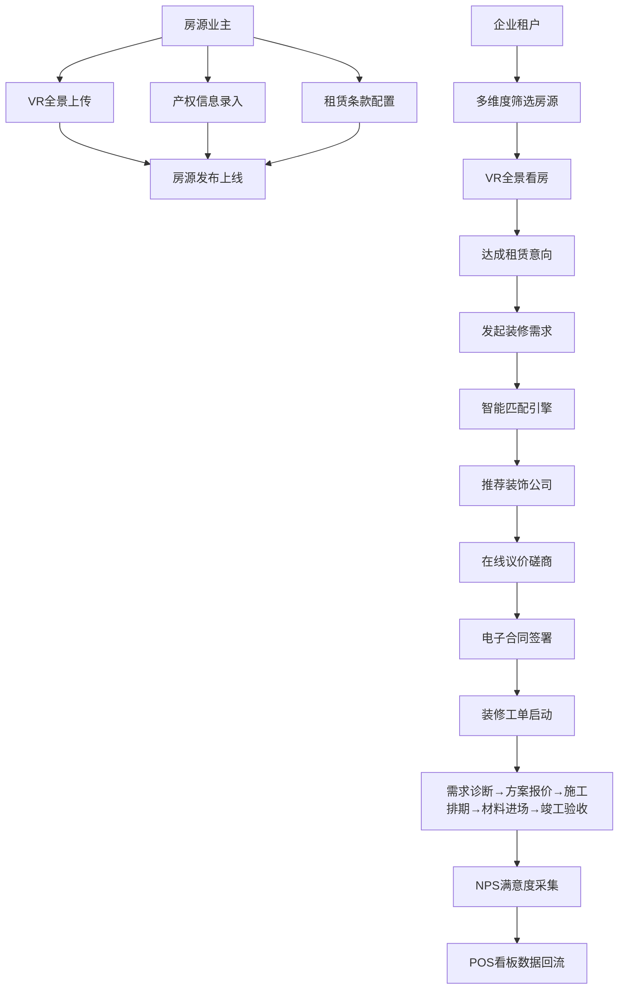

## 1. 产品概述

商业地产选址与装修工程一体化SaaS平台，为写字楼/商铺/厂房业主、租户及装饰公司提供全链路数字化服务。通过整合房源管理、装修工程、供需匹配和运营分析四大核心模块，解决商业地产租赁信息不对称、装修流程不透明、供应商匹配效率低等行业痛点。

- 核心目标：打造商业地产"选→装→管"一站式数字化服务生态
- 市场价值：降本提效30%+，信息透明度提升80%，装修周期缩短25%

## 2. 核心功能

### 2.1 用户角色

| 角色 | 注册方式 | 核心权限 |
|------|----------|----------|
| 房源业主 | 企业认证注册 | 发布房源、配置租赁条款、查看租赁意向、发起装修需求 |
| 企业租户 | 企业认证注册 | 搜索筛选房源、VR看房、发起租赁意向、发布装修需求 |
| 装饰公司 | 资质认证注册 | 接收装修需求、投标报价、工单管理、BIM上传、合同签署 |
| 平台管理员 | 内部邀请 | 数据看板、用户审核、供应商评级、系统配置 |

### 2.2 功能模块

1. **房源管理中心**：房源列表、VR全景上传、产权信息录入、租赁条款模板
2. **装修工单系统**：需求诊断、方案报价、施工排期、材料进场、竣工验收、BIM模型
3. **供需直连平台**：智能匹配引擎、在线议价、电子合同签署
4. **运营管理后台**：POS服务看板、耗时统计、NPS采集、供应商评分
5. **数据仪表盘**：首页概览、关键指标、快捷操作

### 2.3 页面详情

| 页面名称 | 模块名称 | 功能描述 |
|----------|----------|----------|
| 首页仪表盘 | 数据概览卡片 | 房源总数、在装修项目、待签合同、本月营收等KPI |
| 首页仪表盘 | 快捷操作区 | 快速发布房源、发起装修需求、查看待办事项 |
| 首页仪表盘 | 趋势图表 | 房源热度趋势、装修周期统计、匹配成功率折线图 |
| 房源列表页 | 筛选工具栏 | 类型/面积/价格/区域/消防验收状态多维度筛选 |
| 房源列表页 | 房源卡片 | 缩略图+VR标识+核心参数+快捷操作按钮 |
| 房源详情页 | VR全景展示 | 全景查看器、热点标记、场景切换 |
| 房源详情页 | 产权信息面板 | 产权类型、层高、承重、消防验收、房产证号结构化展示 |
| 房源详情页 | 租赁条款配置 | 模板选择、自定义条款、租金阶梯、免租期设置 |
| 装修工单列表 | 状态时间线 | 5大节点进度可视化、当前节点高亮、逾期预警 |
| 装修工单详情 | 需求诊断 | 需求问卷、面积预算工期、风格偏好标签 |
| 装修工单详情 | 方案报价 | 多方案对比、分项报价明细、附件下载 |
| 装修工单详情 | 施工排期 | 甘特图视图、里程碑节点、负责人分配 |
| 装修工单详情 | 材料进场 | 材料清单、验收记录、拍照上传、签字确认 |
| 装修工单详情 | BIM模型 | 轻量化模型嵌入、图层控制、变更标记、版本对比 |
| 装修工单详情 | 竣工验收 | 验收清单、缺陷整改、NPS评分、电子签字 |
| 智能匹配页 | 需求录入 | 面积/预算/工期/风格四维参数输入 |
| 智能匹配页 | 匹配结果 | 推荐装饰公司列表、匹配度评分、资质标签、历史案例 |
| 在线议价室 | 议价面板 | 报价历史轨迹、还价记录、消息气泡、达成共识标记 |
| 合同签署页 | 合同预览 | 条款高亮、关键参数自动填充、骑缝章预览 |
| 合同签署页 | 签名区 | 手写签名板、电子证书、时间戳、双方签署状态 |
| POS服务看板 | 耗时统计 | 各环节平均耗时热力图、节点瓶颈分析、效率趋势 |
| POS服务看板 | NPS采集 | NPS分数仪表盘、差评关键词云、满意度趋势 |
| POS服务看板 | 供应商评级 | 综合评分排行榜、交付质量/响应速度/性价比三维雷达图 |

## 3. 核心流程

### 3.1 房源发布→装修匹配主流程

业主在房源中心上传VR全景并录入产权结构化信息→配置租赁条款模板发布房源→租户浏览筛选并VR看房→达成租赁意向后租户/业主发起装修需求→系统根据面积/预算/工期/风格偏好智能匹配装饰公司→双方在线议价→达成一致后签署电子合同→进入装修工单全流程跟踪→竣工验收采集NPS→数据回流至POS看板。

### 3.2 装修工单流转流程

## 4. 用户界面设计

### 4.1 设计风格

**美学定位：工业科技感 × 精致商务风**

- **主色调**：深蓝 #1E3A5F（专业信任）× 琥珀金 #D4A853（高端品质）
- **辅助色**：翡翠绿 #059669（通过/验收）、珊瑚红 #EF4444（预警/逾期）、天蓝 #0EA5E9（信息/链接）
- **中性色**：炭灰 #1F2937、石板灰 #64748B、云白 #F8FAFC、暖白 #FAFAF7
- **按钮风格**：圆角 8px，主按钮渐变填充 + 轻微投影，悬停时上浮 2px 阴影加深
- **字体**：标题「思源宋体 SemiBold」（商务质感）+ 正文「思源黑体 Regular」（易读性）+ 数字「JetBrains Mono」（数据精准感）
- **布局风格**：左侧导航栏固定 + 顶部状态栏 + 主内容卡片网格，卡片采用 12px 圆角 + 1px 极细描边 + 微投影
- **视觉元素**：细线条几何分隔、金箔质感渐变点缀、数据大屏暗纹背景、轻微颗粒噪点叠加
- **动效**：卡片悬浮上移 + 阴影扩散、数据数字滚动递增、状态节点发光脉冲、页面切换渐隐渐入

### 4.2 页面设计概览

| 页面名称 | 模块名称 | UI元素 |
|----------|----------|--------|
| 首页仪表盘 | KPI卡片 | 深蓝渐变卡片底 + 金色数字显示 + 趋势迷你图 + 环比小标 |
| 房源列表页 | 房源卡片 | 左侧缩略图 + VR角标 + 右侧参数矩阵 + 底部操作栏 |
| 房源详情页 | VR查看器 | 暗底全屏模式 + 罗盘方向指示 + 场景切换标签 + 热点标记点 |
| 房源详情页 | 产权面板 | 左右两栏表单布局 + 图标+数值+单位三段式 + 消防状态标签色 |
| 装修工单列表 | 时间线卡片 | 垂直时间轴 + 彩色节点圆点 + 当前节点脉冲光晕 + 逾期红色警示条 |
| 装修工单详情 | BIM查看器 | 工具栏（缩放/旋转/图层/剖切）+ 右侧变更日志时间线 + 版本切换下拉 |
| 智能匹配页 | 匹配卡片 | 匹配度大圆环进度 + 资质勋章图标组 + 案例缩略图滚动 + 邀请按钮 |
| POS服务看板 | 耗时热力图 | 横轴环节 × 纵轴周次 + 颜色深浅表示耗时 + 鼠标悬浮详情 |
| POS服务看板 | 供应商雷达 | 五维雷达图叠加对比 + 图例筛选 + 选中高亮描边 |
| 合同签署页 | 签名板 | Canvas手写区 + 笔画粗细调节 + 清空/确认 + 证书印章水印 |

### 4.3 响应式

- 设计优先：Desktop 1440×900（主设计稿）
- 自适应断点：1280px（平板横屏）、768px（平板竖屏/大尺寸手机）、375px（手机端）
- 移动端适配：左侧导航收起为底部Tab栏，卡片单列堆叠，图表宽度自适应，表格改为列表卡片形式
- 触控优化：按钮最小 44×44px 触控区，支持下拉刷新、左滑删除、双指缩放BIM模型
