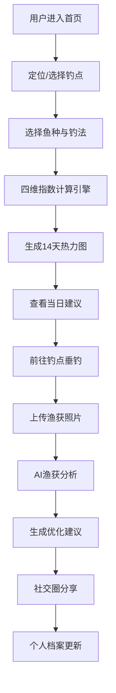

## 1. 产品概述

面向垂钓爱好者的专业气象决策平台，通过多源环境数据与AI算法，为钓友提供科学化、精准化的钓鱼时机与策略建议。平台整合气象、水文、天文等多维数据，结合鱼种习性与钓法特点，输出可交互的钓鱼指数热力图与智能渔获分析，助力钓友提升垂钓体验与收获。

- 核心价值：将传统经验垂钓升级为数据驱动的科学垂钓
- 目标用户：全层级垂钓爱好者，从入门新手到专业钓手
- 市场定位：国内首个四维钓鱼指数计算引擎的专业垂钓决策平台

## 2. 核心功能

### 2.1 用户角色
| 角色 | 注册方式 | 核心权限 |
|------|----------|----------|
| 普通钓友 | 手机号/微信注册 | 浏览钓点、查看指数、上传渔获、社交互动、个人档案 |
| 专业钓手 | 资质认证升级 | 发布钓点、专业数据分析、钓法教学内容创作 |
| 管理员 | 后台账号登录 | 数据源管理、模型版本控制、用户管理、数据看板 |

### 2.2 功能模块
1. **首页仪表板**：今日钓鱼指数概览、14天逐小时热力图、推荐钓点、AI快讯
2. **钓点探索**：钓点地图、钓点详情、环境因子实时数据、周边钓点推荐
3. **AI渔获分析**：照片上传识别、鱼口活跃度预测、黄金时段推荐、装备匹配建议、钓法优化策略
4. **钓友档案**：渔获时空图谱、成长曲线、鱼种图鉴、成就系统、垂钓日志
5. **社交圈**：钓点打卡、渔获分享、水文标签、评论点赞、关注系统
6. **后台管理**：气象数据源管理、指数模型版本控制、用户行为埋点、数据复盘看板

### 2.3 页面详情
| 页面名称 | 模块名称 | 功能描述 |
|---------|----------|----------|
| 首页仪表板 | 指数总览卡片 | 显示当前综合钓鱼指数、温度、气压、风力等关键指标 |
| 首页仪表板 | 14天热力图 | 逐小时×14天可交互热力图，支持鱼种/钓法切换 |
| 首页仪表板 | 推荐钓点 | 基于用户位置与偏好的智能钓点推荐列表 |
| 首页仪表板 | AI快讯 | 当日垂钓建议、天气预警、鱼情播报 |
| 钓点详情 | 基础信息 | 经纬度、水体类型、深度、障碍物标注、钓场规则 |
| 钓点详情 | 环境数据 | 实时实测数据与预报数据的多维度图表展示 |
| 钓点详情 | 鱼种分布 | 该钓点常见鱼种及最佳垂钓时段 |
| 钓点详情 | 钓友评价 | 真实钓获分享、打卡记录、评分系统 |
| AI分析页 | 照片上传 | 支持拖拽上传、拍照上传渔获照片 |
| AI分析页 | 元数据录入 | 钓点、钓法、时长、装备等基础信息录入 |
| AI分析页 | 分析报告 | 鱼口预测、黄金时段、装备建议、钓法优化 |
| 个人档案 | 数据概览 | 总钓获数、总钓时、鱼种数量、成就徽章 |
| 个人档案 | 时空图谱 | 渔获地点分布热力图、时间分布分析 |
| 个人档案 | 成长曲线 | 钓技评分趋势、鱼种解锁进度 |
| 个人档案 | 图鉴成就 | 鱼种图鉴收集、成就系统展示 |
| 社交圈 | 动态流 | 关注钓友的渔获分享与打卡动态 |
| 社交圈 | 发布动态 | 带地理围栏打卡、水文标签的渔获分享 |
| 社交圈 | 互动中心 | 评论、点赞、收藏、关注功能 |
| 管理后台 | 数据源管理 | 多级气象数据源接入、配置、监控 |
| 管理后台 | 模型管理 | 指数模型版本控制、A/B测试、效果评估 |
| 管理后台 | 用户看板 | 用户行为埋点分析、活跃度、留存率 |
| 管理后台 | 数据复盘 | 平台整体运营数据、趋势分析 |

## 3. 核心流程

### 3.1 钓鱼指数查询流程
用户进入首页 → 选择钓点/系统自动定位 → 选择鱼种与钓法 → 系统调用四维计算引擎 → 生成14天逐小时热力图 → 用户交互查看详情 → 获取当日垂钓建议

### 3.2 AI渔获分析流程
用户进入AI分析页 → 上传渔获照片 → 填写钓点/钓法/时长等元数据 → 提交分析 → AI引擎识别鱼种与环境关联 → 生成鱼口预测报告 → 输出装备与钓法建议

### 3.3 渔获分享流程
用户钓获后 → 选择打卡/分享 → 自动获取当前钓点（地理围栏校验） → 添加照片与描述 → 选择水文标签 → 发布到社交圈 → 其他钓友评论点赞

## 4. 用户界面设计

### 4.1 设计风格
- **主色调**：深海蓝 `#0A2540` 作为主色，搭配湖水绿 `#00D4AA` 作为强调色
- **辅助色**：日落橙 `#FF6B35` 用于高指数预警、月光银 `#E8EDF2` 用于背景层次
- **整体风格**：深邃科技感 + 自然元素融合，营造专业可信的决策平台氛围
- **按钮风格**：微渐变 + 圆角12px + 微妙投影，hover时有亮度提升动效
- **字体**：标题使用"思源黑体"粗体，正文使用"Inter"或系统无衬线字体
- **布局风格**：卡片式布局，信息分组清晰，留白适度，数据可视化主导
- **图标风格**：线性图标 + 填充图标结合，统一2px描边，配色与主题一致

### 4.2 页面设计概览
| 页面名称 | 模块名称 | UI元素 |
|---------|----------|--------|
| 首页仪表板 | 指数总览 | 大数字指数展示、环形进度条、渐变色彩分级、微动效 |
| 首页仪表板 | 热力图 | 交互式热力矩阵、时间轴滑块、颜色图例、悬浮详情卡片 |
| 首页仪表板 | 推荐钓点 | 横向滚动卡片、距离/评分标签、钓点缩略图、收藏按钮 |
| 钓点详情 | 环境数据 | 多维度折线图/柱状图、实时数据徽标、趋势箭头 |
| AI分析页 | 上传区域 | 虚线边框上传区、相机图标、拖拽动效、进度条 |
| AI分析页 | 分析报告 | 分栏卡片布局、AI生成标签、建议条目带图标 |
| 个人档案 | 时空图谱 | 地图热力叠加、时间轴、统计数字动画 |
| 个人档案 | 图鉴成就 | 网格布局、已解锁/未解锁状态、成就徽章光效 |
| 社交圈 | 动态流 | 卡片式feed、水文标签胶囊、互动按钮微动效 |
| 管理后台 | 数据看板 | 数据大屏风格、多图表联动、深色主题优化 |

### 4.3 响应式设计
- **设计原则**：桌面端优先，移动端自适应
- **断点设置**：1280px（大屏）、1024px（平板横屏）、768px（平板竖屏）、480px（手机）
- **移动端优化**：底部导航栏、手势滑动切换、触控目标≥44px、下拉刷新
- **热力图适配**：移动端简化为单日24小时视图，支持左右滑动切换日期

### 4.4 动效与交互
- **页面加载**：骨架屏 + 渐入动画，数据模块按序出现
- **热力图交互**：hover单元格放大并显示详情tooltip
- **数据更新**：数字滚动动画、图表平滑过渡
- **按钮交互**：点击时缩放反馈 + 涟漪效果
- **页面切换**：淡入淡出 + 轻微位移动效
