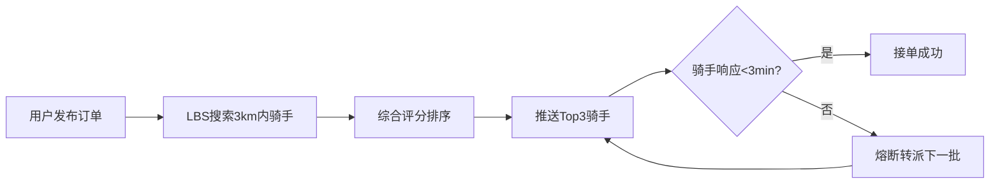
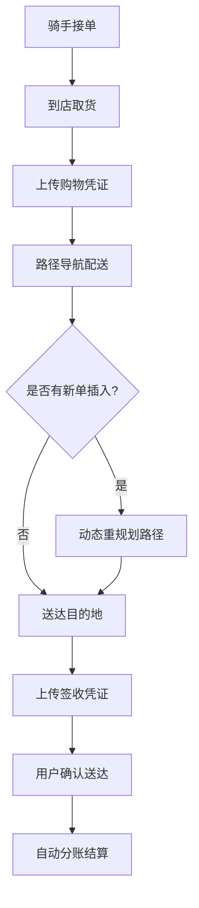
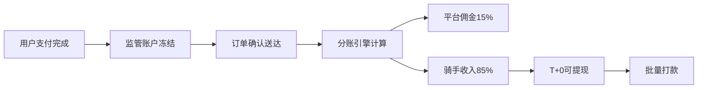

## 1. 产品概述

闪跑侠 - 城市即时跑腿服务调度平台，聚焦高频代办场景（代买/代送/代办），连接需求用户与周边骑手，通过智能调度算法实现高效匹配、路径优化与异常熔断，保障服务时效与质量。

- 核心价值：30分钟同城即时响应，解决用户碎片化跑腿需求；骑手灵活接单增收；平台抽取服务佣金
- 目标用户：25-40岁都市白领、社区居民、小微企业；年龄20-50岁兼职/全职骑手

---

## 2. 核心功能

### 2.1 用户角色

| 角色 | 注册方式 | 核心权限 |
|------|----------|----------|
| 普通用户 | 手机号+验证码 | 发布订单、加价抢单、余额充值、订单追踪、评价骑手 |
| 骑手 | 身份证+健康证审核 | 接单、配送导航、上传凭证、T+0提现、查看信用分 |
| 平台调度员 | 企业邮箱 | 实时监控、人工干预调度、异常订单处理、数据看板 |
| 财务管理员 | 企业邮箱+U盾 | 佣金配置、对账结算、提现审核、通道管理 |

### 2.2 功能模块

1. **用户端首页**：服务类型入口、附近骑手热力图、进行中订单卡片、常用地址管理
2. **发布订单页**：类型选择、物品描述、取送地址、期望时间窗、加价抢单、费用明细
3. **订单追踪页**：骑手实时位置、ETA预估、服务凭证照片、联系骑手/客服、确认送达
4. **骑手工作台**：附近订单池、当前接单、接单建议评分、导航跳转、凭证上传
5. **调度监控中心**：实时订单地图、骑手状态分布、冲突预警、异常熔断队列、人工派单
6. **财务管理中心**：用户余额、骑手钱包、佣金分账、提现管理、通道配置、对账报表
7. **个人中心**：账户设置、历史订单、评价管理、实名认证、我的钱包

### 2.3 页面详情

| 页面名称 | 模块名称 | 功能描述 |
|----------|----------|----------|
| 用户端首页 | 服务类型导航 | 代买/代送/代办三大图标入口，支持快捷创建 |
| 用户端首页 | 热力地图 | 显示周边3km骑手分布，实时刷新位置 |
| 用户端首页 | 进行中订单卡 | 缩略展示当前订单状态，点击跳转追踪页 |
| 发布订单页 | 类型选择器 | Tab切换代买/代送/代办，表单动态适配 |
| 发布订单页 | 物品描述 | 文本输入+快捷标签（星巴克/奶茶/文件/药品等） |
| 发布订单页 | 地址选择 | 起点/终点地图选点，历史地址快捷填充 |
| 发布订单页 | 时间窗设置 | 滑块选择期望送达时段，最早30分钟后 |
| 发布订单页 | 加价面板 | 5元/10元/20元/自定义加价，显示预计响应速度提升 |
| 发布订单页 | 费用明细 | 基础配送费+里程费+加价+平台服务费，合计展示 |
| 订单追踪页 | 实时地图 | 骑手位置动画轨迹，取/送点标记 |
| 订单追踪页 | ETA进度条 | 取货→配送中→即将到达，节点高亮 |
| 订单追踪页 | 凭证画廊 | 购物小票/签收页照片上传，可放大预览 |
| 骑手工作台 | 订单池卡片 | 距离/价格/信用分加权评分，推荐指数星级展示 |
| 骑手工作台 | 接单校验 | 校验时间是否与已有订单重叠，冲突弹窗提示 |
| 骑手工作台 | 路径导航 | 调用外部地图，插入新单后自动重规划 |
| 骑手工作台 | 凭证上传 | 拍照上传小票/签收照，自动压缩加水印 |
| 调度监控中心 | 全局地图 | 订单/骑手聚合标记，集群下钻查看 |
| 调度监控中心 | 冲突预警面板 | 骑手时间冲突/订单超时未接单，实时告警 |
| 调度监控中心 | 熔断队列 | 超时3分钟未响应自动转派，显示转派日志 |
| 调度监控中心 | 人工派单 | 拖拽订单至指定骑手，二次确认 |
| 财务管理中心 | 用户余额池 | 充值/消费/退款流水，日/周/月报表 |
| 财务管理中心 | 骑手钱包 | 待结算/可提现/已提现，T+0到账记录 |
| 财务管理中心 | 分账引擎 | 平台佣金(15%)/骑手收入/支付通道费实时分账 |
| 财务管理中心 | 通道配置 | 微信/支付宝/银联支付参数，权重轮询配置 |

---

## 3. 核心流程

### 3.1 订单发布与匹配流程

用户选择服务类型→填写物品描述与取送地址→选择期望时间窗→可选加价抢单→确认支付(余额/在线)→系统按LBS筛选3km内空闲骑手→按(距离×0.4 + 信用分×0.3 + 履约率×0.3)排序→推送Top3骑手接单→3分钟内超时未响应→自动熔断转派下一批→骑手接单成功→订单状态更新为"待取货"

### 3.2 订单执行与异常处理流程

骑手前往取货点→拍照上传小票→用户实时查看→前往送货点→上传签收凭证→用户确认送达→自动分账(佣金15%/骑手85%)→评价打分→若配送超时→系统自动标记异常→调度员介入→超时>30分钟自动赔付

### 3.3 财务分账流程

用户支付→资金进入平台监管账户→订单完成确认→分账引擎计算(基础费+加价-通道费)→平台15%佣金→骑手85%收入(T+0可提现)→提现申请→支付通道批量打款→生成日对账报表

---

## 4. 用户界面设计

### 4.1 设计风格

**整体调性**：极速动感 + 专业可靠。采用「电光蓝+活力橙」的冷暖撞色体系，传递"快"与"暖"的双重情感。

- **主色调**：电光蓝 `#1E40FF`（专业、科技、信任）
- **辅助色**：活力橙 `#FF6B1A`（速度、行动、骑手徽章）
- **成功色**：翠绿 `#00C48C`（送达、完成）
- **警告色**：珊瑚红 `#FF4757`（超时、异常）
- **背景**：深灰 `#0F1629` 调度端 / 纯白 `#FFFFFF` 用户端

- **按钮风格**：胶囊圆角(12px)，主按钮采用渐变填充+细微光晕悬停，按下时有微动效
- **字体方案**：
  - 标题：`"Space Grotesk"` 现代几何无衬线，600/700字重
  - 正文：`"PingFang SC"` 中文优化，400/500字重
  - 数据：`"JetBrains Mono"` 等宽数字，保证ETA/金额对齐
- **布局**：卡片式模块化，大圆角(20px)卡片+软阴影，用户端顶部导航+底部Tab，调度端三栏布局(侧栏+地图+操作面板)
- **图标**：线性SVG图标，1.5px描边，状态变化时填充切换

### 4.2 页面设计概述

| 页面名称 | 模块名称 | UI元素 |
|----------|----------|--------|
| 用户端首页 | 服务类型入口 | 大圆角卡片，图标微动效，渐变背景，hover放大1.03 |
| 用户端首页 | 实时地图 | 深色底图，骑手橙色标记，脉冲动效，订单蓝色标记 |
| 用户端首页 | 进行中卡片 | 横向滑动卡片，进度条微动效，骑手头像圆形裁剪 |
| 发布订单页 | 表单区 | 分段分组，左侧标签，右侧输入，激活时左侧边框高亮蓝色 |
| 发布订单页 | 加价面板 | 按钮组，选中态橙色填充，右侧显示"预计响应+50%"标签 |
| 订单追踪页 | 地图区域 | 占屏70%，骑手图标沿轨迹平滑移动动画 |
| 订单追踪页 | 时间轴 | 左侧时间节点圆点，连接线流动渐变动效 |
| 订单追踪页 | 凭证画廊 | 3列网格缩略图，点击模态框放大轮播 |
| 骑手工作台 | 订单池 | 瀑布流卡片，星级评分组件，价格强调放大 |
| 骑手工作台 | 进行中卡片 | 大字号ETA倒计时，呼吸闪烁效果 |
| 调度监控中心 | 全局地图 | 聚合标记，点击下钻展开订单列表 |
| 调度监控中心 | 预警面板 | 红色边框闪烁，严重级别标签，超时进度条 |
| 调度监控中心 | 数据看板 | 深色背景，霓虹色数字卡片，图表渐变填充 |
| 财务管理中心 | 分账流水 | 斑马纹表格，金额列右对齐，状态胶囊标签 |

### 4.3 响应式设计

- **核心策略**：用户端/骑手端 Mobile-First，调度/财务端 Desktop-First
- **用户端**：断点 375px / 768px，手机端全屏沉浸式，平板端双列布局
- **骑手端**：断点 375px / 768px，大按钮48px以上，适配车载横屏
- **调度端**：断点 1280px / 1920px，三栏布局可折叠，最小支持1366×768
- **触摸优化**：可点击区域≥44×44px，滑动操作优先，关键操作二次确认弹窗

### 4.4 动效与微交互

- 页面切换：路由元素级过渡，左滑进入/右滑返回
- 地图标记：骑手位置0.8s平滑移动，脉冲光晕呼吸(1.2s循环)
- 接单推送：从顶部滑入卡片，震动反馈+提示音
- 进度节点：完成时绿色勾选动画+礼花粒子微效
- ETA刷新：数字滚动动效，预计时间变化时高亮闪烁
- 订单状态变更：全局Toast从底部滑入，3s自动消失
