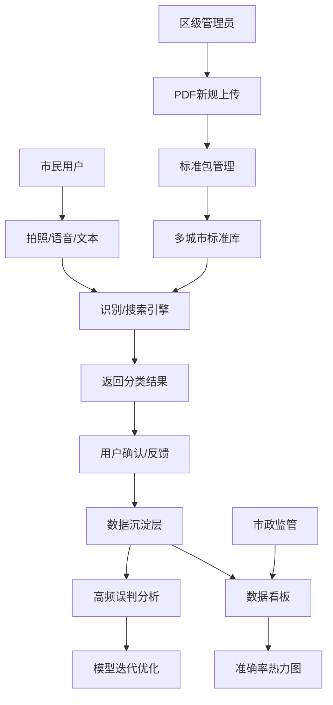

## 1. 产品概述
城市级垃圾分类智能识别与知识服务系统，支撑多行政区差异化垃圾分类标准落地，通过AI图像识别、语音交互和模糊搜索等技术，为市民提供便捷的垃圾分类查询服务，为市政管理提供数据决策支持。

- **核心价值**：解决不同城市/行政区垃圾分类标准不统一、市民查询不便、管理缺乏数据支撑的痛点
- **目标用户**：普通市民、区级管理员、市政监管人员
- **市场价值**：助力垃圾分类政策落地，提升城市精细化管理水平

## 2. 核心功能

### 2.1 用户角色

| 角色 | 注册方式 | 核心权限 |
|------|----------|----------|
| 普通市民 | 无需注册/匿名访问 | 使用拍照识别、语音查询、文本搜索、错误反馈功能 |
| 区级管理员 | 账号密码登录 | 管理辖区分类标准、上传PDF新规、关联分类条目 |
| 市政监管人员 | 账号密码登录 | 查看多城市标准、数据统计、准确率热力图 |

### 2.2 功能模块

1. **市民服务端**：首页导航、拍照识垃圾、语音问分类、文本搜索、错误投放反馈
2. **管理后台**：城市标准包管理、PDF解析与关联、管理员权限管理
3. **数据看板**：用户行为统计、高频误判词条、街道准确率热力图

### 2.3 页面详情

| 页面名称 | 模块名称 | 功能描述 |
|-----------|-------------|---------------------|
| 首页 | 导航入口 | 三大功能入口卡片展示（拍照、语音、反馈），城市选择器，最新分类标准公告 |
| 拍照识别页 | 相机模块 | 实时摄像头预览，拍照/上传图片，AI识别结果展示（类别、投放要求、常见误区），支持地方扩展类别 |
| 语音查询页 | 语音模块 | 语音录制/停止，实时转文字，模糊搜索匹配，语音播报结果 |
| 文本搜索页 | 搜索模块 | 模糊搜索框，热门搜索词条，搜索结果列表（所属类别、投放要求、常见误区） |
| 错误反馈页 | 反馈表单 | 物品名称、误判类别选择、正确类别选择、补充说明、上传图片、提交反馈 |
| 管理后台-标准管理 | 标准包列表 | 城市/行政区筛选，标准包CRUD，分类名称、图标、投放指引、时间戳管理 |
| 管理后台-PDF管理 | PDF上传 | PDF文件上传、解析预览、条目关联匹配、版本管理 |
| 数据看板 | 统计分析 | 用户查询量趋势、高频误判词条排行、各街道分类准确率热力图 |

## 3. 核心流程

### 3.1 拍照识别流程
用户进入拍照识别页 → 授权摄像头 → 对准垃圾拍摄 → 系统AI识别 → 展示识别结果（类别、投放要求、常见误区）→ 用户可反馈识别错误

### 3.2 语音查询流程
用户进入语音查询页 → 点击开始录音 → 说出垃圾名称 → 语音转文字 → 模糊搜索匹配 → 展示结果并语音播报

### 3.3 管理员更新标准流程
区级管理员登录 → 进入标准管理 → 上传本地新规PDF → 系统解析PDF内容 → 管理员关联分类条目 → 发布更新 → 市民端同步最新标准

### 3.4 数据沉淀与迭代流程
用户提交错误反馈 → 系统记录高频误判词条 → 定期导出供模型训练 → 模型迭代优化 → 更新识别引擎

## 4. 用户界面设计

### 4.1 设计风格
- **设计理念**：环保、清新、科技感，体现绿色可持续发展主题
- **主色调**：环保绿 `#22c55e`（代表可回收/环保），辅助色：天空蓝 `#0ea5e9`、暖橙 `#f97316`、岩石灰 `#6b7280`
- **按钮风格**：圆角胶囊按钮，渐变背景，悬停微动画，点击反馈
- **字体方案**：标题使用 LXGW WenKai / 霞鹜文楷（清新有温度），正文使用 Inter / PingFang SC（清晰易读）
- **布局风格**：卡片式布局，大量留白，柔和阴影，层次分明
- **图标风格**：线性+填充混合图标，统一圆角风格，使用 Lucide Icons 库

### 4.2 页面设计概览

| 页面名称 | 模块名称 | UI元素 |
|-----------|-------------|-------------|
| 首页 | 导航入口 | 渐变色Hero区域，三大功能卡片（悬浮动效），城市选择下拉，最新标准滚动通知 |
| 拍照识别页 | 相机模块 | 全屏相机预览框，底部操作栏（拍照/相册/切换镜头），识别结果半透明浮层（类别标签+投放说明） |
| 语音查询页 | 语音模块 | 居中圆形录音按钮（呼吸动效），声波可视化动画，实时转文字展示，结果卡片淡入 |
| 错误反馈页 | 反馈表单 | 分步表单设计，标签化类别选择，图片拖拽上传，提交成功动效 |
| 数据看板 | 统计分析 | 深色背景仪表盘，ECharts热力图，数据卡片网格布局，滚动排行榜 |

### 4.3 响应式设计
- **设计原则**：Desktop-first，移动端自适应
- **断点设置**：`sm: 640px`、`md: 768px`、`lg: 1024px`、`xl: 1280px`
- **移动端优化**：相机页全屏体验，大按钮触控友好，表单简化输入，下拉菜单适配触摸屏
- **性能优化**：图片懒加载，路由按需加载，WebWorker处理图像识别

### 4.4 交互动效
- 页面切换：淡入淡出+轻微位移
- 相机对焦：圆形扫描动画
- 识别结果：从底部滑入+弹性动效
- 录音按钮：脉冲波纹动画
- 卡片悬停：轻微上浮+阴影加深
- 热力图数据：按时间轴动画过渡
