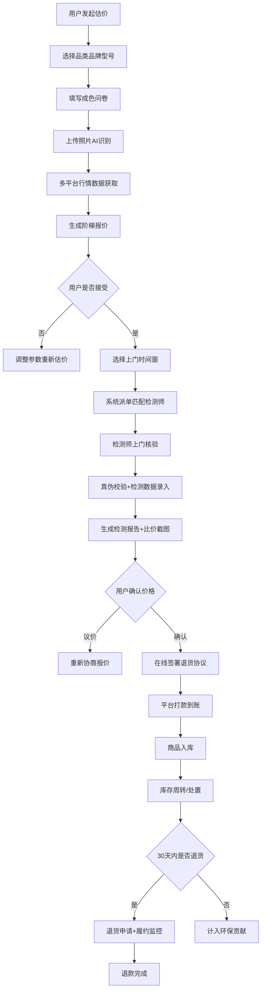

# 高值数码与奢侈品C2B回收交易平台 - 产品需求文档 (PRD)

## 1. 产品概述

国内领先的高值数码与奢侈品C2B回收交易平台，聚焦「价格可信」与「售后保障」两大核心痛点，通过AI成色识别+多平台行情比价+检测师飞检机制，为用户提供透明、高效、安全的奢侈品回收服务。覆盖手机、相机、名表、包包等50+品牌，打造集动态估价、上门检测、在线签约、退货履约、环保贡献于一体的全链路回收生态。

---

## 2. 核心功能

### 2.1 用户角色

| 角色 | 注册方式 | 核心权限 |
|------|----------|----------|
| C端卖家用户 | 手机号注册/微信登录 | 提交回收订单、上传商品照片、签署退货协议、查看检测报告、追踪订单状态、申请退货、查看环保贡献 |
| 检测师 | 资质审核后入职 | 接收上门任务、录入检测数据、上传检测报告、查看个人偏差率、排班管理 |
| 运营管理员 | 后台账号 | 商品库管理、检测师管理、订单审核、城市服务网络配置、库存周转监控、飞检任务派发、环保数据统计 |

### 2.2 功能模块

1. **首页**：动态估价引擎入口、热门品牌导航、平台信任背书数据、服务流程展示、最新成交案例
2. **智能估价页**：品类选择→品牌型号选择→成色问卷→照片上传AI识别→多平台比价→阶梯报价展示
3. **商品库浏览**：品牌分类、型号详情、真伪校验规则说明、历史回收均价
4. **回收订单中心**：订单列表、订单详情、上门时间窗确认、检测报告查看、三方比价截图、退货协议在线签署
5. **检测师档案页**：持证资质展示、历史检测偏差率、服务评价、累计服务单数
6. **退货履约中心**：30天无理由退货申请、退货进度追踪、履约状态监控、退款记录
7. **运营后台 - 城市服务网络**：检测师排班、上门路线优化、区域热力图、运力调配
8. **运营后台 - 库存周转看板**：在库天数统计、翻新率分析、处置渠道毛利对比、滞销预警
9. **运营后台 - 检测师质量飞检**：随机复检任务、偏差率预警、资质年审、奖惩记录
10. **运营后台 - 环保贡献计量**：碳减排量折算、电子证书生成、环保榜单、数据可视化大屏

### 2.3 页面详情

| 页面名称 | 模块名称 | 功能描述 |
|----------|----------|----------|
| 首页 | Hero区域 | 动态估价搜索框、实时行情滚动条、平台核心数据展示（累计回收X件/节省碳X吨/平均溢价X%） |
| 首页 | 品牌品类导航 | 手机/相机/名表/包包/珠宝等分类卡片，品牌Logo墙 |
| 首页 | 服务流程 | 估价→上门→检测→打款→保障，五步流程图 |
| 首页 | 信任背书 | 检测师资质、三方比价、30天退货、正品保障四大承诺 |
| 首页 | 最新成交 | 滚动展示近期成交订单（品牌、成色、成交价） |
| 智能估价页 | 品类品牌选择 | 级联选择器：品类→品牌→系列→型号，支持搜索 |
| 智能估价页 | 成色基础问卷 | 功能完好度、外观磨损、维修史、配件齐全度等选项 |
| 智能估价页 | AI成色识别 | 拖拽上传6面照+细节照，AI实时判定划痕/磨损/氧化等级 |
| 智能估价页 | 多平台比价 | 京东/闲鱼/蜂鸟当前市场价折线对比，平台报价优势标注 |
| 智能估价页 | 阶梯报价 | 快速变现价/标准价/寄售最高价三档，时效与价格权衡说明 |
| 智能估价页 | 下单确认 | 上门地址、时间窗选择（今日/明日/指定日期，分上午/下午/晚间） |
| 订单中心 | 订单列表 | 待上门/检测中/待确认/已完成/退货中 Tab分类 |
| 订单中心 | 订单详情 | 商品信息、检测师信息、上门时间窗地图展示、检测报告PDF预览、三方比价截图 |
| 订单中心 | 协议签署 | 电子签名画布、30天无理由退货协议条款滚动确认、短信验证码签署 |
| 检测师档案 | 资质展示 | 证书编号、从业年限、擅长品类、认证徽章 |
| 检测师档案 | 偏差率看板 | 近30天检测偏差率趋势图、与同行对比、飞检通过率 |
| 退货中心 | 申请流程 | 退货原因选择、照片上传、退款方式选择、快递上门取件预约 |
| 退货中心 | 履约监控 | 退货进度时间轴、退款预计到账时间、客服介入入口 |
| 后台-城市网络 | 排班日历 | 检测师周视图排班、拖拽调班、请假/加班标记 |
| 后台-城市网络 | 路线优化 | 基于地址的TSP最优路线推荐、行驶时间/距离预估 |
| 后台-库存看板 | 数据总览 | 在库总量、平均在库天数、翻新率、月毛利趋势 |
| 后台-库存看板 | 处置渠道 | 拍卖/翻新/二手平台/环保拆解各渠道毛利对比 |
| 后台-质量飞检 | 复检任务 | 随机抽检订单分配、复检结果录入、偏差率自动计算 |
| 后台-质量飞检 | 预警中心 | 偏差率超阈值自动预警、资质到期提醒 |
| 后台-环保计量 | 碳减排大屏 | 品类碳减排系数、累计减排量、等效植树数可视化 |
| 后台-环保计量 | 电子证书 | 证书模板设计、自动生成、批量下载/发送 |

---

## 3. 核心流程

### 3.1 回收交易主流程

用户发起估价 → AI识别成色+多平台比价 → 生成阶梯报价 → 用户确认下单选择上门时间窗 → 系统自动派单匹配检测师 → 检测师上门核验商品真伪并录入检测数据 → 生成检测报告+三方比价截图 → 用户在线确认价格并签署退货协议 → 平台打款 → 商品入库 → 进入库存周转/处置渠道 → （如30天内用户申请退货→履约监控→退款回退）

### 3.2 核心流程图

---

## 4. 用户界面设计

### 4.1 设计风格

**整体定位：高端、可信、科技感** — 符合奢侈品回收的品牌调性，同时通过数据可视化展现技术实力与透明度。

- **主色调**：深邃墨绿 `#0F4C3A`（象征信任、环保、高端）+ 香槟金 `#C9A962`（象征奢侈品、价值、品质）
- **辅助色**：翡翠绿 `#1DB954`（AI识别成功/价格上涨）、珊瑚红 `#E74C3C`（偏差预警/退货）、暖橙 `#F39C12`（阶梯价高亮）
- **背景层次**：炭黑 `#0A0A0F`（主背景）、深灰 `#15151F`（卡片）、墨绿渐变（导航/页脚）
- **按钮风格**：圆角12px，香槟金渐变主按钮（hover光晕扩散），墨绿描边次按钮，按下微缩+阴影变化
- **字体选择**：标题使用 **Playfair Display**（衬线体，高端杂志感），正文使用 **DM Sans**（现代无衬线，高可读性数字展示）
- **布局风格**：卡片式+玻璃拟态（Glasmorphism）叠加，顶部悬浮导航栏，宽屏1440px基准栅格
- **图标风格**：线性描边+端点圆润，关键数据图标使用香槟金填充，状态图标使用微动画
- **氛围元素**：噪点纹理叠加、香槟金渐变分割线、数据卡片发光效果、滚动视差

### 4.2 页面设计概览

| 页面名称 | 模块名称 | UI设计元素 |
|----------|----------|------------|
| 首页 | Hero区域 | 全屏墨绿渐变背景+噪点，Playfair Display超大标题，香槟金搜索框发光效果，右侧实时行情滚动，数字计数动画 |
| 首页 | 品牌品类导航 | 圆形品牌Logo卡片网格，hover缩放+金色边框发光，品类标签磨砂玻璃背景 |
| 首页 | 服务流程 | 对角线布局五步流程，香槟金连接线节点发光，每步图标带进入动画 |
| 智能估价页 | 多步骤向导 | 顶部步骤进度条（金色填充），左侧商品预览，右侧表单，AI识别区域拖拽上传+扫描线动画 |
| 智能估价页 | 比价图表 | 深色背景ECharts折线图，多平台折线不同色彩，平台报价区域金色高亮+价格差徽章 |
| 订单中心 | 订单卡片 | 深色卡片+左侧金色状态条，商品缩略图+检测师头像圆形徽章，操作按钮玻璃拟态 |
| 订单中心 | 协议签署 | 电子签名画布（金色笔触），协议正文磨砂玻璃容器，签署按钮倒计时防误操作 |
| 后台-库存看板 | 数据大屏 | 深色仪表盘风格，KPI卡片金色数字+发光趋势箭头，环形翻新率图表，处置渠道堆叠柱状图 |
| 后台-环保计量 | 碳减排大屏 | 绿色渐变地球可视化，植树等效动画，证书预览金色边框+全息防伪纹理 |
| 后台-飞检中心 | 偏差率看板 | 红色阈值线预警图表，检测师排行榜金色奖牌图标，预警通知卡片震动动画 |

### 4.3 响应式设计

- **策略**：Desktop-first 设计，1440px → 1024px → 768px → 375px 断点适配
- **导航**：1440px完整菜单，1024px折叠次要菜单，768px以下汉堡菜单+底部Tab导航
- **卡片网格**：1440px四列，1024px三列，768px两列，375px单列堆叠
- **图表自适应**：ECharts容器100%宽度，移动端自动简化数据标签与图例
- **触控优化**：移动端按钮最小高度48px，表单输入区增大点击热区，签名画布支持触控笔

### 4.4 动效与微交互

- **页面载入**：分区块staggered渐入（200ms间隔），数字从0计数到目标值
- **估价结果生成**：AI扫描进度条+粒子扩散动画，价格数字滚动递增至最终值
- **按钮交互**：hover时光晕径向扩散，按下scale(0.97)+阴影加深
- **状态切换**：订单状态变更时金色闪光划过卡片顶部
- **数据更新**：KPI数值变化时±差值颜色闪烁（绿涨红跌）
- **滚动效果**：品牌墙横向循环滚动，Hero背景视差偏移
