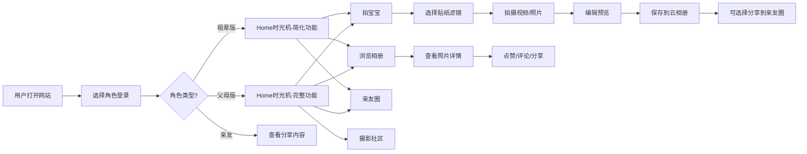

## 1. 产品概述

宝宝时光机是面向0-6岁宝宝家庭的成长记录Web平台，以视频拍摄、云相册、亲友分享为核心，帮助家庭成员共同记录和珍藏宝宝成长瞬间。

- 解决问题：宝宝成长记录分散、亲友分享不便、多角色协同记录困难
- 目标用户：0-6岁宝宝的父母、祖父母、外祖父母及亲友
- 产品价值：构建家庭共同记忆，打造宝宝成长的数字时光胶囊

## 2. 核心功能

### 2.1 用户角色

| 角色 | 登录方式 | 核心权限 |
|------|----------|----------|
| 父母版 | 手机号/微信 | 完整功能：相册管理、视频拍摄、亲友圈、社区互动、设置管理 |
| 祖辈版 | 手机号/邀请码 | 简化功能：查看相册、简易拍摄、点赞评论、减少社交功能 |
| 亲友 | 邀请链接 | 查看分享内容、点赞评论、无法发布内容 |
| 管理员 | 后台登录 | 内容审核、用户管理、数据统计、运营配置 |

### 2.2 功能模块

1. **Home时光机**：宝宝时间轴相册、照片视频网格、成长故事卡片
2. **拍宝宝**：相机拍摄、宝宝贴纸、特效滤镜、视频剪辑、自动保存云端
3. **亲友圈**：动态流、点赞评论、@亲友、分享链接、隐私设置
4. **摄影社区**：热门作品、话题挑战、育儿课程、摄影师入驻
5. **个人中心**：宝宝档案、家庭成员、存储空间、设置管理
6. **管理后台**：数据看板、内容审核、用户管理、课程管理

### 2.3 页面详情

| 页面名称 | 模块名称 | 功能描述 |
|----------|----------|----------|
| 登录页 | 角色选择 | 父母版/祖辈版入口、手机号登录、邀请码登录 |
| Home时光机 | 时间轴 | 按时间展示照片视频、月份切换、智能分组 |
| Home时光机 | 相册网格 | 瀑布流布局、多选操作、下载分享、删除归档 |
| 拍宝宝 | 相机界面 | 实时预览、贴纸选择、滤镜切换、拍摄按钮 |
| 拍宝宝 | 编辑预览 | 视频裁剪、贴纸调整、文案添加、保存发布 |
| 亲友圈 | 动态流 | 下拉刷新、上拉加载、点赞评论、转发分享 |
| 摄影社区 | 发现页 | 热门推荐、话题标签、分类浏览、课程入口 |
| 个人中心 | 宝宝档案 | 宝宝信息、成长曲线、家庭成员管理 |
| 管理后台 | 数据看板 | 用户统计、内容数据、活跃度分析 |
| 管理后台 | 审核中心 | 内容审核、举报处理、违规下架 |

## 3. 核心流程

## 4. 用户界面设计

### 4.1 设计风格

- **主色调**：温暖橙色系 #FF8C42（活力、温馨）
- **辅助色**：柔和粉色 #FFB5C5、天空蓝 #87CEEB、嫩绿 #90EE90
- **中性色**：米白 #FFF8F0、浅灰 #F5F5F5、深灰 #333333
- **按钮风格**：圆角16px、渐变背景、悬停微动效
- **字体**：标题用圆润可爱的"ZCOOL KuaiLe"，正文用"Noto Sans SC"
- **布局风格**：卡片式布局、大量圆角、柔和阴影、温馨气泡元素
- **图标风格**：线性图标+圆角、emoji点缀、宝宝元素图标

### 4.2 页面设计概览

| 页面名称 | 模块名称 | UI元素 |
|----------|----------|--------|
| Home时光机 | 时间轴 | 垂直时间线、月份胶囊、照片卡片、hover放大 |
| 拍宝宝 | 相机界面 | 圆形拍摄按钮、贴纸托盘、滤镜滑动条、倒计时动画 |
| 亲友圈 | 动态卡片 | 头像圆角、宝宝照片突出、点赞动效、评论气泡 |
| 个人中心 | 宝宝档案 | 圆形头像、成长数据可视化、家庭成员头像墙 |

### 4.3 响应式

- 桌面端优先，适配平板和移动端
- 断点：1200px（桌面）、768px（平板）、480px（手机）
- 触控优化：按钮最小44x44px，移动端增大点击区域

### 4.4 动效设计

- 页面加载：元素淡入+上滑， staggered动画
- 照片卡片：hover缩放+阴影加深
- 点赞按钮：心形弹跳动画
- 拍摄按钮：按下缩小+波纹扩散
- 时间轴：滚动时内容渐入

## 5. 非功能需求

- **性能**：首屏加载&lt;2s，图片懒加载，视频预加载
- **安全**：内容审核、隐私保护、数据加密存储
- **兼容**：Chrome 90+、Safari 14+、微信内置浏览器
- **存储**：单用户免费10GB，支持扩容
