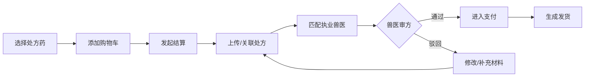

## 1. 产品概述

宠物健康全周期管理SaaS平台，覆盖C端宠主与B端直营护理门店双角色的综合型宠物医疗健康服务平台。平台提供在线预约服务、电子健康档案管理、处方药审方购买、门店运营管理、知识图谱智能问诊等核心服务，满足《动物诊疗机构管理办法》电子病历存档合规要求。

- 核心价值：打通宠主-门店-兽医三方服务链路，实现宠物全生命周期健康数据闭环管理
- 目标市场：国内一二线城市宠物主、连锁直营宠物护理门店

---

## 2. 核心功能

### 2.1 用户角色

| 角色 | 注册方式 | 核心权限 |
|------|----------|----------|
| 宠主（C端） | 手机号/微信登录 | 宠物档案管理、服务预约、商品购买、在线问诊、积分权益 |
| 门店管理员（B端） | 门店专属邀请码 | 排班调度、服务执行、库存管理、服务留痕、病历归档 |
| 执业兽医 | 执业资格认证 | 在线审方、电子病历签署、慢病跟踪管理 |
| 平台运营 | 后台管理账号 | 知识图谱维护、会员体系管理、门店监管审计 |

### 2.2 功能模块

**宠主端（8大模块）：**
1. **首页导航**：个性化推荐、服务快捷入口、健康提醒、症状自查
2. **宠物档案**：多宠物管理、品种信息、健康档案总览
3. **服务预约**：洗护/驱虫/体检/诊疗预约、门店选择、时间选择
4. **健康档案**：疫苗记录、驱虫日志、慢病跟踪、病历详情
5. **在线商城**：处方药购买、营养品选购、兽医审方
6. **在线问诊**：图文/视频问诊、专属通道
7. **会员中心**：等级权益、积分管理、订单管理
8. **症状自查**：知识图谱驱动的智能问诊路径

**门店端（7大模块）：**
1. **工作台**：今日预约、待办提醒、数据概览
2. **排班调度**：员工排班、服务时段配置、假期管理
3. **服务执行**：服务流程留痕、前后对比图上传、电子签名
4. **病历管理**：电子病历编辑、兽医签署、归档查询
5. **库存管理**：耗材入库、库存预警、批次追溯
6. **会员管理**：到店宠主档案、消费记录、服务历史
7. **数据统计**：服务量、营收、库存报表

### 2.3 页面详情

| 页面名称 | 模块名称 | 功能描述 |
|---------|---------|-----------|
| 宠主首页 | 健康仪表盘 | 宠物健康评分、下次驱虫/疫苗倒计时提醒、附近门店推荐、健康动态信息流 |
| 宠主首页 | 症状自查入口 | 基于知识图谱的症状选择器、智能推荐科室/服务 |
| 宠物档案列表 | 宠物卡片 | 多宠物切换、头像/品种/年龄/性别展示、健康状态标签 |
| 宠物档案详情 | 时间线视图 | 疫苗接种时间线、驱虫记录时间线、体重变化曲线、体重趋势图表 |
| 宠物档案详情 | 慢病跟踪卡 | 糖尿病/肾病/心脏病等慢病指标录入、兽医随访提醒 |

| 服务预约页 | 服务分类 | 洗护/美容/基础体检/深度体检/疫苗接种/驱虫服务/专科诊疗分类展示 |
| 服务预约页 | 门店选择 | 地图模式/列表模式切换、距离排序、评分展示、服务项目匹配 |
| 服务预约页 | 时段选择 | 日历+时段网格、员工选择、备注填写、优惠券选择 |
| 预约确认页 | 订单信息 | 服务明细、宠物信息、门店信息、价格明细、支付方式 |
| 健康档案页 | 疫苗记录 | 疫苗名称、接种日期、下次接种提醒、接种证明图片、兽医签字 |
| 健康档案页 | 驱虫日志 | 体内/体外驱虫、驱虫药名称、使用剂量、下次驱虫提醒 |
| 健康档案页 | 电子病历 | 按《动物诊疗机构管理办法》规范字段、诊疗经过、用药清单、兽医签名 |
| 在线商城 | 商品分类 | 处方药专区（需审方）、营养保健品、日常用品 |
| 处方药详情 | 审方流程 | 上传处方/选择历史处方、兽医在线审方状态追踪 |
| 在线问诊 | 问诊列表 | 进行中/已完成、问诊类型、医生信息 |
| 在线问诊 | 聊天界面 | 图文消息、图片上传、处方开具、病历关联 |
| 会员中心 | 等级权益 | 成长值进度条、当前等级、下一等级权益对比、专属标识 |
| 会员中心 | 积分商城 | 积分余额、积分通兑、积分兑换商品/服务 |
| 门店工作台 | 数据看板 | 今日预约数、待服务数、库存预警数、今日营收 |
| 排班调度 | 周视图排班 | 拖拽式排班、员工颜色区分、时段冲突检测 |
| 服务执行 | 服务步骤引导 | 标准化服务SOP步骤、每步确认、关键节点拍照留痕 |
| 服务执行 | 对比图上传 | 服务前/服务后图片对比、标注工具 |
| 库存管理 | 库存列表 | 实时库存、安全库存阈值、红色预警标识 |
| 库存管理 | 批次追溯 | 入库批次、效期管理、扫码出库、溯源链路查询 |
| 病历编辑 | 规范病历 | 主诉/现病史/既往史/体格检查/诊断/治疗方案/用药/医嘱 |

---

## 3. 核心流程

### 3.1 宠主预约服务流程

宠主登录系统 → 选择宠物 → 选择服务类型 → 选择附近门店 → 选择服务时段/员工 → 确认预约信息 → 选择支付方式 → 生成预约订单 → 门店接单确认 → 服务前提醒 → 到店服务 → 服务过程留痕 → 服务完成确认 → 评价/积分发放

### 3.2 处方药购买审方流程

宠主选择处方药 → 添加购物车 → 结算 → 选择/上传处方 → 系统匹配执业兽医 → 兽医在线审方 → 审方通过/驳回 → 通过则进入支付 → 订单生成 → 门店/快递发货

### 3.3 症状自查流程

选择宠物品种 → 选择年龄/性别 → 选择主要症状 → 知识图谱推理 → 展示可能疾病 → 推荐检查项目 → 推荐对应科室/服务 → 一键预约

---

## 4. 用户界面设计

### 4.1 设计风格

- **主色调**：森林绿 #2E7D5E（专业、健康、自然）
- **辅助色**：暖橙 #FF8A4C（活力、温暖）+ 薄荷绿 #8BC6A9（柔和、治愈）
- **中性色**：米白 #F7F5F0（背景）+ 深灰 #2D3436（文字）
- **按钮风格**：圆角 12px、渐变填充、微动效过渡
- **字体**：标题使用「思源宋体」（温暖专业感），正文使用「思源黑体」（清晰易读）
- **卡片风格**：大圆角 16px、柔和投影、微渐变边框
- **图标风格**：线性图标搭配彩色填充，圆润友好

### 4.2 页面设计概览

| 页面名称 | 模块名称 | UI 元素 |
|---------|---------|---------|
| 宠主首页 | 健康仪表盘 | 圆形健康评分环、渐变色进度条、卡片叠加动效、柔和背景纹理 |
| 宠主首页 | 症状自查入口 | 大尺寸快捷入口卡片、图标动画、悬浮上浮效果 |
| 宠物档案详情 | 时间线视图 | 垂直时间线、圆形节点、渐变色连接线、hover 展开动效 |
| 服务预约页 | 门店选择 | 地图+列表双视图切换、卡片式门店卡、评分星星组件、距离标签 |
| 服务预约页 | 时段选择 | 周历横滑、时段色块、选中高亮、员工头像组 |
| 在线商城 | 处方药专区 | 审方标识角标、悬浮卡片、分类图标矩阵 |
| 会员中心 | 等级权益 | 阶梯式等级卡片、发光边框、权益图标矩阵、积分粒子动效 |
| 症状自查 | 知识图谱路径 | 步骤指示器、症状标签云、疾病卡片、推荐结果渐显动画 |
| 门店工作台 | 数据看板 | 数据卡片矩阵、趋势迷你图、预警红色圆点脉冲 |
| 排班调度 | 周视图 | 网格布局、拖拽手柄、颜色编码员工、冲突高亮 |
| 服务执行 | 对比图 | 左右滑动对比、缩放标注工具、步骤进度条 |
| 库存管理 | 批次追溯 | 横向时间轴、批次卡片、扫码动画、溯源链路图 |

### 4.3 响应式设计

- **桌面优先设计（1440px）
- 平板端（1024px）：侧边栏折叠、卡片自适应网格
- 移动端（375px）：底部 Tab 导航、单列布局、触摸优化手势

### 4.4 动效规范

- 页面切换：页面淡入 + 内容错位上移（stagger 20ms）
- 卡片悬浮：上移 4px + 阴影加深
- 按钮：点击缩放 0.96 + 涟漪扩散
- 数据加载：骨架屏渐变闪烁
- 状态变更：脉冲高亮渐隐
