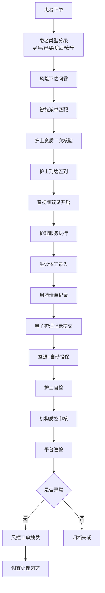

## 1. 产品概述

持证医护人员居家护理服务调度中台，严格遵循国家卫健委《互联网居家护理服务管理办法》构建的全流程合规管控系统。通过数字化手段实现护士资质核验、订单分级管控、服务过程监管、质量审核追溯及保险自动对接，确保居家护理服务全程合规可追溯。

- **核心价值**：解决居家护理行业资质难核验、过程难监管、风险难防控的痛点
- **目标用户**：护理服务机构管理人员、质控专员、平台监管人员、执业护士
- **目标市场**：国内互联网+居家护理服务市场，符合卫健委监管要求的正规机构

## 2. 核心功能

### 2.1 用户角色

| 角色 | 注册方式 | 核心权限 |
|------|----------|----------|
| 平台管理员 | 系统内置 | 全平台数据监管、机构准入审批、风控工单终审、系统配置 |
| 机构管理员 | 平台审核入驻 | 护士资质审核、订单调度、机构质控审核、数据统计 |
| 质控专员 | 机构分配 | 三级审核（机构质控环节）、护理记录抽查、异常上报 |
| 执业护士 | 机构注册+资质核验 | 接单、上传证书、签到服务、音视频录制、护理记录、自检提交 |
| 患者/家属 | APP端注册 | 下单、查看服务记录、评价反馈 |

### 2.2 功能模块

1. **数据看板**：全局运营指标、实时服务监控、风险预警展示
2. **护士资质管理**：执业证书上传、医师执业注册信息系统对接校验、资质有效期预警
3. **订单调度中心**：订单分级管控（老年/母婴/院后康复/安宁疗护）、智能派单、风险评估问卷
4. **服务过程管控**：音视频双录、电子护理记录、用药清单、生命体征录入、数据强绑定
5. **三级审核流**：护士自检、机构质控、平台巡检、审核记录追溯
6. **风控工单系统**：异常操作实时触发、工单流转、处理闭环
7. **保险对接中心**：保险公司API对接、服务开始自动投保、保单管理
8. **统计报表**：服务数据、合规数据、财务数据、风险数据多维度分析

### 2.3 页面详情

| 页面名称 | 模块名称 | 功能描述 |
|----------|----------|----------|
| 数据看板 | 运营指标卡片 | 今日订单量、在途服务、护士在线数、风险预警数 |
| 数据看板 | 实时服务地图 | 展示当前进行中的服务地理位置分布 |
| 数据看板 | 风险趋势图表 | 近7天/30天风险事件趋势折线图 |
| 数据看板 | 快捷操作入口 | 快速跳转核心功能模块 |
| 护士资质管理 | 护士列表 | 护士信息展示、资质状态筛选、搜索 |
| 护士资质管理 | 资质核验 | 证书上传预览、执业信息系统校验结果展示、状态流转 |
| 护士资质管理 | 有效期预警 | 即将到期证书列表、自动提醒配置 |
| 订单调度中心 | 订单列表 | 四类患者类型分级展示、风险等级标识、状态筛选 |
| 订单调度中心 | 订单详情 | 患者信息、服务项目、风险评估结果、派单操作 |
| 订单调度中心 | 风险评估问卷 | 标准化问卷模板、自动评分、等级判定 |
| 订单调度中心 | 智能派单 | 基于距离、资质、档期的匹配推荐 |
| 服务过程管控 | 服务执行面板 | 签到/签退、音视频录制控制、实时状态 |
| 服务过程管控 | 电子护理记录 | 结构化护理文书模板、时间戳签名 |
| 服务过程管控 | 用药/体征录入 | 用药清单核对、生命体征多维度录入 |
| 服务过程管控 | 数据绑定验证 | 录像-记录-用药-体征关联校验 |
| 三级审核流 | 待办审核列表 | 按角色展示待审核任务、优先级排序 |
| 三级审核流 | 审核工作台 | 多维度材料对比、批注、通过/驳回操作 |
| 三级审核流 | 审核追溯 | 完整审核链路记录、操作日志 |
| 风控工单系统 | 工单列表 | 异常类型分类、紧急程度标识、状态追踪 |
| 风控工单系统 | 工单处理 | 异常详情、证据链、处理记录、结果归档 |
| 风控工单系统 | 规则配置 | 异常规则定义、阈值调整、通知配置 |
| 保险对接中心 | 保单列表 | 投保状态、保单号、保险公司、保费信息 |
| 保险对接中心 | 自动投保配置 | 投保规则、险种映射、保险公司API设置 |
| 保险对接中心 | 理赔对接 | 出险报案、理赔材料上传、状态追踪 |
| 统计报表 | 服务统计 | 订单量、服务时长、患者类型分布 |
| 统计报表 | 合规统计 | 资质合规率、审核通过率、录像完整率 |
| 统计报表 | 风险统计 | 风险事件类型、处理时效、重复发生率 |

## 3. 核心流程

### 3.1 护士入驻资质核验流程
护士提交入驻申请并上传执业证书→系统自动对接医师执业注册信息系统→核验通过进入机构审核→机构人工复核→资质生效可接单→临近有效期系统自动预警

### 3.2 服务订单全流程
患者/家属下单→系统根据患者类型自动分级→触发对应风险评估问卷→护士端自动匹配派单→护士接单并前往服务点→到达签到（GPS定位核验）→开启音视频双录→执行护理服务→录入生命体征→记录用药清单→提交电子护理记录→服务结束签退→护士自检提交→机构质控审核→平台巡检抽查→全流程归档

### 3.3 风控异常处理流程
系统实时监测异常行为（超范围操作/未签到服务/录像中断等）→自动生成风控工单并推送相关责任人→质控专员介入调查核实→依据证据链做出处理决定→结果归档并计入护士信用档案→严重违规触发资质冻结

## 4. 用户界面设计

### 4.1 设计风格
- **主色调**：医疗蓝 `#1E6FD9`（专业信任）+ 生命绿 `#10B981`（安全健康）
- **辅助色**：预警橙 `#F59E0B` + 风险红 `#EF4444` + 信息灰 `#64748B`
- **背景色**：浅色渐变背景，主区 `#F8FAFC`，卡片纯白 `#FFFFFF`
- **按钮风格**：圆角8px，中等高度，悬浮微放大+阴影过渡
- **字体**：中文使用「思源黑体 Source Han Sans」，英文使用「Inter」，标题半粗，正文常规
- **布局风格**：左侧导航栏+顶部面包屑+主内容区的经典中台布局，卡片式模块化设计
- **图标风格**：Lucide图标库，线性风格，统一24px基础尺寸

### 4.2 页面设计概述

| 页面名称 | 模块名称 | UI元素 |
|----------|----------|--------|
| 数据看板 | 顶部指标卡 | 渐变背景卡片+图标+大数字+环比趋势箭头 |
| 数据看板 | 风险趋势图 | ECharts折线图+双Y轴+渐变填充区域 |
| 数据看板 | 服务地图 | 城市分布热力图+动态服务点标记 |
| 护士资质 | 资质核验卡 | 证书缩略图+核验状态徽章+进度时间轴 |
| 订单调度 | 订单分级卡 | 四类患者类型专属配色标识+风险等级色块 |
| 订单调度 | 风险问卷 | 题目进度条+选项卡片+实时分值提示 |
| 服务管控 | 录制面板 | 录制状态环形进度+计时器+音轨波形动效 |
| 服务管控 | 体征录入 | 血压/心率/体温等彩色仪表盘输入控件 |
| 审核流 | 审核工作台 | 左右分栏对比视图+批注浮窗+时间轴追溯 |
| 风控中心 | 工单列表 | 紧急程度色条+异常类型图标+状态流转标签 |
| 保险中心 | 保单卡片 | 电子保单样式+防伪水印+保险公司Logo |

### 4.3 响应式
- **设计模式**：Desktop-first 桌面端优先，适配 1440px、1920px 主流分辨率
- **平板适配**：≥1024px 保持完整功能，侧边栏可折叠
- **触控优化**：关键操作按钮最小触控区域 44x44px，列表行高≥48px
- **表单优化**：日期/时间选择器优化触控交互，下拉框支持搜索过滤

### 4.4 动效与交互
- 页面加载：侧边栏+顶部导航先渲染，主内容区卡片错落渐入
- 数据看板：数字滚动动画，图表绘制动画
- 录制面板：录制时红色指示灯呼吸动效+波形动画
- 审核流：状态流转时徽章色彩过渡+右侧时间轴进度动画
- 风控告警：新工单弹出时边框闪烁+轻微震动反馈
