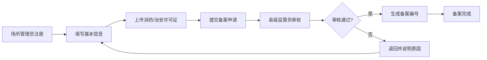
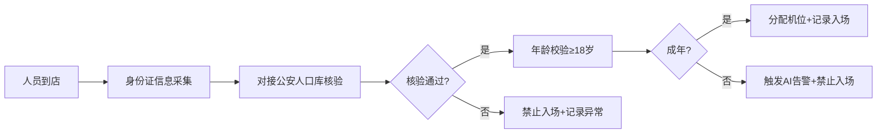
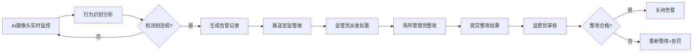
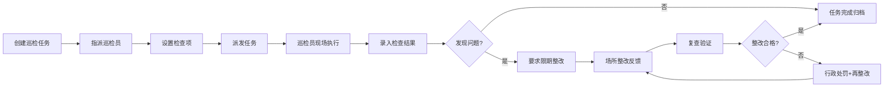

## 1. 产品概述

山东省文旅场所智慧监管服务平台是面向全省网吧等文化经营单位的一体化智慧监管系统，通过信息化手段实现场所备案、人员核验、预约分流、AI告警、巡检管理和经营数据分析的全流程闭环管理，满足等保三级安全要求，为各级文旅监管部门提供穿透式数据决策支撑。

- 解决传统监管手段滞后、人工巡查效率低、违规行为发现不及时等痛点问题
- 目标用户包括：省/市/县三级文旅监管人员、网吧等经营场所管理员、系统运维人员
- 市场价值：实现"互联网+监管"模式创新，提升文旅行业治理能力现代化水平

## 2. 核心功能

### 2.1 用户角色

| 角色 | 注册方式 | 核心权限 |
|------|----------|----------|
| 省级监管员 | 系统管理员分配 | 全省数据总览、跨区域调度、统计分析报表、系统配置管理 |
| 市级监管员 | 系统管理员分配 | 本市数据看板、辖区场所管理、巡检任务派发、告警处置 |
| 县级监管员 | 系统管理员分配 | 本县场所监管、日常巡检执行、违规告警处理、数据上报审核 |
| 场所管理员 | 线上注册+审核通过 | 场所信息备案、预约管理、实名核验、经营数据查看、告警接收 |
| 系统管理员 | 内置账号 | 用户管理、角色权限、日志审计、系统维护、等保合规配置 |

### 2.2 功能模块

1. **登录认证页**：双因素认证、密码强度校验、登录日志记录、会话超时管理
2. **监管数据大屏**：全省概览、地图热力、实时告警、核心指标、穿透式下钻分析
3. **场所备案管理**：基本信息录入、消防/治安许可证上传、备案审核、变更管理、注销管理
4. **实名核验管理**：身份信息采集、公安人口库对接、核验记录查询、异常人员预警
5. **预约分流管理**：时段配置、人数限流、预约申请、预约核销、客流统计
6. **AI告警中心**：吸烟检测告警、未成年人入内告警、告警处置、告警统计、AI模型配置
7. **巡检任务管理**：任务派发、巡检执行、结果回传、整改跟踪、巡检考核
8. **经营数据分析**：上网时长统计、人次分析、地域分布、趋势报表、自动上报
9. **系统管理**：用户管理、角色权限、操作日志、安全审计、等保合规配置

### 2.3 页面详情

| 页面名称 | 模块名称 | 功能描述 |
|----------|----------|----------|
| 登录认证页 | 登录表单 | 用户名/密码登录、短信验证码双因素、记住密码、忘记密码 |
| 登录认证页 | 安全提示 | 等保三级安全提示、密码复杂度要求、上次登录信息展示 |
| 监管数据大屏 | 概览指标卡 | 场所总数、在线数、今日客流、告警数、巡检完成率等核心KPI |
| 监管数据大屏 | 地图可视化 | 山东省行政地图、场所分布热力、点击下钻到市/县/单个场所 |
| 监管数据大屏 | 实时告警流 | 最新告警滚动展示、告警级别颜色区分、快捷处置入口 |
| 监管数据大屏 | 趋势图表 | 客流趋势、告警趋势、场所活跃度趋势等多维度图表 |
| 监管数据大屏 | 穿透分析 | 省→市→县→场所四级数据穿透、联动筛选、维度切换 |
| 场所备案管理 | 备案列表 | 分页查询、多条件筛选、状态标签、快捷操作 |
| 场所备案管理 | 备案详情 | 完整信息展示、证件预览、审核记录、变更历史 |
| 场所备案管理 | 新增/编辑 | 表单分步引导、证件上传、表单校验、草稿保存 |
| 实名核验管理 | 核验记录 | 核验日志、人员信息、核验结果、异常标记 |
| 实名核验管理 | 人员库对接 | 公安人口库对接配置、接口状态监控、异常重试 |
| 预约分流管理 | 预约配置 | 时段设置、人数上限、节假日配置、限流策略 |
| 预约分流管理 | 预约列表 | 预约查询、状态管理、核销操作、取消预约 |
| AI告警中心 | 告警列表 | 告警级别筛选、时间范围、告警类型、处置状态 |
| AI告警中心 | 告警详情 | 抓拍图片、AI分析结果、场所信息、处置流程 |
| AI告警中心 | 告警处置 | 告警派单、处理结果录入、整改跟踪、关闭告警 |
| 巡检任务管理 | 任务列表 | 任务状态、派发时间、巡检员、完成情况 |
| 巡检任务管理 | 任务派发 | 选择巡检员、设置截止时间、添加检查项、附件上传 |
| 巡检任务管理 | 巡检执行 | 检查项勾选、现场拍照、问题描述、位置打卡 |
| 经营数据分析 | 数据报表 | 上网时长、人次、地域分布、同比环比分析 |
| 经营数据分析 | 自动上报 | 上报配置、上报日志、补报操作、数据审核 |
| 系统管理 | 用户管理 | 用户增删改查、角色分配、账号状态管理 |
| 系统管理 | 角色权限 | 角色定义、菜单权限、数据权限、操作权限配置 |
| 系统管理 | 日志审计 | 登录日志、操作日志、安全日志、查询导出 |
| 系统管理 | 等保配置 | 密码策略、会话管理、数据加密、备份恢复配置 |

## 3. 核心流程

### 3.1 场所备案流程
场所管理员在线注册并提交基本信息，上传消防许可证和治安许可证，县级监管员审核材料完整性和合规性，审核通过后生成备案编号，场所正式纳入监管范围。

### 3.2 实名核验流程
上网人员到店后，场所管理员通过设备采集身份证信息，系统自动对接公安人口库进行核验，核验通过后分配机位，核验不通过则禁止入场并记录异常。

### 3.3 AI告警处置流程
AI摄像头实时检测场所内吸烟和未成年人入内行为，检测到违规后立即生成告警并推送至监管端，县级监管员接收告警后派发处置任务，场所管理员整改后反馈结果，监管员审核后关闭告警。

### 3.4 巡检任务流程
市级监管员创建巡检任务并指派给县级巡检员，巡检员现场执行检查并录入结果，发现问题则要求场所整改，整改完成后复查，任务闭环归档。

## 4. 用户界面设计

### 4.1 设计风格

**设计定位：政务科技风，专业、严谨、可信赖**

- **主色调**：政务蓝 `#165DFF`，体现政府监管的权威性和专业性
- **辅助色**：警示红 `#F53F3F`、成功绿 `#00B42A`、警告橙 `#FF7D00`、信息青 `#0FC6C2`
- **中性色**：深灰 `#1D2129`、中灰 `#4E5969`、浅灰 `#C9CDD4`、背景灰 `#F2F3F5`
- **按钮风格**：圆角6px，主按钮立体阴影，悬停微交互，禁用状态灰度
- **字体体系**：
  - 标题字体：`PingFang SC Medium`，字号24px/20px/18px/16px
  - 正文字体：`PingFang SC Regular`，字号14px/13px/12px
  - 数字字体：`DIN Alternate` 等宽数字字体，用于数据大屏指标展示
- **布局风格**：
  - 左侧导航 + 顶部Header + 主内容区的经典政务布局
  - 数据大屏采用全屏沉浸式布局，多区块网格化展示
  - 卡片式内容容器，层次分明的阴影体系
- **图标风格**：线性图标 `@ant-design/icons`，统一24px/20px/16px规格，颜色与语义匹配

### 4.2 页面设计概述

| 页面名称 | 模块名称 | UI元素 |
|----------|----------|--------|
| 登录认证页 | 登录表单 | 渐变背景、玻璃拟态卡片、动效输入框、加载动画、安全认证标识 |
| 监管数据大屏 | 概览指标卡 | 深色科技感背景、数字滚动动效、边框光效、图标微动效、告警脉冲 |
| 监管数据大屏 | 地图可视化 | 分层设色地图、热力点扩散动画、飞线动效、下钻过渡动画 |
| 监管数据大屏 | 实时告警流 | 滚动列表、级别颜色标识、新告警滑入动效、闪烁提示 |
| 监管数据大屏 | 趋势图表 | ECharts渐变色图表、动画加载、数据更新过渡、悬浮高亮 |
| 场所备案管理 | 备案列表 | 表格斑马纹、状态徽标、行悬停高亮、操作列抽屉、分页器 |
| 场所备案管理 | 新增/编辑 | 分步进度条、表单校验提示、上传预览、保存成功动效 |
| AI告警中心 | 告警列表 | 时间线布局、级别色条、抓拍缩略图、处置进度条 |
| AI告警中心 | 告警详情 | 图片轮播、AI分析标注、处置流程节点、时间戳记录 |
| 巡检任务管理 | 任务列表 | 甘特图视图、状态时间轴、优先级标签、执行人头像 |
| 经营数据分析 | 数据报表 | 多图表联动、维度切换标签、数据下钻、导出按钮 |
| 系统管理 | 权限配置 | 树形权限结构、勾选交互、角色卡片、权限预览 |

### 4.3 响应式设计

- **设计原则**：Desktop-first，重点适配1920×1080政务大屏，兼容1366×768及以上分辨率
- **大屏适配**：数据大屏使用视口单位vw/vh，支持全屏展示，自动适配不同分辨率
- **侧边导航**：可折叠收起，宽度240px/64px两档切换
- **表格响应**：小分辨率下表格支持横向滚动，固定首列和操作列
- **触控优化**：按钮最小点击区域44×44px，表单输入框适配触控操作

### 4.4 数据可视化规范

- **地图可视化**：使用ECharts GeoJSON山东省地图，支持三级下钻
- **图表类型**：
  - 趋势分析：折线图、面积图
  - 占比分析：环形图、玫瑰图
  - 对比分析：柱状图、分组条形图
  - 地域分析：热力地图、分级统计地图
  - 实时流：滚动列表、跑马灯、数字滚动
- **配色方案**：图表采用渐变色填充，对比色区分不同维度
- **动画效果**：图表加载动画、数据更新过渡动画、悬浮高亮提示

## 5. 安全合规设计

### 5.1 等保三级要求

- **身份鉴别**：双因素认证、密码复杂度、登录失败锁定、会话超时30分钟
- **访问控制**：基于角色的访问控制(RBAC)、数据权限隔离、最小权限原则
- **安全审计**：全量操作日志留存6个月以上、日志不可篡改、审计报表
- **数据完整性**：传输加密(HTTPS)、存储加密、数字签名、校验码
- **数据保密性**：敏感数据脱敏展示、身份证号掩码、传输加密
- **防病毒**：文件上传病毒扫描、恶意代码检测
- **备份恢复**：每日增量备份、每周全量备份、异地容灾、恢复演练
- **应急响应**：告警分级、应急预案、7×24小时监控

### 5.2 数据脱敏规则

| 数据类型 | 脱敏规则 | 示例 |
|----------|----------|------|
| 身份证号 | 前6后4，中间用*代替 | 370101********1234 |
| 手机号 | 前3后4，中间用*代替 | 138****8888 |
| 姓名 | 保留姓氏，其余用*代替 | 张*明 |
| 住址 | 保留到区县一级，其余省略 | 山东省济南市历下区*** |
