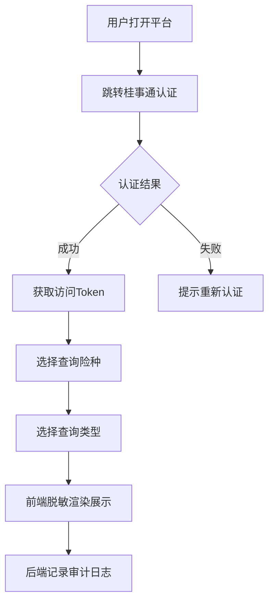
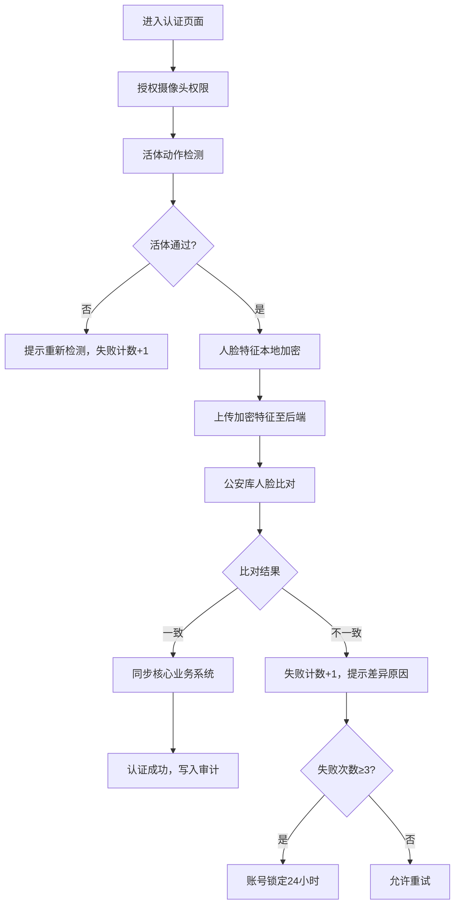

## 1. 产品概述

省级人社公共服务可信数字平台是面向广西壮族自治区参保人员的一站式社保服务门户，集成社保权益查询、线上生存认证等核心功能，对接广西政务云"桂事通"身份认证体系与国家社会保险公共服务平台，为参保群众提供安全、便捷、可信的数字化人社服务。

- 核心目标：解决参保群众办事跑多趟、认证线下排队、社保信息不透明等痛点
- 目标用户：广西全区城镇职工/城乡居民参保人员、人社系统管理员

## 2. 核心功能

### 2.1 用户角色

| 角色 | 注册方式 | 核心权限 |
|------|----------|----------|
| 参保用户 | 桂事通实名认证 | 社保权益查询、生存认证、个人中心 |
| 管理后台操作员 | 工号+UKey登录 | 数据统计、任务管理、审计日志查看 |
| 系统管理员 | 管理员账号+双因素认证 | 用户管理、权限配置、系统设置 |

### 2.2 功能模块

1. **用户端首页**：身份认证入口、快捷功能导航、个人信息概览、政策公告
2. **社保权益查询页**：养老/失业/工伤/生育四险种切换、缴费明细、待遇发放、账户余额、同比/环比对比图表
3. **线上生存认证页**：活体检测引导、人脸识别采集、公安库比对进度、认证结果展示
4. **管理后台首页**：数据概览看板、认证通过率趋势图
5. **高频查询统计页**：TOP10查询事项排名、时段分布热力图
6. **定向提醒任务页**：未认证人员筛选、批量提醒、任务跟踪

### 2.3 页面详情

| 页面名称 | 模块名称 | 功能描述 |
|----------|----------|----------|
| 用户端首页 | 桂事通登录区 | 跳转广西政务云统一身份认证，获取Token |
| 用户端首页 | 快捷功能卡片 | 社保查询、生存认证、政策咨询、办事指南入口 |
| 用户端首页 | 个人信息栏 | 脱敏姓名、社保卡号脱敏、参保状态 |
| 社保权益查询页 | 险种Tab切换 | 养老/失业/工伤/生育四大险种一键切换 |
| 社保权益查询页 | 账户余额卡片 | 个人账户累计存储额、统筹基金展示 |
| 社保权益查询页 | 缴费明细表格 | 按月/按季度/按年度筛选，分页展示 |
| 社保权益查询页 | 待遇发放记录 | 发放日期、发放项目、发放金额、到账状态 |
| 社保权益查询页 | 同比环比图表 | 柱状图对比缴费基数与金额变化趋势 |
| 线上生存认证页 | 认证引导步骤 | 准备工作→活体检测→人脸采集→结果反馈四步流 |
| 线上生存认证页 | 活体检测区 | 摄像头调用、眨眼/摇头/张嘴动作指令 |
| 线上生存认证页 | 进度提示条 | 公安库比对进度、业务系统同步状态 |
| 线上生存认证页 | 失败锁定提示 | 失败次数累计、锁定倒计时、解锁指引 |
| 管理后台首页 | 数据看板 | 今日认证数、通过率、查询量、活跃用户数 |
| 管理后台首页 | 通过率趋势图 | 近30天折线图，区分成功/失败/锁定 |
| 高频查询统计页 | TOP10排名表 | 查询事项、查询次数、占比、环比变化 |
| 定向提醒任务页 | 人员筛选区 | 按地区/年龄/险种/逾期天数筛选 |
| 定向提醒任务页 | 任务创建流 | 选择人群→编辑短信模板→发送→跟踪进度 |
| 定向提醒任务页 | 任务列表 | 任务状态、发送量、已读率、认证转化率 |

## 3. 核心流程

### 3.1 社保权益查询流程

参保用户通过桂事通认证登录平台，选择险种和查询类型（缴费明细/待遇发放/账户余额），前端发起带Token的API请求，后端校验权限后调用国家社保公共服务平台接口，数据返回前端脱敏展示，同时记录操作审计日志。

### 3.2 线上生存认证流程

用户进入认证页面，前端完成活体检测动作序列，采集人脸特征数据本地加密后（仅传加密哈希值至后端），后端调用公安库比对接口，比对成功后实时同步核心业务系统，认证结果返回前端展示；三次失败自动锁定账号24小时。

## 4. 用户界面设计

### 4.1 设计风格

- **主色调**：政务蓝 `#0A5CAF`（信任、权威），辅助色 `#1890FF`（交互）、`#52C41A`（成功）、`#F5222D`（警示）
- **背景色**：渐变蓝色天幕 `linear-gradient(135deg, #E6F2FF 0%, #F5FAFF 100%)`
- **按钮风格**：圆角8px，主按钮采用政务蓝渐变，按下时微缩动画
- **字体**：标题"思源宋体"（庄重），正文"PingFang SC/系统无衬线字体"（清晰易读）
- **布局风格**：顶部导航栏 + 侧边功能菜单 + 卡片化内容区，管理后台采用深色侧边栏搭配浅色内容区
- **装饰元素**：壮锦纹样微纹理背景（体现广西地域文化）、水滴状数据卡片圆角（流畅曲线）

### 4.2 页面设计概览

| 页面名称 | 模块名称 | UI元素 |
|----------|----------|--------|
| 用户端首页 | 登录引导Banner | 渐变背景、壮锦边框装饰、动态粒子光效 |
| 用户端首页 | 功能导航卡片 | 悬浮阴影、hover放大、图标微动画 |
| 社保权益查询页 | 险种Tab栏 | 胶囊形切换、选中态蓝色下划条 |
| 社保权益查询页 | 数据图表 | 渐变填充柱状图、数据标签悬浮提示 |
| 线上生存认证页 | 摄像头取景框 | 动态扫描线、角标装饰线、进度光环 |
| 线上生存认证页 | 动作指令卡片 | 脉冲动画提示、图标+文字分步引导 |
| 管理后台首页 | 数据看板卡片 | 深色背景、发光数字、趋势小箭头 |
| 定向提醒任务页 | 任务进度条 | 分段进度、状态节点高亮 |

### 4.3 响应式设计

- **桌面端优先**：1440px基准栅格，12列布局，适配1920px大屏
- **平板适配**：1024px断点，侧边栏折叠为汉堡菜单，卡片两列布局
- **移动端适配**：768px断点，底部Tab导航，单列卡片堆叠，触摸按钮≥44px
- **触摸优化**：关键操作区增大点击热区，滑动手势切换险种Tab

### 4.4 动效设计指导

- **页面加载**：卡片从上至下错位渐入，stagger延迟100ms
- **图表加载**：柱状图从底部向上生长动画，曲线绘制动画
- **认证引导**：摄像头区域呼吸光环，动作指令脉冲提示
- **数据脱敏**：敏感字段遮罩渐变揭示，hover临时显示（需二次验证）
- **管理后台**：数字滚动计数动画、趋势箭头浮动
