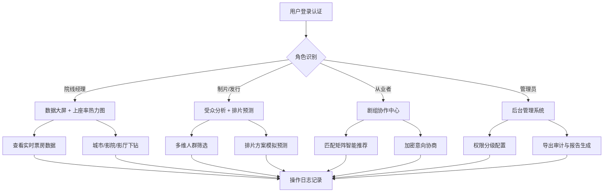

## 1. 产品概述

影视产业专业数据决策支持系统（Cinema Intelligence Platform, CIP）是面向制片方、发行方、院线经理与影视从业者的一站式数据智能平台。系统通过接入猫眼全量消费行为数据，提供秒级票房监控、智能排片预测、受众画像分析、剧组协作匹配等核心能力，助力行业决策者基于数据驱动做出精准商业判断。

- **核心价值**：解决影视行业数据分散、决策凭经验、排片靠感觉、协作效率低等痛点
- **目标用户**：制片方决策层、发行公司、影院/院线经理、影视剧组主创人员
- **市场定位**：国内领先的影视产业垂直领域SaaS数据智能平台

## 2. 核心功能

### 2.1 用户角色

| 角色 | 注册方式 | 核心权限 |
|------|----------|----------|
| 制片方用户 | 企业认证注册 | 票房监控、受众分析、报告订阅、剧组匹配（高级） |
| 发行方用户 | 企业认证注册 | 排片预测、竞品分析、上座率热力图、定制API |
| 院线经理 | 影院资质认证 | 秒级票房、排片建议、上座率下钻、影院对比 |
| 从业者 | 个人实名认证 | 剧组协作、职位匹配、作品背书、合作意向 |
| 平台管理员 | 内部账号 | 权限管理、数据分级、审计日志、系统配置 |

### 2.2 功能模块

1. **数据大屏Dashboard**：实时票房总览、秒级数据采集管道、KPI卡片矩阵、24h趋势图、档期热度榜
2. **排片预测中心**：档期热度分析、竞品表现对比、影院历史数据模型、排片方案模拟、收益预测
3. **上座率热力图**：全国城市热力、影院维度下钻、影厅时段分布、黄金场次识别
4. **受众分析中心**：多维交叉筛选器、人群画像雷达图、观影偏好分析、相似影片人群迁移桑基图
5. **剧组协作中心**：角色/职位/档期三维匹配矩阵、剧组资料可信认证、合作意向加密协商通道
6. **后台管理系统**：数据权限分级管理、导出合规审计日志、行业报告自动化生成器（周报/月报/档期专报）

### 2.3 页面详情

| 页面名称 | 模块名称 | 功能描述 |
|----------|----------|----------|
| 数据大屏 | 实时票房卡片 | 当日实时票房、累计票房、人次、场均人次、上座率，秒级刷新动效 |
| 数据大屏 | 采集管道监控 | Webhook接入状态、数据延迟监控、异常告警指示 |
| 数据大屏 | 24h趋势图表 | 分时票房曲线、同档期对比、影史同期参考线 |
| 数据大屏 | 档期热度榜 | TOP10影片实时排名、涨跌指示、票房占比环形图 |
| 排片预测 | 档期热度分析 | 节假日/档期指数、历史同期表现、供需关系模型 |
| 排片预测 | 竞品对比矩阵 | 同档期影片类型/阵容/宣发投入/预期票房四维对比 |
| 排片预测 | 智能排片模拟 | 多方案对比、调整排片占比、实时测算收益预期 |
| 上座率热力图 | 全国城市热力 | 中国地图着色热力图、省份排名、城市筛选 |
| 上座率热力图 | 影院下钻分析 | 影院列表、影厅分布、时段热力矩阵、黄金场次标记 |
| 受众分析 | 多维交叉筛选 | 性别/年龄/地域/观影频次/偏好类型五维筛选器，实时联动 |
| 受众分析 | 人群画像雷达 | 六维画像雷达图（消费力/频次/偏好广度/社交度/忠诚度/决策周期） |
| 受众分析 | 人群迁移分析 | 相似影片人群迁移桑基图、重叠度分析、获客成本测算 |
| 剧组协作 | 匹配矩阵 | 角色×职位×档期三维匹配热力矩阵、智能推荐算法 |
| 剧组协作 | 可信认证 | 出品方背书徽章、过往作品验证链、实名认证状态 |
| 剧组协作 | 加密协商 | 端到端加密意向沟通、电子签名、合作条款版本管理 |
| 后台管理 | 权限分级 | 公开数据/订阅数据/定制API三级权限配置、角色权限矩阵 |
| 后台管理 | 审计日志 | 数据导出全链路追溯、操作人/时间/数据范围/用途记录 |
| 后台管理 | 报告生成 | 周报/月报/档期专报模板配置、自动化定时生成与推送 |

## 3. 核心流程

用户进入系统后，根据角色权限进入对应工作台。院线经理可实时监控秒级票房与上座率热力图，通过排片预测模型优化排片方案；制片方与发行方利用受众分析模块洞察目标人群，通过人群迁移分析评估竞品影响；剧组主创使用协作中心完成人才匹配与项目对接；系统管理员维护数据权限、审核导出操作并生成行业报告。

## 4. 用户界面设计

### 4.1 设计风格

- **主色调**：深邃星空蓝 `#0A1628`（数据大屏背景）、科技金 `#D4AF37`（核心指标强调）、院线红 `#C0392B`（票房/热度指示）
- **辅助色**：翡翠绿 `#10B981`（增长/正向）、琥珀橙 `#F59E0B`（预警/中性）、深空灰 `#1F2937`（卡片/面板）
- **按钮风格**：扁平极简风格，2px圆角，悬停时0.2s渐变色过渡+轻微上浮动效
- **字体排版**：主标题使用 "Noto Serif SC" 衬线体体现专业权威感，数据数字使用 "JetBrains Mono" 等宽字体保证可读性，正文使用 "Noto Sans SC" 无衬线体
- **布局风格**：左侧固定导航栏+顶部状态栏+主内容区三栏布局，数据大屏采用深色科技感沉浸式设计
- **图标风格**：lucide-react线性图标，统一24px尺寸，强调色填充关键图标

### 4.2 页面设计概览

| 页面名称 | 模块名称 | UI元素 |
|----------|----------|----------|
| 数据大屏 | 实时KPI矩阵 | 深色卡片+金色数字+脉冲刷新动画+微渐变边框 |
| 数据大屏 | 趋势图表 | ECharts深色主题+面积图渐变+多系列可交互图例 |
| 数据大屏 | 档期榜单 | 动态排名切换+涨跌箭头动画+环形占比图 |
| 排片预测 | 竞品矩阵 | 雷达图对比+可切换维度Tab+置信区间展示 |
| 上座率热力图 | 全国热力 | 地图着色+hover气泡详情+钻取路径面包屑 |
| 上座率热力图 | 时段矩阵 | 色块热力+tooltip详情+黄金场次高亮边框 |
| 受众分析 | 筛选面板 | 五维联动筛选器+标签胶囊+已选条件回溯区 |
| 受众分析 | 迁移桑基 | 节点可拖拽+连线流量映射+路径高亮交互 |
| 剧组协作 | 匹配矩阵 | 3D热力透视+智能推荐Top标签+一键发起协作 |
| 后台管理 | 审计日志 | 时间轴视图+可筛选搜索+详情抽屉 |

### 4.3 响应式设计

- **优先策略**：Desktop-first设计，适配1920×1080/2560×1440专业大屏显示
- **平板适配**：≥1024px，侧边栏收起为图标模式，图表自动缩放
- **移动适配**：≥768px，导航转为底部TabBar，数据卡片纵向堆叠，图表单列展示
- **触控优化**：热力图支持双指缩放，筛选面板滑动操作，按钮最小触控区44×44px
