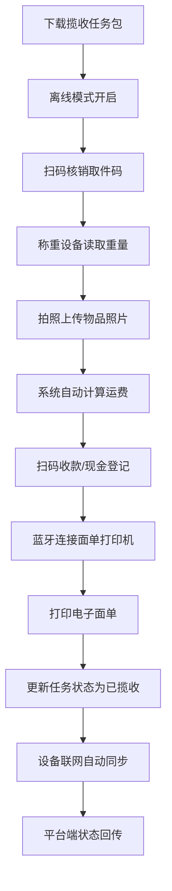
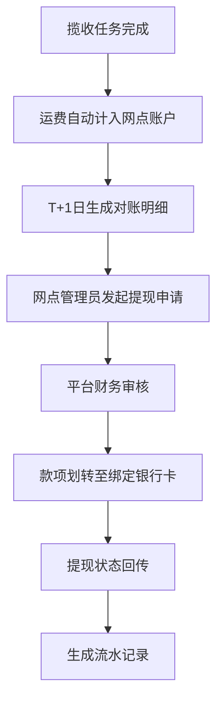
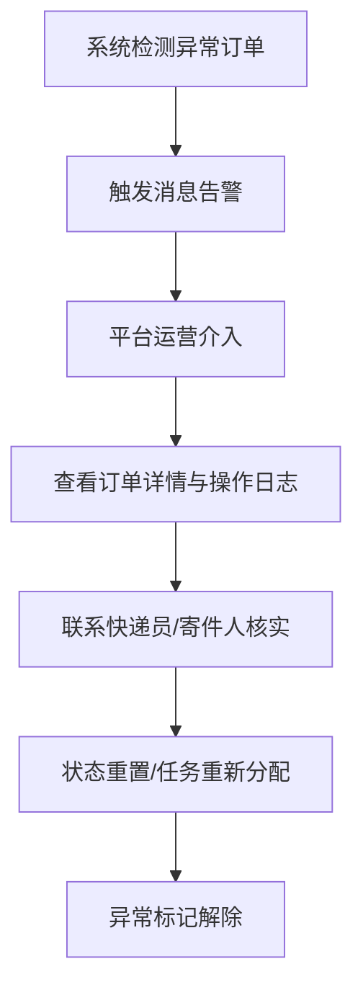

## 1. 产品概述

快递员上门揽收作业管理系统是电商平台履约侧面向B端用户的作业管理工具，核心解决快递网点揽收作业数字化、流程标准化、财务透明化的痛点。系统服务于三类角色：快递员、网点管理员、平台运营，通过离线揽收操作、多网点消息中枢、财务对账中心三大核心模块，实现从订单分配到资金结算的全链路管理。

### 产品价值
- **效率提升**：离线揽收作业流程标准化，扫码-称重-收款-打印全流程数字化，减少人工操作错误。
- **资金透明**：面单账户余额实时管控、运费自动计算、T+1对账提现，确保财务链路可追溯。
- **多角色协同**：快递员专注作业、管理员配置资源、平台运营全局管控，权限隔离保障数据安全。

---

## 2. 核心功能

### 2.1 用户角色与权限

| 角色 | 注册方式 | 核心权限 |
|------|----------|----------|
| 快递员 | 网点管理员创建，资质认证后激活 | 仅查看和操作本人任务；离线揽收全流程操作；查看个人收入明细 |
| 网点管理员 | 平台运营创建，网点认证后激活 | 面单账户额度配置与充值；快递员资质管理；揽收任务分配；网点数据看板 |
| 平台运营 | 平台内部账号体系 | 全局数据看板；异常订单干预；多网点消息通知；系统配置管理 |

### 2.2 功能模块

1. **登录页**：角色身份认证、设备指纹绑定、离线模式切换
2. **工作台总览**：今日揽收任务统计、实时消息提醒、快捷操作入口
3. **揽收任务管理**：任务列表、任务详情、任务状态流转、离线操作同步
4. **订单管理**：寄件订单列表、订单详情、地址与预约时段管理
5. **离线揽收作业**：扫码核销、称重拍照、运费收款、面单打印、状态回传
6. **电子面单账户**：余额查询、充值记录、模板配置、面单打印日志
7. **消息中心**：催揽提醒、面单余额告警、临时停收通知、系统公告
8. **财务对账中心**：按日收入明细、运费计算规则、银行卡绑定、T+1提现流水
9. **快递员管理**：资质认证、所属网点分配、设备指纹管理、业绩统计
10. **全局数据看板**：全网揽收效率、异常订单监控、网点排名、收入趋势

### 2.3 页面详情

| 页面名称 | 模块名称 | 功能描述 |
|----------|----------|----------|
| 登录页 | 身份认证 | 账号密码登录、角色自动识别、设备指纹绑定、记住登录状态 |
| 工作台 | 数据概览 | 今日待揽收/已完成/异常数量统计、实时消息轮播、快捷操作卡片 |
| 揽收任务列表 | 任务管理 | 任务筛选（按状态/时段/优先级）、批量分配、任务详情跳转 |
| 揽收任务详情 | 作业执行 | 订单信息展示、取件码验证、核重校验、运费计算、面单打印 |
| 离线揽收作业 | 离线操作 | 扫码枪接入、称重设备数据读取、拍照上传、离线数据缓存、联网自动同步 |
| 寄件订单列表 | 订单管理 | 订单查询、地址管理、预约时段调整、物品信息编辑 |
| 电子面单账户 | 账户管理 | 余额实时显示、充值记录查询、面单模板编辑、打印日志追溯 |
| 消息中心 | 消息推送 | 分类消息列表、未读标记、消息详情、一键处理跳转 |
| 财务对账 | 收入明细 | 按日聚合收入、运费明细拆解、提现申请、流水查询 |
| 银行卡管理 | 提现配置 | 银行卡绑定、实名认证、默认卡设置、提现记录 |
| 快递员管理 | 人员管理 | 快递员列表、资质审核、网点分配、设备指纹管理 |
| 全局看板 | 运营监控 | 全网揽收热力图、实时效率指标、异常订单预警、网点排名 |

---

## 3. 核心业务流程

### 3.1 离线揽收作业流程

快递员携带移动设备到达寄件地址，在无网络环境下完成全流程作业，联网后自动回传数据：

### 3.2 财务对账与提现流程

### 3.3 异常订单干预流程

---

## 4. 用户界面设计

### 4.1 设计风格

**整体定位**：工业级B端管理系统，强调专业、高效、可靠。采用"深蓝工业风"设计语言，体现物流行业的稳重感与科技感。

**配色方案**：
- **主色调**：深海蓝 `#0F2B5B` — 代表专业与可靠，用于导航栏、标题栏、关键操作按钮
- **辅助色**：活力橙 `#FF6B35` — 用于强调、提醒、待处理状态；科技青 `#00B4D8` — 用于成功状态、数据可视化
- **中性色**：炭灰 `#1A1A2E` 深灰 `#2D3748` 中灰 `#4A5568` 浅灰 `#A0AEC0` 灰白 `#F7FAFC`
- **状态色**：成功绿 `#10B981` 警告黄 `#F59E0B` 错误红 `#EF4444` 信息蓝 `#3B82F6`

**字体选择**：
- 标题字体：`'Space Grotesk'` — 科技感无衬线字体，用于页面标题、数据大屏数字
- 正文字体：`'Inter'` — 高可读性无衬线字体，用于正文、表格、表单
- 等宽字体：`'JetBrains Mono'` — 用于单号、金额、代码等需要对齐的内容

**按钮风格**：
- 主按钮：深海蓝渐变背景，圆角4px，悬停上浮效果（阴影+轻微位移），点击有按压反馈
- 次级按钮：透明背景+蓝色边框，悬停背景浅蓝
- 危险按钮：红色渐变背景，圆角4px
- 按钮高度统一为36px，大按钮44px，小按钮28px

**布局风格**：
- 左侧固定导航栏（240px宽），顶部状态栏（56px高），右侧内容区自适应
- 卡片式布局，卡片间距16px，内边距24px
- 表格采用斑马纹行，悬停高亮，固定表头可滚动
- 深色侧边栏+浅色内容区的经典B端布局，带细微渐变和阴影层次

**图标风格**：
- 统一使用 Lucide 图标库，线条粗细1.5px
- 图标与文字间距8px，大小16px/20px/24px三档
- 状态图标使用填充色，操作图标使用线框+悬停填充

### 4.2 页面设计概览

| 页面名称 | 模块名称 | UI 设计要点 |
|----------|----------|-------------|
| 登录页 | 身份认证 | 深蓝色渐变背景，左侧品牌展示区（带物流元素动态背景），右侧登录表单卡片，玻璃拟态效果，输入框带图标，登录按钮带加载动画 |
| 工作台 | 数据概览 | 顶部数据统计卡片（4列，带图标、数值、环比变化箭头），中部消息轮播栏，下方快捷操作网格（6个入口卡片，带图标和描述），右下角悬浮离线模式开关 |
| 揽收任务列表 | 任务管理 | 顶部筛选栏（多条件组合筛选），左侧状态快捷过滤，中间任务卡片列表（卡片包含：取件码、地址、预约时段、状态标签、操作按钮），支持列表/地图双视图切换 |
| 离线揽收作业 | 作业执行 | 全屏深色模式，大字号取件码显示，步骤指示器（扫码→称重→拍照→收款→打印），每个步骤完成后高亮，支持扫码枪键盘输入，称重数据实时读取显示 |
| 全局数据看板 | 运营监控 | 深色背景，大屏幕布局，顶部全网核心指标（大字+趋势图），中部揽收热力地图，下方多维度图表（柱状图、折线图、饼图），异常订单滚动告警 |
| 财务对账 | 收入明细 | 顶部账户余额卡片（带充值/提现快捷按钮），中部日期范围筛选，下方收入明细表（按日聚合，可展开查看明细），右侧提现记录侧边栏 |

### 4.3 响应式设计

- **桌面端优先**：最小支持1366×768分辨率，最优1920×1080
- **平板适配**：导航栏可收起为图标模式，内容区自适应
- **移动端**：采用底部Tab导航，卡片全宽展示，表格横向滚动
- **触屏优化**：按钮最小尺寸44×44px，下拉菜单增加点击区域，支持滑动操作
- **离线场景**：所有核心操作支持离线模式，数据本地缓存，联网后增量同步

### 4.4 交互动效

- **页面加载**：骨架屏占位，内容渐入（opacity 0→1，translateY 8px→0，200ms ease-out）
- **按钮交互**：悬停 `transform: translateY(-1px)` + 阴影增强，点击 `transform: translateY(1px)` + 阴影减弱
- **消息通知**：右上角滑入（translateX 100%→0，300ms ease-out），3秒后自动滑出
- **状态切换**：任务状态变更时，卡片高亮闪烁（背景色渐变过渡，500ms）
- **步骤引导**：离线揽收流程步骤指示器，当前步骤呼吸灯效果，已完成步骤打勾动画
- **数据更新**：数字变化时滚动动画（从旧值平滑过渡到新值）
