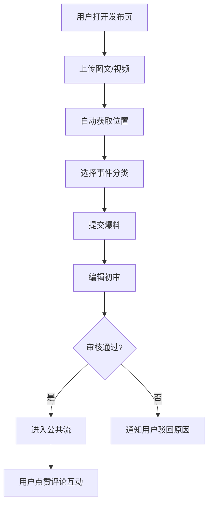
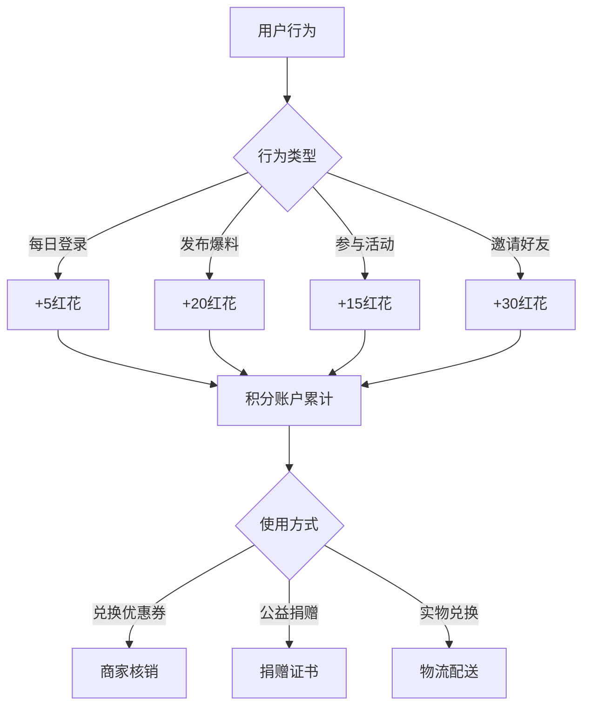

## 1. 产品概述

惠州本地化城市生活社区平台，致力于打造集UGC内容生产、同城兴趣社交、便民生活服务于一体的综合城市社区。通过轻量化爆料系统连接市民与城市治理，以兴趣圈子矩阵激活本地社交活力，构建生活服务中枢提升城市生活便利性，依托小红花积分体系形成正向激励闭环，最终实现"让城市更有温度，让生活更加美好"的核心价值。

- 目标用户：惠州市民、本地商家、政府民生部门、内容创作者
- 核心价值：UGC内容赋能城市治理、兴趣社交连接邻里、便民服务一键直达、积分经济促进共建

## 2. 核心功能

### 2.1 用户角色

| 角色 | 注册方式 | 核心权限 |
|------|----------|----------|
| 普通市民 | 手机号/微信授权 | 浏览内容、发布爆料、加入圈子、参与活动、使用生活服务、积分兑换 |
| 内容创作者 | 普通用户升级 | 发布优质内容、发起活动、获得创作激励 |
| 圈子管理员 | 平台任命/用户申请 | 管理圈子成员、审核圈子内容、发起官方活动 |
| 平台编辑 | 后台账号 | 审核爆料内容、管理公共信息流、处理举报投诉 |
| 政府用户 | 专属账号 | 查看舆情热力图、响应民生诉求、发布官方公告 |
| 商家用户 | 营业执照认证 | 发布优惠券、参与积分兑换合作 |

### 2.2 功能模块

1. **首页**：城市形象展示、热门爆料、精选圈子、快捷服务入口、个人积分
2. **爆料系统**：图文/短视频发布、自动位置标签、事件分类、编辑审核、公共信息流
3. **兴趣圈子**：摄影/亲子/美食/户外等主题圈子、活动发起、报名管理、成果展示
4. **生活服务**：客运班次查询、影院排片、招聘岗位、政务预约、统一渲染
5. **积分系统**：登录/发帖/参与活动获取积分、积分商城、公益捐赠
6. **后台管理**：舆情热力图、内容审核、数据统计、用户管理

### 2.3 页面详情

| 页面名称 | 模块名称 | 功能描述 |
|----------|----------|----------|
| 首页 | 城市形象Banner | 轮播展示惠州城市风光、重大活动、官方公告 |
| 首页 | 快捷功能入口 | 爆料发布、客运查询、影院购票、政务预约、招聘求职、积分商城 |
| 首页 | 热门爆料流 | 按热度展示通过审核的爆料内容，支持点赞评论 |
| 首页 | 精选圈子推荐 | 展示活跃兴趣圈子，支持一键加入 |
| 首页 | 个人信息栏 | 展示头像、昵称、小红花积分数量、签到入口 |
| 爆料发布页 | 内容编辑器 | 支持图文混排、短视频上传、位置获取、事件分类选择 |
| 爆料发布页 | 位置服务 | 自动获取GPS位置，支持手动调整，生成地理位置标签 |
| 爆料发布页 | 事件分类 | 交通出行、城市环境、公共设施、民生服务、突发事件等 |
| 爆料列表页 | 筛选排序 | 按区域、分类、时间、热度筛选排序 |
| 爆料详情页 | 内容展示 | 完整内容、图片/视频、位置地图、评论互动 |
| 爆料审核页 | 编辑后台 | 内容初审、通过/驳回、敏感词检测、违规处理 |
| 圈子列表页 | 分类浏览 | 按主题分类展示所有兴趣圈子 |
| 圈子详情页 | 圈子主页 | 圈子介绍、成员列表、活动公告、精华内容 |
| 活动发布页 | 活动表单 | 活动主题、时间、地点、人数限制、报名条件 |
| 活动详情页 | 报名管理 | 报名列表、签到确认、活动成果展示 |
| 生活服务首页 | 服务分类 | 客运交通、电影演出、招聘求职、政务服务四大板块 |
| 客运查询页 | 班次查询 | 出发地/目的地选择、日期筛选、班次列表、票务信息 |
| 影院排片页 | 电影查询 | 正在热映、影院列表、场次查询、座位选择 |
| 招聘求职页 | 职位搜索 | 岗位列表、企业详情、简历投递入口 |
| 政务预约页 | 服务列表 | 办事指南、在线预约、进度查询 |
| 积分中心页 | 积分概览 | 积分余额、获取记录、消费记录 |
| 积分中心页 | 任务中心 | 每日签到、发帖任务、活动任务、邀请任务 |
| 积分商城页 | 商品列表 | 本地商家优惠券、实物商品、公益捐赠选项 |
| 后台首页 | 数据看板 | 今日爆料数、活跃用户数、热点事件预警 |
| 舆情热力图页 | 区域分析 | 按区县/街道统计爆料密度、情感倾向热力渲染 |
| 舆情热力图页 | 趋势分析 | 时间维度的舆情变化曲线、热点关键词云 |

## 3. 核心流程

### 3.1 爆料发布审核流程

用户打开爆料发布页，选择上传图片或视频，输入文字描述，系统自动获取地理位置，用户选择事件分类后提交。平台编辑收到审核通知，进行内容初审：通过则进入公共信息流展示，驳回则通知用户并说明原因。其他用户可对爆料进行点赞、评论、分享。

### 3.2 积分获取兑换流程

用户每日登录获取积分，发布爆料通过审核获得积分，参与圈子活动获得积分。积分可在商城兑换本地商家优惠券，或选择公益捐赠。平台记录所有积分流水，用户可随时查询。

## 4. 用户界面设计

### 4.1 设计风格

- **主色调**：采用惠州城市特色的"西湖蓝"（#1E88E5）作为主色，搭配"红花湖绿"（#4CAF50）作为辅助色，点缀"朝京门金"（#FFC107）作为强调色
- **色彩体系**：中性色使用柔和的灰白色系，避免刺眼的纯白，营造温暖舒适的城市氛围
- **字体选择**：标题使用"Noto Serif SC"衬线字体，体现城市文化底蕴；正文使用"Noto Sans SC"无衬线字体，保证阅读舒适度
- **按钮风格**：圆角8px的胶囊型按钮，主按钮使用渐变填充，hover状态有轻微上浮和阴影加深效果
- **卡片设计**：圆角12px，柔和的投影效果（box-shadow: 0 4px 20px rgba(0,0,0,0.08)），卡片间保持16px间距
- **图标风格**：使用Lucide图标库，统一24px尺寸，线条圆润，与整体风格协调
- **动效设计**：页面切换使用淡入+滑动组合动画，卡片悬浮有轻微放大效果，数据加载使用骨架屏

### 4.2 页面设计概览

| 页面名称 | 模块名称 | UI元素 |
|----------|----------|--------|
| 首页 | 城市Banner | 全屏宽度轮播，渐变遮罩，白色标题文字，指示器动画 |
| 首页 | 快捷入口 | 4x2宫格布局，圆角图标按钮，文字居中，点击波纹效果 |
| 首页 | 爆料卡片 | 左图右文布局，位置标签角标，点赞评论计数，时间戳 |
| 首页 | 圈子卡片 | 圆形圈子头像，名称+成员数，"加入"按钮，标签展示 |
| 爆料发布页 | 编辑器 | 大文本输入框，图片网格预览，位置标签胶囊，分类选择器 |
| 圈子详情页 | 头部背景 | 模糊处理的圈子封面图，渐变遮罩，圈子信息悬浮 |
| 生活服务页 | 服务卡片 | 图标+名称+简介，色块区分服务类型，箭头指示 |
| 积分中心页 | 积分展示 | 大字号数字，红花图标，进度条动画，流水列表 |
| 热力图页 | 地图区域 | 惠州行政区划底图，热力渐变渲染，数据tooltip |

### 4.3 响应式设计

- **桌面端（1280px+）**：三栏布局，左侧导航、中间内容区、右侧信息面板
- **平板端（768px-1279px）**：两栏布局，顶部导航栏，主内容区自适应宽度
- **移动端（<768px）**：单栏布局，底部Tab导航，内容区全宽，卡片堆叠，触摸目标不小于44x44px
- 所有页面遵循"移动优先"设计原则，保证在手机端的最佳体验

### 4.4 数据可视化设计

- **舆情热力图**：使用ECharts渲染惠州行政区划地图，按爆料密度从低到高使用蓝-绿-黄-橙-红的渐变色
- **统计图表**：使用Recharts绘制趋势折线图、分类柱状图、积分饼图
- **动效处理**：图表加载时有渐进式动画，数据更新有平滑过渡效果

## 5. 非功能性需求

### 5.1 性能要求
- 首屏加载时间 < 3s
- 页面切换过渡时间 < 300ms
- 图片懒加载，支持WebP格式
- 接口响应时间 < 500ms

### 5.2 安全要求
- 用户隐私数据加密存储
- 内容敏感词自动检测过滤
- 上传内容进行病毒扫描
- 操作日志完整记录

### 5.3 可用性要求
- 支持深色/浅色主题切换
- 重要操作支持撤销
- 网络异常时有缓存机制
- 字体大小支持三级调节
