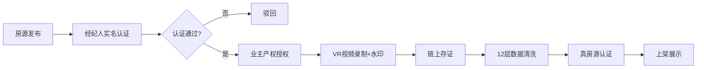
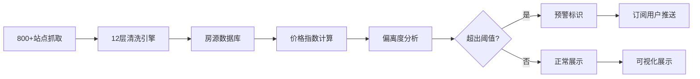
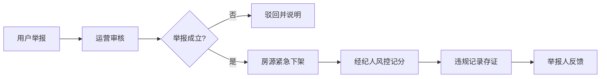

## 1. 产品概述

房产全周期价格治理与智能决策支持平台，覆盖二手房、新房、租赁、海外及旅居五大房类，构建跨渠道房源聚合与真房源验证体系，为用户提供多维度价格分析工具，为管理方提供市场风控与决策支持能力。

- 核心价值：解决房产市场信息不对称、虚假房源泛滥、价格不透明等行业痛点
- 目标用户：购房者、租房者、房产经纪人、平台运营方、市场监管机构

## 2. 核心功能

### 2.1 用户角色

| 角色 | 注册方式 | 核心权限 |
|------|----------|----------|
| 普通用户 | 手机号/微信注册 | 房源浏览、价格查询、时光机回溯、降价提醒订阅 |
| 经纪人 | 实名认证+资质审核 | 房源发布、带看记录上传、业绩管理 |
| 业主 | 实名认证+产权验证 | 房源授权、价格设置、成交确认 |
| 运营管理员 | 后台账号 | 虚假房源处理、经纪人风控、数据仪表盘 |
| 监管用户 | 机构认证 | 市场健康度查看、违规数据统计 |

### 2.2 功能模块

1. **首页大屏**：市场概览、房类切换导航、热门片区、涨跌热力图入口
2. **房源列表页**：多条件筛选、真房源认证标识、价格排序与对比
3. **房源详情页**：价格走势、同户型对比、VR带看、真房源验证链
4. **价格分析中心**：片区7日涨跌热力图、历史成交时序、挂牌偏离度预警、竞品报价矩阵
5. **房价时光机**：历史价格回溯、时间轴导航、价格变迁可视化
6. **用户中心**：订阅管理、浏览收藏、降价提醒
7. **举报中心**：虚假房源举报、证据上传、处理进度追踪
8. **运营后台**：房源审核、经纪人风控、举报处理、市场健康度仪表盘

### 2.3 页面详情

| 页面名称 | 模块名称 | 功能描述 |
|----------|----------|----------|
| 首页大屏 | 市场概览看板 | 五大房类成交量、均价走势、涨跌分布数据卡片 |
| 首页大屏 | 房类切换导航 | 二手房/新房/租赁/海外/旅居 Tab 切换 |
| 首页大屏 | 涨跌热力图 | 片区级7日价格涨跌可视化，支持缩放与钻取 |
| 房源列表页 | 高级筛选 | 价格区间、面积、户型、房龄、朝向、装修等多维筛选 |
| 房源列表页 | 真房源标识 | 已认证房源展示区块链存证标识与验证链接 |
| 房源详情页 | 价格走势模块 | 近6个月挂牌价、成交价、同片区均价三线对比 |
| 房源详情页 | 真房源验证链 | 经纪人认证、带看记录、VR水印、业主授权、链上存证展示 |
| 价格分析中心 | 热力图模块 | 支持按日/周/月切换，片区着色深浅表示涨跌幅度 |
| 价格分析中心 | 同户型对比 | 同小区同户型近3个月成交记录时序散点图 |
| 价格分析中心 | 偏离度预警 | 挂牌价超出片区均价±15%房源红色预警标识 |
| 价格分析中心 | 竞品矩阵 | 周边3公里内同类楼盘报价对比表格 |
| 房价时光机 | 时间轴导航 | 拖动时间轴查看任意历史节点的房价快照 |
| 房价时光机 | 变迁可视化 | 片区价格随时间变化的动态演进动画 |
| 用户中心 | 订阅管理 | 小区/片区/房源订阅，设置降价幅度阈值 |
| 举报中心 | 举报流程 | 选择举报类型、上传证据、填写描述、提交 |
| 运营后台 | 风控仪表盘 | 经纪人异常行为监测、集中下架再上架套利识别 |
| 运营后台 | 市场健康度 | 城市级供需比、库存去化周期、价格波动指数 |

## 3. 核心流程

### 3.1 真房源验证流程

房源发布 → 经纪人实名认证校验 → 业主产权授权 → VR视频录制与水印嵌入 → 链上存证哈希生成 → 房源信息12层清洗 → 真房源认证标识授予 → 上架展示

### 3.2 价格分析与预警流程

跨渠道数据抓取 → 数据清洗去重 → 价格指数计算 → 偏离度模型分析 → 异常预警触发 → 用户订阅推送

### 3.3 虚假房源举报闭环流程

用户举报 → 证据审核 → 房源下架 → 经纪人扣分 → 违规记录上链 → 处理结果反馈

## 4. 用户界面设计

### 4.1 设计风格

- **主色调**：深海军蓝 `#0A2463`（专业、信任、金融属性）
- **辅助色**：
  - 上涨红 `#E63946`（警示、上涨）
  - 下跌绿 `#2A9D8F`（平稳、下跌）
  - 认证金 `#D4AF37`（真房源、权威）
- **中性色**：炭灰 `#1A1A2E`、浅灰 `#F5F7FA`、纯白 `#FFFFFF`
- **按钮风格**：微圆角（4px）、简约边框、悬停微上浮效果
- **字体**：
  - 标题：思源宋体（厚重、专业、金融感）
  - 正文：思源黑体（清晰、易读）
  - 数据数字：JetBrains Mono（等宽、精确感）
- **布局风格**：卡片式模块化布局、数据网格化展示、大屏数据可视化优先
- **图标风格**：线性图标为主、关键数据点使用渐变填充图标

### 4.2 页面设计概述

| 页面名称 | 模块名称 | UI 元素 |
|----------|----------|---------|
| 首页大屏 | 市场概览 | 卡片式数据面板、渐变色数据条、动态数字滚动 |
| 首页大屏 | 涨跌热力图 | 交互式地图、分层设色、悬停详情气泡、图例切换 |
| 房源列表 | 房源卡片 | 真房源金色徽章、价格醒目标识、关键参数网格布局 |
| 房源详情 | 价格走势 | 多线对比图、数据点悬停详情、时间范围切换器 |
| 房源详情 | 真房源验证链 | 时间轴布局、链上哈希展示、可点击验证链接 |
| 价格分析 | 热力图 | 片区级着色、渐变图例、钻取交互、播放动画 |
| 价格分析 | 竞品矩阵 | 数据表格、条件格式化着色、排序交互 |
| 房价时光机 | 时间轴 | 滑块拖动、年份刻度、价格云图动态演进 |
| 运营后台 | 风控仪表盘 | 异常行为红标闪烁、实时数据流、趋势折线 |
| 运营后台 | 健康度仪表盘 | 仪表盘样式、三色状态区间、关键指标卡片 |

### 4.3 响应式设计

- **桌面端优先**：1440px 为基准设计，核心大屏采用 1920px 优化
- **平板适配**：1024px 断点，热力图自适应缩放，侧边栏可折叠
- **移动端**：768px 断点，卡片单列布局，热力图简化为列表，核心功能优先展示
- **触控优化**：按钮最小 44x44px，滑动交互支持，双击缩放地图

### 4.4 数据可视化指引

- **热力图**：使用 ECharts 地图组件，自定义 visualMap 渐变区间，支持片区下钻
- **价格时序图**：使用面积图叠加折线图，填充透明度 0.15
- **仪表盘**：自定义 SVG 仪表盘，指针动画过渡 0.8s 缓动
- **矩阵表格**：条件格式化，颜色渐变映射价格偏离度
- **真房源链**：垂直时间轴，节点图标使用渐变色填充
