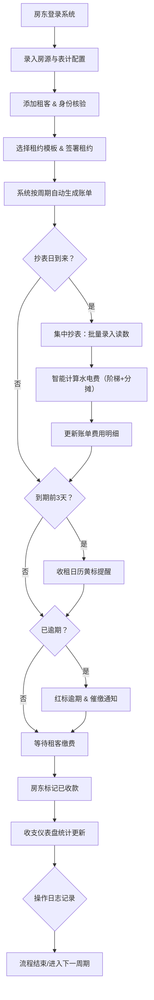

# 房产资产管理 SaaS 系统 - 产品需求文档 (PRD)

## 1. 产品概述

面向个体房东的轻量化房产资产管理 SaaS 系统，一站式解决多套房源的租客管理、抄表计费、账单生成、收租提醒、收支统计等核心痛点。系统严格遵循《民法典》租赁合同相关规范，关键操作全部留痕可溯，确保合规性与数据安全性。

- **核心目标用户**：拥有 2-50 套房源的个体房东、二房东、小型房产中介
- **核心价值**：降本增效（自动化抄表计费）、风险管控（逾期提醒、合规租约）、数据驱动（多维收支分析）

---

## 2. 核心功能

### 2.1 用户角色

| 角色 | 注册方式 | 核心权限 |
|------|----------|----------|
| 房东（管理员） | 手机号注册 | 全部功能：房源/租客/账单/抄表/统计/租约模板/日志 |
| 租客（只读） | 邀请链接 | 查看个人账单、租约、缴费记录 |

### 2.2 功能模块总览

1. **收支仪表盘**：首页总览、月度趋势、房源排行、租客贡献、逾期预警
2. **房源管理**：多套房源档案、户型/面积/地址、表计配置（水/电/燃气）、招租状态
3. **租客管理**：身份信息、身份证 OCR 识别、人脸活体比对、入住/退租、租约绑定
4. **集中抄表**：同一房源多表计批量录入、历史读数追溯、异常读数预警
5. **费用管理**：费用项自定义（租金/水电/物业/杂费）、单价配置、阶梯费率、分摊规则
6. **账单管理**：按周期自动生成、固定/浮动/阶梯式计费、账单续期、批量导出
7. **收租日历**：月视图日历、红标逾期、黄标临近 3 天、快捷标记已收
8. **租约中心**：租约模板库（含押金条款、违约责任）、一键填充、水印海报导出
9. **操作日志**：关键动作全量留痕、按时间/操作人/模块检索、审计导出

### 2.3 页面详情

| 页面名称 | 模块名称 | 功能描述 |
|----------|----------|----------|
| 收支仪表盘 | 数据概览卡片 | 本月应收/已收/逾期、在租房源数、入住率、净收益 |
| 收支仪表盘 | 月度趋势图 | 近 12 个月收入/支出/净利润折线+柱状混合图 |
| 收支仪表盘 | 房源收益榜 | Top10 房源收益排行柱状图 |
| 收支仪表盘 | 费用构成饼图 | 租金/水电/物业等占比环形图 |
| 收支仪表盘 | 逾期预警列表 | 逾期账单清单，快捷催缴入口 |
| 房源管理 | 房源列表 | 卡片式展示，状态标签（出租中/空置/维修中） |
| 房源管理 | 房源详情 | 基本信息、表计列表、关联租客、历史账单 |
| 房源管理 | 房源表单 | 新增/编辑房源，表计批量配置 |
| 租客管理 | 租客列表 | 表格展示，状态标签（在住/已退租/待审核） |
| 租客管理 | 身份核验 | 身份证 OCR 上传模拟、人脸活体比对模拟流程 |
| 租客管理 | 租客详情 | 个人信息、租约记录、缴费历史、证件照片 |
| 集中抄表 | 房源选择器 | 切换房源，筛选抄表周期 |
| 集中抄表 | 批量录入表 | 多表计（水/电/燃气）本次读数批量录入，自动计算差值 |
| 集中抄表 | 费用预览 | 实时展示各表计费用明细、合计金额 |
| 账单管理 | 账单列表 | 按状态/房源/租客筛选，批量操作 |
| 账单管理 | 账单详情 | 费用明细拆分、收款记录、操作历史 |
| 账单管理 | 周期配置 | 固定日/按月/自定义周期，自动续期开关 |
| 收租日历 | 月历视图 | 日期色块区分状态，悬停展示账单摘要 |
| 收租日历 | 快捷操作 | 点击日期查看当日账单，标记已收/催缴 |
| 租约中心 | 模板库 | 标准租约、简版租约、合租协议等模板，预览+选用 |
| 租约中心 | 租约编辑器 | 变量自动填充（房源/租客/金额），在线预览 |
| 租约中心 | 海报生成 | 一键导出带房源信息+房东联系方式+水印的招租海报 |
| 操作日志 | 日志列表 | 时间倒序，按模块/动作/操作人筛选 |
| 操作日志 | 日志详情 | JSON 结构化展示变更前后对比 |

---

## 3. 核心流程

### 3.1 主业务流程（自然语言描述）

房东登录系统后，首先在「房源管理」中录入房源信息并配置水电表计；随后在「租客管理」中添加租客，完成身份证 OCR 与人脸核验后签署电子租约；租约生效后，系统根据账单周期自动生成首期账单。每月抄表日，房东进入「集中抄表」批量录入各表计读数，系统自动按阶梯费率与分摊规则计算水电费并关联至账单。到期日前 3 天，收租日历以黄色标记提醒；逾期未缴则以红色标记并触发催缴。租客缴费后，房东标记账单已收，收支仪表盘同步更新统计数据。所有关键操作（房源变更、租客信息修改、账单金额调整、租约签署）均写入操作日志，支持审计追溯。

### 3.2 Mermaid 主流程图

---

## 4. 用户界面设计

### 4.1 设计风格

- **主色调**：深青色 `#0F766E`（teal-700）作为主色，传达专业、稳重、可信赖的金融属性
- **辅助色**：琥珀黄 `#F59E0B`（临近提醒）、珊瑚红 `#EF4444`（逾期警示）、翠绿 `#10B981`（已收/正常）
- **中性色**：slate 系列灰阶，避免纯黑纯白，营造柔和质感
- **按钮风格**：圆角 10px，主按钮 4px 柔和阴影，hover 时轻微上浮 + 阴影加深过渡 200ms
- **字体**：标题使用 "Noto Serif SC"（衬线）提升品质感，正文使用 "Noto Sans SC"（无衬线）确保可读性
- **布局风格**：左侧导航 + 顶部状态栏 + 右侧内容区三段式布局，卡片式内容容器，8px 圆角
- **图标/emoji**：lucide-react 线性图标，辅助使用 🏠 💰 📋 等 emoji 增加亲和感
- **特殊质感**：卡片使用 subtle 渐变边框 + 低透明度背景噪声纹理，营造高端 SaaS 质感

### 4.2 页面设计概览

| 页面名称 | 模块名称 | UI 元素设计 |
|----------|----------|-------------|
| 收支仪表盘 | 数据概览卡片 | 4 张 2×2 卡片网格，每张含图标+数值+环比箭头+迷你趋势图 |
| 收支仪表盘 | 月度趋势图 | 面积折线图（收入/支出双色叠加），X 轴月份，Y 轴金额 |
| 房源管理 | 房源卡片 | 封面缩略图（占位渐变）+ 地址标题 + 状态标签 + 租客头像 + 月租金 |
| 租客管理 | 身份核验流程 | 三步进度条：①上传身份证 ②OCR 识别结果确认 ③活体眨眼/摇头动画 |
| 集中抄表 | 批量录入表单 | 表计类型图标（水💧电⚡燃气🔥）+ 上次读数灰显 + 本次输入框 + 差值自动计算 + 金额实时预览 |
| 收租日历 | 月历视图 | 7 列网格，日期格子按状态渲染背景（绿/黄/红/灰），右上角角标显示账单数量 |
| 租约中心 | 海报预览 | 竖版 A4 比例模拟，顶部房源图 + 中间租金信息 + 底部二维码占位 + 斜向水印 |
| 操作日志 | 日志条目 | 时间轴样式，左侧圆点（颜色区分模块），右侧操作摘要 + 展开箭头 |

### 4.3 响应式策略

- **桌面优先**：以 1440px 宽度为基准设计，三段式布局正常展示
- **平板（768-1024px）**：左侧导航折叠为图标模式，内容区卡片换行适配
- **移动端（<768px）**：底部 Tab 导航替代侧边栏，日历改为周视图，表格改卡片列表
- **触摸优化**：关键操作按钮最小高度 44px，表单输入框增大点击区域

---

## 5. 合规性规范（《民法典》租赁合同）

| 规范点 | 系统实现方式 |
|--------|-------------|
| 租赁期限不得超过 20 年 | 租约编辑器自动校验期限字段，超期弹窗提示 |
| 押金金额不得超过月租金 20% | 费用配置模块押金输入框自动计算上限并校验 |
| 提前退租违约责任 | 模板库内置 3 种违约金计算方式（固定金额/月租金倍数/按日比例） |
| 维修义务划分 | 租约模板必选模块：房屋维修责任与费用承担条款 |
| 转租需经出租人同意 | 租客详情页转租申请流程，需房东审批确认 |
| 买卖不破租赁 | 房源状态变更为「已出售」时，自动提示现有租约继续有效 |
