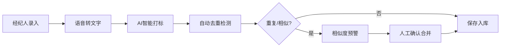
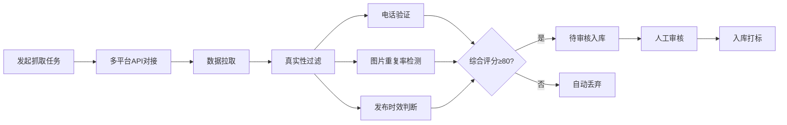
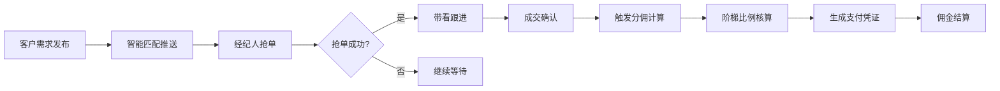
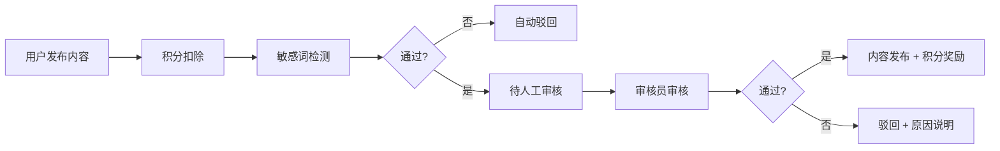

## 1. 产品概述

房地产中介数字化作业系统，聚焦提升门店经纪人获客、转化与协作效率。通过整合房客源CRM、智能房源抓取、推广分发、抢单匹配与知识社区五大核心模块，实现房产交易全流程数字化管理，帮助中介门店降本增效、提升成交转化率。

## 2. 核心功能

### 2.1 用户角色

| 角色 | 注册方式 | 核心权限 |
|------|---------|---------|
| 经纪人 | 手机号注册 + 执业资质审核 | 录入房客源、抢单、推广房源、查看佣金 |
| 门店管理员 | 企业认证注册 | 团队管理、数据统计、佣金审核、内容管理 |
| 系统审核员 | 后台分配 | 资质审核、内容审核、违规处理 |

### 2.2 功能模块

1. **房客源CRM**：语音转文字录入、AI智能打标、自动去重、相似度预警
2. **房源抓取引擎**：多平台API对接、真实性过滤（电话验证/图片去重/时效判断）
3. **智能推广中心**：一键多渠道同步、H5楼书生成、专属二维码
4. **抢单大厅**：精准需求推送、抢单机制、分佣结算
5. **知识社区**：问答积分制、UGC内容上传、内容审核流

### 2.3 页面详情

| 页面名称 | 模块名称 | 功能描述 |
|---------|---------|---------|
| 工作台 | 数据概览 | 今日待办、业绩统计、房源/客源数量、待审核提醒 |
| 工作台 | 快捷操作 | 快速录入、房源发布、抢单入口、推广中心 |
| 房源管理 | 房源列表 | 房源卡片、筛选搜索、批量操作、AI打标展示 |
| 房源管理 | 房源详情 | 完整房源信息、图片展示、跟进记录、相似预警 |
| 房源管理 | 录入表单 | 语音录入、AI辅助填写、字段校验、去重检测 |
| 客源管理 | 客源列表 | 客源卡片、需求标签、跟进状态、AI打标 |
| 客源管理 | 客源详情 | 客户画像、需求分析、跟进记录、成交历史 |
| 房源抓取 | 抓取任务 | 平台选择、过滤规则设置、抓取进度、结果预览 |
| 房源抓取 | 审核入库 | 待审核列表、真实性评分、一键入库/驳回 |
| 推广中心 | 推广列表 | 已推广房源、渠道状态、推广效果统计 |
| 推广中心 | H5楼书 | 模板选择、内容编辑、二维码生成、预览分享 |
| 抢单大厅 | 需求列表 | 实时需求推送、匹配度评分、区域/预算筛选 |
| 抢单大厅 | 我的抢单 | 已抢订单、跟进状态、成交记录 |
| 佣金结算 | 佣金列表 | 待结算/已结算、阶梯比例、明细查看 |
| 佣金结算 | 支付凭证 | 凭证生成、下载打印、状态追踪 |
| 知识社区 | 问答广场 | 问题列表、积分展示、热门话题、搜索 |
| 知识社区 | 内容详情 | 问答展示、点赞评论、资源下载 |
| 知识社区 | 内容发布 | 问题提问、资料上传、分类选择 |
| 个人中心 | 个人信息 | 执业资质、头像设置、密码修改 |
| 个人中心 | 我的积分 | 积分明细、兑换记录、等级体系 |

## 3. 核心流程

### 3.1 房源录入流程

### 3.2 房源抓取流程

### 3.3 抢单成交流程

### 3.4 知识社区内容审核流程

## 4. 用户界面设计

### 4.1 设计风格

- **主色调**：深蓝色 `#1e3a8a`（专业、信任），搭配金色 `#f59e0b`（高端、成就）
- **辅助色**：翡翠绿 `#10b981`（成功、通过）、珊瑚红 `#ef4444`（警告、错误）、天空蓝 `#0ea5e9`（信息、链接）
- **中性色**：采用锌灰色系（zinc-50 ~ zinc-900），保持专业商务感
- **按钮风格**：微圆角（8px）、悬停微上浮效果、渐变主按钮
- **字体**：标题使用 "Noto Serif SC"（专业衬线），正文使用 "PingFang SC"（清晰易读）
- **布局风格**：侧边导航 + 顶部工具栏 + 内容卡片式布局，信息密度适中
- **图标风格**：lucide-react 线性图标，保持简洁现代
- **整体氛围**：专业、高效、可信赖的企业级SaaS界面

### 4.2 页面设计概览

| 页面名称 | 模块名称 | UI元素 |
|---------|---------|--------|
| 工作台 | 数据概览 | 渐变数据卡片、微动画数字滚动、趋势折线图、环形进度图 |
| 工作台 | 快捷操作 | 图标网格、悬停缩放效果、彩色图标背景 |
| 房源列表 | 卡片布局 | 房源图片轮播、AI标签气泡、状态角标、操作按钮组 |
| 房源录入 | 表单页面 | 语音录制按钮动画、AI填充提示、重复检测进度条 |
| 抢单大厅 | 需求卡片 | 匹配度进度条、倒计时动画、抢单脉冲按钮、区域地图标识 |
| H5楼书 | 预览页面 | 3D翻页效果、二维码悬浮卡片、分享动画 |
| 知识社区 | 问答卡片 | 积分徽章、采纳标识、热度排行、头像动效 |

### 4.3 响应式设计

- 采用桌面优先（Desktop-first）设计原则
- 主内容区最小宽度 1280px，最大宽度 1920px
- 侧边导航在平板端自动折叠为图标模式
- 移动端适配时采用底部Tab导航，卡片单列布局
- 表单元素在小屏幕自动调整为全宽堆叠
- 表格组件在移动端自动切换为卡片列表展示

### 4.4 动效与交互

- **页面加载**：渐入 + 上移动画，内容区域错落延迟显示
- **数据更新**：数字滚动动画、进度条平滑过渡
- **悬停效果**：卡片微上浮（translateY(-2px)）、阴影加深
- **按钮交互**：点击缩放（scale(0.97)）、波纹扩散效果
- **通知提醒**：右侧滑入、重要信息脉冲闪烁
- **AI打标**：标签逐个弹入动画、渐变背景
