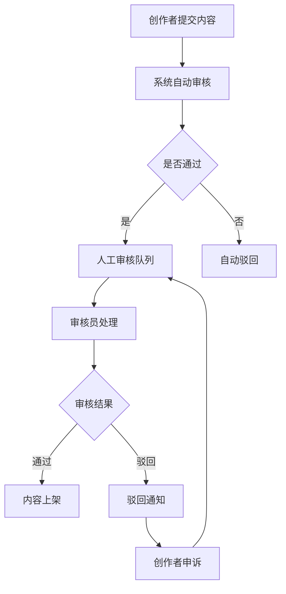

## 1. 产品概述

SkillVerse —— 以"技能即服务"为核心的UGC+交易型视频社区工作台。连接技能创作者与需求方，支持短视频课程交易与定制化技能服务对接。

- 核心价值：降低技能学习与服务获取门槛，为创作者提供多元变现路径，为平台构建交易闭环与社区生态。
- 目标用户：技能创作者（舞蹈/音乐/运动等垂直领域）、技能需求方（学习者/服务购买者）、平台运营方。

## 2. 核心功能

### 2.1 用户角色

| 角色 | 注册方式 | 核心权限 |
|------|----------|----------|
| 普通用户（C端） | 手机号/三方登录 | 浏览Feed流、购买课程、发布需求、预约服务、评价 |
| 创作者（B端） | 资质审核后升级 | 发布课程合集、设置定价/订阅、接定制订单、工作台管理 |
| 需求方（B端） | 企业/个人认证 | 发布定制技能订单、批量预约、订单管理 |
| 平台管理员 | 后台账号 | 内容审核、订单仲裁、资金分账、数据运营 |

### 2.2 功能模块

1. **C端社区Feed流**：视频瀑布流、分类推荐、互动（点赞/评论/收藏/分享）、创作者关注
2. **课程交易中心**：课程合集浏览、单课/订阅购买、视频播放、学习进度、课程评价
3. **定制订单广场**：需求发布、技能搜索、预约邀约、在线支付定金、服务留痕
4. **创作者工作台**：课程管理、订单管理、收入结算、数据分析、粉丝管理
5. **需求方工作台**：需求管理、预约管理、评价管理、收藏创作者
6. **平台管理后台**：内容审核流、供需匹配算法、交易分账引擎、争议仲裁、保险对接
7. **履约保障体系**：双向信用评价、服务过程留痕（时间/地址/沟通）、争议仲裁、保险对接

### 2.3 页面详情

| 页面名称 | 模块名称 | 功能描述 |
|----------|----------|----------|
| 首页（Feed流） | 顶部导航、分类标签、视频瀑布流、悬浮发布按钮 | 无限滚动、短视频预览、互动操作、快速发布入口 |
| 课程详情页 | 视频播放器、课程介绍、章节列表、定价区、评价区 | 视频播放、购买/订阅、加入购物车、查看评价 |
| 订单广场 | 筛选栏、需求卡片列表、发布需求按钮 | 按地域/类别/价格筛选、发布定制需求 |
| 创作者主页 | 头像简介、粉丝数、课程Tab、服务Tab、评价Tab | 查看创作者信息、关注、浏览课程与服务 |
| 创作者工作台 | 数据概览、课程管理、订单管理、收入结算、设置 | 多维度数据统计、课程上下架、订单处理、提现 |
| 需求方工作台 | 我的需求、预约管理、评价管理、收藏 | 需求发布/编辑、预约确认、服务评价 |
| 管理后台 | 审核中心、订单管理、分账管理、用户管理、数据看板 | 内容合规审核、争议仲裁、资金分账、运营数据 |
| 订单详情页 | 服务信息、时间地点、沟通记录、支付信息、评价入口 | 履约过程留痕、进度跟踪、定金支付、服务评价 |

## 3. 核心流程

### 3.1 课程购买流程
用户浏览课程 → 选择单课/订阅 → 加入购物车 → 在线支付 → 开通学习权限 → 观看视频 → 完成学习 → 评价课程

### 3.2 定制服务流程
需求方发布需求 → 平台智能匹配 → 创作者接单/用户邀约 → 双方沟通确认 → 支付定金 → 服务履约（过程留痕） → 服务完成 → 支付尾款 → 双向评价 → 资金结算

### 3.3 内容审核流程
创作者提交课程/服务 → 系统自动审核（关键词/图像识别） → 人工审核队列 → 审核员审核 → 通过/驳回 → 结果通知 → 申诉通道

## 4. 用户界面设计

### 4.1 设计风格
- **主色调**：深邃紫（#6366F1）作为主色，代表创意与专业；辅助色活力橙（#F97316）强调交易与行动；中性色采用锌灰体系构建层次
- **按钮风格**：圆润胶囊形按钮，主按钮采用渐变填充，hover有微立体效果，次要按钮描边+填充双态
- **字体**：标题使用 Playfair Display（优雅衬线）提升品质感；正文使用 Inter（现代无衬线）保证可读性
- **布局风格**：卡片式布局 + 玻璃态元素 + 毛玻璃导航栏，内容区采用大留白与精致阴影
- **图标风格**：线性Lucide图标，统一2px描边，圆角风格

### 4.2 页面设计概览

| 页面名称 | 模块名称 | UI元素 |
|----------|----------|--------|
| 首页Feed流 | 视频瀑布流 | 双列瀑布流、圆角卡片、悬停放大动效、渐变遮罩播放按钮 |
| 课程详情页 | 播放器+信息区 | 固定顶部播放器、粘性购买栏、章节时间轴、评分星星 |
| 创作者工作台 | 数据仪表盘 | 卡片式数据概览、图表可视化、侧边栏导航、标签页切换 |
| 管理后台 | 审核中心 | 表格列表、状态标签、操作按钮组、分页器 |

### 4.3 响应式
桌面优先设计，适配平板与移动端自适应布局。Feed流在移动端转为单列，工作台侧边栏转为底部Tab导航。

### 4.4 动效与交互
- 页面加载：元素错峰渐显 + 轻微上移动画
- 卡片悬停：微放大 + 阴影加深 + 微妙光晕
- 视频卡片：悬停显示播放按钮脉冲动画
- 模态弹窗：背景模糊 + 缩放进入
- 底部导航：选中态弹性缓动过渡
