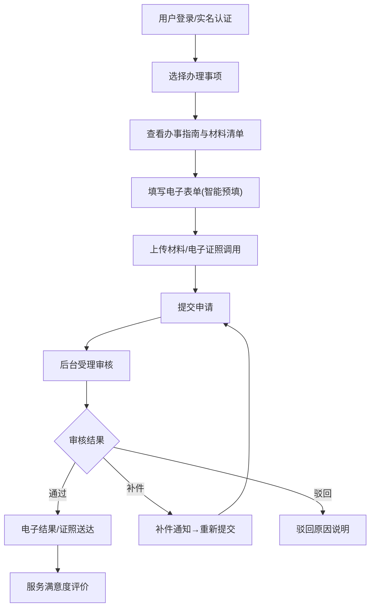
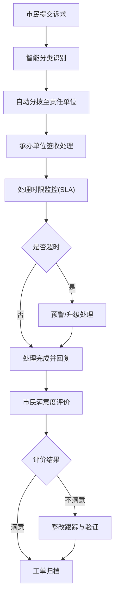
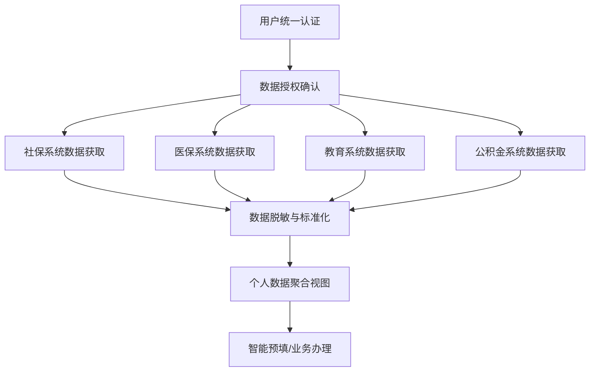

## 1. 产品概述

抚州市级政务民生一体化服务门户平台，作为智慧城市中枢入口，打通人社、医保、教育、交通、文旅等12个委办局业务系统，为市民提供一站式政务服务与便民工具。

- 核心目标：实现政务服务"一网通办"，提升市民办事效率与政府服务效能
- 目标用户：抚州市全体市民、企业法人、政务管理人员
- 市场价值：打造数字政府标杆，实现跨部门数据融合与业务协同

## 2. 核心功能

### 2.1 用户角色

| 角色 | 注册方式 | 核心权限 |
|------|----------|----------|
| 市民用户 | 身份证/手机号实名认证 | 办理业务、查询信息、使用便民工具、提交诉求、评价服务 |
| 企业法人 | 营业执照+法人认证 | 企业相关事项办理、批量业务办理 |
| 委办局管理员 | 后台账号分配 | 事项管理、工单处理、数据查看 |
| 平台管理员 | 超级管理员账号 | 全平台管理、系统监控、报告生成、权限配置 |

### 2.2 功能模块

1. **统一认证中心**：统一登录、单点跳转(SSO)、多因素身份认证
2. **门户首页**：城市数据概览、快捷服务入口、通知公告、热门服务
3. **个人中心**：个人信息聚合(社保+医保+学籍+公积金)、我的办件、我的证照
4. **事项办理中心**：高频事项办理、电子表单引擎、材料智能预填、办件进度追踪
5. **便民工具集**：公积金计算器、违章查询、场馆预约、政策匹配测试
6. **诉求与评价**：市民诉求提交、工单自动分拨、满意度评价、整改跟踪
7. **后台管理系统**：事项颗粒度管理、服务健康监控、效能分析报告、工单管理

### 2.3 页面详情

| 页面名称 | 模块名称 | 功能描述 |
|----------|----------|----------|
| 登录页 | 统一登录 | 账号密码/人脸识别/短信验证码登录、CA证书登录、实名认证 |
| 门户首页 | 城市概览 | 实时城市运行数据大屏、今日办件量、服务满意度、热门服务排行 |
| 门户首页 | 快捷服务 | 12个委办局快捷入口、高频事项一键办理、场景化服务套餐 |
| 个人中心 | 数据融合视图 | 社保缴费明细、医保账户余额、学籍状态、公积金余额聚合展示 |
| 个人中心 | 我的证照 | 电子证照展示、证照下载、证照授权使用 |
| 事项办理 | 事项列表 | 按部门/类别/热度分类展示、事项搜索、事项详情 |
| 事项办理 | 表单引擎 | 动态表单渲染、智能预填、多步骤表单、材料上传 |
| 事项办理 | 办件进度 | 办件列表、进度追踪、补件提醒、电子结果送达 |
| 便民工具 | 计算器 | 公积金贷款计算器、社保缴费计算器、医保报销估算 |
| 便民工具 | 查询 | 违章查询、场馆查询、公交查询、景区客流查询 |
| 便民工具 | 预约 | 场馆预约、景区预约、政务大厅预约 |
| 便民工具 | 政策匹配 | 个人条件输入、政策智能匹配、匹配度评分 |
| 诉求中心 | 诉求提交 | 诉求分类、位置定位、图片上传、匿名提交 |
| 诉求中心 | 我的诉求 | 诉求列表、处理进度、回复查看 |
| 后台首页 | 管理驾驶舱 | 服务效能总览、实时监控、预警提醒 |
| 后台-事项管理 | 事项配置 | 事项新增/编辑、办事步骤拆解、表单配置、材料清单配置 |
| 后台-服务监控 | 健康监控 | 各系统接口可用性、响应时间、错误率监控、告警配置 |
| 后台-工单管理 | 工单处理 | 工单自动分拨、人工转派、处理时限、SLA监控 |
| 后台-评价管理 | 满意度闭环 | 评价数据统计、差评预警、整改跟踪、整改验证 |
| 后台-报告中心 | 效能报告 | 月度服务效能分析报告、趋势分析、部门排名、导出下载 |

## 3. 核心流程

### 3.1 市民办事流程

### 3.2 诉求处理流程

### 3.3 跨系统数据融合流程

## 4. 用户界面设计

### 4.1 设计风格

- **主色调**：政务蓝 (#1E5AA8)，体现权威、专业、可信赖
- **辅助色**：活力橙 (#FF8A3D) 用于强调按钮和状态提示，清新绿 (#2ECC71) 表示成功/通过，暖红 (#E74C3C) 表示警告/错误
- **中性色**：深灰 (#2C3E50) 用于正文，中灰 (#7F8C8D) 用于辅助文字，浅灰 (#ECF0F1) 用于背景和分割
- **按钮风格**：圆角6px，主按钮采用政务蓝渐变，悬停有轻微上浮效果
- **字体**：标题使用 Noto Sans SC Bold，正文使用 Noto Sans SC Regular，数字使用 Roboto Mono 增强可读性
- **布局风格**：卡片式布局+顶部导航，重要信息使用数据可视化大屏展示
- **图标风格**：线性图标配合彩色点缀，统一使用24px网格
- **整体调性**：简洁大气、专业权威、温暖亲民

### 4.2 页面设计概览

| 页面名称 | 模块名称 | UI元素 |
|----------|----------|--------|
| 登录页 | 登录卡片 | 政务蓝渐变背景、城市剪影装饰、半透明玻璃拟态登录卡片、多登录方式Tab切换 |
| 门户首页 | 顶部导航 | 渐变Logo区、搜索框、消息通知、用户头像下拉菜单 |
| 门户首页 | 数据大屏 | 半环形进度图、实时数据滚动、彩色数据卡片、动态数字动画 |
| 门户首页 | 服务入口 | 12宫格彩色图标矩阵、悬停发光效果、快捷访问标记 |
| 个人中心 | 数据聚合 | 多标签页切换、数据卡片堆叠、时间轴展示缴费记录、环形图展示占比 |
| 事项办理 | 表单引擎 | 步骤指示器(Stepper)、分组表单区块、智能预填标签、实时校验提示 |
| 后台管理 | 驾驶舱 | 深色主题数据大屏、多维度图表、实时告警飘条、系统状态指示灯 |
| 后台管理 | 报告中心 | 报告封面+目录+章节导航、图表与文字混排、PDF导出样式预览 |

### 4.3 响应式设计

- 桌面端优先设计（1440px基准），适配1920px及以上大屏
- 平板端（768px-1024px）：侧边栏收起，服务入口调整为6列
- 移动端（<768px）：底部Tab导航，服务入口调整为4列，数据大屏简化展示
- 触摸交互优化：按钮最小44x44px，手势滑动支持

### 4.4 动效设计

- 页面加载：骨架屏渐显+内容错位入场
- 数据变化：数字滚动动画、图表渐进渲染
- 交互反馈：按钮点击涟漪、卡片悬停微浮、表单校验抖动
- 状态切换：Tab切换滑动过渡、模态框缩放入场
