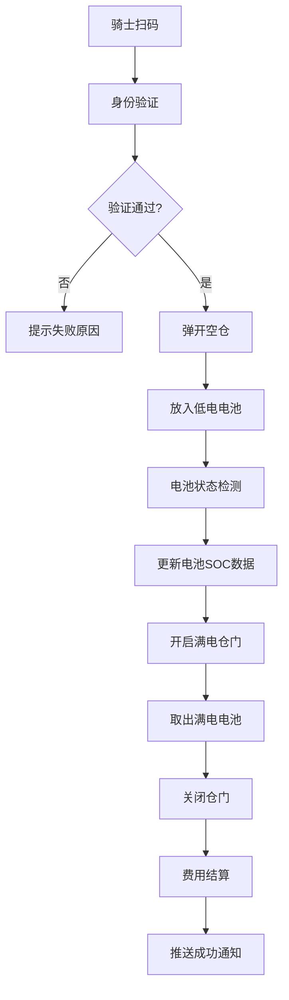

# 两轮电动车换电能源网络运营平台 - 产品需求文档

## 1. 产品概述

两轮电动车换电能源网络运营平台是一套面向即时配送骑手的智能换电服务系统，通过遍布城市的换电柜网络，为骑士提供30秒极速换电服务。平台融合物联网、大数据、人工智能技术，实现电池全生命周期管理、设备智能运维、区域热力分析等核心能力。

- **核心价值**：解决电动车充电慢、续航短、安全隐患等痛点，为外卖/快递骑士提供高效、安全、便捷的能源补给方案
- **目标用户**：外卖骑手、快递配送员、共享电单车运营企业、城市能源运营商
- **合规标准**：所有电池数据采集符合GB/T 36276-2018《电动汽车用动力蓄电池循环寿命要求及试验方法》

## 2. 核心功能

### 2.1 用户角色

| 角色 | 注册方式 | 核心权限 |
|------|----------|----------|
| 骑士 | 手机号+实名+驾驶证OCR核验 | 扫码换电、预约锁电、套餐购买、低电量预警接收 |
| 运维人员 | 企业账号分配 | 柜体巡检、故障处理、电池更换、工单管理 |
| 运营管理员 | 企业后台账号 | 数据看板、设备管理、电池全生命周期档案、热力分析、告警配置 |
| 系统管理员 | 超级管理员账号 | 用户管理、权限配置、系统设置、标准参数维护 |

### 2.2 功能模块

1. **骑士端H5应用**：首页地图、扫码换电、预约锁电、我的电池、套餐中心、钱包支付、个人中心
2. **运营管理后台**：数据总览、换电柜管理、电池管理、骑士管理、订单管理、告警中心、热力分析、系统设置
3. **智能运维系统**：故障分级告警、工单派发、巡检计划、设备健康度评估
4. **电池AI分析**：健康度预测、衰减曲线分析、寿命预估、报废预警

### 2.3 页面详情

| 页面名称 | 模块名称 | 功能描述 |
|---------|---------|----------|
| 骑士端-首页 | 地图导航 | 周边换电柜定位、实时状态显示、满电电池数量、距离排序 |
| 骑士端-扫码换电 | 扫码模块 | QR码扫描、柜体识别、仓门控制、换电流程引导 |
| 骑士端-换电流程 | 流程指引 | 放入低电电池→满电仓开启→取出满电电池→交易完成 |
| 骑士端-预约锁电 | 预约功能 | 选择柜体、锁定满电电池、30分钟保留、倒计时提醒 |
| 骑士端-支付页面 | 支付模块 | 套餐余额抵扣、微信/支付宝混合支付、交易明细 |
| 骑士端-个人中心 | 用户信息 | 实名状态、驾驶证信息、套餐管理、换电记录 |
| 后台-数据总览 | 数据看板 | 今日换电量、在网柜数、活跃骑士、告警统计、关键指标趋势图 |
| 后台-换电柜管理 | 柜体列表 | 设备状态、GPS位置、仓位数、温控数据、通信状态 |
| 后台-电池管理 | 电池档案 | 唯一ID查询、充放电记录、健康度评分、循环次数、电压曲线 |
| 后台-告警中心 | 故障告警 | 三级告警（通信中断/温控失效/机械卡顿）、告警历史、处理状态 |
| 后台-热力分析 | 热力图 | 区域换电热力、骑手轨迹叠加、柜体布点优化建议 |
| 后台-骑士管理 | 用户列表 | 实名核验、驾驶证OCR、封禁管理、套餐统计 |

## 3. 核心流程

### 3.1 换电主流程

骑士打开APP扫码→系统验证骑士身份与套餐→柜体弹开空仓→骑士放入低电量电池→系统检测电池状态并更新SOC→满电电池仓自动开启→骑士取出满电电池→关闭仓门→交易完成（支持套餐余额/微信/支付宝混合支付）→系统推送换电成功通知

### 3.2 预约锁电流程

骑士选择附近柜体→查看满电电池数量→提交预约→系统锁定电池→30分钟倒计时→骑士到达扫码→自动解锁完成换电→超时自动释放

### 3.3 电池健康度预测流程

采集充放电数据→计算循环次数→拟合电压衰减曲线→GB/T 36276-2018标准比对→AI模型预测剩余寿命→生成健康度报告→异常预警

## 4. 用户界面设计

### 4.1 设计风格

- **主色调**：电光青 #00E5FF（能源、科技感）、深空蓝 #0A1628（稳重、专业）
- **辅助色**：告警红 #FF4D4F、成功绿 #00E676、警示橙 #FFAA00
- **整体风格**：科技工业风、深色主题为主、数据可视化驱动、霓虹光效点缀
- **字体**：标题使用 Rajdhani（科技感字体），正文使用 PingFang SC / Microsoft YaHei
- **按钮风格**：直角硬朗边框、渐变填充、悬停发光效果
- **布局风格**：模块化卡片布局、数据网格展示、仪表盘式设计
- **图标风格**：线性图标 + 发光描边、工业质感

### 4.2 页面设计概览

| 页面名称 | 模块名称 | UI元素 |
|---------|---------|-------|
| 骑士端首页 | 地图模块 | 深色地图底图、霓虹标记点、脉冲动画、悬浮状态卡片 |
| 骑士端换电页 | 流程动画 | 仓门开合动效、电池充电动画、进度流光效、成功脉冲 |
| 后台数据总览 | 数据看板 | 大屏数字滚动、环形进度条、实时数据流、三维机柜示意 |
| 后台电池详情 | 数据曲线 | 多轴折线图、衰减曲线拟合、健康度雷达图、循环次数柱状图 |
| 后台告警中心 | 告警列表 | 三级颜色标识、闪烁告警动画、处理进度条、告警详情抽屉 |
| 后台热力图 | 地图可视化 | 热力图层、轨迹线动画、柜体标记点、区域多边形 |

### 4.3 响应式设计

- **骑士端**：移动端优先设计，适配375px-768px宽度，支持触摸交互
- **管理后台**：桌面端优先，最小支持1280px宽度，侧边栏可折叠
- **数据可视化**：图表自适应容器宽度，关键指标卡片支持网格重排

### 4.4 动效设计

- 页面切换：淡入 + 轻微位移
- 数据加载：骨架屏 + 渐入动画
- 告警提示：呼吸灯闪烁 + 脉冲扩散
- 换电流程：步骤进度条 + 状态切换过渡
- 地图标记：脉冲圈动画 + 悬浮阴影
