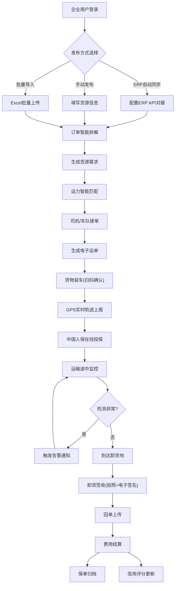

## 1. 产品概述

数字物流协同平台是面向制造业企业的一站式智能物流管理系统，核心解决实体企业运力不稳定、货物追踪难、保险覆盖弱等痛点。平台整合货源发布、运力匹配、全程追踪、在线投保、后市场服务五大核心模块，构建从订单到签收的全链路数字化协同网络。

## 2. 核心功能

### 2.1 用户角色

| 角色 | 注册方式 | 核心权限 |
|------|----------|----------|
| 制造企业用户 | 企业认证注册 | 货源发布、ERP对接、运单管理、投保、后市场服务 |
| 车队/司机 | 资质认证注册 | 运力接单、运输执行、轨迹上报、签收确认 |
| 平台管理员 | 后台注册 | 运力审核、企业认证、数据监控、系统配置 |
| 保险专员 | 人保系统对接 | 保单审核、理赔对接、风险评估 |

### 2.2 功能模块

1. **数据总览仪表盘**：KPI指标卡片、实时运单监控地图、运力/货源热力图、异常告警列表
2. **货源智能发布系统**：ERP对接配置、订单批量导入、智能需求拆解、温控/体积/重量标注
3. **运力池分级管理**：司机/车队认证、信用评分体系、返程车源推荐、履约率排序筛选
4. **全程货物追踪视图**：GPS实时轨迹、电子运单流转、节点时间戳、异常停留告警
5. **中国人保货物险投保**：保费实时计算、在线投保流程、电子保单存证、理赔申请
6. **后市场服务中心**：ETC充值管理、油卡折扣结算、维保预约工单、费用对账报表

### 2.3 页面详情

| 页面名称 | 模块名称 | 功能描述 |
|----------|----------|----------|
| 数据总览 | KPI指标卡 | 在途运单数、异常告警数、本月运费、保险理赔率、运力池规模 |
| 数据总览 | 实时监控地图 | 全国运输车辆分布、点击查看车辆详情、轨迹动画回放 |
| 数据总览 | 告警中心 | 异常停留、超时未签收、温控超标、事故上报等告警推送 |
| 货源管理 | ERP对接配置 | SAP/Oracle/用友等主流ERP系统API配置、字段映射规则、同步频率 |
| 货源管理 | 货源发布 | 手动发布订单、批量Excel导入、自动从ERP同步、智能匹配推荐 |
| 货源管理 | 订单详情 | 货物明细、装卸货信息、特殊要求、投标/指派运力、进度跟踪 |
| 运力池 | 运力分级列表 | 金牌认证/银牌认证/普通运力分级打标、信用分排序筛选 |
| 运力池 | 司机/车队档案 | 资质证照、车辆信息、历史履约记录、信用评分趋势 |
| 运力池 | 返程车源 | 目的地匹配、空车利用率推荐、议价系统 |
| 货物追踪 | 运输轨迹视图 | GPS轨迹地图、电子围栏、停留点标注、异常高亮 |
| 货物追踪 | 电子运单 | 运单状态流转、节点确认、签收照片上传、回单管理 |
| 货物追踪 | 异常管理 | 告警规则配置、异常工单、处理记录、统计分析 |
| 保险服务 | 在线投保 | 货物信息录入、保费按重量/体积/价值实时计算、险种选择 |
| 保险服务 | 保单管理 | 电子保单下载、保单验真、保单状态跟踪、批量投保 |
| 保险服务 | 理赔中心 | 理赔申请上传、进度跟踪、定损记录、赔付到账 |
| 后市场 | ETC服务 | ETC卡绑定、在线充值、消费账单、发票申请 |
| 后市场 | 油卡服务 | 油卡品牌选择、折扣套餐、在线充值、消费明细 |
| 后市场 | 维保服务 | 维修保养预约、服务商匹配、电子工单、验收评价 |

## 3. 核心流程

### 3.1 货源发布到签收全流程

### 3.2 保险投保流程

## 4. 用户界面设计

### 4.1 设计风格

- **主色调**：深海蓝 (#0F3460) - 代表专业、可靠、稳定
- **辅助色**：工业橙 (#E94560) - 突出告警、CTA按钮
- **点缀色**：科技青 (#16C79A) - 表示成功、正常、通过
- **中性色**：石板灰系列 (#1A1A2E, #16213E, #F8F9FA)
- **按钮风格**：圆角8px，带微投影，hover时上浮2px+阴影加深
- **字体**：标题用「思源黑体 Heavy」，正文用「思源黑体 Regular」，数字用「JetBrains Mono」
- **布局风格**：左侧导航栏+顶部状态栏的经典B端SaaS布局，卡片式内容容器，微圆角+细边框
- **图标风格**：线性图标，2px描边，统一使用Lucide图标库

### 4.2 页面设计概览

| 页面名称 | 模块名称 | UI元素 |
|----------|----------|--------|
| 数据总览 | KPI指标卡 | 渐变背景卡片，数值放大+趋势小图，图标+标题+数值+环比四象限布局 |
| 数据总览 | 实时地图 | 暗色底图+发光轨迹点，车辆icon脉冲动画，侧边悬浮详情面板 |
| 数据总览 | 告警中心 | 时间轴布局，红色/橙色/绿色分级色块，点击展开处理面板 |
| 货源管理 | ERP配置 | 分步向导式配置，字段映射拖拽界面，连接状态实时指示灯 |
| 货源管理 | 订单列表 | 高级数据表格，支持多列筛选、批量操作、行内快捷编辑 |
| 运力池 | 运力分级 | Tab切换分级视图，卡片网格布局，信用分环形进度条 |
| 货物追踪 | 轨迹视图 | 大尺寸地图占主区域，右侧时间轴节点面板，底部播放控制条 |
| 保险服务 | 保费计算 | 左右分栏布局：左侧表单输入，右侧实时计算结果动态更新 |
| 后市场 | 服务卡片 | 三列图标卡片组，悬浮放大动效，渐变图标背景 |

### 4.3 响应式设计

- 桌面端优先设计：最小支持1440px宽度
- 笔记本适配：1366px下侧栏可折叠为图标模式
- 数据表格横向滚动，保持列最小宽度
- 地图区域自适应容器尺寸

### 4.4 交互动效

- 页面入场：内容区域从下往上15px位移+渐入，200ms缓动
- 卡片悬浮：translateY(-2px) + box-shadow加深，150ms过渡
- 地图轨迹：车辆移动时采用path动画，脉冲光圈指示当前位置
- 告警推送：右上角滑入通知，红色闪烁边框+数字角标
- 数字滚动：KPI数值更新时采用countUp动画效果
