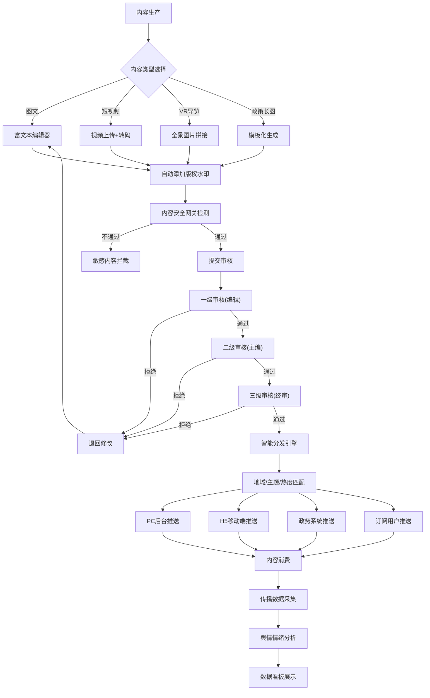
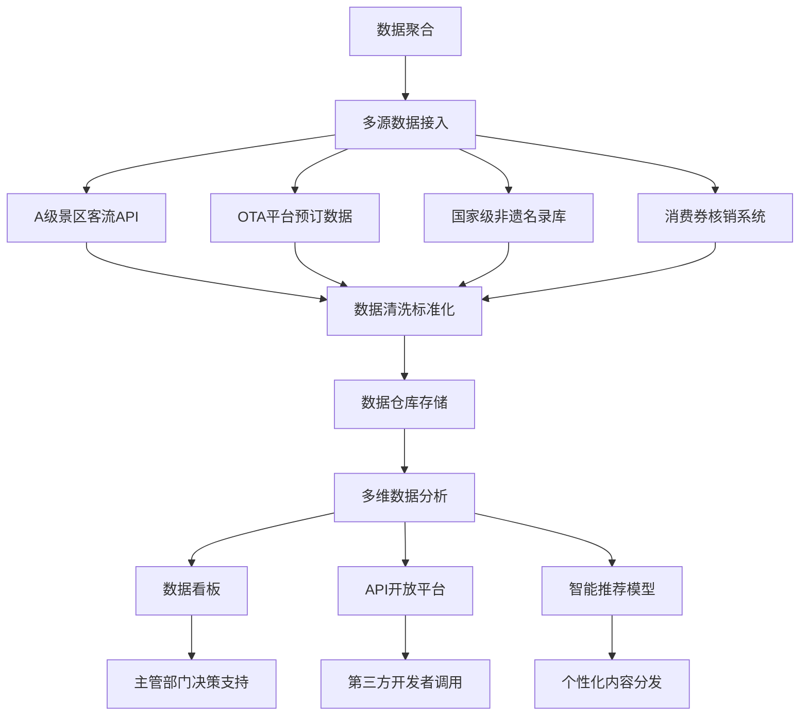

## 1. 产品概述

权威文旅垂直领域内容生产与产业服务中台，面向文旅主管部门、景区运营方、文旅企业及专业读者，构建"内容+数据+服务"三位一体架构。解决文旅行业内容分散、数据割裂、服务滞后的痛点，打造国家级权威文旅信息枢纽。

## 2. 核心功能

### 2.1 用户角色

| 角色 | 注册方式 | 核心权限 |
|------|----------|----------|
| 超级管理员 | 系统初始化分配 | 全系统管理、用户权限配置、系统参数设置 |
| 文旅主管部门 | 实名认证+单位资质审核 | 政策发布、数据统计、活动审批、舆情监控 |
| 景区运营方 | 企业资质认证 | 内容发布、客流管理、OTA对接、活动申报 |
| 文旅企业 | 企业资质认证 | 内容创作、产品推广、招商对接、消费券核销 |
| 专业编辑/记者 | 单位邀请注册 | PGC内容生产、专题策划、审核初审 |
| 专业读者 | 实名认证 | 内容订阅、数据查询、VR导览、评论互动 |
| 普通游客 | 手机号注册 | H5浏览、内容消费、活动报名、消费券领取 |

### 2.2 功能模块

1. **内容生产中心**：图文编辑器、短视频上传、VR导览制作、政策解读长图生成
2. **多级审核流**：三级审核机制、审核日志、退改意见、定时发布
3. **版权管理**：数字水印、版权登记、转载追踪、侵权监测
4. **传播分析**：传播路径追踪、传播热力图、KOL识别、舆情情绪分析
5. **数据聚合平台**：A级景区客流、OTA预订、非遗名录、文旅消费券核销
6. **API开放平台**：接口申请、权限管理、调用统计、开发者文档
7. **数据看板**：自定义仪表盘、多维度分析、报表导出、实时监控
8. **产业服务中心**：项目招商对接、节庆活动申报、导游资格认证
9. **内容安全网关**：敏感词过滤、AI内容审核、人工复核、发布审计
10. **智能分发引擎**：地域定向、主题标签、热度排序、个性化订阅
11. **PC管理后台**：全功能管理界面、数据可视化、权限管理
12. **政务系统插件**：iframe嵌入、单点登录、数据共享、业务协同
13. **H5轻系统**：移动端适配、扫码访问、离线缓存、分享传播

### 2.3 页面详情

| 页面名称 | 模块名称 | 功能描述 |
|----------|----------|----------|
| 登录页 | 身份认证 | 账号密码登录、短信验证码、单点登录、政务网接入 |
| 工作台 | 数据概览 | 待办事项、核心指标、快捷入口、消息通知 |
| 内容列表页 | 内容管理 | 多类型筛选、批量操作、状态管理、搜索 |
| 内容编辑页 | 富媒体编辑 | 图文排版、短视频剪辑、VR全景上传、长图生成器 |
| 审核中心 | 多级审核 | 待审核列表、审核操作、意见反馈、审核日志 |
| 版权管理页 | 版权保护 | 水印配置、版权登记、转载记录、侵权告警 |
| 传播分析页 | 数据追踪 | 传播路径图、地域分布、情绪分析、热点识别 |
| 数据看板页 | 可视化分析 | 自定义图表、客流热力、消费趋势、多维度钻取 |
| API开放平台 | 开发者中心 | 接口目录、应用管理、密钥配置、调用监控 |
| 招商对接页 | 产业服务 | 项目库、投资方名录、对接记录、进度追踪 |
| 活动申报页 | 节庆管理 | 申报表单、评审流程、公示发布、效果评估 |
| 导游认证页 | 资格管理 | 资质上传、在线考试、证书查询、继续教育 |
| 系统设置页 | 管理配置 | 权限管理、组织架构、系统参数、日志审计 |
| H5首页 | 移动端门户 | 轮播推荐、分类导航、热门内容、订阅入口 |
| VR导览页 | 沉浸式体验 | 360°全景、语音讲解、POI热点、路线规划 |
| 政务插件页 | 系统嵌入 | 数据同步、业务代办、消息推送、统计报表 |

## 3. 核心流程

## 4. 用户界面设计

### 4.1 设计风格

**设计理念：权威、专业、国风现代**

- **主色调**：故宫红 `#C8102E` 作为品牌主色，象征文旅的权威性与文化底蕴
- **辅助色**：
  - 青绿山水 `#2D5A52` 用于数据可视化
  - 琉璃黄 `#F0A500` 用于突出重要信息和告警
  - 青花瓷蓝 `#1A4B8C` 用于链接和交互元素
- **中性色**：
  - 墨色 `#1A1A1A` 正文文本
  - 深灰 `#4A4A4A` 次级文本
  - 浅灰 `#F5F5F0` 背景底色
- **字体**：
  - 标题：思源宋体（Source Han Serif），传承文化气质
  - 正文：思源黑体（Source Han Sans），保证可读性
  - 数字：JetBrains Mono，数据展示清晰
- **按钮风格**：圆角4px，微立体阴影，hover状态有轻微上浮效果
- **布局风格**：卡片式布局，留白充足，中国传统对称美学与现代信息架构结合
- **图标风格**：线性图标融入传统纹样元素，如回纹、云纹细节
- **动效设计**：过渡动画采用水墨晕染效果，数据加载采用卷轴展开动效

### 4.2 页面设计概览

| 页面名称 | 模块名称 | UI元素 |
|----------|----------|--------|
| 登录页 | 品牌展示 | 左侧山水意境插画动效，右侧登录表单，玻璃拟态效果，故宫红主按钮 |
| 工作台 | 数据概览 | 顶部导航栏+左侧菜单，关键指标卡片带微动画，待办事项列表，快速操作区 |
| 内容编辑页 | 富媒体编辑 | 左右分栏布局，左侧编辑区，右侧实时预览，顶部工具栏集成AI辅助功能 |
| 数据看板页 | 可视化分析 | 可拖拽组件网格，多种图表类型，时间轴筛选器，配色采用青绿山水渐变 |
| VR导览页 | 沉浸式体验 | 全屏全景视图，底部热点导航，侧边语音讲解控制面板，进度条采用卷轴样式 |
| 审核中心 | 多级审核 | 列表+详情双栏，审核状态标签采用不同色系，审批流程可视化时间线 |
| H5首页 | 移动端门户 | 卡片式信息流，下拉刷新，上滑加载，底部标签导航，国潮风插画装饰 |

### 4.3 响应式设计

- **PC管理后台**：桌面端优先，1920px基准设计，支持1280px以上自适应，侧边栏可折叠
- **政务系统插件**：iframe自适应嵌入，支持不同政务系统的布局规范，最小宽度1024px
- **H5轻系统**：移动优先，375px基准设计，响应式适配320px-768px，支持横竖屏切换，触摸交互优化

### 4.4 无障碍设计

- 支持屏幕阅读器的语义化标签
- 色觉友好配色方案，避免红绿色差
- 键盘导航完整支持
- 字体大小可调节
- 高对比度模式

## 5. 非功能性需求

### 5.1 性能要求
- 页面首屏加载时间 < 2s
- API响应时间 < 200ms
- 视频转码处理 10分钟内完成
- 并发用户支持 > 10000
- 数据实时更新延迟 < 30s

### 5.2 安全要求
- 等保三级认证标准
- 数据传输全程HTTPS加密
- 敏感数据存储加密
- 操作日志留存180天
- 支持政务网内外网隔离部署

### 5.3 可用性要求
- 系统可用性 99.9%
- 支持灰度发布
- 数据备份策略：每日全量+实时增量
- 灾难恢复时间 < 4小时
