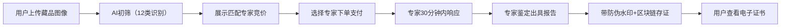

## 1. 产品概述

文玩艺术品垂直领域专业鉴定服务平台，面向藏家、新手与从业者，提供AI初筛+专家鉴定的一站式服务。通过区块链存证保障鉴定报告公信力，构建行家知识库与价值评估体系，打造集鉴定、咨询、学习、交易参考于一体的专业服务生态。

- 解决痛点：传统鉴定门槛高、耗时长、真伪难辨、报告无公信力
- 目标用户：藏家群体、文玩新手、行业从业者、博物馆等B端机构
- 市场价值：连接专家与藏家，建立标准化鉴定流程，推动行业透明化

## 2. 核心功能

### 2.1 用户角色

| 角色 | 注册方式 | 核心权限 |
|------|----------|----------|
| 普通用户（藏家/新手） | 手机号+实名认证 | 上传藏品、发起鉴定、查看证书、浏览知识库、社区问答 |
| 鉴定专家 | 资质审核+平台认证 | 接单鉴定、出具报告、参与仲裁、知识库贡献 |
| 平台管理员 | 后台账号 | 专家资质审核、纠纷仲裁、模板配置、API管理、数据统计 |
| B端机构用户 | API密钥申请 | 批量初鉴、机构专属通道、定制化报告 |

### 2.2 功能模块

1. **首页**：平台介绍、鉴定流程展示、专家团队、知识库入口、社区热榜
2. **藏品鉴定页**：图像上传、AI初筛、品类选择、专家竞价、订单跟踪
3. **鉴定证书页**：防伪证书展示、区块链存证验证、PDF下载、证书查询
4. **行家知识库**：分类检索（年代/工艺/真伪）、藏品图鉴、专家解读文章
5. **价值评估页**：藏品估值、拍卖数据参考、稀缺性分析
6. **社区问答页**：提问回答、专家解答、FAQ结构化沉淀
7. **用户中心**：我的藏品、鉴定订单、收藏夹、账户设置
8. **专家工作台**：任务大厅、鉴定报告编辑、收益管理、资质信息
9. **管理后台**：专家认证、纠纷仲裁、模板配置、API管理、数据看板
10. **API开放平台**：接口文档、密钥管理、调用统计、SDK下载

### 2.3 页面详情

| 页面名称 | 模块名称 | 功能描述 |
|----------|----------|----------|
| 首页 | Hero区域 | 动态藏品展示、平台Slogan、快速鉴定入口CTA |
| 首页 | 鉴定流程 | 四步流程可视化：上传→AI初筛→专家鉴定→出证存证 |
| 首页 | 专家团队 | 专家卡片展示（资质/领域/好评率）、查看更多 |
| 首页 | 知识库精选 | 热门分类、精选文章、最新解读 |
| 首页 | 社区热榜 | 热门问题、活跃专家讨论 |
| 藏品鉴定页 | 图像上传 | 拖拽/点击上传、多图支持、拍摄引导、品类识别 |
| 藏品鉴定页 | AI初筛结果 | 品类识别（12类）、年代推测、真伪初判、置信度、建议专家 |
| 藏品鉴定页 | 专家竞价 | 匹配专家列表、报价对比、响应时间、好评率、选择下单 |
| 藏品鉴定页 | 订单跟踪 | 进度条（接单→鉴定中→报告已出）、30分钟SLA倒计时 |
| 鉴定证书页 | 证书展示 | 藏品信息、鉴定结论、专家签名、防伪水印、证书编号 |
| 鉴定证书页 | 区块链验证 | 存证哈希、区块高度、时间戳、验证二维码 |
| 行家知识库 | 分类检索 | 年代筛选、工艺标签、真伪要点、全文搜索 |
| 行家知识库 | 藏品图鉴 | 高清图谱、特征标注、真伪对比 |
| 价值评估页 | 估值计算器 | 材质、年代、品相、稀有度参数输入 |
| 价值评估页 | 拍卖参考 | 同类藏品历史成交记录、价格趋势图 |
| 社区问答页 | 问题列表 | 分类标签、筛选排序、专家标识 |
| 社区问答页 | 问题详情 | 回答展示、专家认证标识、采纳机制 |
| 用户中心 | 我的藏品 | 藏品相册、鉴定历史、证书管理 |
| 用户中心 | 我的订单 | 进行中/已完成订单、评价专家 |
| 专家工作台 | 任务大厅 | 待抢订单、智能推荐、我的任务 |
| 专家工作台 | 报告编辑 | 模板选择、富文本编辑、图片标注、电子签名 |
| 管理后台 | 专家认证 | 资质审核（国家级/省级/行内资深）、分级管理 |
| 管理后台 | 纠纷仲裁 | 申诉列表、证据审查、仲裁裁决、处罚记录 |
| 管理后台 | 模板配置 | 鉴定报告模板、证书样式、水印参数 |
| API开放平台 | 接口文档 | 批量初鉴、证书验证、数据查询等RESTful API |

## 3. 核心流程

### 3.1 鉴定主流程

用户上传藏品图像 → AI自动识别品类并初筛真伪 → 匹配领域专家展示竞价列表 → 用户选择专家下单支付 → 专家30分钟内接单响应 → 专家鉴定并出具带水印报告 → 报告上链存证 → 用户查看防伪电子证书

### 3.2 专家认证流程

专家提交申请 → 上传资质证书 → 平台初审 → 专家等级评定（国家级/省级/行内资深）→ 缴纳保证金 → 开通接单权限

### 3.3 纠纷仲裁流程

用户发起申诉 → 上传证据 → 专家回应举证 → 平台仲裁委员会审议 → 出具裁决结果 → 退款/处罚执行

## 4. 用户界面设计

### 4.1 设计风格

- **主色调**：墨玉绿 `#2D4A3E` + 鎏金色 `#C9A961` + 宣纸米 `#F5F1E8`
- **辅色调**：朱砂红 `#A8302A`（警示/强调）、青花蓝 `#2A4B7C`（链接/信息）
- **按钮风格**：圆角6px，鎏金边描边，悬停有微妙金色光泽动画
- **字体**：标题用「思源宋体」彰显文化底蕴，正文用「思源黑体」保障可读性
- **布局风格**：卡片式布局，宣纸纹理背景，适度留白，古典纹样装饰边框
- **图标风格**：线性国风图标，融入毛笔、印章、卷轴等文化元素
- **整体气质**：新中式典雅风格，融合传统美学与现代交互

### 4.2 页面设计概览

| 页面名称 | 模块名称 | UI元素 |
|----------|----------|--------|
| 首页 | Hero区域 | 全屏墨玉绿渐变背景，鎏金大标题，动态藏品轮播，卷轴式展开动画 |
| 首页 | 鉴定流程 | 四步时间轴，圆形步骤节点用鎏金边，连接线如毛笔笔触 |
| 藏品鉴定页 | 图像上传 | 宣纸质感上传区域，虚线鎏金边，拖拽时边框发光动画 |
| 藏品鉴定页 | AI初筛结果 | 卡片式展示，置信度用鎏金进度条，识别类别用印章式标签 |
| 鉴定证书页 | 证书展示 | 竖版卷轴样式，防伪水印为半透明平台logo重复排列，骑缝章装饰 |
| 行家知识库 | 分类检索 | 木纹样式侧边栏，分类标签如古籍书签，搜索框铜环装饰 |
| 管理后台 | 数据看板 | 深色仪表盘风格，数据卡片微立体，关键指标鎏金高亮 |

### 4.3 响应式设计

- Desktop-first设计，断点设置为1440px / 1024px / 768px / 375px
- 移动端采用底部Tab导航，侧边栏转为抽屉式
- 证书页面在移动端支持横屏查看，保障信息完整
- 图片上传在移动端自动调用摄像头，提供拍照→上传快捷路径

### 4.4 动效设计

- 页面加载：卷轴展开式入场动画，内容由上至下渐显
- 悬停交互：卡片微上浮+鎏金边框高亮，按钮有金粉散粒效果
- 证书验证：区块链哈希值滚动显示，验证成功显示印章盖下动画
- AI分析进度：水墨晕染式进度条，从中心向外扩散
