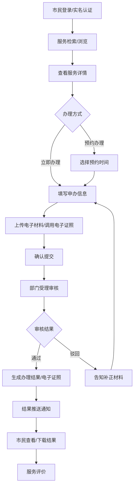
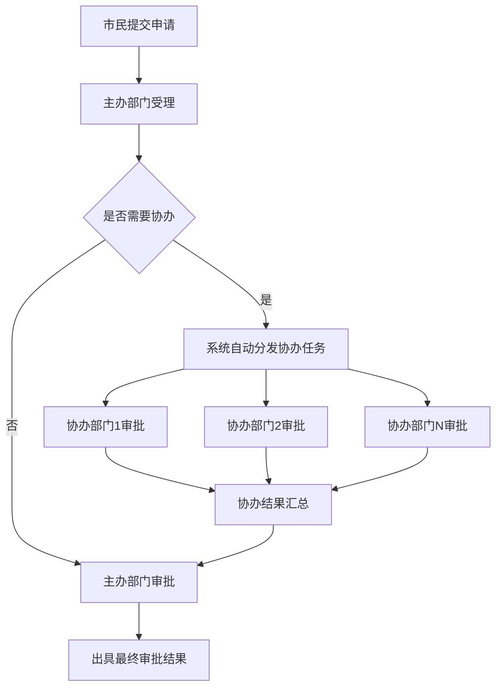

## 1. 产品概述
昆山市级城市级政务与民生服务统一工作台，面向市民、企业及政府部门提供一体化数字政务服务平台。
- 整合六大服务域480+子服务项，实现统一接入、分类检索、权限分级调用与电子证照核验
- 构建市公安局、市数据局等多部门协同治理架构，支撑政务事项全生命周期管理
- 目标价值：打造"一网通办"标杆，提升政务服务效率与市民满意度

## 2. 核心功能

### 2.1 用户角色
| 角色 | 注册方式 | 核心权限 |
|------|---------|---------|
| 市民用户 | 实名认证（对接公安人口库） | 浏览/申办服务、电子证照管理、服务评价 |
| 企业用户 | 企业信息核验注册 | 企业办事服务、批量证照管理 |
| 部门管理员 | 内部账号分配 | 本部门服务管理、事项审批、数据查看 |
| 超级管理员（市数据局） | 系统内置 | 全平台服务配置、跨部门协同、系统监控、审计管理 |
| 系统运维 | 运维账号 | 服务可用性监控、系统配置、日志管理 |

### 2.2 功能模块
1. **市民端首页**：导航栏、六大服务域入口、搜索中心、热门服务、办件进度、通知公告
2. **服务大厅**：分类浏览、筛选检索、服务详情、在线申办
3. **办事流程引擎**：预约管理、申办填写、材料上传、进度追踪、结果推送、服务评价
4. **电子证照中心**：407类证照库管理、证照详情、扫码亮证、授权使用
5. **个人中心**：实名认证、我的办件、我的证照、收藏服务、消息通知
6. **管理端驾驶舱**：部门协同看板、服务监控、热力图统计、访问审计
7. **部门管理后台**：服务项配置、审批流程管理、材料模板管理、证照类型配置
8. **系统管理**：用户权限、单点登录配置、身份认证对接、系统日志

### 2.3 页面详情
| 页面名称 | 模块名称 | 功能描述 |
|---------|---------|-----------|
| 市民端首页 | 顶部导航 | Logo、搜索框、登录/注册、消息通知、语言切换 |
| 市民端首页 | 六大服务域 | 民生服务、办事服务、医疗健康、交通出行、教育在线、生活休闲卡片入口 |
| 市民端首页 | 热门服务推荐 | 按访问量/好评度排序的Top10服务快捷入口 |
| 市民端首页 | 办件进度看板 | 用户当前进行中的办件状态展示 |
| 服务大厅页 | 分类检索 | 左侧服务域分类树、右侧服务列表+多维度筛选 |
| 服务详情页 | 服务信息 | 服务介绍、办理条件、所需材料、办理流程、办理机构 |
| 服务详情页 | 在线申办入口 | 立即办理、预约办理、收藏服务 |
| 申办流程页 | 步骤导航 | 填写信息→上传材料→确认提交→支付费用(可选)→完成 |
| 办件详情页 | 进度时间轴 | 各节点状态、处理部门、经办人、办理时间、备注 |
| 办件详情页 | 结果下载 | 证照下载、批文下载、办理结果查看 |
| 电子证照中心 | 我的证照 | 按证照类型分组展示、证照状态标识、到期提醒 |
| 电子证照详情 | 证照亮证 | 动态二维码生成、证照信息展示、使用记录 |
| 个人中心 | 账号设置 | 实名认证、手机号绑定、密码修改、隐私设置 |
| 个人中心 | 我的办件 | 全部/进行中/已完成/已评价办件列表 |
| 管理端驾驶舱 | 数据看板 | 今日办件量、服务使用率、各部门办理时效排行 |
| 管理端驾驶舱 | 行为热力图 | 市民使用行为区域热力图、时段热力图 |
| 管理端驾驶舱 | 服务监控 | 各服务接口可用性实时监控、异常告警 |
| 管理端驾驶舱 | 访问审计 | 用户登录日志、服务访问日志、异常操作记录 |
| 部门后台 | 服务管理 | 服务项CRUD、上下架管理、权限配置 |
| 部门后台 | 审批工作台 | 待办/已办审批、批量处理、审批意见 |
| 系统管理 | 用户权限 | 角色管理、部门管理、用户分配、单点登录配置 |
| 登录页 | 身份认证 | 账号密码、短信验证码、人脸识别、CA证书多种登录方式 |

## 3. 核心流程

### 3.1 市民办事主流程
市民通过统一工作台进行服务申办的完整流程：

### 3.2 电子证照亮证流程

### 3.3 跨部门协同审批流程

## 4. 用户界面设计

### 4.1 设计风格
- **主色调**：政务蓝 #1E5AA8（专业、可信）
- **辅助色**：中国红 #C62828（警示、重要）、活力绿 #2E7D32（成功、通过）、金黄 #F9A825（提醒、进行中）
- **中性色**：深灰 #2C3E50（文字）、中灰 #7F8C8D（辅助文字）、浅灰 #F5F7FA（背景）
- **按钮风格**：圆角6px、主色填充、悬停加深、点击有涟漪反馈
- **字体**：标题使用"思源宋体"彰显政务庄重感，正文使用"思源黑体"保证可读性
- **布局风格**：卡片式布局、顶部导航+左侧分类的经典政务架构、宽间距大留白
- **图标风格**：线性图标为主，重要功能使用填充图标，色彩与主题色统一

### 4.2 页面设计概览
| 页面名称 | 模块名称 | UI元素 |
|---------|---------|--------|
| 市民端首页 | Hero区域 | 渐变蓝色背景、城市剪影、搜索框居中、六大服务域图标网格排列 |
| 市民端首页 | 服务域卡片 | 彩色渐变图标+服务名称+子服务数量、悬停上浮动画 |
| 市民端首页 | 热门服务 | 横向滚动卡片、服务图标+名称+办件量+快捷办理按钮 |
| 市民端首页 | 进度看板 | 时间轴样式展示进行中办件、状态颜色标识 |
| 服务大厅页 | 筛选区域 | 标签式筛选、部门筛选、办理类型筛选、搜索框 |
| 服务大厅页 | 服务列表 | 卡片列表、服务名称标签、办理时限、在线办理按钮 |
| 申办流程页 | 步骤条 | 顶部步骤指示器、已完成绿色、进行中蓝色、未完成灰色 |
| 申办流程页 | 表单区域 | 分组表单、自动填充证照信息、实时校验提示 |
| 办件详情页 | 进度时间轴 | 垂直时间轴、节点状态色、处理部门、办理时效标记 |
| 电子证照中心 | 证照网格 | 仿真证照卡片样式、全息纹理效果、状态标签 |
| 电子证照亮证 | 亮证区域 | 居中大尺寸动态二维码、倒计时、证照信息半透明展示 |
| 管理端驾驶舱 | 数据概览 | 数据卡片+趋势小图、数字滚动动画、颜色渐变背景 |
| 管理端驾驶舱 | 热力图 | 地图背景+色块热力叠加、时间滑块、区域统计 |
| 登录页 | 认证中心 | 左侧政务品牌展示区+右侧登录表单、人脸识别动效 |

### 4.3 响应式设计
- **桌面优先**：以1920px宽度为基准设计，采用12栅格系统
- **平板适配**：1024px宽度下侧边栏可收起、服务卡片改为2列布局
- **手机适配**：768px以下顶部导航变为汉堡菜单、服务卡片单列、表单全宽
- **触控优化**：移动端按钮最小触控区域44px、表单输入框增大内边距
- **亮证模式**：手机端亮证页面自动调高屏幕亮度、支持横屏展示

### 4.4 无障碍与安全
- 符合WCAG 2.1 AA级标准，色彩对比度≥4.5:1
- 支持键盘无障碍导航（Tab键顺序合理）
- 表单操作支持撤销/二次确认机制
- 敏感信息（身份证、手机号）脱敏展示
- 重要操作留痕审计、操作日志不可篡改
