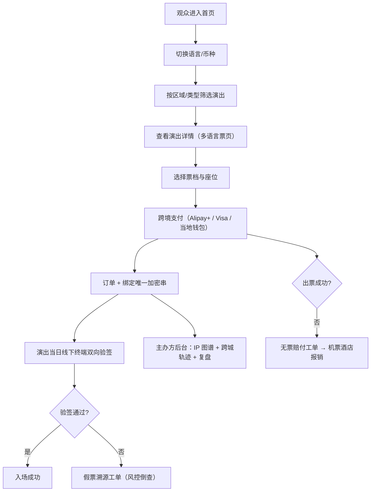

## 1. 产品概述
星程票务 StarPass — 全国性演出票务基础设施平台，覆盖内地、港澳台、日韩、东南亚市场。为 C 端观众提供多语言购票、跨境支付、无票赔付、假票核验；为主办方/经纪方提供动态定价引擎、演出 IP 资产库、跨城观演轨迹分析与复盘报表。

## 2. 核心特性

### 2.1 用户角色
| 角色 | 注册方式 | 核心权限 |
|------|----------|----------|
| 观众用户 | 邮箱 / 手机号 / 社交账号 | 多语言浏览、选座购票、跨境支付、核验门票、申请赔付 |
| 主办方运营 | 企业资质审核 | 演出发布、票档定价策略、查看观众轨迹、导出复盘报表 |
| 核验人员 | 主办方授权 | 线下终端验票、假票上报、异常工单处理 |
| 平台风控 | 内部员工 | 假票溯源、跨境支付异常复核、赔付审批 |

### 2.2 功能模块
1. **首页仪表板**：Hero 品牌区、动态定价热力指标、跨境 GMV/币种、活跃演出、热搜艺人榜
2. **演出列表与详情**：按区域/类型/日期筛选、艺人/场馆/票档展示、4 语言切换、多币种结算状态、选座
3. **工单中心**：假票溯源工单、线下核验异常、无票赔付工单、跨境支付异常四类工单 + 新增工单
4. **排期与验票**：演出排期日历、验票终端状态、场次余票监控
5. **管理后台**：动态定价面板、演出 IP 关系图谱、观众跨城观演轨迹、主办方复盘报表
6. **个人中心**：我的订单、数字票夹（加密串展示）、赔付记录、语言/币种偏好

### 2.3 页面详情
| 页面名称 | 模块名称 | 功能描述 |
|-----------|-------------|---------------------|
| 首页仪表板 | Hero 品牌区 | 多语言切换、币种切换、主标语 + 平台亮点 |
| 首页仪表板 | KPI 指标卡 | 在售演出数、在售票档数、跨境 GMV、已售座位、赔付金额、验票通过量 |
| 首页仪表板 | 动态定价指数 | 实时余票/热搜/艺人热度 → 票价变动百分比热力条 |
| 首页仪表板 | 活跃演出网格 | 艺人头像 + 场馆 + 城市 + 最低票价 + 开票状态卡片 |
| 首页仪表板 | 跨境 GMV 分栏 | 人民币/港币/新台币/日元/韩元/美元/新加坡令吉 分市场金额 |
| 演出列表 | 筛选栏 | 区域市场（内地/港澳台/日韩/东南亚）、演出类型、日期、币种 |
| 演出列表 | 演出卡片 | 海报、艺人、场馆、日期、票档区间、语言徽标、市场徽标 |
| 演出详情 | 演出头部 | 多语言标题切换、艺人卡、场馆地图、场次信息 |
| 演出详情 | 票档与定价 | 不同票档原价/动态价/涨跌幅、剩余数量、多币种对照 |
| 演出详情 | 多语言票页 | 中/英/日/韩 四语切换介绍与购票须知 |
| 演出详情 | 跨境支付 | Alipay+/Visa/Mastercard/当地钱包 Logo、结算币种展示 |
| 工单中心 | 工单分类 Tab | 全部 / 假票溯源 / 核验异常 / 无票赔付 / 支付异常 |
| 工单中心 | 新增工单 | 工单类型 + 关联演出/订单 + 描述 + 优先级 + 加密串粘贴 |
| 工单中心 | 工单卡片 | 类型徽标、状态、关联订单、处理人、SLA 倒计时 |
| 排期验票 | 排期日历 | 月度视图、每天场次色块、点击看详情 |
| 排期验票 | 验票终端状态 | 终端 ID、场馆、在线状态、已核验数、异常数 |
| 排期验票 | 余票监控 | 票档-剩余-均价 热力表 |
| 管理后台 | 动态定价面板 | 票价曲线、余票曲线、热搜指数曲线三合一图 |
| 管理后台 | IP 关系图谱 | 艺人-主办方-场馆-经纪公司节点网络图 |
| 管理后台 | 跨城观演轨迹 | 出发城市→演出城市流向桑基/弦图、Top 迁移路线 |
| 管理后台 | 主办方复盘 | 售罄时长、客单价、跨城率、复购率、满意度雷达 |
| 个人中心 | 数字票夹 | 每张票唯一加密串、QR 占位、验签状态 |
| 个人中心 | 订单与赔付 | 跨境订单、支付通道、赔付流程节点 |

## 3. 核心流程
观众在首页切换语言/币种 → 按区域筛选演出 → 进入详情页查看多语言介绍与票档 → 选座后走跨境支付（支付宝国际/Visa/当地钱包） → 系统写入订单并绑定唯一加密串 → 演出当日线下终端双向验签通过入场；如无票则自动触发赔付工单，关联机票酒店报销流程；如遇假票上报则生成溯源工单，风控沿加密串链路倒查；主办方在后台通过 IP 图谱 + 跨城轨迹 + 复盘报表优化下一轮方案。

## 4. 用户界面设计
### 4.1 设计风格
- **主色**：深空靛蓝 `#0B1A3A`（品牌深色）、霓虹洋红 `#FF2E88`（演出娱乐主色）、琥珀金 `#F5B544`（高价值/热度）
- **辅色**：青绿 `#2DD4BF`（验票通过/安全）、绯红 `#EF4444`（赔付/异常）
- **中性**：炭灰 `#0F172A` → 银灰 `#94A3B8` → 象牙 `#F8FAFC`
- **按钮**：胶囊圆角（radius 999px）+ 微光渐变 hover；主按钮霓虹洋红渐变，次按钮深空靛蓝描边
- **字体**：展示字体 "Space Grotesk"（演出科技感），正文 "Noto Sans SC / JP / KR" 多语言族
- **布局**：深色导航 + 分区卡片网格 + 大图海报 Hero；多语言切换胶囊、币种浮动面板
- **图标**：Lucide 线性（默认）+ 关键节点发光（购票、验票、赔付）
- **纹理**：Hero 叠加颗粒噪点 + 径向聚光渐变 + 演唱会光束 SVG 装饰

### 4.2 页面设计概览
| 页面名称 | 模块名称 | UI 元素 |
|-----------|-------------|-------------|
| 首页 | Hero 品牌区 | 深空靛蓝底 + 洋红光束 + 多语/币种胶囊 + 动效入场 |
| 首页 | KPI 指标卡 | 6 宫格深色玻璃卡片 + 荧光数字 + 环比箭头 |
| 首页 | 活跃演出网格 | 3 列海报卡 + 艺人圆头像 + 场馆徽标 + 悬浮放大 |
| 演出详情 | 头部 | 全屏海报横幅 + 4 语切换 + 艺人/VJ 轮播头像 |
| 演出详情 | 票档区 | 阶梯式卡片（VIP / A / B / C），涨跌幅荧光标签 |
| 工单中心 | 工单列表 | 左侧 Tab + 右侧时间线卡片 + SLA 进度环 |
| 管理后台 | IP 图谱 | SVG 节点网络图（艺人/场馆/主办方/经纪） |
| 管理后台 | 跨城轨迹 | 中国/东亚/东南亚底图弦图 + 流向线粗细代表人数 |
| 管理后台 | 复盘报表 | 雷达图 + 售罄曲线 + 分票档收入堆叠柱 |

### 4.3 响应式
桌面优先（≥1280 宽 12 栅格）；平板 8 栅格、演出网格 2 列；手机 4 栅格 1 列；底部导航抽屉替代顶栏；多语/币种切换固定为悬浮胶囊。
