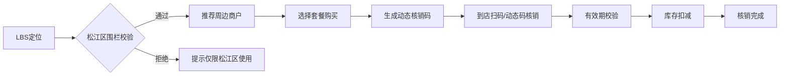

## 1. 产品概述

松江区城市生活服务中台是聚焦松江区域的本地生活垂直服务平台，覆盖餐饮、娱乐、休闲、商超等POI场景，通过整合商户资源与用户需求，打造"商户入驻-LBS推荐-套餐发布-用户核销-运营管理"的完整闭环。

- **核心目标**：构建松江区专属的本地生活服务生态，提升区域消费活力
- **解决问题**：本地商户获客难、用户缺乏区域专属优惠、运营方缺乏数据化管理手段
- **目标用户**：松江区居民、商户经营者、平台运营管理人员
- **市场价值**：深耕区域经济，打造本地化、精准化的生活服务平台标杆

## 2. 核心功能

### 2.1 用户角色

| 角色 | 注册方式 | 核心权限 |
|------|----------|----------|
| 普通用户 | 手机号注册/微信登录 | 浏览商户、购买套餐、扫码核销、查看订单 |
| 商户用户 | 营业执照+资质审核入驻 | 门店管理、套餐发布、核销验证、数据查看 |
| 运营管理员 | 后台账号登录 | 商户审核、营销活动配置、数据报表、系统管理 |

### 2.2 功能模块

1. **用户端首页**：LBS定位推荐、商圈热力图、限时优惠、分类导航
2. **商户入驻页**：资质上传、门头照上传、营业时间配置、优惠标签设置
3. **套餐详情页**：套餐信息展示、限时折扣、团购券购买、库存显示
4. **订单核销页**：扫码核销、动态码核销、有效期校验、库存扣减
5. **商户管理后台**：套餐管理、订单管理、核销记录、营业数据
6. **运营管理后台**：商户多维筛选、营销活动配置、消费报告生成、地理围栏管理

### 2.3 页面详情

| 页面名称 | 模块名称 | 功能描述 |
|----------|----------|----------|
| 用户端首页 | LBS定位模块 | 自动获取用户位置，校验松江区地理围栏，展示周边3km商户 |
| 用户端首页 | 商圈热力图 | 可视化展示松江各商圈热度，支持点击切换商圈 |
| 用户端首页 | 限时优惠专区 | 轮播展示限时折扣套餐，倒计时显示 |
| 用户端首页 | 分类导航 | 餐饮/娱乐/休闲/商超四大分类入口 |
| 商户入驻页 | 资质核验 | 营业执照上传、经营许可证上传、法人身份证验证 |
| 商户入驻页 | 门头照上传 | 支持图片上传、预览、裁剪功能 |
| 商户入驻页 | 营业时间配置 | 按周设置营业时段，支持特殊日期配置 |
| 商户入驻页 | 优惠标签配置 | 选择/自定义优惠标签（满减、折扣、赠品等） |
| 套餐详情页 | 套餐信息 | 图文展示套餐内容、原价/折扣价、适用时段 |
| 套餐详情页 | 购买模块 | 选择数量、立即购买、加入购物车 |
| 套餐详情页 | 库存显示 | 实时显示剩余库存、已售数量 |
| 订单核销页 | 扫码核销 | 调用摄像头扫描商户二维码 |
| 订单核销页 | 动态码核销 | 生成6位动态核销码，每分钟刷新 |
| 订单核销页 | 校验模块 | 有效期校验、使用范围校验、库存扣减 |
| 运营后台-商户管理 | 多维筛选 | 按街道/业态/热度/评分多维度筛选商户 |
| 运营后台-营销活动 | 活动配置 | 创建区域营销活动（如"大学城周末狂欢周"），设置活动规则、参与商户、优惠力度 |
| 运营后台-数据报表 | 消费报告 | TOP10品类排行、用户复购率、券核销率、热力趋势图 |
| 运营后台-系统设置 | 地理围栏 | 配置松江区边界坐标，强制校验所有服务调用 |

## 3. 核心流程

### 3.1 商户入驻流程
商户提交入驻申请 → 运营方资质核验 → 门头照审核 → 配置营业时间与标签 → 入驻成功 → 发布套餐

### 3.2 用户消费流程
LBS定位校验 → 浏览推荐商户 → 选择套餐 → 购买支付 → 生成核销码 → 到店核销 → 库存扣减

### 3.3 营销活动流程
运营创建活动 → 设置活动规则 → 选择参与商户 → 配置优惠力度 → 活动上线 → 数据监控 → 生成报告

## 4. 用户界面设计

### 4.1 设计风格
- **主色调**：采用城市活力蓝（#165DFF）作为主色，搭配松江特色的水绿色（#00B42A）作为辅助色，体现区域特色与科技感
- **辅助色**：暖橙色（#FF7D00）用于优惠标签和促销信息，突出价格优势
- **中性色**：深灰（#1D2129）、中灰（#4E5969）、浅灰（#C9CDD4），确保信息层级清晰
- **按钮风格**：圆角8px，主按钮采用渐变效果，悬停时有微动画和阴影变化
- **字体**：标题使用"Noto Serif SC"展现城市文化底蕴，正文使用"PingFang SC"保证可读性
- **布局风格**：卡片式布局，留白充足，层次分明，使用微妙的投影营造空间感
- **图标风格**：线性图标为主，关键功能使用面性图标增强辨识度

### 4.2 页面设计概览

| 页面名称 | 模块名称 | UI元素 |
|----------|----------|--------|
| 用户端首页 | Hero区域 | 全屏宽度，渐变背景+搜索框+定位信息，LBS动画效果 |
| 用户端首页 | 商圈热力图 | 松江地图轮廓，热力色块可视化，悬停显示商圈名称和热度值 |
| 用户端首页 | 分类导航 | 图标+文字，4列网格，悬停有上浮效果 |
| 用户端首页 | 限时优惠 | 横向滚动卡片，倒计时动效，价格突出显示 |
| 用户端首页 | 推荐列表 | 竖向卡片流，左图右文，显示距离、评分、销量、优惠标签 |
| 商户入驻页 | 表单区域 | 分步表单，步骤指示器，上传区域支持拖拽 |
| 商户入驻页 | 图片预览 | 模态框预览，支持裁剪和旋转 |
| 套餐详情页 | 商品展示 | 顶部轮播图，价格区域放大显示，划线价对比 |
| 套餐详情页 | 购买区域 | 底部悬浮固定，数量选择器+立即购买按钮 |
| 订单核销页 | 动态码 | 大尺寸动态数字，每分钟刷新动画，二维码并排展示 |
| 运营后台 | 数据看板 | 卡片式数据指标，趋势折线图，饼图展示品类分布 |
| 运营后台 | 商户列表 | 表格+筛选器，支持批量操作，状态标签 |
| 运营后台 | 活动配置 | 时间轴式活动列表，配置表单向导 |

### 4.3 响应式设计
- **桌面端（≥1280px）**：主内容区最大宽度1200px，侧边导航+内容区布局，运营后台采用经典Dashboard布局
- **平板端（768px-1279px）**：用户端单列布局，运营后台可折叠侧边栏
- **移动端（<768px）**：用户端优先，底部Tab导航，卡片占满宽度，触控目标≥44x44px，操作按钮居中放置
- **触控优化**：所有可点击元素提供视觉反馈（缩放/颜色变化），关键操作增加触觉反馈提示

### 4.4 动效与交互
- **页面加载**：骨架屏占位，内容渐入动画，列表项错落延迟显示
- **热力图**：加载时色块从浅到深渐变，悬停时有呼吸灯效果
- **倒计时**：数字翻转动画，最后10分钟变红闪烁提醒
- **核销成功**：绿色对勾缩放动画，撒花粒子效果
- **导航切换**：滑动过渡，当前项有下划线跟随动画
- **按钮交互**：点击时缩放至95%，释放后回弹，背景色渐变
