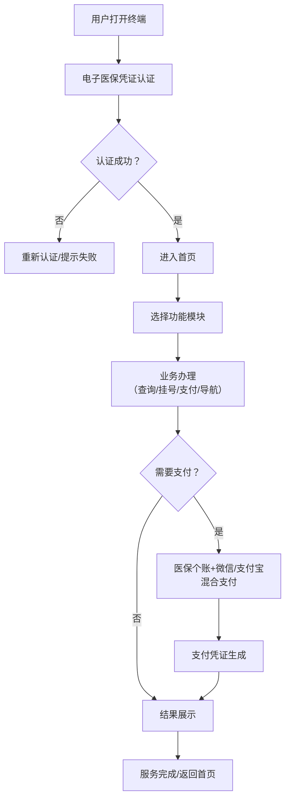
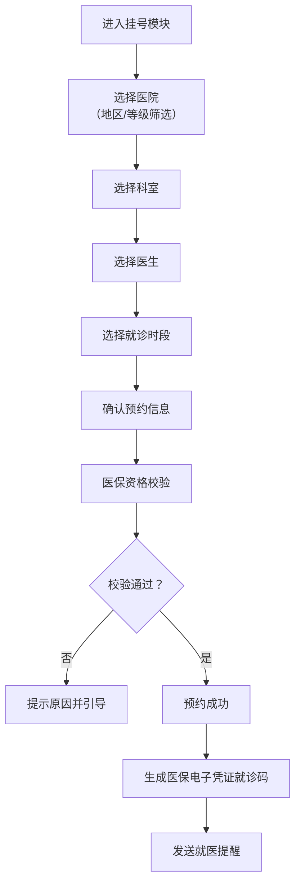
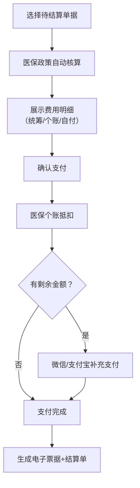

## 1. 产品概述

江苏省医保服务一体化数字终端，深度对接省级医保核心业务系统，为参保群众提供全流程、一站式医保服务。通过电子医保凭证强身份认证，实现账户查询、就诊记录、挂号预约、医保支付、医院导航等核心功能，并内置异常处理与政策推送机制，全面提升医保服务的便捷性和智能化水平。

## 2. 核心功能

### 2.1 用户角色

| 角色 | 认证方式 | 核心权限 |
|------|----------|----------|
| 参保用户 | 电子医保凭证（国家平台签发）强身份认证 | 查询个人账户、就诊记录、慢特病认定、预约挂号、医保支付、医院导航 |
| 系统管理员 | 账号密码+UKey认证 | 配置管理、数据监控、异常处理 |

### 2.2 功能模块

1. **身份认证页**：电子医保凭证扫码/人脸识别登录，强身份认证
2. **首页**：个人账户概览、快捷功能入口、政策推送公告
3. **账户查询页**：个人账户余额、消费明细（按医院/药店/药品分类）
4. **就诊记录页**：近3年就诊记录、诊断信息、处方详情、费用构成分析
5. **慢特病认定页**：门诊慢特病认定状态查询、申请进度追踪
6. **挂号预约页**：全省二级以上医院号源池、科室/医生/时段筛选
7. **医保支付页**：诊间结算、出院一站式清算、个账+微信/支付宝混合支付
8. **医院导航页**：高德POI搜索、室内地图、医保定点资质与报销比例标注
9. **异常预警页**：异地就医备案状态、医保待遇异常预警、政策更新推送

### 2.3 页面详情

| 页面名称 | 模块名称 | 功能描述 |
|----------|----------|----------|
| 身份认证页 | 凭证登录模块 | 支持电子医保凭证扫码登录、人脸识别登录，对接国家医保平台强身份认证 |
| 身份认证页 | 生物识别模块 | 人脸采集与比对，活体检测，确保身份真实性 |
| 首页 | 账户概览 | 实时显示个人账户余额、本月消费、医保待遇状态 |
| 首页 | 快捷入口 | 六大功能模块快速访问，支持自定义排序 |
| 首页 | 政策推送轮播 | 按参保地精准推送最新医保政策、公告通知 |
| 账户查询页 | 余额展示 | 个人账户余额、统筹基金余额、年度累计消费 |
| 账户查询页 | 消费明细 | 支持按时间范围、医院、药店、药品分类筛选，图表可视化 |
| 就诊记录页 | 记录列表 | 近3年就诊记录分页展示，按时间倒序排列 |
| 就诊记录页 | 详情展开 | 诊断信息、处方药品、检查检验项目、费用构成饼图 |
| 慢特病认定页 | 状态查询 | 认定状态、有效期、认定病种列表 |
| 慢特病认定页 | 申请进度 | 线上申请提交、材料上传、审批进度追踪 |
| 挂号预约页 | 医院筛选 | 支持按地区、等级、专科、医保定点筛选 |
| 挂号预约页 | 号源查询 | 科室、医生、时段三级筛选，号源实时刷新 |
| 挂号预约页 | 预约确认 | 预约成功后自动生成医保电子凭证就诊码 |
| 医保支付页 | 待结算列表 | 诊间费用、住院费用待结算清单 |
| 医保支付页 | 混合支付 | 医保个账抵扣 + 微信/支付宝补充支付，一键完成 |
| 医保支付页 | 支付凭证 | 电子票据生成与下载，医保结算单预览 |
| 医院导航页 | POI搜索 | 高德地图POI搜索，支持关键词、周边、分类检索 |
| 医院导航页 | 室内地图 | 支持楼层切换、科室定位、路径规划 |
| 医院导航页 | 医保信息标注 | 定点资质标识、报销比例、起付线信息叠加展示 |
| 异常预警页 | 异地备案 | 异地就医备案状态，失败自动重试机制 |
| 异常预警页 | 待遇预警 | 医保待遇享受异常实时弹窗预警 |
| 异常预警页 | 政策推送 | 按参保地精准触达政策更新消息中心 |

## 3. 核心流程

### 3.1 用户主流程

参保用户打开终端 → 电子医保凭证身份认证 → 首页功能选择 → 对应业务办理 → 结果反馈/支付 → 服务完成

### 3.2 挂号预约流程

选择医院 → 选择科室 → 选择医生 → 选择时段 → 确认预约 → 生成就诊码 → 就医提示

### 3.3 医保支付流程

待结算单确认 → 医保政策核算 → 个账抵扣 → 剩余金额混合支付 → 电子票据

## 4. 用户界面设计

### 4.1 设计风格

**设计定位**：政务民生类数字终端界面，强调专业、可信、便捷、温暖

- **主色调**：医保蓝 `#1677FF`（国家医保标准色），传递专业、可信的政务属性
- **辅助色**：
  - 医疗绿 `#00B42A`：用于成功状态、医保定点标识
  - 温暖橙 `#FF7D00`：用于预警、提示信息
  - 健康红 `#F53F3F`：用于错误状态、紧急提醒
- **中性色**：以 `slate` 色系为基础，确保政务界面的稳重感
- **按钮风格**：圆角 8px，主按钮采用渐变效果 `linear-gradient(135deg, #1677FF 0%, #0958D9 100%)`，带轻微阴影
- **字体**：
  - 标题：`"Noto Sans SC"`，加粗，字重 600-700
  - 正文：`"PingFang SC"`，常规，字重 400-500
  - 数字展示：`"Roboto Mono"` 等宽字体，确保金额、日期对齐
- **布局风格**：卡片式布局，模块分区清晰，信息层级分明，采用 8px 栅格系统
- **图标风格**：Lucide 线性图标，线条宽度 1.5px，与文字保持 4px 间距
- **动效设计**：
  - 页面切换：淡入淡出 + 轻微位移 (transform: translateY(8px) → 0)
  - 卡片悬停：阴影加深 + 上移 2px (transition: all 0.2s ease)
  - 数据加载：骨架屏 + 脉冲动画
  - 支付成功：圆环扩散动画 + 钩形绘制

### 4.2 页面设计概览

| 页面名称 | 模块名称 | UI元素 |
|----------|----------|--------|
| 身份认证页 | 凭证登录 | 大型扫码区域、人脸识别按钮、医保Logo、渐变背景、动态光效 |
| 首页 | 账户概览 | 圆角渐变卡片、大号余额数字、趋势箭头、快捷功能网格（3×2）、政策轮播横幅 |
| 账户查询页 | 消费明细 | Tab切换（医院/药店/药品）、时间筛选器、柱状图趋势、明细列表、分类统计饼图 |
| 就诊记录页 | 记录详情 | 时间轴布局、可折叠卡片、费用构成环形图、处方药品标签、诊断关键词高亮 |
| 挂号预约页 | 号源池 | 医院筛选侧边栏、日历组件、号源时段网格、医生头像卡片、实时号源状态标签 |
| 医保支付页 | 混合支付 | 费用明细表格、医保政策标签、支付方式选择（个账/微信/支付宝）、支付进度条 |
| 医院导航页 | 地图导航 | 高德地图容器、POI搜索框、医保定点图标、楼层切换器、室内路径绘制 |
| 异常预警页 | 消息中心 | 消息分类Tab、预警卡片（带颜色状态）、重试按钮、政策推送时间线 |

### 4.3 响应式设计

- **桌面优先**：基准分辨率 1920×1080，适配医保大厅触控终端（21.5寸/27寸）
- **平板适配**：≥ 768px，侧边栏收起为图标模式，网格布局自适应列数
- **触控优化**：
  - 最小点击区域 48×48px
  - 按钮间距 ≥ 8px
  - 支持双击放大、双指缩放（地图模块）
  - 滚动条宽度 12px，便于触控操作

### 4.4 无障碍设计

- 符合 WCAG 2.1 AA 级标准
- 颜色对比度 ≥ 4.5:1（正文）、≥ 3:1（大文本）
- 所有交互元素支持键盘导航（Tab/Enter/Space）
- 重要信息提供语音播报（调用终端TTS接口）
- 支持高对比度模式切换（为视力障碍用户）
