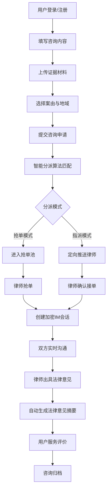
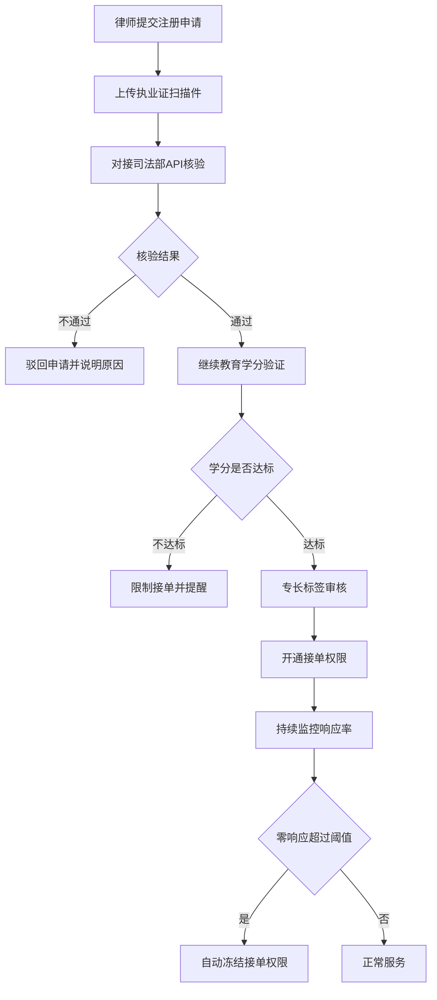
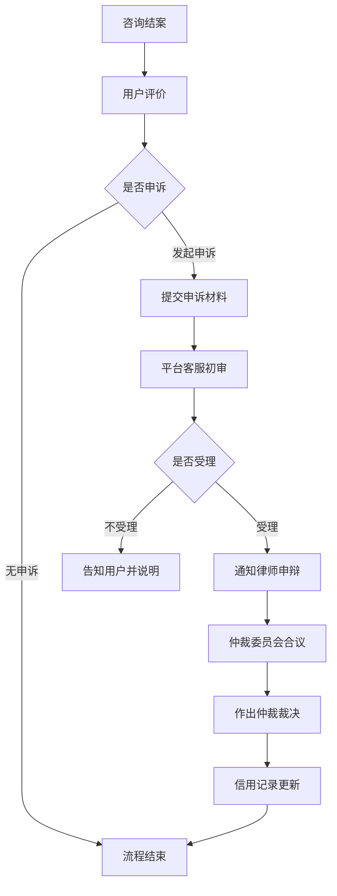

# 法律公益咨询协同平台 - 产品需求文档（PRD）

## 1. 产品概述

法律公益咨询协同平台是一个面向公众提供免费法律咨询服务的公益平台，致力于解决律师资源调度不均与服务可信保障两大核心痛点。平台通过智能分派算法实现用户与律师的精准匹配，保障咨询服务的专业性、安全性与高效性。

- 目标用户：有法律咨询需求的普通公众、具备执业资质的志愿律师、平台管理员
- 核心价值：公益普惠、精准匹配、安全可信、全程可追溯

## 2. 核心功能

### 2.1 用户角色

| 角色 | 注册方式 | 核心权限 |
|------|----------|----------|
| 普通用户 | 手机号/实名认证 | 提交咨询、上传证据、IM会话、评价服务 |
| 志愿律师 | 执业证核验+资质审核 | 抢单/接受指派、IM会话、提交法律意见 |
| 平台管理员 | 内部账号 | 律师资质审核、纠纷仲裁、数据监控 |

### 2.2 功能模块

1. **首页/用户咨询大厅**：平台介绍、案由分类导航、咨询提交入口
2. **咨询提交页**：文字描述、语音录入、图片证据上传、案由/地域选择
3. **智能分派中心**：按案由+地域+专长标签匹配、抢单池+指派双模式
4. **律师工作台**：待接单列表、进行中咨询、历史咨询、资质状态
5. **加密IM会话室**：端到端加密、阅后即焚、证据水印、消息撤回
6. **结案归档系统**：自动生成《法律意见摘要》、电子归档、查询调阅
7. **律师资质核验中心**：执业证核验、继续教育学分、信用档案
8. **纠纷处理中心**：服务评价、申诉提交、仲裁裁决、信用记录
9. **后台监控仪表盘**：饱和度监控、响应时长、律师活跃度、自动冻结

### 2.3 页面详情

| 页面名称 | 模块名称 | 功能描述 |
|----------|----------|----------|
| 用户首页 | 导航栏/Hero区 | 平台介绍、快速咨询入口、案由分类 |
| 用户首页 | 公益数据展示 | 累计咨询量、服务律师数、满意度统计 |
| 咨询提交页 | 问题描述 | 富文本编辑、语音转文字、字数统计 |
| 咨询提交页 | 证据上传 | 多图上传、拖拽上传、图片预览、压缩 |
| 咨询提交页 | 分类选择 | 案由分类（婚姻/劳动/债务/房产等）、地域选择 |
| 律师工作台 | 抢单大厅 | 待分派案件列表、筛选、抢单操作 |
| 律师工作台 | 我的咨询 | 进行中/已结案列表、入口跳转 |
| 加密IM会话 | 消息列表 | 加密消息、阅后即焚计时、文件水印 |
| 加密IM会话 | 证据展示区 | 带水印的证据图片、下载限制 |
| 结案页面 | 法律意见摘要 | 自动生成、律师确认、用户查阅 |
| 资质核验中心 | 律师档案 | 执业证信息、教育学分、信用评级 |
| 纠纷处理中心 | 评价/申诉 | 星级评价、文字评价、申诉表单 |
| 监控仪表盘 | 数据概览 | 饱和度热力图、响应时长趋势、律师排名 |

## 3. 核心流程

### 3.1 用户咨询流程

用户提交咨询后，系统根据案由、地域、律师专长标签进行智能匹配，进入抢单池或直接指派。律师响应后进入加密IM会话，咨询结束自动生成法律意见摘要并归档。

### 3.2 律师资质核验流程

### 3.3 纠纷处理流程

## 4. 用户界面设计

### 4.1 设计风格

- **主色调**：正义蓝 (#0F4C81) - 代表专业、信任、权威
- **辅助色**：天平金 (#C9A962) - 代表公平、公正
- **警示色**：警戒红 (#C0392B) - 用于重要提示与风险警告
- **成功色**：公益绿 (#27AE60) - 代表公益与希望
- **中性色**：石墨灰 (#2C3E50)、银灰色 (#BDC3C7)、象牙白 (#F8F9FA)
- **按钮风格**：微圆角（8px）、悬浮阴影反馈、渐变填充
- **字体**：标题 - Noto Serif SC（衬线体，彰显法律庄重感）；正文 - Noto Sans SC（无衬线体，保证可读性）
- **布局风格**：卡片式布局、左右分栏（IM场景）、顶部固定导航
- **图标风格**：线性图标、法律元素（天平、法典、印章等）、统一2px线宽

### 4.2 页面设计概述

| 页面名称 | 模块名称 | UI元素 |
|----------|----------|--------|
| 用户首页 | Hero区 | 全屏渐变背景、大标题衬线字体、动画入场、快速咨询悬浮按钮 |
| 用户首页 | 数据展示 | 数字滚动动画、卡片式布局、图标+数据组合 |
| 咨询提交页 | 表单区 | 分步引导、进度条、文件拖拽区、语音录入波纹动画 |
| 律师工作台 | 抢单大厅 | 列表卡片、标签徽章、倒计时抢单按钮、筛选侧栏 |
| 加密IM会话 | 消息区 | 气泡消息、阅后即焚进度条、水印遮罩层、加密状态指示器 |
| 加密IM会话 | 证据展示 | 图片水印、查看权限控制、过期自动销毁提示 |
| 监控仪表盘 | 数据面板 | 热力图、折线趋势图、环形进度、实时数据刷新动效 |

### 4.3 响应式设计

- 桌面端优先设计（1440px基准）
- 平板端（768-1024px）：侧栏收起为汉堡菜单、卡片自适应网格
- 移动端（<768px）：单列布局、底部导航栏、触摸优化间距
- IM会话支持全屏沉浸式体验

### 4.4 动效设计

- 页面加载：staggered渐入动画
- 抢单按钮：脉冲波纹+倒计时动效
- 消息发送：滑入+缩放反馈
- 数据卡片：数字滚动计数
- 证据水印：平铺半透明+用户信息融合
