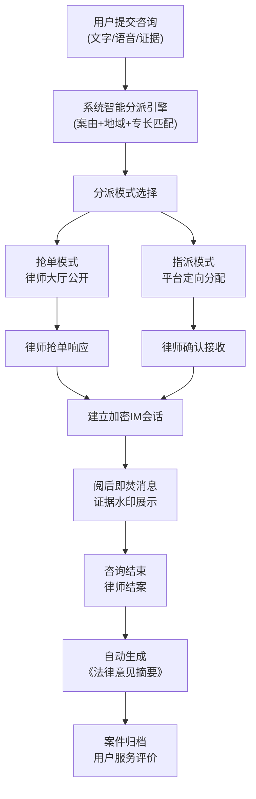
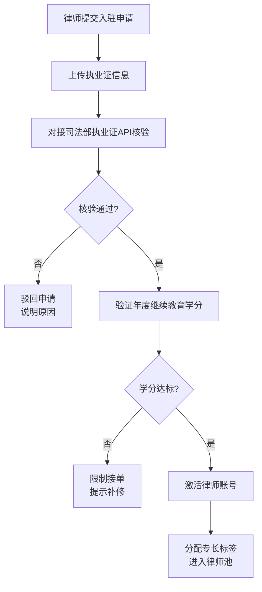
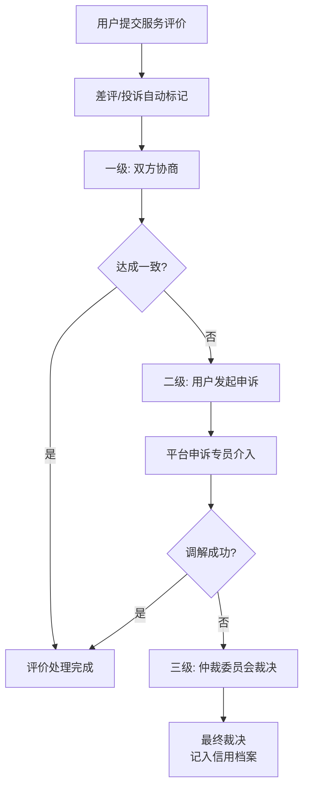

## 1. 产品概述
法律公益咨询协同平台，聚焦律师资源智能调度与法律服务可信保障，通过数字化手段连接有法律需求的公众与公益律师，构建高效、安全、可信赖的公益法律服务生态。
- 核心解决：公益律师资源分配不均、服务过程缺乏信任、咨询质量难以监管、纠纷处理机制缺失等痛点
- 目标用户：有法律咨询需求的公众、公益执业律师、平台运营管理人员
- 产品价值：降低法律援助门槛，保障服务质量与可信度，提升公益法律服务效率

## 2. 核心功能

### 2.1 用户角色

| 角色 | 注册方式 | 核心权限 |
|------|---------|---------|
| 咨询用户 | 手机号/实名注册 | 提交法律咨询、上传证据材料、参与加密IM会话、评价服务、发起申诉 |
| 公益律师 | 资质审核后入驻 | 抢单/接收指派咨询、参与加密IM会话、生成法律意见、查看服务数据 |
| 平台管理员 | 后台账号 | 律师资质核验、纠纷仲裁处理、监控服务饱和度、管理律师权限 |

### 2.2 功能模块

1. **用户端首页**：平台介绍、服务流程、案由分类入口、提交咨询入口、公益数据展示
2. **咨询提交页**：问题描述（文字/语音输入）、案由选择、地域选择、证据上传（图片/文档）
3. **用户咨询列表**：进行中咨询、历史咨询、案件状态、消息提醒
4. **律师抢单大厅**：待分配咨询列表、智能推荐、抢单操作、筛选过滤
5. **加密IM会话**：阅后即焚消息、证据水印显示、文件传输、会话加密标识
6. **律师案件管理**：我的案件、待响应、进行中、已结案、法律意见生成
7. **律师资质核验中心**：执业证核验、继续教育学分验证、资质状态管理
8. **纠纷处理中心**：服务评价列表、申诉处理、仲裁裁决
9. **运营监控看板**：公益服务饱和度、人均咨询量、平均响应时长、律师活跃度

### 2.3 页面详情

| 页面名称 | 模块名称 | 功能描述 |
|---------|---------|---------|
| 用户端首页 | 英雄区域 | 平台标语、核心价值展示、快速提交入口、动画背景 |
| 用户端首页 | 案由分类 | 婚姻家庭、劳动纠纷、债务债权、交通事故等分类卡片 |
| 用户端首页 | 服务流程 | 提交→分派→咨询→结案四步流程可视化 |
| 用户端首页 | 公益数据 | 累计咨询量、服务律师数、满意度、响应时长等数据展示 |
| 咨询提交页 | 问题输入 | 富文本输入、语音录制、字数统计 |
| 咨询提交页 | 分类选择 | 案由分类、所在地区、紧急程度选择 |
| 咨询提交页 | 证据上传 | 图片/文档上传、预览、删除、水印提示 |
| 用户咨询列表 | 状态标签 | 待分派、咨询中、已结案、已评价状态筛选 |
| 用户咨询列表 | 咨询卡片 | 律师信息、最后消息、时间、未读标记 |
| 律师抢单大厅 | 智能推荐 | 匹配专长标签的咨询优先展示、推荐标识 |
| 律师抢单大厅 | 抢单操作 | 一键抢单、查看详情、竞争人数显示 |
| 加密IM会话 | 消息区域 | 阅后即焚倒计时、已读状态、消息气泡样式区分 |
| 加密IM会话 | 证据展示 | 图片水印、文件脱敏显示、下载权限控制 |
| 加密IM会话 | 会话控制 | 阅后即焚开关、清空会话、结案按钮 |
| 律师案件管理 | 案件列表 | 待响应、进行中、已结案分类Tab |
| 律师案件管理 | 法律意见 | 模板化生成、自动填充、编辑、提交归档 |
| 资质核验中心 | 核验列表 | 待审核、已通过、已驳回、已冻结状态 |
| 资质核验中心 | 详情核验 | 执业证信息比对、继续教育学分验证、操作记录 |
| 纠纷处理中心 | 三级处理链 | 服务评价→申诉→仲裁流程可视化、状态流转 |
| 运营监控看板 | 饱和度监控 | 人均咨询量趋势图、律师负载热力图 |
| 运营监控看板 | 响应统计 | 平均响应时长、零响应律师预警、自动冻结列表 |

## 3. 核心流程

### 3.1 咨询服务主流程
用户提交法律咨询问题（支持文字/语音输入及图片证据上传），系统根据案由分类、地域信息、律师专长标签进行智能匹配分派。律师可通过抢单模式主动接单，或由平台进行指派分配。响应后进入端到端加密IM会话，支持消息阅后即焚及证据文件水印保护。咨询结束后律师生成《法律意见摘要》并自动归档，用户进行服务评价。

### 3.2 流程示意图

### 3.3 律师入驻与资质核验流程

### 3.4 纠纷处理三级流程

## 4. 用户界面设计

### 4.1 设计风格
- **主色调**：深靛蓝 (#1e3a5f) - 象征法律的专业、稳重与权威
- **辅助色**：金棕色 (#c9a962) - 象征公正与公信力；青绿 (#2dd4bf) - 象征公益与希望
- **背景色系**：暖灰白 (#fafaf7) 为底色，配合深靛蓝的头部与导航
- **按钮风格**：圆角矩形（8px），主按钮采用深靛蓝填充配金色文字边框，悬停有微上浮动效
- **字体**：标题使用 Noto Serif SC（衬线体，彰显法律文书的庄重感），正文使用 Noto Sans SC（清晰易读）
- **布局风格**：卡片式布局，适度留白，重要信息配金色边框装饰，整体风格庄重而不失现代感
- **图标风格**：线性图标配金色点缀，使用法律相关元素（天平、法典、盾牌等）

### 4.2 页面设计概览

| 页面名称 | 模块名称 | UI元素 |
|---------|---------|--------|
| 用户端首页 | 英雄区域 | 全屏渐变背景（深靛蓝→藏青），金色装饰线条，衬线体大标题，浮动动画数据卡片 |
| 用户端首页 | 案由分类 | 6张分类卡片网格，图标+名称+简介，悬停金色边框高亮 |
| 用户端首页 | 服务流程 | 水平时间轴，4个节点带连线，金色节点标记，步骤卡片 |
| 用户端首页 | 公益数据 | 4个数据展示块，大数字配金色单位，背景微透明玻璃质感 |
| 咨询提交页 | 问题输入 | 大尺寸文本域，语音录制按钮（圆形脉动动画），实时字数统计 |
| 咨询提交页 | 分类选择 | 下拉选择器，地区联动选择，紧急程度滑块 |
| 咨询提交页 | 证据上传 | 拖拽上传区域，文件卡片缩略图，水印提示标签 |
| 加密IM会话 | 消息区域 | 左右气泡区分，阅后即焚消息带火焰图标+倒计时，会话背景有暗纹 |
| 加密IM会话 | 证据展示 | 图片带斜纹水印，文件名脱敏显示，下载需二次确认 |
| 资质核验中心 | 核验列表 | 表格布局，状态标签颜色区分，操作列按钮组 |
| 运营监控看板 | 饱和度监控 | ECharts折线图+热力图，阈值警戒线，异常数据高亮 |

### 4.3 响应式设计
- 桌面端优先设计（1280px及以上），三栏布局可充分展示监控数据与会话内容
- 平板端（768px-1279px）：导航折叠为侧边抽屉，卡片布局调整为2列
- 移动端（<768px）：单栏流式布局，底部Tab导航，IM会话全屏展示
- 所有交互元素保证最小44px触控区域，关键操作支持手势（滑动删除、长按预览等）

### 4.4 动效与微交互
- 页面加载：采用渐入+上移动画，元素按层级顺序延迟出现
- 抢单按钮：点击时有波纹扩散动效，抢单成功显示金色对勾动画
- 阅后即焚：消息消失时有火焰燃烧渐隐效果
- 数据看板：数字滚动计数动画，图表渐变填充
- 卡片悬停：微上浮（translateY -4px）+ 金色边框渐变高亮
