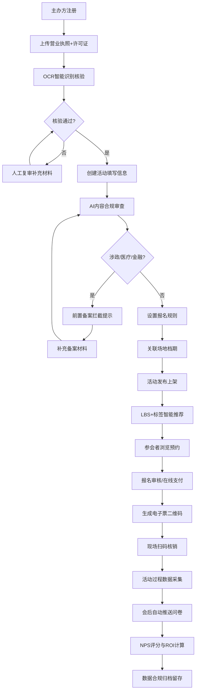

## 1. 产品概述

垂直领域活动全生命周期管理平台，覆盖从主办方资质核验到会后数据分析的完整业务闭环，服务活动主办方、参会者、场地服务商三类核心主体。通过AI合规审查、智能推荐引擎、数据看板等模块，解决活动运营中的资质风险、内容合规、精准获客、效果量化等核心痛点，所有数据严格遵循《大型群众性活动安全管理条例》留存要求。

---

## 2. 核心功能

### 2.1 用户角色

| 角色 | 注册方式 | 核心权限 |
|------|----------|----------|
| 活动主办方 | 企业资质注册+OCR核验 | 创建活动、设置报名规则、查看ROI看板、核销管理、NPS分析 |
| 参会者 | 手机号/微信注册 | 浏览推荐活动、预约报名、扫码入场、填写问卷 |
| 场地服务商 | 企业资质注册 | 场地资源上架、档期管理、订单接收、结算对账 |
| 平台管理员 | 后台分配 | 资质复审、合规审计、数据留存管理、行业热词监测 |

### 2.2 功能模块

1. **主办方工作台**：资质管理、活动创建与编辑、报名审核、付费设置、直播权限、核销管理、问卷归档
2. **参会者门户**：LBS活动推荐、兴趣标签匹配、预约/购票、电子票包、扫码核销、会后问卷
3. **场地服务平台**：场地展示、档期日历、订单匹配、服务评价
4. **AI审核中心**：营业执照OCR、行业许可证核验、内容合规审查（涉政/医疗/金融前置拦截）
5. **智能推荐引擎**：基于LBS定位、用户画像、兴趣标签、活动热度的多维推荐
6. **数据看板中心**：活动ROI分析、讲师影响力图谱、行业热词趋势监测、NPS报告生成
7. **合规档案系统**：活动数据留存（≥180天）、安全台账、审计日志、导出报备

### 2.3 页面详情

| 页面名称 | 模块名称 | 功能描述 |
|----------|----------|----------|
| 登录注册页 | 角色选择面板 | 三类主体入口、手机号验证、企业/个人注册表单 |
| 资质核验页 | OCR上传组件 | 营业执照上传、许可证上传、OCR识别结果对比、人工复审状态 |
| 主办方工作台 | 活动概览卡片 | 在办/待办/已结束活动统计、快速创建入口、最近核销记录 |
| 活动创建页 | 多步骤表单 | 基本信息→合规预审→报名设置（审核/付费/直播）→场地关联→发布预览 |
| 报名设置面板 | 规则配置器 | 报名审核开关、付费墙价格阶梯、直播权限白名单、报名人数上限 |
| 参会者首页 | LBS推荐区 | 定位授权、距离排序、附近活动地图、兴趣标签筛选器 |
| 活动详情页 | 报名交互区 | 活动介绍、日程、讲师、场地、报名/购票按钮、分享裂变 |
| 核销管理页 | 扫码核销组件 | 二维码扫描、批量核销、核销统计、异常预警（重复/过期票） |
| 问卷中心 | 问卷模板库 | 会后问卷自动发送、答题进度、数据归档、NPS计算 |
| ROI数据看板 | 多维图表 | 报名转化率漏斗、完课率曲线、线索留资量、获客成本分析 |
| 讲师影响力页 | 图谱可视化 | 跨活动频次图谱、观众复购热力、评分趋势、合作推荐 |
| 行业趋势页 | 热词云图 | AIGC/Web3等标签聚类、时间趋势线、同比环比、预警阈值 |
| 合规档案页 | 留存管理 | 按活动/日期筛选、数据完整性检查、一键导出、审计日志 |
| 场地服务商页 | 档期管理 | 场地日历、价格配置、订单列表、评价管理、结算中心 |

---

## 3. 核心流程

### 3.1 活动创建与执行全流程

主办方完成资质OCR核验后创建活动，系统进行AI合规审查，通过后发布至推荐引擎。参会者基于LBS与标签匹配发现活动，完成预约/支付后获取电子票。现场扫码核销入场，会后自动触发问卷回收，系统生成NPS报告与ROI看板。全流程数据自动归档至合规档案系统。

### 3.2 数据合规留存流程

每笔活动数据（报名信息、核销记录、影像资料、问卷数据）均按照《大型群众性活动安全管理条例》要求加密存储，留存期不少于180天，支持监管部门调阅导出。

---

## 4. 用户界面设计

### 4.1 设计风格

- **主色**：深海蓝 `#0A2463`（专业、信任、政务合规感）
- **辅色**：活力橙 `#F77F00`（活动热度、行动号召）、翡翠绿 `#2A9D8F`（合规通过、安全状态）
- **警示色**：胭脂红 `#D62828`（合规拦截、异常预警）、琥珀黄 `#FCBF49`（待审核、提醒）
- **按钮风格**：微立体圆角（6px），渐变填充，hover浮起阴影+0.12s过渡
- **字体方案**：标题用 Noto Serif SC（衬线体，体现正式感与权威感），正文用 Inter 优化版定制字体（提高屏幕可读性），数字用 JetBrains Mono（数据看板）
- **布局风格**：模块化卡片布局，左侧导航+顶部状态条，数据看板区采用非对称栅格+嵌套卡片
- **视觉层次**：玻璃拟态（Glassmorphism）用于弹窗与浮层，数据卡片采用多层阴影+边框渐变营造品质感
- **图标风格**：线性粗细2px圆角图标，关键状态辅以微型色点标记

### 4.2 页面设计概览

| 页面名称 | 模块名称 | UI 要素 |
|----------|----------|---------|
| 登录注册页 | 角色选择面板 | 三列竖排卡片（主办方/参会者/服务商），悬浮发光边框，选中态渐变描边+内阴影 |
| 资质核验页 | OCR上传组件 | 大尺寸虚线拖拽区，上传后实时OCR进度条，识别字段侧面对比高亮 |
| 主办方工作台 | 活动概览卡片 | 顶部KPI四宫格（渐变色块+大数字），活动列表带状态色签，快捷操作悬浮工具栏 |
| 活动创建页 | 多步骤表单 | 顶部步骤条（带对勾动画），当前步骤卡片放大投影，侧边实时合规检查清单 |
| 参会者首页 | LBS推荐区 | 顶部地图容器（半透明浮层+活动气泡），下方瀑布流活动卡，标签横向滚动筛选 |
| 活动详情页 | 报名交互区 | 首屏大图+文字错落排版，倒计时徽章，讲师卡片带社交认证标识 |
| 核销管理页 | 扫码核销组件 | 居中扫码框（扫描线动画），左右分栏（实时核销流+统计饼图） |
| ROI数据看板 | 多维图表 | 非对称Bento Grid布局，转化率漏斗带流光效果，关键KPI卡片数字滚动动画 |
| 讲师影响力页 | 图谱可视化 | 力导向关系图（讲师为节点→活动连线），点击节点展开详情侧滑板 |
| 行业趋势页 | 热词云图 | 彩色词云交互（hover放大+定义线），下方时间趋势面积图带渐变填充 |
| 合规档案页 | 留存管理 | 列表带进度条指示留存天数，到期预警红色标记，导出操作带审批流弹窗 |

### 4.3 响应式设计

- **桌面优先**：1440px基准栅格（12列，24px间距），数据看板≥1280px最佳
- **平板适配**：≥768px，左侧导航收起为图标模式，看板卡片重排为2列
- **移动端**：<768px，底部Tab导航，核销扫码全屏模式，图表简化为关键指标
- **触控优化**：可点击区域≥44×44px，长列表惯性滚动，关键操作二次确认弹层

### 4.4 动效规范

- 页面加载：模块级错峰入场（stagger 80ms），从下往上淡入位移12px
- 数据更新：KPI数字滚动（countUp），图表重绘带路径描边动画
- 状态切换：Tab/步骤条采用滑块弹性过渡（cubic-bezier(0.34, 1.56, 0.64, 1)）
- 合规检查：通过态打勾SVG路径描边动画，拦截态红色脉冲波纹×3次
- 扫码核销：成功态绿色对勾+震动反馈（移动端），失败态红色抖动+错误提示
