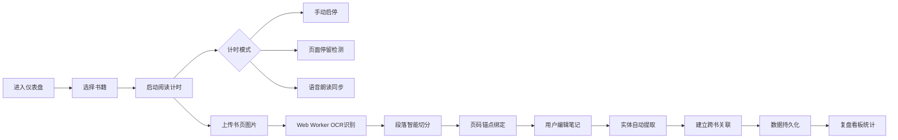

## 1. 产品概述

面向深度阅读者的个人知识管理SaaS平台，以阅读行为结构化为核心，将阅读过程中的计时、笔记、关联、复盘形成闭环。帮助用户建立从"输入-处理-关联-输出"的完整知识内化流程，解决阅读碎片化、笔记孤岛化、知识遗忘率高的痛点。目标用户为学术研究者、专业读者、终身学习者群体。

## 2. 核心功能

### 2.1 用户角色

| 角色 | 注册方式 | 核心权限 |
|------|----------|----------|
| 个人用户 | 本地匿名使用（无需注册） | 全部功能：书籍管理、阅读计时、OCR笔记、知识图谱、复盘看板、数据导出 |

### 2.2 功能模块

1. **阅读仪表盘**：今日阅读概览、阅读计时器入口、最近阅读书籍、未完成预警
2. **书籍库管理**：书籍列表、书籍详情、ISBN/豆瓣元数据补全、自定义标签体系、阅读进度追踪
3. **阅读计时器**：手动启停计时、页面停留自动检测、语音朗读进度同步模式
4. **OCR笔记引擎**：图片上传、Web Worker本地OCR识别、中文图文混排、段落智能切分、原文页码锚点绑定
5. **笔记关联图谱**：实体自动提取（人名/概念/事件）、跨书链接可视化、节点关系网络、图谱交互探索
6. **阅读复盘看板**：周/月维度切换、书籍类型分布、专注时长曲线、笔记密度热力图、未完成书目预警
7. **数据导出中心**：Markdown格式导出、附件打包下载、自定义导出范围

### 2.3 页面详情

| 页面名称 | 模块名称 | 功能描述 |
|-----------|-------------|---------------------|
| 阅读仪表盘 | 今日概览卡 | 显示今日已读时长、笔记数、正在阅读书籍数 |
| 阅读仪表盘 | 快速计时器 | 大尺寸计时器，支持手动开始/暂停/结束，模式切换 |
| 阅读仪表盘 | 最近阅读列表 | 最近5本阅读书籍，显示进度条和继续阅读按钮 |
| 阅读仪表盘 | 预警面板 | 标记超过7天未继续的书籍，提醒续读 |
| 书籍库 | 书籍网格/列表 | 封面展示、标签筛选、搜索、排序（添加时间/阅读进度/书名） |
| 书籍库 | 添加书籍弹窗 | ISBN输入扫描、手动填写、豆瓣搜索补全元数据、封面上传 |
| 书籍详情 | 元数据编辑区 | 书名/作者/出版社/ISBN/页数/分类/标签可编辑 |
| 书籍详情 | 阅读进度追踪 | 页码滑块、开始/结束日期、预估剩余时间 |
| 书籍详情 | 笔记时间线 | 按页码和时间排序的笔记列表，支持展开折叠 |
| OCR笔记页 | 图片上传区 | 拖拽上传、粘贴上传、多图批量，缩略图预览队列 |
| OCR笔记页 | 识别进度面板 | Web Worker状态、单图进度、全局进度、可取消 |
| OCR笔记页 | 识别结果编辑器 | 原文对照、段落切分、页码绑定、标签标记、文本编辑 |
| 笔记图谱 | 力导向图谱 | 实体节点拖拽、缩放、选中高亮、关系连线 |
| 笔记图谱 | 实体筛选栏 | 按实体类型（人名/概念/事件）、关联书籍筛选 |
| 笔记图谱 | 详情侧栏 | 选中实体的所有笔记引用列表、跳转原文 |
| 复盘看板 | 时间维度切换 | 周报/月报切换器、自定义日期范围 |
| 复盘看板 | 类型分布饼图 | 按书籍分类统计阅读时长占比 |
| 复盘看板 | 专注时长曲线 | 每日专注时长折线图，含趋势线和均线 |
| 复盘看板 | 笔记密度热力图 | 日历热力图，颜色深浅代表当日笔记数量 |
| 复盘看板 | 未完成预警表 | 列出所有已开始未完成书籍，显示停滞天数、完成率 |
| 数据导出 | 导出配置面板 | 选择导出范围（全部/指定书籍/时间范围）、格式选项 |
| 数据导出 | 导出预览 | Markdown结构预览、附件清单确认 |

## 3. 核心流程

### 3.1 阅读与笔记主流程

用户进入仪表盘 → 选择书籍或直接启动计时器 → 进入阅读计时模式（手动/停留检测/语音同步） → 阅读中上传书页图片 → Web Worker本地执行OCR识别 → 智能切分段落并绑定页码 → 用户编辑修正笔记内容 → 系统自动提取笔记中实体并建立关联 → 阅读结束后数据入库 → 复盘看板可视化统计

### 3.2 元数据补全流程

用户添加书籍 → 输入ISBN → 调用豆瓣API搜索 → 自动填充书名/作者/封面/分类 → 用户自定义标签 → 保存入库

### 3.3 数据导出流程

选择导出范围 → 生成Markdown结构树 → 打包附件（图片+OCR原始文件） → 生成ZIP下载包

## 4. 用户界面设计

### 4.1 设计风格

**设计方向：编辑部风格（Editorial & Scholarly）— 学术典藏感**

- **主色**：深墨色 `#1A1620`（背景），营造专注阅读氛围
- **辅色**：羊皮纸米白 `#F5F0E6`（卡片底）、古籍蓝 `#3B5998`（强调色）、赭石金 `#B8860B`（高亮/标记）
- **点缀色**：朱砂红 `#C41E3A`（预警）、松石绿 `#4A8B7A`（图谱/实体）
- **按钮风格**：微立体圆角（8px），悬停轻微上浮+阴影加深，按压凹陷反馈
- **字体选择**：
  - 标题：Noto Serif SC（思源宋体）— 传承纸本阅读质感
  - 正文：Noto Sans SC（思源黑体）— 长时间阅读清晰度
  - 代码/笔记等宽：JetBrains Mono — 技术感补充
- **布局风格**：非对称杂志式网格，大量留白配合细线分割，卡片采用羊皮纸纹理背景，整体营造"个人藏书楼"氛围
- **图标风格**：线性描边图标（1.5px），古籍韵味，避免卡通化

### 4.2 页面设计概览

| 页面名称 | 模块名称 | UI元素 |
|-----------|-------------|-------------|
| 阅读仪表盘 | 今日概览卡 | 羊皮纸卡片底、宋体大号数字、微动画数据递增、金线边框 |
| 阅读仪表盘 | 快速计时器 | 居中大型圆环进度（墨色填充+金色描边）、宋体数字计时、三模式Tab切换、呼吸光效 |
| 阅读仪表盘 | 最近阅读列表 | 横向滚动卡片流、封面缩略+进度叠加条、悬停放大微动画 |
| 书籍库 | 书籍网格 | 瀑布流+书脊效果、封面带投影、标签胶囊（圆角半透明）、悬停书名浮起 |
| 书籍详情 | 元数据编辑区 | 左右双栏：左封面右信息、标签输入带自动补全、编辑态蓝金边框 |
| OCR笔记页 | 图片上传区 | 大面积虚线上传区（拖入变实+金色高亮）、缩略图卡片堆叠+删除角标 |
| OCR笔记页 | 识别结果编辑器 | 左右分栏对照：左原图带页码标、右可编辑文本、段落分割线可拖动 |
| 笔记图谱 | 力导向图谱 | 深色画布+节点光晕、人名（蓝色方块）/概念（绿色圆形）/事件（金色菱形）、悬停关系线高亮 |
| 复盘看板 | 笔记密度热力图 | 7列N行小方块、5档色阶（米白→墨色渐变）、悬停Tooltip显示详情 |
| 复盘看板 | 专注时长曲线 | 平滑贝塞尔曲线、面积填充渐隐、均线金色虚线 |
| 数据导出 | 导出配置面板 | 步骤条导航（金点已完成）、复选框卡片组、进度条叠金纹 |

### 4.3 响应式设计

- **设计原则**：Desktop-first（桌面端1440px基准），响应式适配平板和移动端
- **断点设置**：1440px / 1024px（平板）/ 768px（大屏手机）/ 375px（手机）
- **适配策略**：
  - 1024px以上：完整多栏布局，图谱画布大尺寸
  - 1024~768px：双栏合并为单栏流，图谱缩小+可全屏展开
  - 768px以下：导航折叠为底部Tab，计时器全屏模式，热力图横向滚动
- **触摸优化**：移动端OCR区域长按触发菜单，图谱单指拖拽+双指缩放，所有点击目标≥44×44px

### 4.4 动效设计

- **页面过渡**：元素错落淡入（stagger 80ms），入场位移30px→0
- **计时器**：启动时圆环放射金光扩散脉冲，暂停时缓呼吸
- **OCR识别**：进度条填充时带微光流动，完成时金色√弹跳
- **图谱节点**：首次加载节点逐个弹性展开（spring 120/14），选中时光晕脉动
- **卡片悬停**：transform translate(-2px,-2px) + 柔光阴影加深（0 12px 32px rgba(0,0,0,.15)）
- **数据刷新**：数字从旧值滚动到新值（500ms缓动）
