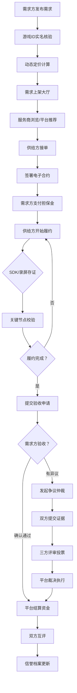

## 1. 产品概述

游戏技能服务撮合平台，连接代练需求方（玩家）与供给方（高段位玩家），解决游戏段位提升、陪练上分、稀有英雄代打等需求。通过实名核验、动态定价、履约监控、争议仲裁、分级认证及风控体系，构建安全可信的交易环境。

- 核心目标：建立透明、高效、安全的游戏代练撮合生态
- 目标用户：有段位提升需求的普通玩家、具备高段位操作能力的职业/半职业玩家
- 市场价值：解决传统代练市场信息不对称、欺诈频发、售后无保障的行业痛点

## 2. 核心功能

### 2.1 用户角色

| 角色 | 注册方式 | 核心权限 |
|------|----------|----------|
| 需求方（玩家） | 手机号+实名认证 | 发布需求、浏览服务商、下单支付、验收评价、申请仲裁 |
| 供给方（代练） | 手机号+实名+游戏账号验证+资质审核 | 认证服务商、接单履约、上传录屏、申诉争议 |
| 平台运营 | 内部账号 | 争议仲裁、服务商分级、风控审核、数据监控 |
| 评审员 | 招募+实名认证 | 参与三方评审、提供裁决意见 |

### 2.2 功能模块

1. **首页大厅**：服务展示、搜索筛选、推荐服务商、平台数据看板
2. **需求发布页**：游戏选择、段位设置、服务类型、保障条款配置
3. **服务商中心**：个人主页、信誉档案、认证标识、历史战绩、服务报价
4. **订单合约页**：订单详情、资金担保状态、履约进度、证据链查看
5. **履约监控台**：关键节点记录、录屏回放、SDK数据、完成度分析
6. **争议仲裁工作台**：证据提交、评审表决、裁决结果、申诉通道
7. **服务商分级体系**：钻石/黄金/白银认证、成长值、特权展示
8. **游戏账号管理**：账号绑定、实名核验、段位截图、UID校验
9. **风控中心**：设备指纹、行为序列、异常交易、刷单检测
10. **资金钱包**：担保账户明细、收支流水、提现申请、退款记录

### 2.3 页面详情

| 页面名称 | 模块名称 | 功能描述 |
|----------|----------|----------|
| 首页大厅 | Hero区域 | 平台标语、核心价值展示、实时交易数据滚动、动画特效 |
| 首页大厅 | 服务分类导航 | 热门游戏Tab切换、服务类型筛选（排位/陪练/定级赛/英雄熟练度） |
| 首页大厅 | 推荐服务商卡片 | 头像、段位认证标识、信誉评分、接单量、服务价格、一键咨询 |
| 首页大厅 | 实时成交滚动 | 横向滚动展示最近成交订单，营造活跃氛围 |
| 需求发布页 | 游戏选择器 | 游戏图标网格、支持搜索、段位信息联动 |
| 需求发布页 | 段位差设置 | 当前段位→目标段位选择器，自动计算基础价格 |
| 需求发布页 | 服务配置 | 局数/时长、胜率保障、时段选择、英雄限制、附加服务 |
| 需求发布页 | 动态定价预览 | 实时展示溢价系数（时段/稀缺英雄/段位差）、最终价格明细 |
| 服务商中心 | 头部认证区 | 钻石/黄金认证徽章、信誉等级、总完成订单、好评率 |
| 服务商中心 | 信誉档案 | 近30天履约率、按时交付率、仲裁胜率、用户评价标签云 |
| 服务商中心 | 服务报价表 | 游戏×段位阶梯报价、服务套餐、保障条款说明 |
| 服务商中心 | 历史战绩 | 最近完成订单列表、段位跃升可视化图表 |
| 订单合约页 | 合约概览 | 订单状态标签、定金比例、担保资金、双方信息 |
| 订单合约页 | 履约时间轴 | 接单→开始→关键节点→完成→验收，节点进度可视化 |
| 订单合约页 | 证据链面板 | 录屏列表、段位截图、SDK校验记录、关键节点存证 |
| 订单合约页 | 操作区 | 确认验收、申请退款、发起争议、联系对方 |
| 履约监控台 | 录屏播放器 | 倍速播放、关键帧标记、时间戳跳转、画面水印检测 |
| 履约监控台 | 关键节点卡 | 每局胜负、段位变化、MVP获取、任务目标完成记录 |
| 履约监控台 | 完成度仪表盘 | 进度百分比、剩余预估时长、风险预警提示 |
| 争议仲裁工作台 | 争议详情 | 双方陈述时间线、争议焦点标签、申请时间 |
| 争议仲裁工作台 | 证据对比 | 左右分屏对比双方证据、支持标注、时间戳同步 |
| 争议仲裁工作台 | 三方评审区 | 评审员头像、投票进度、裁决理由、最终结果展示 |
| 游戏账号管理 | 账号卡片 | 游戏图标+UID、实名状态、段位信息、最近验证时间 |
| 游戏账号管理 | 核验流程 | 厂商开放平台OAuth授权、段位截图OCR识别、UID校验 |
| 风控中心 | 风险概览 | 今日拦截数、高风险账户、设备异常分布图 |
| 风控中心 | 行为序列分析 | 用户操作热力图、鼠标轨迹回放、异常模式标记 |
| 资金钱包 | 账户余额卡片 | 担保中/可用/冻结三态展示、收益统计图表 |
| 资金钱包 | 流水明细 | 收入/支出/退款/仲裁赔付分类筛选、订单关联跳转 |

## 3. 核心流程

用户核心交易流程：需求方发布代练需求 → 平台智能匹配推荐服务商 → 供给方接单并签署电子合约 → 需求方支付定金至平台担保账户 → 供给方开始履约（SDK/录屏存证）→ 关键节点自动校验 → 履约完成提交验收 → 需求方确认验收后平台结算 → 双方互评 → 争议则进入仲裁流程。

## 4. 用户界面设计

### 4.1 设计风格

**主色与辅色：**
- 主色调：深邃电竞紫 `#6B21A8`，渐变至霓虹紫 `#A855F7`，象征高端游戏氛围
- 辅助色：胜利金 `#F59E0B`（黄金认证）、钻石蓝 `#06B6D4`（钻石认证）、警示红 `#EF4444`
- 中性色：暗夜灰 `#0F0F1A` 背景、烟雾灰 `#1F1F2E` 卡片、文字分层 `#F1F5F9 / #94A3B8 / #64748B`

**按钮风格：**
- 主按钮：电竞紫渐变背景 + 霓虹光晕效果，圆角 10px，悬停时光晕扩散
- 次按钮：描边 + 半透明填充，点击有微凹陷反馈
- 危险操作：警示红渐变 + 脉冲警告动效

**字体选择：**
- 标题字体：`Orbitron`（科幻电竞风，数字和英文表现极佳）
- 正文字体：`Noto Sans SC`（中文可读性优先，字重选择 Regular/Medium/Semibold）
- 数据数字：`JetBrains Mono`（等宽字体，金额/段位数据对齐美观）

**布局风格：**
- 卡片式布局为主，圆角 16px，双层投影（深色阴影 + 紫色光晕）
- 顶部固定导航栏，左侧可折叠功能侧栏
- 数据看板采用非对称网格布局，核心指标放大突出
- 关键数据使用玻璃拟态卡片（backdrop-blur）提升层次感

**图标风格：**
- 线性图标为主，关键操作使用面性图标强调
- 段位图标使用 3D 立体徽章效果（带金属质感和反光）
- Emoji 场景：评价标签、成就徽章、状态表情

### 4.2 页面设计概览

| 页面名称 | 模块名称 | UI元素 |
|----------|----------|--------|
| 首页大厅 | Hero区域 | 全屏渐变紫背景 + 几何粒子动画，Orbitron大标题，实时数据跑马灯，发光CTA按钮 |
| 首页大厅 | 服务分类导航 | Tab切换带滑块动效，游戏图标悬浮放大，选中状态霓虹描边 |
| 首页大厅 | 推荐服务商卡片 | 对角线构图，头像带认证光环，段位徽章3D悬浮，信誉星级发光，价格用金箔渐变背景 |
| 首页大厅 | 实时成交滚动 | 无缝横向滚动卡片，新订单从右侧滑入带入场动画，头像+游戏+价格信息 |
| 需求发布页 | 游戏选择器 | 游戏封面卡片网格，选中时卡片上浮 + 紫色边框高亮，段位信息联动展开 |
| 需求发布页 | 段位差设置 | 垂直时间轴布局，当前段→目标段用渐变连接线连接，中间显示段位跨度可视化 |
| 需求发布页 | 动态定价预览 | 玻璃拟态价格卡片，明细项展开/折叠动效，溢价系数用标签徽章突出显示 |
| 服务商中心 | 头部认证区 | 横幅背景+服务商头像，钻石/黄金徽章悬浮发光，核心数据用Orbitron字体展示 |
| 服务商中心 | 信誉档案 | 雷达图展示多维度评分，评价标签云动态排列，战绩折线图带渐变填充 |
| 订单合约页 | 履约时间轴 | 垂直时间轴，节点图标动画填充，已完成节点连线点亮，进行中节点脉冲动画 |
| 订单合约页 | 证据链面板 | 录屏缩略图带时间戳hover，证据卡片可展开详情，存证哈希值用等宽字体 |
| 履约监控台 | 录屏播放器 | 暗色播放器皮肤，进度条标记关键帧，关键节点时间戳可点击跳转 |
| 争议仲裁工作台 | 证据对比 | 左右分屏带中间VS分隔线，证据同步滚动，标注区域高亮联动 |
| 风控中心 | 风险概览 | 数字跳动动画，风险等级热力图，异常检测点脉冲闪烁标记 |

### 4.3 响应式

- **设计优先级**：桌面端优先（1440px基准），适配 1024px 平板横屏，向下兼容 768px 平板竖屏及 375px 手机端
- **断点策略**：1280px（优化布局）、1024px（侧栏折叠为抽屉）、768px（卡片单列+Tab底栏）、375px（精简展示核心信息）
- **触控优化**：移动端点击热区不小于 44×44px，列表项支持左滑快捷操作，录屏播放器支持手势控制进度和音量

### 4.4 3D场景指引

- **环境氛围**：3D段位徽章使用HDRI金属环境贴图，营造反光质感
- **光照设置**：主光从左上45°，辅光紫色点光源从右下，增加体积光效果
- **相机设置**：徽章默认微小仰角展示，hover时自动旋转一圈，微浮动效果
- **交互动画**：鼠标移动时徽章轻微跟随倾斜（视差效果），点击时触发弹跳
- **后处理效果**：Bloom辉光 + 轻微Vignette暗角 + ACES电影级色调映射
- **性能预算**：Lazy加载3D元素，单个徽章面数控制在5000三角面以内
