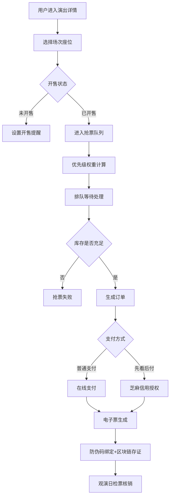

## 1. 产品概述

高并发演出票务交易与履约保障系统，面向演唱会、话剧、脱口秀等现场活动，提供从主办方入驻、演出管理、票务销售、检票核销到数据分析的全链路服务。核心解决票源防伪、抢票高并发、信用购票、退换票风控等行业痛点。

## 2. 核心功能

### 2.1 用户角色

| 角色 | 注册方式 | 核心权限 |
|------|----------|----------|
| 普通用户 | 手机号/实名认证注册 | 浏览演出、抢票购票、电子票核验、申请退票 |
| 主办方 | 资质审核入驻 | 演出发布、场次管理、座位图配置、票务核销 |
| 平台运营 | 后台账号 | 主办方审核、数据监控、风控规则配置 |

### 2.2 功能模块

1. **用户端首页**：演出推荐、分类筛选、搜索、热门榜单
2. **演出详情页**：演出信息、场次选择、座位图、票价策略、购票
3. **抢票排队页**：实时排队状态、加速通道、优先级展示
4. **订单中心**：订单列表、电子票展示、退票申请、先看后付管理
5. **主办方工作台**：入驻申请、演出管理、场次配置、核销记录
6. **运营管理后台**：主办方审核、数据大屏、风控配置

### 2.3 页面详情

| 页面名称 | 模块名称 | 功能描述 |
|----------|----------|----------|
| 首页 | 轮播推荐 | 热门演出轮播展示，支持自动切换和手动滑动 |
| 首页 | 分类导航 | 演唱会/话剧/脱口秀/其他分类快捷入口 |
| 首页 | 热门榜单 | 按销量/热度排序的演出TOP榜 |
| 演出详情 | 演出信息 | 海报、艺人/团队介绍、场馆信息、演出时长 |
| 演出详情 | 场次选择 | 日期时间切换、预售/开售状态、剩余票数 |
| 演出详情 | 座位图选座 | 可视化座位分区、颜色区分票价、可选/已售状态 |
| 演出详情 | 阶梯票价 | 展示早鸟票/预售票/全价票/折扣票等多档位 |
| 抢票排队 | 排队状态 | 实时队列位置、预计等待时间、当前处理进度 |
| 抢票排队 | 加速通道 | 会员加速、信用分加速、邀请好友加速 |
| 订单中心 | 电子票 | 二维码/防伪码展示、核验状态、区块链存证哈希 |
| 订单中心 | 先看后付 | 芝麻信用额度、自动扣款时间、订单状态 |
| 订单中心 | 退票申请 | 时间窗口校验、手续费计算、原因选择 |
| 主办方工作台 | 入驻审核 | 资质材料上传、审核状态、进度查询 |
| 主办方工作台 | 场次配置 | 座位图分区、票价设置、开售时间、库存管理 |
| 核销页面 | 扫码核验 | 二维码扫描、防伪码校验、闸机SDK对接 |
| 运营数据大屏 | 热力图 | 上座率区域热力图、实时颜色渲染 |
| 运营数据大屏 | 销量排行 | 区域销量TOP榜、演出销量TOP榜 |
| 运营数据大屏 | 退票分析 | 退票原因聚类、时间分布、费率统计 |

## 3. 核心流程

### 3.1 购票抢票流程

用户浏览演出 → 选择场次和座位 → 进入抢票队列 → 根据优先级排队 → 队列处理成功 → 生成订单 → 选择支付方式（普通支付/先看后付） → 支付完成 → 电子票生成（绑定防伪码+区块链存证）

### 3.2 先看后付流程

用户授权芝麻信用 → 信用评估 → 授信额度内购票 → 无需支付 → 观演完成 → 自动扣款 → 订单完成

### 3.3 退票风控流程

用户发起退票 → 校验退票时间窗口 → 计算手续费梯度 → 选择退票原因 → 风控引擎审核 → 退款处理 → 库存回补

### 3.4 检票核销流程

用户出示电子票 → 扫码/闸机读取 → 防伪码校验 → 区块链存证验证 → 核验成功 → 入场记录

## 4. 用户界面设计

### 4.1 设计风格

- **主色调**：深邃酒红 #8B1A2B（演出行业的热情与高级感）
- **辅助色**：金色 #D4AF37（票务的尊贵感与防伪标识）、炭黑 #1A1A2E（深色主题）
- **按钮风格**：圆角 8px，渐变填充，悬停微放大动效
- **字体**：标题使用 Cinzel（衬线字体，仪式感），正文使用 Noto Sans SC（高可读性）
- **布局风格**：卡片式布局，玻璃拟态效果，深色主题为主
- **图标风格**：Lucide 线性图标，金色描边

### 4.2 页面设计概览

| 页面名称 | 模块名称 | UI 元素 |
|----------|----------|---------|
| 首页 | 轮播推荐 | 全屏海报轮播，渐变遮罩，底部金色进度条 |
| 首页 | 分类导航 | 图标+文字卡片，悬停发光效果 |
| 演出详情 | 座位图 | 交互式SVG座位图，分区着色，悬浮tooltip |
| 抢票排队 | 进度条 | 动态进度条，金色脉冲动效，实时数字跳动 |
| 电子票 | 票据样式 | 仿实体票设计，撕裂线，防伪纹理，二维码 |
| 数据大屏 | 热力图 | 场馆平面图，颜色梯度热力渲染，悬浮数据 |
| 数据大屏 | 排行榜 | 金色奖杯图标，动态排名切换，柱状图动画 |

### 4.3 响应式

- 桌面端优先设计（1280px+）
- 平板适配（768px-1279px）：侧边栏收起，卡片双列布局
- 移动端适配（<768px）：底部Tab导航，单列卡片，简化操作

### 4.4 动效设计

- 页面入场：元素渐入+上移，stagger 延迟 50ms
- 按钮交互：悬停时 scale(1.02)，点击时 scale(0.98)
- 座位选择：选中时金色脉冲涟漪扩散
- 数据更新：数字滚动动画，图表柱形生长动画
- 票据展示：入场时翻页动效，模拟实体票展开
