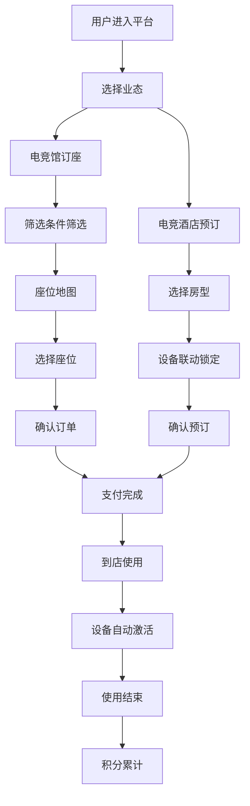

## 1. 产品概述

电竞主题空间数字化运营平台，覆盖网鱼电竞馆与电竞酒店两大实体业态。通过数字化技术实现门店资产、用户运营、会员体系、设备监控的全链路管理，提升运营效率与用户体验。

- **核心价值**：实现线下实体空间的数字化转型，通过数据驱动运营决策，打造"人-场-货"全链路数字化闭环。
- **目标用户**：门店运营人员、总部管理层、会员用户、设备运维人员。

## 2. 核心功能

### 2.1 用户角色

| 角色 | 登录方式 | 核心权限 |
|------|----------|----------|
| 超级管理员 | 账号密码 | 全平台管理、数据看板、系统配置 |
| 门店店长 | 账号密码 | 门店运营、设备管理、会员管理 |
| 运营专员 | 账号密码 | 活动运营、赛事管理、商城管理 |
| 会员用户 | 手机号/微信 | 订座、预订酒店、参与赛事、积分兑换 |
| 运维人员 | 账号密码 | 设备监控、故障处理、IoT管理 |

### 2.2 功能模块

1. **经营数据看板：坪效分析、设备使用率、客单价、复购率
2. **门店资产管理：座位管理、包间管理、设备管理、状态实时映射
3. **智能订座引擎：多条件筛选、实时预订、订单管理
4. **酒店预订管理：房型管理、设备联动、入住管理
5. **会员体系：积分管理、段位等级、权益兑换
6. **IoT设备监控：实时状态、温度监控、故障预警
7. **活动运营：赛事管理、观赛直播、战队招募
8. **商城管理：商品管理、库存管理、订单履约

### 2.3 页面详情

| 页面名称 | 模块名称 | 功能描述 |
|----------|----------|----------|
| 登录页 | 登录表单 | 账号密码登录、角色选择、记住密码 |
| 经营数据看板 | 数据概览 | 核心指标卡片、趋势图表、门店对比 |
| 经营数据看板 | 坪效分析 | 面积效益分析、时段分析、区域对比 |
| 经营数据看板 | 设备使用率 | 设备使用率排行、时段分布、故障统计 |
| 经营数据看板 | 客单价分析 | 客单价趋势、消费构成、复购率 |
| 门店资产-座位管理 | 座位列表 | 座位状态、设备配置、批量操作 |
| 门店资产-包间管理 | 包间列表 | 包间类型、容纳人数、设备配置 |
| 门店资产-设备管理 | 设备列表 | 设备型号、状态、归属位置 |
| 智能订座 | 座位筛选 | 按设备配置、网络延迟、空闲时段筛选 |
| 智能订座 | 座位地图 | 可视化座位布局、实时状态、一键预订 |
| 智能订座 | 订单管理 | 订单列表、状态流转、退款处理 |
| 酒店预订 | 房型管理 | 房型列表、设备配置、价格管理 |
| 酒店预订 | 预订管理 | 预订列表、入住退房、设备联动 |
| 会员体系 | 会员列表 | 会员信息、等级、积分、消费记录 |
| 会员体系 | 段位等级 | 等级规则、升级条件、权益配置 |
| 会员体系 | 权益兑换 | 商品列表、兑换记录、库存管理 |
| IoT监控 | 实时监控 | 设备状态大屏、温度、帧率、网络延迟 |
| IoT监控 | 故障预警 | 预警列表、处理记录、告警配置 |
| 活动运营 | 赛事管理 | 赛事列表、报名管理、赛程安排 |
| 活动运营 | 观赛直播 | 直播列表、观看数据、互动功能 |
| 活动运营 | 战队招募 | 战队列表、招募信息、成员管理 |
| 商城管理 | 商品管理 | 商品列表、分类、库存、价格 |
| 商城管理 | 订单履约 | 订单列表、自提/闪送、物流跟踪 |
| 系统设置 | 门店管理 | 门店列表、配置、BI数据同步 |

## 3. 核心流程

### 3.1 订座流程

用户选择门店 → 筛选条件（设备配置/网络延迟/时段）→ 查看座位地图 → 选择座位 → 确认订单 → 支付 → 订座成功 → 到店上机

### 3.2 酒店预订流程

用户选择酒店 → 选择房型 → 查看设备配置 → 选择日期 → 确认预订 → 支付 → 预订成功 → 入住 → 设备自动解锁

### 3.3 会员权益兑换流程

用户查看权益商品 → 选择商品 → 确认兑换 → 扣减积分 → 生成兑换订单 → 到店自提/同城闪送

### 3.4 IoT设备监控流程

设备上报数据 → 系统实时监控 → 异常检测 → 故障预警 → 运维人员处理 → 故障恢复

## 4. 用户界面设计

### 4.1 设计风格

- **主色调**：深青色(#0F172A）科技蓝(#3B82F6）霓虹绿(#10B981）
- **辅助色**：电竞紫(#8B5CF6)、告警红(#EF4444)、警告橙(#F59E0B)
- **背景**：深色科技感渐变背景，带网格纹理
- **按钮风格**：圆角8px，悬停发光效果，渐变填充
- **字体**：主字体使用 Orbitron（显示数字/标题）、Inter（正文）
- **布局风格**：左侧导航+顶部工具栏+主内容区的管理后台布局
- **图标风格**：线性图标，霓虹发光效果，科技感
- **整体风格**：赛博朋克/科技电竞风格，深色主题，霓虹光效，数据可视化大屏风格

### 4.2 页面设计概览

| 页面名称 | 模块名称 | UI元素 |
|----------|----------|--------|
| 经营数据看板 | 数据概览 | 霓虹发光卡片、渐变数据大屏、动态图表、实时数据刷新动画 |
| 座位地图 | 座位布局 | 网格布局、状态颜色区分、悬停发光、点击选中效果 |
| IoT监控大屏 | 实时监控 | 仪表盘、进度条、波形图、告警闪烁效果 |
| 登录页 | 登录表单 | 霓虹边框发光、渐变背景、科技感输入框 |

### 4.3 响应式

桌面端优先设计，适配1920×1080及以上分辨率。支持平板横向适配。

### 4.4 数据可视化

- 使用ECharts/Recharts实现数据图表
- 支持实时数据刷新动画
- 大屏展示模式，支持全屏模式
