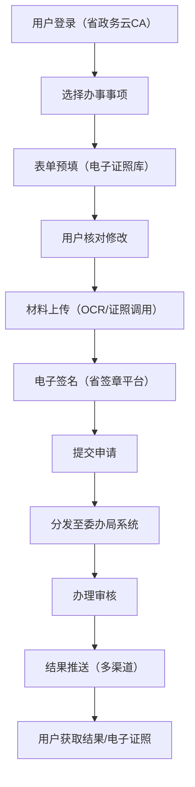
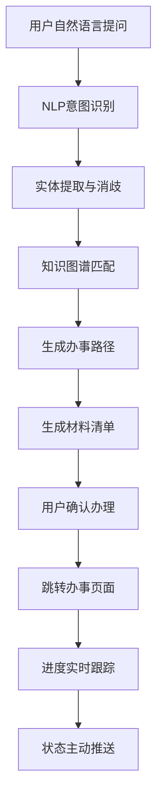

## 1. 产品概述

省级一体化政务服务中台是整合人社、公安、卫健、住建等12个委办局业务系统的综合性政务服务平台，通过统一身份认证、电子证照库、事项知识图谱实现服务穿透，为群众和企业提供"一网通办、跨省通办、一件事一次办"的智能化政务服务体验。

- 主要目标：打破部门数据壁垒，实现政务服务从"群众跑"向"数据跑"转变，提升政务服务效能和群众满意度
- 目标用户：办事群众、企业法人、政务工作人员、系统管理员
- 市场价值：落实"放管服"改革要求，打造省级政务服务标杆，实现"最多跑一次"向"一次不用跑"升级

## 2. 核心功能

### 2.1 用户角色

| 角色 | 注册方式 | 核心权限 |
|------|----------|----------|
| 办事群众 | 省政务云CA实名认证/身份证号注册 | 掌上办事、智能导办、进度查询、电子证照管理 |
| 企业法人 | 统一社会信用代码+法人实名认证 | 企业开办、资质办理、跨域协同事项办理 |
| 政务工作人员 | 内部工号+CA认证 | 事项受理、审核审批、效能监测、政策配置 |
| 系统管理员 | 超级管理员账户 | 系统配置、容灾管理、用户权限管理、数据监控 |

### 2.2 功能模块

1. **首页仪表盘**：服务效能概览、热门事项推荐、待办提醒、数据统计看板
2. **掌上办事中心**：高频事项办理、表单预填、材料OCR识别、电子签名、办件进度
3. **智能导办助手**：自然语言问答、办事路径解析、材料清单生成、进度主动推送
4. **跨域协同中心**：企业开办"一网通办"、新生儿出生"一件事"联办、跨部门事项协同
5. **电子证照中心**：证照查询、证照申领、证照授权、证照使用记录
6. **后台管理中心**：服务效能监测、政策适配引擎、容灾切换中心、系统管理

### 2.3 页面详情

| 页面名称 | 模块名称 | 功能描述 |
|---------|----------|----------|
| 首页仪表盘 | 数据概览 | 展示今日办件量、办结率、平均耗时、群众满意度等核心指标，支持委办局维度筛选 |
| 首页仪表盘 | 热门事项 | 展示办理频次最高的10个事项，支持一键申办 |
| 首页仪表盘 | 待办提醒 | 展示用户待提交、审核中、待补正的办件列表 |
| 掌上办事中心 | 事项列表 | 按主题分类展示所有可办事项，支持搜索、筛选、收藏 |
| 掌上办事中心 | 表单预填 | 对接电子证照库自动填充表单字段，支持人工修改 |
| 掌上办事中心 | 材料上传 | 支持拍照OCR识别、本地文件上传、电子证照调用三种方式 |
| 掌上办事中心 | 电子签名 | 对接省签章平台，实现手写签名、印章加盖、批量签署 |
| 智能导办助手 | 问答界面 | 支持自然语言提问，实时解析办事需求，匹配最佳办事路径 |
| 智能导办助手 | 材料清单 | 根据办事事项自动生成个性化材料清单，标注材料来源（电子证照/需上传） |
| 智能导办助手 | 进度推送 | 办件状态变化时主动推送消息，支持短信、APP、微信多渠道通知 |
| 跨域协同中心 | 企业开办 | 一站式办理工商注册、税务登记、公章刻制、社保开户、银行开户 |
| 跨域协同中心 | 出生一件事 | 联办出生医学证明、户口登记、医保参保、预防接种证 |
| 电子证照中心 | 证照列表 | 展示用户名下所有电子证照，支持亮证、下载、分享 |
| 后台管理 - 效能监测 | 办结率分析 | 按事项、部门、地区维度展示办结率趋势，支持同比环比分析 |
| 后台管理 - 效能监测 | 退件原因聚类 | 运用NLP技术对退件原因进行自动分类，生成优化建议 |
| 后台管理 - 政策引擎 | 政策适配 | 自动匹配用户画像与可享补贴政策，精准推送 |
| 后台管理 - 容灾中心 | 故障监测 | 实时监控各委办局系统状态，异常自动告警 |
| 后台管理 - 容灾中心 | 应急切换 | 厅局系统故障时一键启用缓存数据，支持应急受理 |

## 3. 核心流程

### 3.1 掌上办事主流程

用户登录统一身份认证后，选择办事事项，系统自动调用电子证照预填表单，用户核对补充信息后上传材料（支持OCR识别和证照调用），完成电子签名后提交申请，系统自动分发到对应委办局业务系统办理，办理结果通过多渠道主动推送给用户。

### 3.2 智能导办流程

用户通过自然语言描述办事需求，系统进行意图识别和实体提取，匹配事项知识图谱，生成最优办事路径和材料清单，用户可直接跳转办理，全程跟踪进度。

## 4. 用户界面设计

### 4.1 设计风格

- **主色调**：政务蓝（#165DFF）作为品牌主色，代表权威、专业、可信；辅以正红（#F53F3F）作为警示和重要操作色，浅灰（#F2F3F5）作为背景色
- **按钮风格**：采用圆角矩形设计（8px圆角），主按钮使用渐变填充，悬停时增加阴影和微缩放效果
- **字体**：使用 "PingFang SC" 作为主要字体，标题使用加粗，正文使用常规字重，小字号（12px）用于辅助信息
- **布局风格**：顶部导航栏+左侧菜单栏的经典政务后台布局，内容区采用卡片式设计，信息层级清晰
- **图标风格**：使用线性图标，保持简洁统一，图标尺寸与文字高度对齐

### 4.2 页面设计概述

| 页面名称 | 模块名称 | UI元素 |
|---------|----------|--------|
| 首页仪表盘 | 数据概览 | 渐变数据卡片、趋势折线图、环形进度图、数据表格、筛选器 |
| 掌上办事中心 | 事项列表 | 分类标签栏、搜索框、事项卡片网格、收藏按钮、申办按钮 |
| 掌上办事中心 | 表单页面 | 分步导航、自动填充标识、字段验证提示、材料上传区、签名画布 |
| 智能导办助手 | 问答界面 | 聊天式对话框、快捷问题推荐、消息气泡动画、打字指示器 |
| 跨域协同中心 | 一件事联办 | 流程进度条、多部门卡片、材料共享状态、联合办理按钮 |
| 后台管理 | 效能监测 | 多维度图表、数据钻取、热力图、退件原因词云 |
| 后台管理 | 容灾中心 | 系统状态仪表盘、故障告警条、应急切换开关、切换日志 |

### 4.3 响应式设计

- **设计原则**：桌面端优先，兼顾平板和移动端适配
- **断点设置**：1440px（桌面）、1024px（平板横屏）、768px（平板竖屏）、375px（手机）
- **移动端适配**：侧边栏转为底部导航，数据卡片转为单列布局，表格支持横向滚动
- **触摸优化**：按钮最小触摸区域44x44px，表单字段增加垂直间距，支持下拉刷新和上拉加载

### 4.4 交互与动效

- **页面加载**：采用骨架屏和淡入动画，避免空白等待
- **数据更新**：数字滚动动画、图表渐入动画
- **表单交互**：字段聚焦动效、验证错误抖动提示、提交成功打钩动画
- **导航切换**：页面切换使用左右滑动过渡，菜单展开使用平滑动画
- **状态提示**：成功/错误消息使用Toast从顶部滑入，3秒后自动消失
