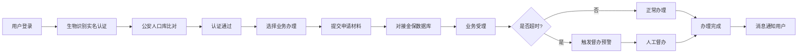
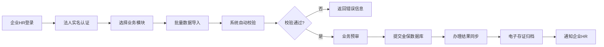

## 1. 产品概述

省级人社一体化政务服务平台是面向全省个人用户与企业HR的综合性人力资源社会保障服务系统，对接金保工程核心数据库，提供五险一金查询、医保服务、人事考试、电子社保卡、企业参保管理等全链条人社服务。

- **核心价值**：实现人社业务"一网通办、跨省通办"，提升政务服务效率与群众满意度
- **目标用户**：全省参保个人、企业HR管理人员、人社经办机构工作人员
- **合规标准**：所有接口严格遵循《国家政务服务平台接口规范》

## 2. 核心功能

### 2.1 用户角色

| 角色 | 注册/登录方式 | 核心权限 |
|------|--------------|----------|
| 个人用户 | 身份证+生物识别实名认证、电子社保卡登录 | 五险一金查询、医保服务、考试报名、电子社保卡申领 |
| 企业HR | 企业统一社会信用代码+法人实名认证 | 员工参保增减员、失业金申领预审、电子合同存证 |
| 后台管理员 | 政务内网账号+UKey认证 | 业务督办、政策管理、系统监控、实名认证审核 |

### 2.2 功能模块

1. **个人服务门户**：首页概览、五险一金查询、医保服务、人事考试、电子社保卡
2. **企业服务门户**：参保管理、失业金预审、劳动关系管理、企业信息
3. **后台管理系统**：生物识别认证中心、业务督办预警、政策文件管理、系统监控
4. **公共服务模块**：实名认证、消息中心、办事指南、个人中心

### 2.3 页面详情

| 页面名称 | 模块名称 | 功能描述 |
|---------|----------|---------|
| 首页/门户 | 服务导航 | 快捷入口、业务办理进度、政策公告、数据概览卡片 |
| 个人中心 | 账户信息 | 个人基本信息、实名认证状态、登录安全设置 |
| 社保查询 | 五险明细 | 养老/医疗/失业/工伤/生育保险缴费明细、账户余额、转移进度 |
| 公积金查询 | 公积金详情 | 住房公积金缴存明细、账户余额、贷款查询、提取申请 |
| 医保服务 | 就医记录 | 定点医院查询、药品目录、报销比例、就医记录追溯 |
| 人事考试 | 考试报名 | 考试列表、在线报名、准考证打印、成绩查询 |
| 电子社保卡 | 卡包管理 | 电子社保卡申领、NFC闪付、扫码支付、用药记录 |
| 企业参保管理 | 增减员申报 | 员工参保批量申报、减员办理、申报记录查询 |
| 失业金预审 | 资格审核 | 失业金申领预审、材料审核、审核进度跟踪 |
| 劳动关系 | 电子合同 | 电子合同存证、合同模板、签署管理 |
| 认证中心 | 生物识别 | 人脸/指纹识别、公安人口库比对、实名认证状态 |
| 业务督办 | 超时预警 | 办理超时预警、督办工单、SLA监控仪表盘 |
| 政策管理 | 智能标签 | 政策文件发布、按人群/场景/时效智能打标、检索 |
| 消息中心 | 通知推送 | 业务办理通知、预警提醒、政策推送 |

## 3. 核心流程

### 3.1 个人用户业务办理流程

用户登录平台后，通过实名认证（生物识别+公安人口库比对），即可办理各项人社业务。业务办理过程中系统实时对接金保工程核心数据库，对超时业务自动触发督办预警。

### 3.2 企业HR办事流程

企业HR通过法人认证后，可批量办理员工参保业务，系统自动进行数据校验与预审，预审通过后同步至金保工程核心数据库。

## 4. 用户界面设计

### 4.1 设计风格

- **主色调**：政务蓝 (#165DFF) 作为主色，体现政务服务的专业、信任、权威
- **辅助色**：渐变蓝 (#0FC6C2) 用于数据可视化与强调元素
- **成功色**：绿色 (#00B42A)，警告色：橙色 (#FF7D00)，危险色：红色 (#F53F3F)
- **按钮风格**：圆角矩形 (8px)，主按钮采用渐变效果，悬停微动画
- **字体选择**：
  - 标题字体：思源黑体 (Source Han Sans CN) Bold
  - 正文字体：思源黑体 Regular
  - 数字字体：DIN Alternate 等宽数字字体用于数据展示
- **布局风格**：卡片式布局 + 顶部导航 + 左侧菜单（后台），层次分明，信息密度适中
- **图标风格**：线性图标，统一2px描边，与政务风格保持一致

### 4.2 页面设计概览

| 页面名称 | 模块名称 | UI元素 |
|---------|----------|--------|
| 首页门户 | 服务导航区 | 大标题、快捷服务网格、数据卡片、公告轮播、渐变背景 |
| 社保查询页 | 数据展示 | Tab切换、数据表格、图表可视化、时间筛选器、明细弹窗 |
| 医保服务页 | 就医记录 | 搜索框、医院列表卡片、药品目录树、报销比例环形图 |
| 企业参保页 | 批量操作 | 数据表格、批量导入按钮、进度条、校验结果提示 |
| 后台督办页 | 监控仪表盘 | 统计卡片、预警列表、SLA趋势图、工单状态流转 |
| 认证中心页 | 生物识别 | 摄像头取景框、识别进度动画、认证状态结果反馈 |

### 4.3 响应式设计

- **设计原则**：桌面端优先，兼顾平板与移动端
- **断点设置**：1440px（桌面）、1024px（平板横屏）、768px（平板竖屏）、375px（手机）
- **适配策略**：
  - 桌面端：三栏布局 + 完整功能
  - 平板端：两栏布局 + 菜单折叠
  - 移动端：单栏布局 + 底部导航 + 核心功能
- **触控优化**：移动端按钮最小尺寸44x44px，手势操作支持

### 4.4 交互动效

- **页面进入**：渐入 + 上移动画 (fadeInUp)，采用staggered错落效果
- **数据加载**：骨架屏 (Skeleton) + 渐入过渡
- **按钮交互**：悬停时背景色渐变加深 + 轻微上浮效果
- **卡片交互**：悬停时阴影加深 + 微妙缩放 (scale 1.01)
- **通知提示**：从右侧滑入 + 轻微弹跳效果
- **数据图表**：柱状图/折线图从底部生长动画，环形图描边动画
