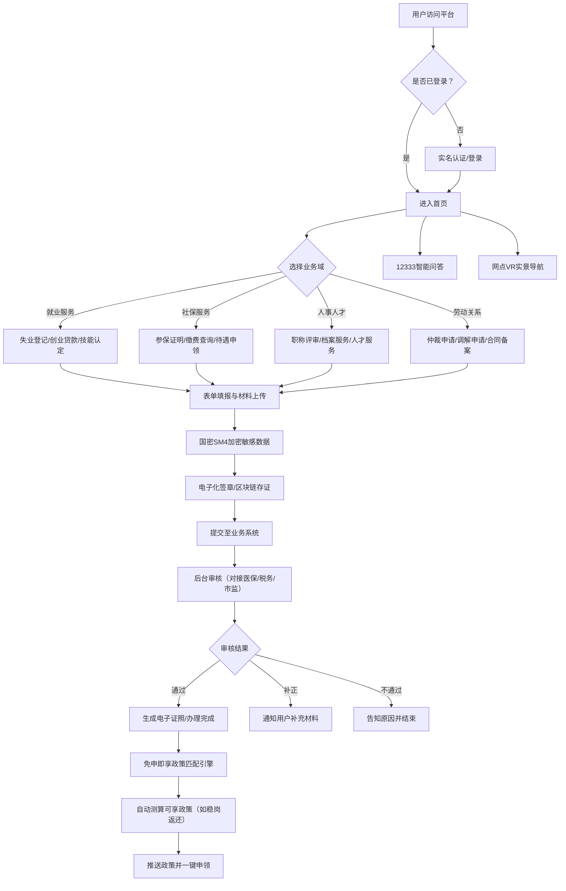

## 1. 产品概述

省级人力资源和社会保障一体化政务服务平台，覆盖就业、社保、人事、劳动关系四大业务域，为全省群众和企业提供一站式人社政务服务。通过对接医保、税务、市场监管三网数据，实现"免申即享"政策精准推送，结合区块链存证、国密SM4加密、智能问答等技术，打造安全、便捷、智能的政务服务新标杆。

## 2. 核心功能

### 2.1 用户角色

| 角色 | 注册方式 | 核心权限 |
|------|----------|----------|
| 个人用户 | 实名认证/社保卡登录 | 办理个人业务、查询个人信息、政策匹配 |
| 企业用户 | 统一社会信用代码认证 | 办理企业业务、稳岗返还申请、员工社保管理 |
| 经办人员 | 机构内部账号 | 业务审核、数据统计、知识库管理 |
| 系统管理员 | 超级管理员账号 | 用户管理、权限配置、系统监控 |

### 2.2 功能模块

1. **首页**：服务入口导航、政策公告轮播、个人信息卡片、免申即享政策推荐、热门服务快捷入口、服务网点导航
2. **就业服务**：失业登记电子化签章、创业担保贷款在线预审、岗位推荐、职业技能等级认定报名与成绩核验
3. **社保服务**：社保参保证明区块链存证、缴费查询、待遇申领、关系转移接续
4. **人事人才**：人才评价、职称评审、档案服务、高层次人才服务
5. **劳动关系**：劳动仲裁申请材料结构化填报、调解申请、合同备案、权益查询
6. **智能问答**：12333智能问答知识库、方言语音识别、常见问题自动回复
7. **免申即享**：政策匹配引擎、稳岗返还自动测算、政策推送与申领
8. **服务网点**：VR实景导航、网点信息查询、排队叫号、预约服务
9. **个人中心**：我的办件、我的证照、消息中心、实名认证、安全设置

### 2.3 页面详情

| 页面名称 | 模块名称 | 功能描述 |
|----------|----------|----------|
| 首页 | 顶部导航栏 | 用户登录状态、角色切换、消息通知、帮助中心 |
| 首页 | 政策公告轮播 | 最新政策文件滚动展示、点击查看详情 |
| 首页 | 四大业务域入口 | 就业、社保、人事、劳动关系图标化入口 |
| 首页 | 免申即享推荐 | 根据用户画像智能匹配政策、一键申领 |
| 首页 | 热门服务快捷入口 | 办理量TOP10服务快速访问 |
| 首页 | 服务网点地图 | 全省人社服务网点分布、VR实景入口 |
| 失业登记 | 表单填报 | 个人基本信息、失业原因、就业意愿结构化采集 |
| 失业登记 | 电子化签章 | 基于国密算法的电子签名、签章图片生成与存证 |
| 创业担保贷款 | 贷款预审 | 资质自动校验、额度预估、材料上传、进度查询 |
| 社保参保证明 | 证明开具 | 区块链存证、PDF下载、二维码验证、在线核验 |
| 职业技能等级认定 | 报名系统 | 考试计划查询、在线报名、缴费、准考证打印 |
| 职业技能等级认定 | 成绩核验 | 成绩查询、证书下载、第三方在线核验 |
| 劳动仲裁申请 | 结构化填报 | 案件类型向导、当事人信息、诉求事项、证据上传 |
| 智能问答 | 对话界面 | 文本输入、语音识别（含方言）、多轮对话、知识库检索 |
| 免申即享 | 政策大厅 | 政策分类展示、智能匹配、稳岗返还自动测算、申领进度 |
| 网点VR导航 | 实景漫游 | 360度全景展示、室内导航、窗口介绍、预约办理 |
| 个人中心 | 我的办件 | 办件列表、进度跟踪、评价反馈 |
| 个人中心 | 我的证照 | 电子证照库、亮证服务、证照分享 |

## 3. 核心流程

## 4. 用户界面设计

### 4.1 设计风格

- **主色调**：政务蓝 #165DFF（政府公信力、专业可靠），搭配深蓝 #0E2C6B 作为辅助
- **强调色**：金色 #E6A23C（重要提醒、高优先级）、绿色 #52C41A（成功状态）、红色 #F53F3F（错误/警告）
- **中性色**：浅灰背景 #F5F7FA、卡片白 #FFFFFF、文字深灰 #1D2129、次文字 #4E5969
- **按钮风格**：圆角 8px，主按钮带渐变效果，hover 时轻微上浮阴影
- **字体方案**：标题使用 "Noto Serif SC"（庄重典雅），正文使用 "Noto Sans SC"（清晰易读）
- **布局风格**：顶部导航 + 左侧业务菜单 + 内容区三栏式政务布局，卡片化设计，层次分明
- **图标风格**：使用政务风格线性图标，统一 24px 网格，线条粗细 1.5px
- **装饰元素**：国徽红色点缀、传统回纹边框元素、数据可视化图表

### 4.2 页面设计概览

| 页面名称 | 模块名称 | UI 元素 |
|----------|----------|----------|
| 首页 | Hero区域 | 大面积政务蓝渐变背景 + 金色装饰线条，搜索框居中，政策轮播大图，入场动画渐进显示 |
| 首页 | 业务域入口 | 四大业务域图标卡片，hover时发光边框 + 上浮，点击展开二级菜单 |
| 首页 | 免申即享 | 金色边框突出卡片，政策标签云动画，一键申领按钮脉冲效果 |
| 业务办理页 | 表单区域 | 分步式向导，左侧步骤条，右侧表单，已完成步骤绿色对勾，当前步骤蓝色高亮 |
| 业务办理页 | 电子签章 | 签名画布区域，证书信息展示，签章预览动画 |
| 智能问答 | 对话界面 | 左侧用户消息右对齐蓝底，右侧机器人消息左对齐灰底，语音按钮波形动画，打字指示器 |
| VR导航页 | 全景区域 | 全屏360度全景，底部热点导航圆点，窗口信息浮动卡片 |
| 个人中心 | 数据卡片 | 用户信息头像卡片，办件统计环形图，证照列表网格布局 |

### 4.3 响应式设计

- Desktop-first 设计，优先适配 1920x1080 政务常用分辨率
- 平板端（1024px）：左侧菜单折叠为图标模式，内容区自适应
- 移动端（768px）：顶部导航变为汉堡菜单，卡片单列堆叠，表单全宽展示
- 触摸优化：按钮最小 44px 触摸区域，表单元素间距适配手指操作

### 4.4 动效设计

- 页面加载：导航栏先出现 → 内容区块错开 100ms 渐入上浮
- 卡片 hover：translateY(-4px) + box-shadow 加深，过渡 200ms ease-out
- 表单提交：按钮 loading 旋转 → 成功时绿色对勾弹跳动画
- 政策匹配：标签云从中心扩散出现，数字滚动计数效果
- 语音识别：麦克风按钮呼吸光环 + 波形柱状图实时跳动
